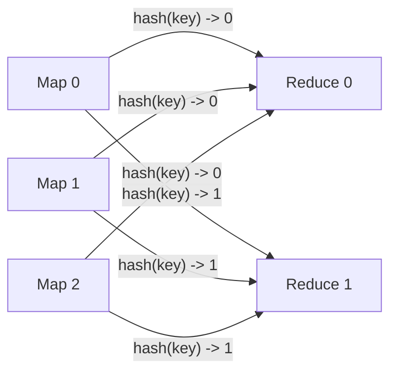

# 分区、并行度、Shuffle 与数据倾斜：理解分布式计算性能

Kafka 的 partition、Spark 的 partition、Flink 的并行 subtask、Iceberg 的数据分区并不是一回事，但它们共享一个基本思想：把数据切成能够独立存储、传输或处理的单元。

大数据性能问题也常常可以归结为三个问题：数据怎样切、任务怎样并行、数据何时必须跨节点重分布。只看 CPU 或盲目增加 executor，往往治不了热点 key、过大分区和 Shuffle 长尾。

## 1. 四个容易混淆的概念

### 1.1 数据分区

按照某种规则把逻辑数据集拆成多个子集。分区规则可能是时间、范围、hash、业务 key 或随机轮询。

### 1.2 文件分区

表在存储层按日期、地区等字段组织数据，用于读取裁剪。例如 `days(event_time)=2026-08-10`。一个表分区内可以有很多文件，一个文件也不是一个计算任务的永久对应物。

### 1.3 执行并行度

某个算子或 stage 同时运行多少个 task/subtask。它决定同一时刻有多少执行实例消费数据，但仍受实际可用 CPU slot、内存和输入分区数限制。

### 1.4 资源槽位

YARN container、Kubernetes Pod、Spark executor core、Flink slot 都是资源承载方式。申请并行度 1,000 并不代表有 1,000 个 task 同时执行；资源不足时它们会排队或共享。

## 2. 常见分区策略

| 策略 | 规则 | 优点 | 风险 |
|---|---|---|---|
| Round-Robin | 依次发送到各分区 | 无 key 时分布通常均匀 | 相同 key 无顺序/局部性 |
| Hash | `hash(key) mod N` | 同 key 聚集，适合聚合和分组 | 热 key 形成热点；N 变化会重映射 |
| Range | 按值域切分 | 范围查询和全局排序友好 | 边界难估，数据分布变化后不均 |
| Time | 按小时/天/月 | 生命周期和时间过滤清晰 | 当前时间分区可能成为写热点 |
| Random | 随机分配 | 容易摊平无状态负载 | 下游按 key 处理仍需 Shuffle |
| Custom | 业务规则或热点隔离 | 可处理已知特殊分布 | 规则复杂，演进和维护成本高 |

Hash 分区的近似目标是每个分区数据量接近：

```text
partition_size ≈ total_size / partition_count
```

但 hash 只能让大量、相对均匀的 key 分散。如果某一个 key 本身占 40% 数据，无论 hash 函数多好，它仍会完整落到一个分区。

## 3. 并行执行如何发生

假设读取 1 TiB 数据并执行过滤。数据被切成 256 个输入分区，引擎有 32 个可用执行槽位，则通常最多同时运行约 32 个 task，分 8 轮处理。

理想计算时间近似：

```text
T_ideal = total_work / effective_parallelism
effective_parallelism = min(task_count, available_slots, source_parallelism, bottleneck_capacity)
```

真实时间还包括：

```text
T_total = T_schedule + T_read + T_compute + T_shuffle + T_spill + T_commit + T_straggler
```

并行度增加时，`T_compute` 可能下降，但调度、连接数、网络交换、小文件和结果提交开销会上升。最后通常被磁盘、网络或下游吞吐限制。

### 3.1 并行度太低

- CPU 和磁盘未充分利用；
- 单 task 数据量大，失败重算代价高；
- 单个分区状态大，checkpoint 和恢复慢；
- 长尾 task 直接决定作业完成时间。

### 3.2 并行度太高

- task 启动、调度和 RPC 开销增大；
- 每个 task 数据过少，产生大量小文件；
- 连接、buffer、线程和元数据对象过多；
- 上下文切换、GC 和对象存储请求成本增加。

合理并行度是 workload、资源和目标文件大小共同决定的，不存在适用于所有任务的固定公式。

## 4. 什么是 Shuffle

当下游需要按照与上游不同的 key 重新组织数据时，数据必须跨 task、通常跨节点交换，这就是 Shuffle。

以 `GROUP BY user_id` 为例，上游读取的每个分区都可能包含同一用户的记录。为了得到完整聚合，所有相同 `user_id` 必须到同一个下游 task。



典型 Shuffle 算子包括：

- `GROUP BY`、`DISTINCT`；
- 非共分区的 Join；
- 全局排序和 repartition；
- Flink 的 `keyBy` 后下游算子；
- 跨 partition 的窗口或去重。

过滤、列裁剪、同分区 map 等窄依赖操作则可以在本地完成。

## 5. Shuffle 的真实数据路径

以典型批引擎为例：

1. 上游 task 读取输入并计算目标 partition；
2. 记录进入内存 buffer，按 partition 分组；
3. buffer 不足时进行排序、聚合或 spill 到本地磁盘；
4. 下游 task 经网络拉取或接收属于自己的多个 block；
5. 下游合并、排序，内存不足时再次 spill；
6. 所有依赖数据就绪后执行聚合、Join 或写出。

所以 Shuffle 同时消耗 CPU、内存、本地临时盘和网络。常见瓶颈不是某一个“Shuffle 参数”，而是以下组合：

- 序列化/压缩占用 CPU；
- buffer 太小产生频繁 spill；
- 临时盘吞吐或空间不足；
- 跨机架流量拥塞、丢包重传；
- 大分区让某个 task 拉取和合并时间过长；
- 上游 task 失败导致 Shuffle block 丢失和 stage 重算。

流引擎也有网络 repartition，但它持续传输记录并施加反压，状态恢复依赖 checkpoint；批引擎通常生成有生命周期的中间 Shuffle 数据。分析方法相通，具体实现不同。

## 6. 为什么要尽量减少 Shuffle，而不是完全避免

跨 key 的正确聚合本来就需要把相关数据放在一起，Shuffle 是语义所需，不是代码“写坏了”。优化目标是减少不必要的交换字节和长尾：

1. **先过滤再 Shuffle**：尽早应用谓词和列裁剪；
2. **先局部聚合再交换**：map-side combine 降低记录数；
3. **复用已有分区/排序**：共分区数据避免重新分发；
4. **小表广播**：让小维表复制到各 worker，避免大表 repartition；
5. **选择合适 key**：同时满足业务语义和分布均衡；
6. **避免重复 repartition**：检查物理执行计划中的 Exchange/Shuffle 节点。

不能为了减少 Shuffle 改变计算结果。例如去重需要全局 key 边界时，局部去重不能替代全局去重。

## 7. 数据倾斜是什么

数据倾斜是不同分区的记录数、字节数、计算复杂度或状态大小严重不均。它的表现通常是大多数 task 很快完成，少数 task 长时间运行，整个 stage 等待长尾。

可以用简单的偏斜比观察：

```text
skew_ratio = max_partition_size / median_partition_size
```

当最大分区远大于中位数时，需要进一步确认是否造成业务 SLO 问题。不要机械使用某个阈值，因为计算复杂度和硬件也会影响 task 时长。

### 7.1 四类倾斜

1. **记录数倾斜**：某个 key 的记录特别多。
2. **字节倾斜**：记录数相近，但某些记录包含超大字段。
3. **计算倾斜**：数据量相近，某些 key 的算法或外部调用更慢。
4. **状态倾斜**：流作业某些 key 保存大量 window、timer 或去重状态。

只统计 records 可能漏掉后三类，必须联合观察 bytes、CPU time、state size 和 wall-clock duration。

## 8. 倾斜从哪里产生

- 大客户、热门商品、默认租户等天然热点 key；
- `NULL`、空字符串或“未知”被统一成一个 key；
- 分区字段基数太低，例如只按省份切 31 个分区；
- 时间分区中所有实时数据写入当前小时；
- Join 一侧某个 key 多对多爆炸；
- 上游过滤后改变了原有均匀分布；
- 不合理的 range boundary；
- 文件大小悬殊，输入 task 工作量不均；
- Kafka partition 与下游并行度映射不合理。

倾斜诊断的第一步不是加资源，而是找出“哪个 key、哪个 partition、从哪一步开始不均”。

## 9. 诊断流程

### 第一步：确定长尾 stage/operator

查看 DAG 或拓扑，找出耗时最长、backpressure 最大或 checkpoint 最慢的节点。记录其输入/输出数据量、并行度和上下游关系。

### 第二步：比较分位数，不看平均值

比较 task duration、input bytes、Shuffle read/write、spill、GC 和 state size 的 median/P95/max。若 max 远高于 median，通常存在长尾。

### 第三步：定位分区和 key

对 key 进行采样或预聚合：

```sql
SELECT key, COUNT(*) AS cnt
FROM source
GROUP BY key
ORDER BY cnt DESC
LIMIT 50;
```

同时统计记录字节、NULL 比例和 join 后放大倍数。生产数据可能敏感，应输出 hash 后 key 或仅输出分布统计。

### 第四步：排除硬件慢节点

如果同一节点上的多个无关 task 都慢，检查磁盘 await、网络重传、CPU throttling、NUMA、GC 和容器限制。数据倾斜与慢节点会产生类似长尾，但治理方式完全不同。

### 第五步：确认是否是下游反压

流作业中，上游 busy 或 backpressured 不一定是上游自身慢，可能是 sink 限速逐层传播。沿数据流逆向找到最早出现高利用/低输出的算子。

## 10. 倾斜治理方法

### 10.1 Salting：给热 key 加盐

把一个热点 key 人为拆成多个子 key：

```text
original_key = customer_001
salted_key   = customer_001#0 ... customer_001#15
```

第一阶段按 salted key 局部聚合，第二阶段去掉 salt 再合并。它适合可结合的聚合（sum/count/min/max 等），代价是增加一轮计算和 Shuffle。

对于 Join，可以将大表热点 key 加盐，同时把小表对应行复制为全部 salt。若两边都是大表，盲目复制会造成更大数据爆炸。

### 10.2 两阶段聚合

先在原分区内做局部聚合，再全局聚合。它减少 Shuffle 记录数，但对不可结合操作或需要完整明细的逻辑不适用。

### 10.3 Broadcast Join

把足够小的表发送到所有 worker，让大表留在原地。判断能否广播要看序列化后体积、并发 task 数和 worker 内存，而不是仅看源表行数。

```text
广播总网络量 ≈ 小表大小 × worker 数
```

### 10.4 单独处理热点 key

先识别 Top-N 热点，将其分流到专用逻辑，普通 key 使用常规 hash 分区。适合热点集合相对稳定且业务价值高的场景，但需要维护热点检测和规则更新。

### 10.5 调整分区数和文件

如果是整体分区太少而非单 key 热点，增加分区数能提高并行度；如果是大量微小分区，则应合并小文件、降低并行度或让 writer 产生目标大小文件。

增加分区数无法拆开一个不可分割的热 key，这是最常见误用。

### 10.6 自适应执行

现代引擎可以在运行时合并小分区、拆分倾斜分区或改变 Join 策略。自适应能力依赖统计信息和引擎版本，应验证物理计划确实发生变化，而不是只打开配置。

### 10.7 修改业务模型

有时 key 的粒度本身不合理。例如所有未知用户都使用 `user_id=0`。可以将匿名会话 ID、设备 ID 或事件 ID 作为更细粒度 key，在业务允许的边界内避免人为热点。

## 11. 存储分区与计算分区要分别设计

表按天分区是为了查询裁剪和生命周期管理，不代表 Spark/Flink 只能用一天一个 task。引擎可以把一天中的多个文件切为多个输入 split；也可能把多个小文件合成一个 task。

存储分区过细会导致：

- 目录、catalog 和 manifest 元数据膨胀；
- 每个分区文件太少或太小；
- 查询规划和对象 LIST/GET 请求增多；
- 分区演进困难。

存储分区过粗则导致读取裁剪差、compaction 范围大和并发写冲突。Iceberg 的 hidden partitioning 允许消费者按业务字段过滤，由表元数据将过滤条件转换到分区值，减少调用方对物理目录的依赖。

## 12. 文件大小为什么影响并行度

文件太大：

- 单个 split/task 工作量大；
- 重试代价高；
- 并行读取受限；
- 某些不可切分压缩格式形成单 task。

文件太小：

- 打开、鉴权、RPC 和对象请求开销占比高；
- 元数据和规划时间增加；
- writer 数量过多；
- 下游训练 DataLoader 频繁打开文件。

目标文件大小需通过实测选择。分析型列式文件常见目标为数百 MiB 量级，但不能把经验值当标准：对象存储请求延迟、查询选择性、并发写入和训练读取模式都会改变最佳值。

## 13. 端到端并行度必须匹配

假设：

- Kafka topic 有 24 个 partition；
- Flink source 并行度为 48；
- 下游 keyBy 聚合并行度为 96；
- Iceberg sink 产生 96 个 writer；

此时 source 同一时刻最多有约 24 个实例直接读取非空 Kafka partition，其余可能空闲；聚合可以有 96 个 key group 分片，但 sink 可能每个 checkpoint 产生多达 96 组小文件。单独把 Flink 并行度调大，可能只是把瓶颈转成小文件和提交压力。

规划时画出：

```text
source partitions -> source parallelism -> key partitions -> sink writers -> output files
```

同时验证网络、CPU、状态大小、checkpoint 和下游文件维护成本。

## 14. 可重复性能实验

构造 1000 万条记录，其中一个 key 占 40%，其余 key 均匀分布。运行以下四组方案：

1. 直接按 key 聚合；
2. 仅将分区数扩大 4 倍；
3. 热 key 使用 16 路 salting 后两阶段聚合；
4. 过滤无用列并局部聚合后再 Shuffle。

每次记录：

| 指标 | 目的 |
|---|---|
| 各 task input records/bytes | 证明数据是否均匀 |
| median/P95/max task duration | 量化长尾 |
| Shuffle read/write bytes | 观察交换量变化 |
| memory spill/disk spill | 判断内存和本地盘压力 |
| CPU、磁盘 await、网络吞吐 | 排除资源瓶颈 |
| 输出 count/sum/checksum | 证明优化没有改变结果 |

预期：只增加分区数不能拆开单个热 key；salting 会降低最大 task 数据量，但多一轮聚合；提前过滤和局部聚合通常能减少 Shuffle 字节。实际结论必须以你的引擎版本和指标为准。

## 15. 故障与恢复边界

Shuffle 中间数据通常不是最终权威数据。节点失败后可能发生：

- 丢失本地 Shuffle block，引擎重跑上游 task；
- 下游 fetch failure 导致整个 stage 重试；
- 临时盘满导致写失败；
- 流作业网络 buffer 堵塞，checkpoint 超时；
- speculative task 重复执行，sink 必须避免重复提交。

所以临时盘也要监控容量和性能，不能因为“数据可重算”就不做规划。重算会增加恢复时间、网络和上游压力，甚至形成故障风暴。

## 16. 常见误区

- **分区数等于节点数。** 分区是逻辑/执行单元，节点可以先后处理多个分区。
- **提高并行度一定加速。** 最慢资源不变时，只会增加开销。
- **增加 partition 能解决所有倾斜。** 单个热点 key 仍落入一个 partition。
- **Shuffle 一定是坏事。** 它通常是全局语义需要，目标是减少不必要字节和长尾。
- **平均 task 时间很正常就没有倾斜。** 应比较 median、P95、max 和分区分布。
- **CPU 低就是并行度不够。** 也可能在等网络、磁盘、锁、GC 或下游。
- **表分区就是 Spark/Kafka 分区。** 它们处在不同层，生命周期和用途不同。

## 17. 掌握验收

- 区分表分区、文件、输入 split、执行并行度和资源 slot；
- 画出一次 `GROUP BY` 的 Shuffle 数据路径；
- 解释 Shuffle 为什么同时消耗 CPU、内存、磁盘和网络；
- 用 max/median 分区大小和 task 时长识别倾斜，而不是只看平均值；
- 区分记录数、字节、计算和状态四类倾斜；
- 说明 salting、局部聚合、broadcast、热点分流和增加分区分别适合什么场景；
- 从 Kafka partition 一直检查到 sink writer，避免局部并行度优化制造小文件；
- 优化后使用记录数、业务聚合和 checksum 证明结果未改变。

上一篇：[批处理、流处理、数据湖、数仓与湖仓](./02-批处理流处理数据湖数仓与湖仓.md)

下一篇：[数据一致性、幂等、At-Least-Once 与 Exactly-Once](./04-数据一致性幂等与Exactly-Once.md)

## 参考资料

- [Apache Spark 文档](https://spark.apache.org/docs/latest/)
- [Apache Flink：DataStream Operators](https://nightlies.apache.org/flink/flink-docs-stable/docs/dev/datastream/operators/overview/)
- [Apache Iceberg：Partitioning](https://iceberg.apache.org/docs/latest/partitioning/)
- [Apache Kafka 文档](https://kafka.apache.org/documentation/)
