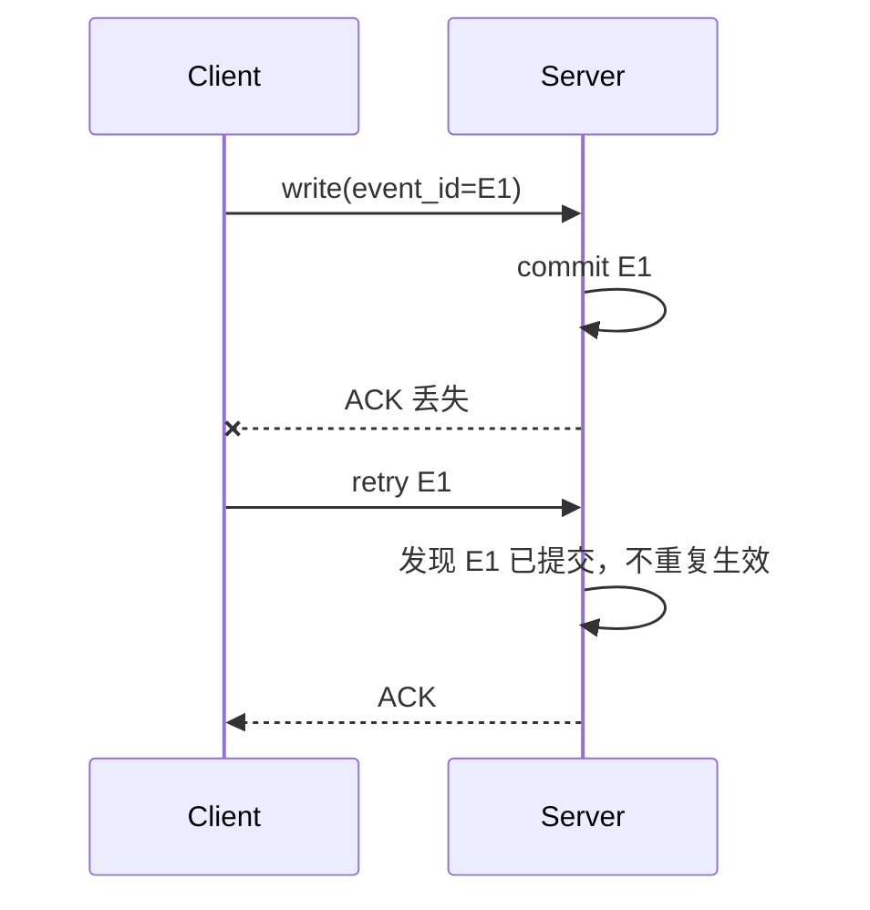
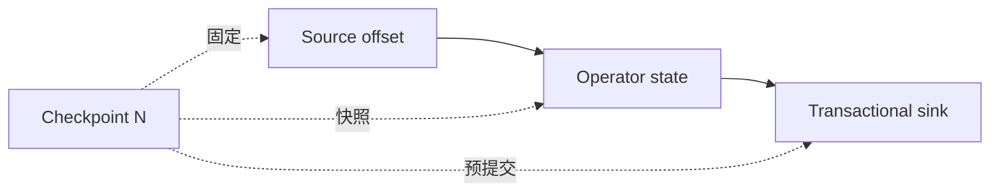
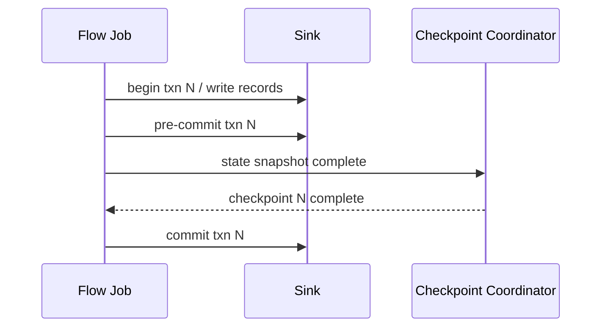
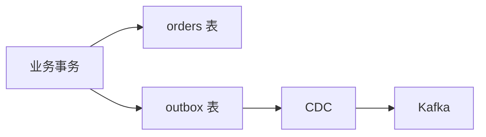

# 数据一致性、幂等、At-Least-Once 与 Exactly-Once

“我们用了 Kafka 事务”“Flink 开启了 checkpoint”，都不能单独证明业务端到端 Exactly-Once。正确性取决于 source 读取位置、计算状态和 sink 外部效果能否在失败后回到同一个逻辑进度。

这篇不把 Exactly-Once 当作一个开关，而是拆成可验证的故障边界。最终目标不是保证每个网络包只发送一次，而是让一条业务事件对最终结果只产生一次可见效果，或者重复效果能被确定地消除。

## 1. 先定义“一个事件”

同一笔订单可能在链路中出现多个层次的标识：

- 业务主键：`order_id`；
- 变更事件 ID：一次 insert/update 对应的唯一 ID；
- 数据库日志位置：binlog file/position 或 LSN；
- Kafka 位置：topic、partition、offset；
- 处理版本：job version、checkpoint ID；
- 表版本：Iceberg snapshot ID；
- 数据集版本：训练集 manifest/version。

业务主键不一定等于事件唯一键。一笔订单可以先创建、后支付、再退款。如果只按 `order_id` 去重，可能错误丢掉合法更新。设计幂等之前必须先确定粒度：是“订单实体只保留最终状态”，还是“每次业务变化都只能应用一次”。

推荐为事件定义稳定 envelope：

```json
{
  "event_id": "全局唯一变化标识",
  "entity_id": "order_123",
  "event_type": "order_paid",
  "event_time": "2026-08-10T10:00:05+08:00",
  "source_position": "可重放位置",
  "schema_version": 3,
  "payload": {}
}
```

## 2. 三种投递/处理语义

### 2.1 At-Most-Once：最多一次

事件要么处理一次，要么在故障时丢失，但不重试产生重复。常见于对少量丢失不敏感的遥测或通过“先提交位置、后处理”实现的链路。

风险：位置已经推进，处理进程却在写结果前宕机，事件无法再次读取。

### 2.2 At-Least-Once：至少一次

系统保证事件最终会被处理，但故障重试可能处理多次。这是大量消息和流系统的实用基础语义。

风险：若 sink 写入不是幂等，计数、金额或外部调用会重复。

### 2.3 Exactly-Once：恰好一次

每个事件对定义范围内的状态产生一次逻辑效果。实现方式通常不是“永不重发”，而是重发加事务、幂等或去重，让重复执行不可见。

必须写清范围。例如：

- Kafka topic 到另一个 Kafka topic 内 Exactly-Once；
- 某个 Flink 作业状态与事务 sink 一致；
- Iceberg 每个 checkpoint 只提交一个 snapshot；
- 最终发短信、扣款等外部副作用是否也在保证范围内。

如果范围只到数据湖，不能宣称下游通知系统也是 Exactly-Once。

## 3. 为什么网络通信无法简单做到“物理只执行一次”

客户端向服务端发送写请求，服务端完成写入后返回 ACK，但 ACK 在网络中丢失。客户端只知道请求超时，无法判断：

1. 服务端根本没收到；
2. 服务端收到但未执行；
3. 服务端执行成功，只是 ACK 丢了。

如果不重试可能丢；如果重试可能重复。因此可靠系统通常重试，并用唯一请求 ID、事务 ID、版本号或幂等写入识别重复。



Exactly-Once 更多是协议和状态管理问题，不是要求底层网络从不重复。

## 4. 什么是幂等

如果操作执行一次和执行多次的最终效果相同，它就是幂等的：

```text
f(f(x)) = f(x)
```

### 4.1 常见幂等方式

**按主键 Upsert**

```sql
INSERT INTO target(order_id, status, version)
VALUES (?, ?, ?)
ON CONFLICT (order_id)
DO UPDATE SET status = EXCLUDED.status,
              version = EXCLUDED.version
WHERE target.version < EXCLUDED.version;
```

版本条件还能防止旧事件覆盖新状态。

**唯一事件表**

在同一数据库事务中先插入 `event_id`，利用唯一约束拒绝重复，再更新业务表。要注意去重记录的生命周期和容量。

**确定性覆盖**

同一批次始终写到同一个版本化路径，验证后原子切换 manifest 或表 snapshot。不要让重试产生多个都可见的目录。

**比较并交换（CAS）/乐观并发**

只有当前版本等于预期版本时才提交新版本，用于表元数据和状态更新。

### 4.2 看起来幂等但不是

- `balance = balance + amount` 重试会重复加钱；
- `counter++` 重试会重复计数；
- 发送邮件/短信通常无法靠数据库回滚撤销；
- 用处理时间生成新 UUID，每次重试 ID 不同，无法识别重复；
- 覆盖同一路径但内容取决于当前时间，结果不确定。

## 5. 去重需要状态和边界

去重集合不能无限保存在内存中。必须定义：

- 去重 key 是业务实体还是事件；
- 保存多久，是否覆盖最大重放和迟到窗口；
- 状态存在哪里，故障后是否一起恢复；
- schema 变化后 key 是否仍稳定；
- 超过 TTL 的重复如何处理。

假设每天 10 亿事件，每个去重条目连同索引占 100 B，仅一天状态约 93 GiB。保留 30 天就接近 2.8 TiB，还不含存储引擎放大。必须估算状态容量，而不是看到 `event_id` 就默认可永久去重。

## 6. Offset 提交时机决定丢失还是重复

简化的消费者逻辑：读取消息、处理、写下游、提交 offset。

### 6.1 先提交 offset，后写结果

进程在两者之间宕机，重启后从新 offset 继续，刚才的消息丢失，接近 At-Most-Once。

### 6.2 先写结果，后提交 offset

进程写成功后、提交 offset 前宕机，重启会再次处理同一消息，形成 At-Least-Once。若 sink 幂等，最终可得到一次逻辑效果。

### 6.3 offset 与结果同事务提交

如果消息位置和结果能进入同一个事务，或者由协调协议原子对齐，可以获得定义范围内的 Exactly-Once。跨不同系统时通常需要两阶段提交、幂等 sink、事务 outbox 或版本化发布。

## 7. Checkpoint 如何对齐 source、state 和 sink

以有状态流作业为例：



一次成功 checkpoint 需要记录：

1. source 已处理到哪些 partition/offset；
2. 算子 state、timer 和必要元数据；
3. sink 中与该 checkpoint 对应的待提交事务或文件。

故障后恢复到 checkpoint N：source 从 N 的位置继续，operator state 恢复到 N，checkpoint N 之后未完成的 sink 事务被中止或不可见。

Checkpoint 只能保证参与协议的组件。若算子直接调用一个没有事务和幂等能力的 HTTP 接口，checkpoint 回滚后请求可能再次发送。

## 8. Barrier 与一致快照的直觉

有多个输入时，checkpoint barrier 沿数据流传播。算子需要保证快照反映同一个逻辑切面，不能把一个输入 barrier 前的数据和另一个输入 barrier 后的数据随意混合。

对齐式 checkpoint 可能等待较慢输入，反压时导致对齐时间变长；非对齐 checkpoint 会把部分 in-flight 数据一并纳入快照，以缩短 barrier 等待，但可能增加 checkpoint 体积。具体能力和行为必须以所用 Flink 版本文档为准。

排查 checkpoint 不能只看总时长，还要看：

- barrier 对齐时间；
- state snapshot/上传时间；
- checkpoint 大小；
- 每个 subtask 的长尾；
- sink pre-commit/commit 时间；
- 失败原因和连续失败次数。

## 9. 事务 Sink 与两阶段提交

经典两阶段思路：

1. **Pre-Commit**：将本 checkpoint 的输出写入不可见事务或临时文件；
2. **Commit**：checkpoint 全局成功后，使事务或文件版本可见；
3. **Abort**：checkpoint 失败时清理或标记废弃输出。



还要处理“checkpoint 已成功但 worker 在收到完成通知前宕机”等恢复场景。事务 ID 和 checkpoint ID 必须可恢复，使重启后能判断提交、中止或忽略。

## 10. Iceberg 快照提供什么一致性

Iceberg 写入通常先生成数据文件，再构建 metadata/manifest，最后通过 catalog 原子更新表的当前元数据指针。读者要么看到旧 snapshot，要么看到新 snapshot，不应看到只提交了一半的文件集合。

但仍需注意：

- 数据文件上传成功、元数据提交失败会留下 orphan files；
- 并发 writer 可能发生乐观并发冲突，需要重试和重新校验；
- snapshot 原子可见不自动保证上游事件从不重复；
- 过早清理 snapshot/orphan 可能破坏仍在运行的 reader 或恢复流程；
- 多表更新通常不天然构成一个跨表事务。

所以表格式解决的是“表版本提交”边界，不替代整条 pipeline 的一致性设计。

## 11. Kafka 幂等与事务的边界

概念上需要区分：

- **幂等 producer**用于防止 producer 重试在同一分区产生重复写入；
- **Kafka transaction**可以把多个 partition 的写入以及消费位置提交纳入一个 Kafka 事务；
- **read_committed consumer**只读取已提交事务记录。

这些能力能支持 Kafka 内部 consume-transform-produce 的 Exactly-Once，但写外部数据库、对象存储或发送通知时，仍需要外部系统参与事务或具备幂等/去重协议。具体配置、默认值和版本行为应核对 [Kafka 官方文档](https://kafka.apache.org/documentation/)。

## 12. Outbox 与 CDC

业务服务经常要同时更新数据库并发布事件。如果先提交订单、再发 Kafka，进程可能在两步之间宕机；如果先发 Kafka、再提交订单，消费者可能看到实际未提交的业务。

Transactional Outbox 将业务变化和待发布事件写入同一个数据库事务：



数据库事务保证 order 与 outbox 一致，CDC 负责把 outbox 变化投递到 Kafka。CDC 仍可能重复投递，消费者要用稳定 event ID 幂等处理。Outbox 解决的是跨数据库与消息系统的原子发布缺口，不是整链路自动 Exactly-Once。

## 13. 乱序、迟到与一致性不是一回事

事件可能只处理一次，却以错误顺序更新状态。例如 `order_paid(version=2)` 先到，随后 `order_created(version=1)` 迟到。若 sink 简单 Upsert，旧状态可能覆盖新状态。

治理方式包括：

- 版本号或源日志 position 单调比较；
- 以事件时间排序并允许一定等待；
- 按业务 key 保证单 partition 内顺序；
- 对迟到更新执行补偿或重新计算；
- 保留 immutable change log，再构建当前视图。

Exactly-Once 解决重复效果，事件顺序和业务状态机需要额外设计。

## 14. 端到端故障矩阵

| 故障点 | 可能现象 | 必须验证 |
|---|---|---|
| source 读后未保存位置 | 事件重复读取 | 去重/幂等是否生效 |
| operator state 未完成快照 | 聚合回退 | source 是否一起回退 |
| sink 写成功但 ACK 丢失 | sink 重试 | 事务 ID/事件 ID 是否稳定 |
| checkpoint 成功通知丢失 | 未知事务状态 | 恢复时能否查询并完成提交 |
| Iceberg 文件写完、snapshot 失败 | orphan files | 不可见且可安全清理 |
| 任务版本升级 | state/schema 不兼容 | savepoint、兼容性与回滚 |
| 去重 TTL 过期后重放 | 历史重复重新生效 | 重放窗口是否小于保留时间 |
| 外部 API 超时 | 不知是否执行 | 是否支持 idempotency key/查询状态 |

## 15. 正确性验证不能只数总行数

建议建立多层校验：

1. **传输层**：输入/输出记录数、Kafka offset 范围；
2. **唯一性**：`event_id` 重复数、主键版本倒退数；
3. **业务守恒**：订单金额、借贷平衡、状态机合法性；
4. **时间边界**：最大事件时间、watermark、迟到比例；
5. **版本**：checkpoint、snapshot、作业代码和 schema 版本；
6. **抽样追踪**：选一批 event ID 跨系统追踪其位置与结果。

总行数相同仍可能同时丢 100 行、重复 100 行，因此必须组合唯一性和业务守恒校验。

## 16. 故障注入实验

构造 100 万条带唯一 `event_id` 和金额的事件，故意让 1% 事件重复发送。流作业按 key 聚合并写入可查询 sink。

在以下时刻终止 worker：

1. 正常处理期间；
2. checkpoint 进行中；
3. sink pre-commit 后；
4. checkpoint 完成、下一 checkpoint 尚未开始时。

每次恢复后验证：

```text
唯一 event 数 = 预期 event 数
金额汇总 = 源数据按 event_id 去重后的汇总
最终 snapshot/事务 = 已完成 checkpoint 对应版本
未提交文件/事务 = 不可见且可回收
```

再把去重状态 TTL 调小，重放超出 TTL 的历史数据，观察重复重新生效。这个反例能帮助理解 Exactly-Once 的时间和状态边界。

## 17. 常见误区

- **Exactly-Once 就是消息永远只发送一次。** 通常是允许重发，但最终逻辑效果一次。
- **Kafka 开事务后外部数据库也自动 Exactly-Once。** 事务边界不会自动跨系统。
- **开启 checkpoint 就完成端到端一致性。** source、state、sink 都必须参与一致恢复。
- **主键 Upsert 能处理所有重复。** 多事件实体、累加操作和外部副作用需要不同设计。
- **作业结果行数相同就没有丢重。** 丢失和重复可能互相抵消。
- **去重状态可以永久保存。** 状态容量、TTL 和最大重放窗口必须匹配。
- **Exactly-Once 也保证事件顺序。** 重复、顺序和迟到是不同问题。

## 18. 掌握验收

- 明确区分业务实体 ID、事件 ID、source position、checkpoint 和 snapshot；
- 用 ACK 丢失例子解释为什么重试与重复不可避免；
- 比较 At-Most-Once、At-Least-Once 和 Exactly-Once 的故障窗口；
- 设计主键 Upsert、唯一事件表、事务发布或确定性覆盖；
- 画出 source offset、operator state 和 sink transaction 的一致 checkpoint；
- 说明 Kafka 事务、Flink checkpoint、Iceberg snapshot 各自保证到哪里；
- 为迟到、乱序、去重 TTL 和 schema 演进设计独立策略；
- 通过唯一性、业务守恒和版本追踪证明恢复后数据正确。

上一篇：[分区、并行度、Shuffle 与数据倾斜](./03-分区并行度Shuffle与数据倾斜.md)

下一篇：[Parquet、ORC、Avro 与压缩编码](./05-Parquet-ORC-Avro与压缩编码.md)

## 参考资料

- [Apache Kafka 文档](https://kafka.apache.org/documentation/)
- [Apache Flink：State 与 Fault Tolerance](https://nightlies.apache.org/flink/flink-docs-stable/docs/learn-flink/fault_tolerance/)
- [Apache Flink：Checkpointing](https://nightlies.apache.org/flink/flink-docs-stable/docs/ops/state/checkpointing/)
- [Apache Iceberg：Reliability](https://iceberg.apache.org/docs/latest/reliability/)
