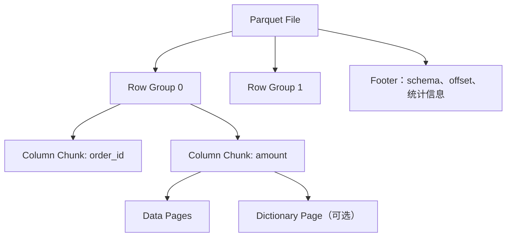
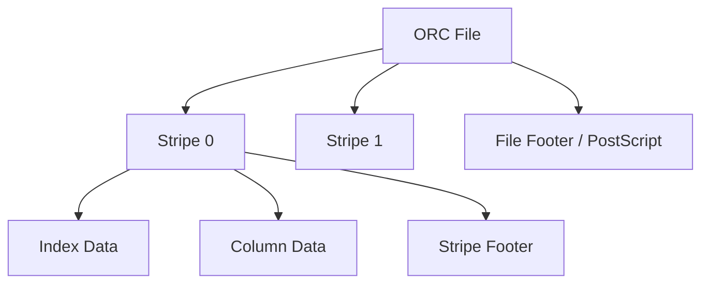

# Parquet、ORC、Avro 与压缩编码：从文件布局到查询和训练吞吐

文件格式不是扩展名。它决定数据怎样排列、schema 怎样保存、查询能否跳过无关列和数据块、压缩需要多少 CPU、文件损坏会影响多大范围，也会影响 Spark、Flink、Trino 和训练 DataLoader 的吞吐。

本篇重点理解三种常见格式：Avro 适合带 schema 的行式记录与数据交换；Parquet、ORC 面向分析型列式读取。它们不是互相淘汰，而是适用于不同数据路径。

## 1. 先区分逻辑数据与物理布局

同一张逻辑表：

| order_id | user_id | province | amount | event_time |
|---|---|---|---:|---|
| o1 | u10 | SH | 25.00 | 10:00:01 |
| o2 | u20 | BJ | 80.00 | 10:00:02 |
| o3 | u10 | SH | 15.00 | 10:00:03 |

行式布局连续保存一整行，再保存下一行：

```text
[o1,u10,SH,25,10:00:01][o2,u20,BJ,80,10:00:02]...
```

列式布局在一个数据块内把同一列的值放在一起：

```text
order_id: [o1,o2,o3]
user_id:  [u10,u20,u10]
province: [SH,BJ,SH]
amount:   [25,80,15]
```

如果查询只计算 `SUM(amount)`，列式格式可以少读取其他列；同一列值类型相同、重复模式明显，也更适合字典、游程和位打包编码。

## 2. 行式与列式的取舍

| 维度 | 行式 | 列式 |
|---|---|---|
| 单条记录写入/读取 | 直接 | 需要组织列块，通常批量更合适 |
| 扫描少量列 | 会读入无关字段 | 列裁剪显著减少 I/O |
| 压缩 | 跨字段类型混合，通常较弱 | 同列同类型，编码和压缩更有效 |
| 全行重建 | 一次连续读取 | 需要从多列重组 |
| 分析聚合 | 通常较慢 | 通常更合适 |
| 消息传输 | 自然 | 很少逐条使用列式文件 |

行式/列式是总体方向，不代表任何场景性能绝对。查询选择性、文件大小、对象存储延迟、CPU、缓存和实现版本都会改变结果，必须基准测试。

## 3. Avro：带 Schema 的行式容器

Avro 使用 schema 描述字段、类型、默认值和嵌套结构，记录以紧凑二进制形式编码。常见用途：

- Kafka 消息 payload（通常配合 schema registry）；
- CDC 或数据交换记录；
- 需要顺序读取完整记录的中间文件；
- 部分表格式的 metadata/manifest 文件。

简化 schema：

```json
{
  "type": "record",
  "name": "OrderPaid",
  "namespace": "com.example.events",
  "fields": [
    {"name": "event_id", "type": "string"},
    {"name": "order_id", "type": "string"},
    {"name": "amount_cents", "type": "long"},
    {"name": "coupon_code", "type": ["null", "string"], "default": null}
  ]
}
```

Schema 让 writer 和 reader 能协商字段演进，但“文件能读”不等于业务兼容。例如把金额单位从分改成元，即使类型仍是 long，也是破坏性语义变化，必须用新字段或新版本表达。

### 3.1 Avro Object Container File

Avro 容器文件通常包含 schema、codec 元数据和多个数据 block；同步标记帮助分割和恢复。它适合批量顺序处理完整记录，但对只扫描少数列的分析查询，不如列式格式节省 I/O。

## 4. Parquet 的物理层次

简化结构：



- **Row Group**：一批逻辑行，是列式组织和并行扫描的重要边界。
- **Column Chunk**：某 row group 中某一列的数据。
- **Page**：column chunk 内更小的编码/压缩单元。
- **Footer**：保存 schema、各块位置和统计信息，reader 通常先读 footer 来规划读取。

### 4.1 列裁剪

查询只选择 `province, amount` 时，只需读取相关 column chunk，而不必读取订单描述等大字段。

### 4.2 Predicate Pushdown 与 Data Skipping

若 row group 统计显示：

```text
event_date min=2026-08-01, max=2026-08-01
```

查询 `event_date = '2026-08-10'` 时可以跳过它。统计信息可能还包括 null count、distinct count 或更细索引，具体取决于 writer 和 reader 实现。

跳过数据的前提是：过滤条件能被引擎下推、统计信息可靠、值域有足够局部性。如果文件内数据完全随机，min/max 范围很宽，裁剪效果就差。

### 4.3 嵌套结构

Parquet 可以用 definition/repetition level 表达可选字段、list 和嵌套结构。嵌套层次过深会增加编码、查询和 schema 演进复杂度，分析模型中应避免不必要的任意 JSON 大字段。

## 5. ORC 的物理层次

ORC 将文件组织为多个 stripe，每个 stripe 包含各列的数据流和索引，文件尾部保存 stripe 与统计等元数据。



ORC 同样支持列裁剪、统计、压缩和谓词下推，在 Hive 生态中长期使用广泛。Parquet 和 ORC 的功能有很多重叠，选择时重点考虑：

- 主要计算引擎和 writer/reader 兼容性；
- 表格式推荐和团队既有规范；
- 实际 workload 的读取/写入基准；
- schema、timestamp、decimal 等类型兼容；
- 工具链对统计、索引和加密的支持。

不要只比较单个文件压缩比，就宣布某格式全面胜出。

## 6. Encoding 与 Compression 不是一回事

### 6.1 编码（Encoding）

编码利用列值模式减少表示开销，例如：

- **Dictionary Encoding**：重复字符串映射为小整数 ID；
- **Run-Length Encoding**：连续相同值保存为“值 + 次数”；
- **Delta Encoding**：递增数值保存相邻差值；
- **Bit Packing**：用实际所需 bit 数保存小整数；
- **Plain Encoding**：直接按基础类型表示。

### 6.2 压缩（Compression）

压缩算法再对编码后的字节流压缩。常见 codec 取舍：

| Codec | 一般特点 | 常见考虑 |
|---|---|---|
| Snappy | 压缩/解压快，压缩比中等 | 分析任务常见，偏吞吐 |
| Zstandard | 可在速度与压缩比间调级别 | 存储与网络成本较高时常有优势 |
| Gzip/Deflate | 压缩比常较好，CPU 开销较高 | 冷数据或兼容场景，需实测 |
| LZ4 | 很快，压缩比通常较低 | 延迟和 CPU 敏感场景 |
| None | 无压缩 | 数据已压缩或 CPU 极端紧张时才考虑 |

具体支持列表和默认值随格式、引擎与版本变化，写入前应核对官方文档和兼容矩阵。

### 6.3 压缩为何可能让查询更快

如果扫描受磁盘/网络限制，压缩把读取字节从 1 TiB 降到 300 GiB，即使解压消耗 CPU，总耗时仍可能下降。若数据已高度压缩、CPU 已饱和，进一步压缩可能适得其反。

可用简化模型判断：

```text
T_read ≈ compressed_bytes / effective_io_bandwidth
T_total ≈ T_read + T_decode + T_compute
```

真正瓶颈在哪一项，需要通过 CPU、read bytes、吞吐和 profile 证明。

## 7. Schema Evolution 的边界

常见变化：

- 新增可选字段并设置默认值；
- 字段重命名；
- 扩大数值类型；
- 删除字段；
- 改变嵌套层次、时间精度或 decimal scale。

仅依赖字段顺序或名称容易误读旧数据。表格式通常为字段保存稳定 ID，以区分“重命名”和“删除后新建同名字段”。不同文件格式和引擎的兼容规则不完全相同，升级前应建立读写兼容测试。

### 7.1 语法兼容不等于语义兼容

以下变化即使能读取也可能破坏业务：

- `amount` 从“分”变“元”；
- timestamp 从 UTC 变为本地时间；
- 空字符串开始表示“未知”；
- 枚举值增加但下游代码使用穷举；
- user ID 从内部 ID 变为外部账号。

Schema registry、数据契约和版本说明需要同时管理字段类型与业务含义。

## 8. Partition、File、Row Group 不在同一层

```text
Table
  └── Logical Partition（例如 day=2026-08-10）
       ├── File A（Parquet）
       │    ├── Row Group 0
       │    └── Row Group 1
       └── File B（Parquet）
```

- 表分区负责粗粒度裁剪、并发写入和生命周期；
- 文件是对象存储/HDFS 中的提交与读取单位；
- row group/stripe 是文件内部的列式读取单元；
- page 是编码压缩的更小单位。

调优必须说明在哪一层。把“增加 partition”当成“减小 row group”会导致完全错误的操作。

## 9. 小文件问题

持续流式 writer、过高并行度或过细分区会产生大量小文件。即使总数据只有 1 TiB，100 万个 1 MiB 文件也可能比 2,000 个 512 MiB 文件难处理：

- Catalog/manifest 和查询规划时间增加；
- 对象存储 GET/HEAD 请求数量和成本增加；
- worker 频繁打开关闭文件；
- 每个文件 footer 和索引开销占比增大；
- GPU DataLoader 随机打开小文件，CPU 和元数据成为瓶颈。

### 9.1 小文件治理

1. 降低 sink writer 并行度或增大 rolling 条件；
2. 定期 compaction，将小文件重写为目标大小；
3. 合理设计表分区，避免低数据量分区；
4. 控制每次 checkpoint/微批的提交频率；
5. 查询引擎侧合并小文件 split 只能减轻执行开销，不能消除元数据和请求成本；
6. compaction 后按快照保留策略安全清理旧文件，不能直接删除仍被旧 snapshot 引用的文件。

## 10. 文件过大同样有代价

- 并行 split 数不足，少数 task 形成长尾；
- 单文件损坏或重试影响范围大；
- 写入和提交等待时间变长；
- 小范围查询仍需读取较大块；
- 训练随机采样可能在巨型文件内频繁 seek。

目标大小应在“足够大以摊薄元数据开销”和“足够小以获得并行度与故障粒度”之间平衡。应记录文件大小分布，而不只看平均值：P10、median、P90、max 更能反映问题。

## 11. 可切分性为什么重要

纯文本配合某些整体流式压缩后，reader 可能无法从文件中间独立解压，导致一个大文件只能由一个 task 从头读。Parquet/ORC 自带内部块和元数据，通常更适合并行分析。

CSV/JSON 的额外问题包括：

- schema 和类型不稳定；
- 转义、换行和空值规则复杂；
- 数值/时间反复解析消耗 CPU；
- 缺乏列统计，难以裁剪；
- 文本体积大。

它们适合作为交换、调试或原始落地格式的某些场景，但不应默认作为长期分析主格式。

## 12. 从分析文件到 GPU 训练数据

Parquet 适合特征表的列裁剪和批量扫描，但 GPU 训练吞吐还受数据样本形态影响：

- 表格特征可以直接批量读取所需列并转换为 tensor；
- 图像、音频等大对象通常存对象本体，表中保存 URI、label、checksum 和版本；
- 大量小对象常打包成 shard，以减少打开文件和对象请求；
- DataLoader 需要并行解码、预取、shuffle 和 pinned memory；
- 本地 NVMe/页缓存可缓解远端存储抖动；
- 每个训练 rank 应获得不重叠且可复现的数据 shard。

分析查询的最佳布局不一定是训练的最佳布局。生产链路常从湖仓的权威 snapshot 导出一个不可变训练 manifest 和优化后的 shards，同时保留源 snapshot ID、转换代码版本和 checksum，保证可复现。

相关硬件和数据加载基础可继续阅读 [GPU 基础知识：从计算核心到显存](../../../gpu/fundamentals/01-GPU基础知识：从计算核心到显存.md) 和 [AI 工作负载的存储 I/O 模型](../../../storage/ai-workloads/01-AI工作负载的存储IO模型.md)。

## 13. 文件损坏与正确性

格式和压缩并不替代端到端校验。数据管道应记录：

- 对象大小、ETag/版本 ID 或 checksum；
- 文件行数、null count、min/max 和业务汇总；
- writer 版本、schema ID、codec；
- 表 snapshot 和 manifest；
- 读取失败、校验失败和坏文件隔离。

文件损坏时不要简单跳过并让作业“成功”，除非业务明确允许且结果标记为不完整。否则静默缺数比作业失败更危险。

## 14. 如何做格式与 Codec 基准测试

准备三类数据：高重复低基数字符串、宽表稀疏列、高基数字符串/嵌套字段。分别写 Avro、Parquet、ORC，并测试至少两种 codec。

固定引擎版本、资源和数据，执行：

1. 全列全表扫描；
2. 只读 5% 的列；
3. 使用高选择性过滤；
4. 大范围聚合；
5. 多并发 reader；
6. 训练侧连续 batch 读取。

记录：

| 指标 | 解释 |
|---|---|
| 写入时间与 CPU | writer 成本 |
| 文件总大小、文件数、分布 | 存储和元数据成本 |
| 读取压缩/解压后字节 | I/O 与编码效果 |
| P50/P95 查询时间 | 平均与长尾 |
| CPU、网络、磁盘吞吐 | 瓶颈位置 |
| 被裁剪文件/row group 数 | 下推是否生效 |
| DataLoader samples/s、GPU idle | 训练供给效果 |

每个结果都执行 count、聚合和抽样 checksum，避免把写入/读取错误误当成性能提升。

## 15. 选型建议

| 场景 | 常见起点 | 仍需验证 |
|---|---|---|
| Kafka 事件和 CDC envelope | Avro/Protobuf/JSON Schema | schema registry、兼容策略、调试能力 |
| Spark/Flink/Trino 分析表 | Parquet | engine 支持、统计、codec、文件大小 |
| Hive 生态分析表 | ORC 或 Parquet | 现有表规范和执行引擎 |
| 调试和低规模交换 | JSON/CSV | 类型、转义、压缩可切分性 |
| GPU 表格特征 | Parquet/Arrow 类批布局 | 列裁剪、batch 转换、CPU 解码 |
| 图像/音频训练集 | 对象 + manifest + shard | 随机性、并行度、缓存和 checksum |

格式标准化比每个团队自由选择更重要。应定义允许的类型、timestamp 规则、codec、目标文件大小、schema 演进和坏文件处理策略。

## 16. 常见误区

- **Parquet 是数据库。** 它是文件格式，不负责表事务、Catalog 和并发提交。
- **列式格式永远更快。** 单条全行读取、低规模交换或写入延迟场景可能更适合行式。
- **压缩比最高的 codec 就最好。** CPU、延迟、网络和兼容性同样重要。
- **分区越细过滤越快。** 过细分区会制造元数据和小文件问题。
- **文件总大小正常就没有小文件问题。** 必须看文件数量和大小分布。
- **Schema 能兼容读取，业务就兼容。** 单位、时区和字段语义变化可能更危险。
- **训练能从 Parquet 读取就不会饿 GPU。** 解码、对象请求、shuffle、缓存和 H2D 都可能成为瓶颈。

## 17. 掌握验收

- 画出 Parquet file、row group、column chunk、page 和 footer 的关系；
- 说明 ORC stripe 和 Avro 行式记录的主要用途；
- 区分 encoding 与 compression，并解释压缩为何有时加速查询；
- 解释列裁剪、谓词下推和统计信息在什么条件下有效；
- 区分表分区、文件、row group 和执行 task；
- 根据文件数量和 P10/P50/P90 大小识别小文件；
- 设计包含 CPU、I/O、裁剪和正确性校验的格式基准；
- 从湖仓 snapshot 导出可复现训练数据集，并保留 manifest、版本和 checksum。

上一篇：[数据一致性、幂等、At-Least-Once 与 Exactly-Once](./04-数据一致性幂等与Exactly-Once.md)

下一篇：[从 Kafka 到 Flink、Iceberg、Spark 再到 GPU](../projects/01-从Kafka到Flink-Iceberg-Spark再到GPU.md)

## 18. 参考资料 {/* #参考资料 */}

- [Apache Parquet 文档](https://parquet.apache.org/docs/)
- [Apache ORC 文档](https://orc.apache.org/docs/)
- [Apache Avro 文档](https://avro.apache.org/docs/current/)
- [Apache Iceberg 文档](https://iceberg.apache.org/docs/latest/)
