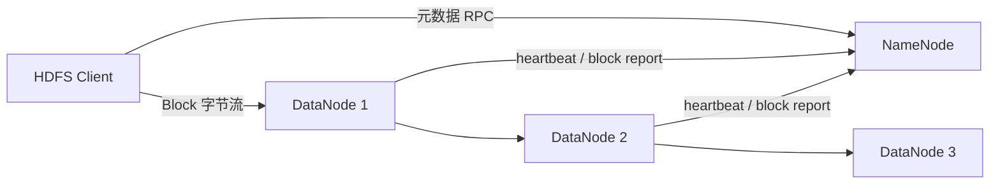

# HDFS 架构、Block 与读写路径

HDFS 面向大文件顺序吞吐和普通服务器故障，核心思想是：文件命名空间由 NameNode 管理，文件内容切成 Block 分散到 DataNode，并通过复制或纠删码容错。它不是低延迟 POSIX 文件系统，也不适合海量小文件和高频随机覆盖。

## 1. 组件与状态



- **NameNode**维护目录树、权限、文件到 Block、Block 到 DataNode 的映射以及租约。
- **DataNode**在本地卷保存 Block 与校验信息，周期性发送 heartbeat 和 block report。
- **Client**先向 NameNode 查询或申请元数据，再直接与 DataNode 传输数据；业务字节不经过 NameNode。

NameNode 是元数据控制面，DataNode 是数据面。把 NameNode 网络流量当成全部读写流量，是常见误判。

## 2. Block 为什么很大

大 Block 可减少文件到 Block 的映射数量、寻道和 RPC 开销，并让单次流式读取持续更久。文件小于一个 Block 时只占实际字节，不会预先填满整块。Block 大小影响并行度与元数据量：过大使单任务粒度和恢复单位变粗，过小会增加 NameNode 元数据、调度和网络连接。

规划时同时考虑：

```text
block 数 ≈ 文件总大小 / block 大小
任务并行上限 ≈ 可切分输入的 split 数
恢复流量 ≈ 丢失 block 总量 × 目标副本缺口
```

## 3. 写入路径

1. Client 请求创建文件，NameNode 检查权限、路径和同名文件，并授予写租约。
2. Client 缓冲达到一个 packet/chunk 后，请求该 Block 的 DataNode pipeline。
3. NameNode按副本策略、机架、磁盘空间和负载返回节点列表。
4. Client 发给第一个 DataNode，后者转发给第二个，依次形成 pipeline。
5. ACK 从 pipeline 尾部反向返回；失败节点被移除，Client 继续并通知 NameNode 补足副本。
6. Block 满后申请下一个 Block；close 时等待确认并让文件完成可见。

写入成功不是“第一个 DataNode 收到字节”，而是达到协议要求的 pipeline 确认并完成元数据状态。客户端崩溃可能留下 under-construction 文件，由租约恢复处理。

## 4. 读取路径

1. Client 向 NameNode 请求文件 Block 位置。
2. NameNode 按网络拓扑返回副本，Client通常选择最近副本。
3. Client 直接向 DataNode 流式读，并校验 checksum。
4. 当前副本异常时切换其他副本，并上报坏 Block。
5. 读到 Block 末尾后选择下一个 Block 副本。

“数据本地性”意味着计算尽量靠近已有副本，但在存算分离和容器环境中，网络、缓存和调度可能比传统本地性更重要。

## 5. 一致性与限制

HDFS 传统语义偏向 write-once/read-many，支持 append，但不适合作为大量小随机更新的数据库。写入中的数据何时对其他 reader 可见、`hflush`/`hsync` 的持久性边界，要按具体 API 和版本验证。三副本也不是备份：误删和错误覆盖会传播，仍需 snapshot、异地复制或备份。

## 6. 最小实验

```bash
hdfs dfs -mkdir -p /lab/hdfs
hdfs dfs -put sample.bin /lab/hdfs/
hdfs dfs -ls /lab/hdfs
hdfs fsck /lab/hdfs/sample.bin -files -blocks -locations
hdfs dfs -cat /lab/hdfs/sample.bin | sha256sum
```

记录文件大小、Block 数、副本位置和 checksum。停止一个保存副本的 DataNode，重复读取并观察客户端切换；恢复后观察副本是否补齐。实验只能在隔离环境进行。

## 7. 关键指标与排障

- NameNode heap、RPC queue、GC、总文件/Block 数；
- live/dead/stale DataNode、heartbeat 延迟；
- missing/corrupt/under-replicated block；
- DataNode volume failure、磁盘利用率和读写延迟；
- 客户端 short-circuit/local/remote read 比例；
- 网络吞吐、跨机架流量和重建流量。

读慢时先定位是 NameNode RPC 慢、单个 DataNode/磁盘慢、网络拥塞、Block 分布不均，还是大量小文件造成打开开销。平均带宽正常不能排除单节点长尾。

## 8. 掌握验收

- 画出读写路径并明确元数据与业务字节是否经过 NameNode；
- 解释 Block 大小如何影响元数据、并行度和恢复粒度；
- 说明 pipeline 节点失败后的 ACK 与恢复过程；
- 用 `fsck` 证明 Block、副本和机架位置；
- 区分副本、snapshot 与备份。

下一篇：[NameNode 元数据、Checkpoint、HA 与 Federation](./02-NameNode元数据Checkpoint-HA与Federation.md)

## 参考资料

- [Apache Hadoop HDFS 用户指南](https://hadoop.apache.org/docs/current/hadoop-project-dist/hadoop-hdfs/HdfsUserGuide.html)
- [HDFS Architecture](https://hadoop.apache.org/docs/current/hadoop-project-dist/hadoop-hdfs/HdfsDesign.html)
