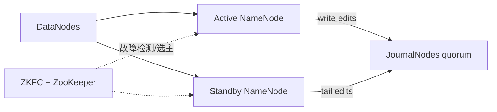

# NameNode 元数据、Checkpoint、HA 与 Federation

NameNode 不保存文件内容，却决定整个命名空间是否可访问。它在内存中维护 inode、目录和 Block 映射，持久化由 fsimage 与 edit log 共同完成。大量小文件首先压垮的往往不是 DataNode 容量，而是 NameNode 内存、RPC 和 checkpoint 时间。

## 1. 元数据生命周期

- **fsimage**：某一时点命名空间的持久化快照。
- **edits**：快照之后的命名空间操作日志，例如 create、rename、delete。
- **内存命名空间**：启动时加载 fsimage，再回放 edits 得到当前状态。
- **Block 报告**：DataNode 报告自己实际持有哪些 Block，帮助重建 Block 位置视图。

Checkpoint 将旧 fsimage 与 edits 合并成新 fsimage，控制日志长度和重启回放时间。Secondary NameNode 是 checkpoint 辅助角色，不是随时可接管的热备 NameNode。

## 2. HA 数据路径



Active 接受命名空间写操作并把 edits 写入共享日志 quorum；Standby 持续跟随 edits，并接收 DataNode Block 报告，以缩短切换恢复。客户端通过逻辑 nameservice 配置自动故障转移。

## 3. Fencing 为什么必需

网络分区时旧 Active 可能仍认为自己可写。若新 Standby 同时晋升，就会双主破坏元数据。Fencing 负责让旧 Active 失去写共享资源或服务请求的能力。选主成功不等于 fencing 成功，必须在演练中确认旧主确实不可写。

## 4. HA 不等于备份

HA 解决进程/节点故障和短 RTO；错误删除、恶意操作、软件缺陷可能同时反映到 Active、Standby 和 JournalNodes。生产还需要：

- 定期保存 fsimage/edits 备份并校验可恢复；
- HDFS snapshot 防逻辑误删；
- 跨集群复制满足更大故障域的 RPO；
- 配置、密钥和 ZooKeeper/JournalNode 恢复文档。

## 5. Federation 解决什么

Federation 让多个 NameNode/namespace 共享一组 DataNode，每个 namespace 管理独立 Block Pool。它用于突破单一命名空间的内存、RPC 和组织边界，不是简单的 Active/Standby 高可用。每个 namespace 仍应配置自己的 HA。

适合按租户或业务域拆分，但代价是路径治理、配额、跨 namespace 数据移动、监控和灾备更复杂。ViewFs 可提供客户端统一挂载视图，但不会把多个 NameNode 变成一个事务命名空间。

## 6. 容量规划

不能只用“每个 Block 占多少字节内存”的固定经验值，因为 inode、ACL、snapshot、xattr、EC 和版本实现都会改变开销。正确做法是在代表性元数据规模下测量：

```text
heap 安全余量 = 目标文件/目录/Block 数下实测占用 + GC余量 + 增长余量
checkpoint RTO = fsimage 读写 + edits 合并 + 上传/切换时间
```

同时设置 namespace/file quota，从入口阻止单个租户制造小文件风暴。

## 7. 操作与验证

```bash
hdfs haadmin -getServiceState nn1
hdfs haadmin -getServiceState nn2
hdfs dfsadmin -report
hdfs dfsadmin -safemode get
hdfs oiv -p Delimited -i fsimage_file -o fsimage.csv
```

在隔离环境演练 Active 进程退出、主机断网、JournalNode 少数/多数不可用和 ZooKeeper 异常。记录检测、选主、fencing、客户端恢复和无元数据丢失的证据。

## 8. 关键指标

- heap/old generation、GC pause、RPC queue/processing time；
- total files、directories、blocks、snapshots；
- edit log sync latency、JournalNode quorum 状态；
- Standby edits lag、last checkpoint age/duration；
- failover 次数、ZKFC 状态、fencing 结果；
- startup/safemode 时间与 missing block。

## 9. 掌握验收

- 解释 fsimage、edits、checkpoint 与内存状态的关系；
- 区分 Secondary NameNode、Standby NameNode 和 Federation；
- 画出 Active、Standby、JournalNode、ZKFC 的控制路径；
- 说明为什么故障转移必须 fencing；
- 制定 NameNode 元数据备份和恢复演练，而不只依赖 HA。

上一篇：[HDFS 架构、Block 与读写路径](./01-HDFS架构Block与读写路径.md)　下一篇：[DataNode 复制、机架感知、再平衡与纠删码](./03-DataNode复制机架感知再平衡与纠删码.md)

## 参考资料

- [HDFS High Availability](https://hadoop.apache.org/docs/current/hadoop-project-dist/hadoop-hdfs/HDFSHighAvailabilityWithQJM.html)
- [HDFS Federation](https://hadoop.apache.org/docs/current/hadoop-project-dist/hadoop-hdfs/Federation.html)
