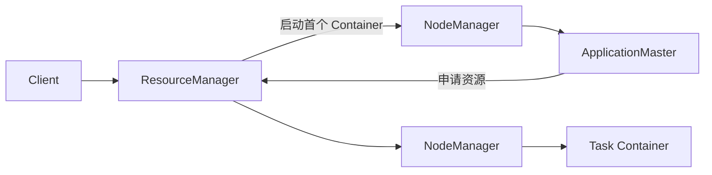

# YARN ResourceManager、NodeManager、Container 与资源模型

YARN 把集群资源管理从具体计算框架中抽离。它负责“哪个应用在什么节点获得多少资源”，而 Spark/MapReduce 自己负责“作业内的 task 怎样执行”。两层调度的状态和指标必须分开。

## 1. 组件

- **ResourceManager**含调度器和应用管理控制面，维护集群可用资源。
- **NodeManager**注册节点、启动/监控 Container、上报资源和健康。
- **ApplicationMaster**每个应用一个，向 RM 协商 Container 并协调本应用任务。
- **Container**是资源分配边界，不等同 Docker 容器；其隔离方式取决于配置。

## 2. 提交流程

Client 上传依赖并提交 application → RM 选择节点启动 AM → AM 注册并申请资源 → Scheduler 按队列/优先级/资源匹配分配 Container → NM 启动任务 → AM 汇总状态并注销。

若 AM 申请 100 个 Container 但队列只有 20 个可用，作业内部显示 pending 不一定是引擎故障，而可能是 YARN 队列或节点标签约束。

## 3. 资源模型

基础资源通常是 memory 与 vcores，也可扩展自定义资源。三个值要区分：

- 应用/Container **request**；
- Scheduler 账面 **allocation**；
- 进程真实 **usage**。

Request 过低会 OOM、swap 或被 NM 杀；过高会浪费、排队和降低集群并发。vcore 是调度份额，不保证每个 workload 得到固定物理核心性能，仍要看 cgroup、超卖和 CPU throttling。

## 4. 队列与调度

Capacity/Fair 等调度器提供队列容量、公平共享、优先级、最大应用数、用户限制和抢占。设计时回答：

- 每个租户保底和最大资源多少；
- 空闲资源能否借用，何时归还；
- 生产、补数、实验任务谁可抢占谁；
- 单个大应用是否阻塞小应用；
- node label/placement constraint 是否造成资源碎片。

队列配置变化应模拟峰值和故障场景，不能只看总容量之和等于 100%。

## 5. 本地化与延迟调度

任务可偏好 data-local、rack-local 或 off-switch 节点。调度器可能短暂等待本地资源，再放宽位置以避免长期排队。大集群中要平衡网络流量和资源利用率；强制本地性可能让有空闲资源的节点闲置。

## 6. 故障恢复

- NM 丢失：其 Container 失败，AM 申请其他节点重试；
- AM 失败：RM 可按应用重试策略重新启动 AM；
- RM 失败：生产需配置 HA 和持久状态恢复；
- Container 超内存：确认物理/虚拟内存口径、heap 与 off-heap，而不是只加 Java heap。

任务重试会重新产生外部副作用，因此输出必须使用 commit protocol、事务或幂等路径。

## 7. 指标与排障

- RM active/standby、scheduler queue、pending/running apps；
- 队列 used/available/pending/preempted resources；
- NM healthy/lost/decommissioned、Container launch failure；
- 每应用 requested/allocated/used、locality、AM attempt；
- Container exit code、stderr、cgroup OOM、磁盘和日志聚合；
- 节点资源碎片：有总空闲但没有满足单个大 request 的节点。

排队慢的顺序：队列容量 → 用户/应用限制 → 单 Container request → 节点标签/位置 → AM 是否成功 → NM 健康。

## 8. 实验

向两个队列提交小任务和超大 request 任务，观察 pending 原因；限制某队列容量并开启可控抢占，记录资源归还时间。停止一个 NM，验证 task 重试和输出是否重复。所有实验使用非生产队列。

## 9. 掌握验收

- 画出 Client、RM、AM、NM、Container 的交互；
- 区分 YARN 资源调度与 Spark/Flink 作业内调度；
- 解释总资源有空闲但应用仍 pending 的五种原因；
- 为多租户设计保底、上限、借用与抢占；
- 从 Container exit code 定位资源不足或节点故障。

上一篇：[HDFS 容量规划、性能指标与故障排查](./04-HDFS容量规划性能指标与故障排查.md)　下一篇：[MapReduce 从 Map 到 Shuffle、Sort 和 Reduce](./06-MapReduce从Map到Shuffle-Sort和Reduce.md)

## 参考资料

- [Apache Hadoop YARN](https://hadoop.apache.org/docs/current/hadoop-yarn/hadoop-yarn-site/YARN.html)
- [YARN Capacity Scheduler](https://hadoop.apache.org/docs/current/hadoop-yarn/hadoop-yarn-site/CapacityScheduler.html)
