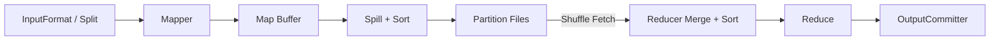

# MapReduce 从 Map 到 Shuffle、Sort 和 Reduce

MapReduce 的价值不只是历史。Spark 和 Flink 的分区、Shuffle、task 重试都继承了相似的分布式计算问题。把 MapReduce 的数据路径看清楚，是理解现代引擎物理执行的好起点。

## 1. 编程模型

```text
map(K1,V1) -> list(K2,V2)
reduce(K2,list(V2)) -> list(K3,V3)
```

单词计数中，Map 输出 `(word,1)`，Shuffle 把相同 word 放到同一 reducer，Reduce 求和。Map/Reduce 函数只是业务逻辑，框架还负责输入切分、排序、网络交换、重试与提交。

## 2. 完整数据路径



InputSplit 是逻辑输入范围，不一定等于 HDFS Block。RecordReader 把字节解析成记录。Map 输出进入 buffer，达到阈值后按 partition 排序并 spill；多个 spill 合并。Reducer 从所有 mapper 拉取自己的 partition，合并排序后按 key 调用 reduce。

## 3. Partitioner 与全局语义

默认 hash partition 保证相同 key 到同一 reducer。Reducer 数决定输出 partition 数和 Shuffle 并行度。单热 key 无论 reducer 多多仍进入一个 reducer，需要 salting、两阶段聚合或修改粒度。

全局排序通常需要 range partition 和采样边界；边界不准会造成倾斜。只有一个 reducer 能简单得到全局排序，但会把整个作业串行化。

## 4. Combiner

Combiner 在 mapper 侧做局部合并，可显著减少 Shuffle 记录。它可能运行零次或多次，因此函数必须满足可结合性，并且不能依赖调用次数。`sum/count/min/max` 常适合；平均值不能只局部输出 average，应输出 `(sum,count)` 再合并。

## 5. Shuffle 的资源消耗

- Map buffer、序列化、排序和 spill 使用 CPU、内存与本地盘；
- Reducer fetch 占网络与连接；
- 多路 merge 再使用磁盘和 CPU；
- 压缩减少网络/磁盘字节但增加 CPU；
- 小 spill 太多会增加 merge pass；巨大 partition 会产生 reducer 长尾。

先过滤字段、使用 Combiner、合理 partition、压缩 map output，通常比盲目加 reducer 更有效。

## 6. 容错与推测执行

Map task 失败可重跑；其本地中间输出丢失时 reducer 重新 fetch，必要时 Map 重算。Reducer 最终输出通过 OutputCommitter 避免失败 attempt 的临时结果暴露。

推测执行为慢 task 启动另一个 attempt，以先完成者为准。它适合偶发慢节点，不解决确定性热 key；对有外部副作用或非幂等 writer 可能制造重复。

## 7. 关键计数器

- input/output records 与 bytes；
- map output records/bytes；
- spilled records、merge 次数；
- shuffled maps/bytes、failed fetch；
- data-local/rack-local task；
- GC/CPU time、task attempt 与 killed speculative；
- HDFS read/write、最终文件数。

通过 `map output / input` 观察数据放大，通过 `reduce max duration / median` 识别倾斜，通过 spilled records 与本地盘定位内存/Shuffle 压力。

## 8. 实验

对同一倾斜数据运行：无 Combiner、启用 Combiner、增加 reducer、热 key salting。保持输入和资源不变，记录 Shuffle bytes、spill、最大 reducer 时间与 checksum。预期“只加 reducer”不能拆热 key，而 Combiner 和 salting改变网络量/长尾。

## 9. 掌握验收

- 画出 split、Map、spill、partition、fetch、sort、Reduce 和 commit；
- 解释 Combiner 为什么不能依赖执行次数；
- 说明 reducer 数对输出文件和并行度的影响；
- 从 counters 区分数据放大、spill、倾斜与 fetch failure；
- 解释 task 重试为何要求输出提交幂等。

上一篇：[YARN 资源模型与调度路径](./05-YARN资源模型与调度路径.md)　下一篇：[Hive 表、分区、Metastore 与小文件治理](./07-Hive表分区Metastore与小文件治理.md)

## 10. 参考资料 {/* #参考资料 */}

- [MapReduce Tutorial](https://hadoop.apache.org/docs/current/hadoop-mapreduce-client/hadoop-mapreduce-client-core/MapReduceTutorial.html)
