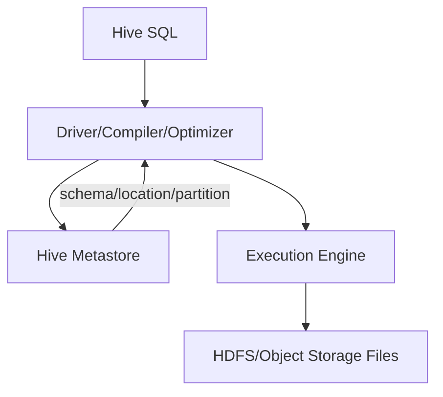

# Hive 表、分区、Metastore、执行引擎与小文件治理

Hive 的关键贡献是把 HDFS/对象存储中的文件映射成带 schema 的表，并用 SQL 描述批量计算。数据字节仍由文件系统保存，Metastore 保存表定义和位置，计算由 MapReduce、Tez 或 Spark 等执行引擎完成。

## 1. 表到文件的映射

常见对象：database、table、column、partition、storage descriptor、SerDe、file format 和 table location。External/managed 的删除与生命周期语义随配置和版本不同，上线前必须用测试表验证，而不能只凭名称判断是否删数据。

## 2. 分区与分桶

- **Partition**按目录或表元数据粗粒度切数据，查询谓词可裁剪不相关分区。
- **Bucket**按列 hash 拆文件，可能帮助采样、Join 或并行，但优化能否利用取决于数据写入正确性和执行引擎。

按天分区适合时间过滤；按用户 ID 建数百万分区会压垮 Metastore 和文件系统。分区字段应兼顾过滤、数据量、写入并发和生命周期。

查询缺少分区谓词会扫描全表。生产可通过 SQL lint、引擎保护和扫描字节配额阻止误操作。

## 3. Metastore 是控制面

Metastore 不保存大表记录，却保存读取这些记录所需的 schema 与位置。生产需保证后端数据库备份、服务高可用、连接池、权限和变更审计。

常见故障：

- Metastore 延迟让 SQL 长时间卡在 planning；
- 大量分区 list/get 使数据库与服务过载；
- 文件已写但分区未注册，或分区存在但路径为空；
- 多引擎对类型、timestamp、SerDe 理解不一致；
- 手工移动目录导致 location 失效。

## 4. SQL 到任务

解析 SQL → 生成逻辑算子树 → 应用谓词/列裁剪和 Join 优化 → 切为 stage/task → 引擎读取文件并 Shuffle → 写临时结果 → commit。`EXPLAIN` 应成为日常工具，重点看扫描分区、Join 策略、Exchange/Shuffle 和统计信息。

优化器依赖 table/column statistics。过期统计可能导致大表广播或错误 Join 顺序；收集统计也有扫描成本，应与数据更新节奏匹配。

## 5. 文件格式和 ACID

分析表优先使用 Parquet/ORC 等列式格式，统一压缩、类型和目标文件大小。Hive ACID 表通过事务、write ID、base/delta 文件和 compaction 支持更新语义，运维复杂度高于 append-only 表；必须监控 compaction backlog、锁和事务清理。

表格式 Iceberg 提供另一种 snapshot/metadata 路径。不要在同一张表上让不兼容 writer 绕过表协议直接写目录。

## 6. 小文件治理

小文件来源：动态分区过多、每 task 一个文件、微批频繁提交、数据量小却并行度高。影响 NameNode/对象请求、planning、task 启动和 reader 吞吐。

治理闭环：统计每分区文件数与 P50/P90 大小 → 找到 writer/分区源头 → 调整并行度和 rolling → 定期合并 → 用事务/快照安全替换 → 校验旧 reader 和生命周期。

直接 `mv`/删除生产表文件可能让 Metastore、事务或表快照失真。

## 7. 分层建模

ODS 保留可追溯源记录，DWD 清洗去重并统一粒度，DWS 沉淀公共聚合，ADS 服务具体应用。分层是责任边界，不是固定层数。每层定义 owner、主键/粒度、时间语义、SLA、质量和保留期。

## 8. 实验与排障

创建按天分区的外部表，分别执行带/不带分区谓词查询，用 `EXPLAIN` 和 HDFS read bytes 证明裁剪。向一天写入大量小文件，再合并为目标大小，对比 planning、task 数与总耗时。全程核对 count、sum 和 checksum。

指标：Metastore RPC/DB latency、分区数、SQL compilation time、scan bytes/files、task/Shuffle、输出文件分布、锁/事务/compaction。

## 9. 掌握验收

- 画出 SQL、Metastore、执行引擎与文件系统的关系；
- 区分表分区、bucket、文件和计算 task；
- 用 `EXPLAIN` 证明分区裁剪与 Join 策略；
- 解释小文件为何同时影响 NameNode、规划和执行；
- 设计 Metastore 备份、schema 变更和数据生命周期流程。

上一篇：[MapReduce 从 Map 到 Shuffle、Sort 和 Reduce](./06-MapReduce从Map到Shuffle-Sort和Reduce.md)　下一模块：[Kafka 架构与分区日志](../../messaging/kafka/01-Kafka架构分区日志Segment与索引.md)

## 10. 参考资料 {/* #参考资料 */}

- [Apache Hive 文档](https://hive.apache.org/docs/latest/)
- [Hive Language Manual](https://cwiki.apache.org/confluence/display/Hive/LanguageManual)
