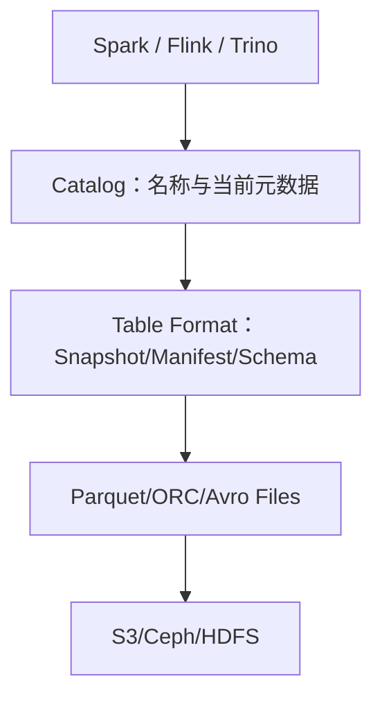

# 数据湖、表格式、Catalog 与存算分离

“把 Parquet 放到 S3”只得到文件，不自动得到可并发写、可演进、可回滚的表。现代湖仓至少包含：底层存储、数据文件格式、表格式元数据、Catalog 和计算引擎。

## 1. 五层模型

- 存储保存对象/Block；
- 文件格式组织列、编码、压缩与统计；
- 表格式原子管理哪些文件属于哪个版本；
- Catalog 把 `namespace.table` 解析为当前表元数据；
- 引擎规划并执行读写。

每层可替换，但兼容矩阵、权限和一致性边界要验证。

## 2. 数据湖的治理要求

可用数据湖不仅能保存原始数据，还需 schema、owner、敏感级别、质量、保留期、血缘、版本和发现能力。缺少这些会形成数据沼泽：同名字段口径不同、目录不可追溯、过期数据无人清理。

## 3. 表格式解决什么

- 读者看到一致 snapshot，而不是半批文件；
- writer 原子提交文件集合并检测冲突；
- schema/partition 演进不强迫重写全部历史；
- time travel、rollback 和审计；
- 文件级统计和元数据裁剪；
- 行级更新通过 delete/update 语义表达。

它不负责计算资源、底层硬件可靠性、业务建模和所有跨表事务。

## 4. Catalog 的角色

Catalog 保存/解析表标识、当前 metadata 指针和相关属性，实现原子提交所需的并发控制。可选实现有 Hive Metastore、REST、JDBC、云服务等，具体能力不同。

生产关注：高可用、延迟、并发提交、认证授权、备份恢复、跨区域和引擎兼容。Catalog 不可用时数据对象仍在，但无法安全发现最新表状态。

## 5. 存算分离

计算集群按需扩缩并共享同一数据，容量和 CPU 可独立规划；代价是网络、对象请求、Catalog 和缓存成为关键路径。对象存储吞吐高不代表小对象/metadata 请求快。

缓存只能作为可重建性能层：本地 NVMe、page cache 或分布式 cache 失效后，权威 snapshot仍在远端。

## 6. 多引擎风险

不同 Spark/Flink/Trino 版本对表规范、类型、delete file、分支/标签等支持可能不同。只让通过表格式 connector 的 writer 修改表；禁止某引擎绕过 metadata 直接删除/覆盖目录。

建立兼容测试：每个 writer 产出后，所有 reader 校验 schema、count、timestamp/decimal、filter、time travel 和 delete。

## 7. 选型问题

先问：是否多引擎共享、是否有并发写、是否需更新删除、历史回溯、schema/partition 演进、对象存储、治理与团队能力。若只是单应用小数据 append，复杂湖仓可能不值得。

## 8. 掌握验收

- 画出存储、文件、表格式、Catalog 和引擎；
- 解释 Parquet 为什么不是表事务；
- 说明 Catalog 故障和对象存储故障的不同现象；
- 列出存算分离的网络/缓存/元数据代价；
- 为多引擎建立读写兼容测试。

下一篇：[Iceberg Metadata、Manifest、Snapshot 与读写路径](./02-Iceberg-Metadata-Manifest-Snapshot与读写路径.md)

## 9. 参考资料 {/* #参考资料 */}

- [Apache Iceberg Documentation](https://iceberg.apache.org/docs/latest/)
- [Apache Iceberg Specification](https://iceberg.apache.org/spec/)
