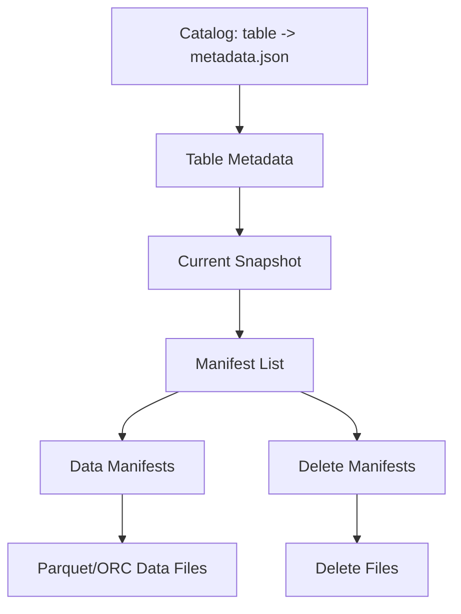

# Iceberg Metadata、Manifest、Snapshot 与读写路径

Iceberg 跟踪表中的文件，而不是把目录层次当作表真相。每次表变化创建新 metadata/snapshot，并通过 Catalog 原子切换当前版本。旧 snapshot继续引用旧文件，从而支持一致读取和 time travel。

## 1. 元数据树

Table metadata 记录 schema、partition specs、properties、snapshots 和当前 snapshot。Manifest list 保存 manifest 统计；manifest 是不可变 Avro 文件，列出 data/delete files、partition tuple、列统计和状态。

## 2. 读取路径

1. Catalog 解析当前 metadata；
2. 选择当前或指定 snapshot；
3. 用 partition stats 裁剪 manifest；
4. 用 file metrics 裁剪 data files；
5. 生成 scan tasks/splits；
6. Reader 读取数据列并应用适用 delete；
7. 返回一致 snapshot 结果。

Planning 慢可能发生在 Catalog、metadata/manifest 数量或对象请求，并不一定是数据扫描慢。

## 3. 写入与提交

Writer 并行生成 data/delete files及指标 → 写 manifest/manifest list → 基于读取的 base metadata 构建新 snapshot → Catalog 原子比较并切换 metadata 指针。

若其他 writer 先提交，当前 commit 可能冲突；引擎重新加载最新 metadata，按操作隔离规则验证并重试。乐观并发不等于所有冲突都可安全重试，例如覆盖同一数据范围需要检测。

## 4. Snapshot 操作

Summary 中 operation 可区分 append、replace、overwrite、delete 等。Compaction 通常是 replace：更换物理文件而不改变逻辑数据。Snapshot ID、parent、sequence number 和 timestamp共同描述历史。

Time travel 固定 snapshot；读“当前”可能在不同查询时刻变化。长任务应在启动时记录 snapshot ID。

## 5. Delete Files

行级更新/删除可通过位置删除、等值删除等机制表达，reader 合并 data 与 delete。Delete file 过多会增加 planning、读取和 merge-on-read 成本，需要 rewrite/compaction。规范版本与引擎支持必须匹配。

## 6. Orphan Files

文件上传成功但 commit 失败会留下不被 snapshot引用的对象。它们不可见但占空间。Orphan 清理必须设置大于最长在途写、重试和 reader 窗口的安全时间，禁止按目录“看起来旧”直接删。

## 7. 元数据表与诊断

使用引擎提供的 snapshots、history、files、manifests、partitions 等 metadata tables 查看历史和文件分布。记录 snapshot 提交延迟/冲突、manifest/file 数、planning time、scan bytes/files 和 delete-file ratio。

## 8. 实验

创建表，执行两次 append、一次 delete/overwrite 和一次文件 rewrite。每步记录 snapshot/history/files，按旧 snapshot 查询；故意并发两个 writer观察冲突。校验 compaction 前后 count/checksum 不变。

## 9. 掌握验收

- 从 Catalog 画到 data/delete file；
- 解释 manifest/manifest list 的裁剪作用；
- 描述乐观提交冲突和安全重试；
- 区分 append、overwrite、delete、replace；
- 安全识别和清理 orphan file。

上一篇：[数据湖、表格式与 Catalog](./01-数据湖表格式Catalog与存算分离.md)　下一篇：[Schema/Partition Evolution 与 Time Travel](./03-Schema-Partition-Evolution与Time-Travel.md)

## 参考资料

- [Iceberg Specification](https://iceberg.apache.org/spec/)
- [Iceberg API](https://iceberg.apache.org/docs/latest/api/)
