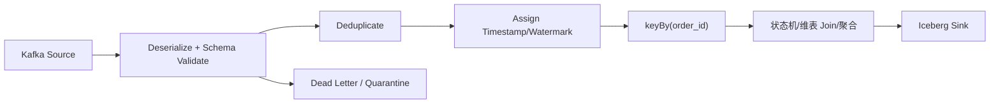
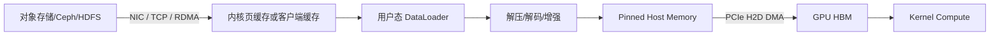
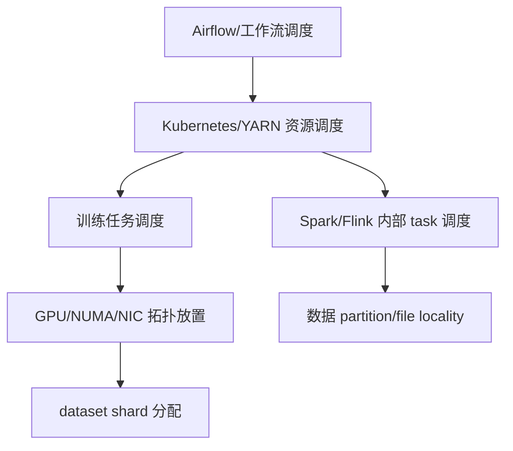

# 从 Kafka 到 Flink、Iceberg、Spark 再到 GPU：一条数据的完整路径

前面的文章分别解释了批流架构、分区、Shuffle、一致性和文件格式。本篇把这些模块装回一条真实链路：业务数据库的订单变化进入 Kafka，Flink 实时清洗并写 Iceberg，Spark 生成特征和训练数据集，训练节点从远端存储读取数据，经 CPU、PCIe 进入 GPU 显存。

目标不是给出唯一技术选型，而是建立一套可以替换组件的分析框架。Kafka 可以换成其他日志系统，Iceberg 下层可以是 S3、Ceph 或 HDFS，批引擎可以替换，但每个交接点仍要回答：字节在哪里、状态由谁保存、失败从哪里恢复、吞吐如何测量。

## 1. 业务目标与验收口径

假设业务每天产生 10 亿条订单变化事件，平均 800 B，峰值为平均值的 5 倍。平台需要：

- 订单变化在 60 秒内进入湖仓明细表；
- 每日生成一个可复现的训练数据集版本；
- 任一 worker 故障不能静默丢失或重复计算金额；
- 训练作业平均 GPU 利用率达标时，能证明数据供给不是瓶颈；
- 每条训练样本可追踪到 source position、表 snapshot 和转换代码版本。

先估算平均入口吞吐：

```text
records/s = 1,000,000,000 / 86,400 ≈ 11,574
bytes/s   = 11,574 × 800 B ≈ 8.8 MiB/s
peak      ≈ 44 MiB/s（按 5 倍峰值）
```

网络和磁盘规划不能只按 44 MiB/s。Kafka 副本写入、跨节点复制、协议开销、Flink 读取、Iceberg 文件上传和 compaction 都会放大物理流量，还需安全余量和故障恢复带宽。

## 2. 端到端架构

```mermaid
flowchart LR
    A["MySQL/PostgreSQL"] -->|"binlog / WAL"| B["Debezium CDC"]
    B -->|"Avro/Protobuf record"| C["Kafka"]
    C -->|"partition + offset"| D["Flink"]
    D -->|"data/delete files + commit"| E["Iceberg"]
    E -->|"Parquet objects"| F["S3 / Ceph / HDFS"]
    E -->|"snapshot scan"| G["Spark"]
    G -->|"feature table"| H["训练数据发布器"]
    H -->|"manifest + shards"| I["训练节点存储/缓存"]
    I -->|"read/decode/batch"| J["CPU Memory"]
    J -->|"PCIe H2D"| K["GPU HBM"]
    K -->|"DDP collective"| L["NVLink/NVSwitch/NIC"]
```



不要把最后的 GPU 通信与前面的数据加载混为一谈：

- **数据供给路径**负责把训练样本从对象/文件存储送到 GPU；
- **训练通信路径**负责在 GPU 之间同步 gradient、parameter 或 activation，走 NVLink/NVSwitch、PCIe、RDMA NIC 等；
- 二者可能共享 CPU、NUMA、PCIe root complex 和网络，因此会互相争抢，但指标和优化手段不同。

## 3. 为每一跳建立“状态护照”

一条事件只有携带稳定标识，才能重放、去重和追踪。

| 阶段 | 数据标识/版本 | 控制状态 | 正确性证据 |
|---|---|---|---|
| 数据库 | 主键、事务 ID、LSN/binlog position | 事务日志 | 已提交事务、源行版本 |
| CDC | event ID、source position、schema version | connector offset | 快照与增量无缺口 |
| Kafka | topic、partition、offset | 元数据、consumer group offset | offset 范围与记录校验 |
| Flink | key、operator state、checkpoint ID | checkpoint/savepoint | source/state/sink 对齐 |
| Iceberg | table、snapshot ID、data file | catalog + metadata/manifest | 原子可见 snapshot |
| Spark | application ID、input snapshot、job version | DAG/commit protocol | 输入输出 count/checksum |
| 数据集 | dataset version、manifest、shard checksum | registry/catalog | 不可变 manifest |
| 训练 | run ID、epoch、sample ID、model checkpoint | scheduler/experiment tracker | 数据集和代码版本可追溯 |

在日志、指标和表字段中保留必要关联 ID，但不要把密码、个人敏感信息或完整 payload 当成可观测标签。

## 4. 第一跳：数据库到 CDC

### 4.1 数据面

CDC 连接器先对现有表做一致快照，再持续读取 binlog/WAL 中的 insert、update、delete。输出应保留 before/after、操作类型、源表、源位置和 schema 信息。

### 4.2 控制面

连接器必须持久化：

- 全量快照进度；
- 已确认的日志位置；
- schema history；
- connector/task 分配与状态。

### 4.3 故障边界

快照与增量交界最容易出问题。若先完成快照再记录日志位置，可能漏掉快照期间更新；若位置和快照不一致，也可能重复。具体连接器通过其快照协议协调，必须验证所用数据库和 connector 模式。

Schema change 也不能只看进程是否存活：新增列、改变 decimal、表重命名、DDL 权限不足都可能让下游解析失败或悄悄变成 null。

### 4.4 关键指标

- source 当前日志位置与 connector 已处理位置；
- snapshot 剩余表/行；
- 每秒事件与字节；
- 数据库复制槽/binlog 保留空间；
- schema history 失败和无法解析事件；
- 从数据库 commit 到 Kafka record 的延迟。

## 5. 第二跳：CDC 到 Kafka

### 5.1 Topic 与 Partition 设计

若需要同一订单变更保持顺序，可用稳定 `order_id` 作为 message key，使同 key 进入同一 partition。Kafka 只在单 partition 内提供顺序边界，跨 partition 没有全局顺序。

Partition 数要同时满足：

- 峰值 producer/consumer 吞吐；
- Flink source 可用并行度；
- broker 磁盘、网络与副本恢复压力；
- 元数据和 rebalance 成本；
- 未来扩展余量。

增加 partition 会改变普通 `hash(key) mod N` 映射，可能影响 key 顺序的连续性和下游假设，不能当作无影响扩容。

### 5.2 Schema 与 Envelope

推荐用 Avro/Protobuf/JSON Schema 等带版本治理的消息结构，至少包含：

```text
event_id, entity_id, op, event_time, source_position,
schema_version, before, after
```

大字段或二进制对象通常不直接塞进 Kafka，而是存对象存储，事件只携带 URI、版本和 checksum。这样可避免 broker 和 consumer 被超大 record 拖垮。

### 5.3 可靠性边界

Producer 的 acks、重试、幂等与事务决定发送故障时的行为；broker 副本与 ISR 决定节点故障时的数据可用性；topic retention 决定最大重放窗口。参数随 Kafka 版本变化，应依据官方文档设置并用故障实验验证。

### 5.4 关键指标

- bytes/records in/out；
- produce/fetch request latency；
- under-replicated/offline partition；
- ISR shrink/expand 与 leader 变化；
- consumer lag 的 records 和时间维度；
- broker 磁盘使用率、磁盘延迟、网络饱和与 page cache；
- record size、batch size、压缩比和错误率。

Consumer lag 增长只是结果，需继续判断是输入突增、Flink 计算变慢、checkpoint 阻塞，还是下游存储反压。

## 6. 第三跳：Kafka 到 Flink

### 6.1 Source 与并行度

Flink source 读取 partition/offset，将事件反序列化。Source 并行度大于 Kafka partition 数时，额外 subtask 不会凭空增加有效读取并行；partition 太少时，增加 TaskManager 也不能突破源端并行上限。

### 6.2 典型处理拓扑



每个算子要明确：

- 是否无状态；
- 按什么 key 分区；
- 保存多少 keyed state/timer；
- TTL 与最大迟到/重放窗口；
- schema 错误是失败、隔离还是忽略；
- 输出是 append、upsert 还是 changelog。

### 6.3 时间语义

使用 source 中的业务事件时间，定义 watermark 和允许迟到。Watermark 太激进会把正常乱序判为迟到；太保守会让窗口和 state 长期不释放，提高延迟与 checkpoint 体积。

建议分别记录：

```text
ingestion_lag  = kafka_append_time - source_commit_time
processing_lag = flink_process_time - kafka_append_time
event_time_lag = current_time - current_watermark
```

三者能区分采集、消息和流计算在哪一段落后。

### 6.4 Checkpoint 与一致性

Checkpoint 对齐 Kafka offset、Flink operator state 和 Iceberg sink 待提交文件。完成 checkpoint 后，对应表 snapshot 才成为一致可见版本，具体提交协议取决于 connector 版本。

生产配置要同时考虑：

- checkpoint interval 与业务可见延迟；
- timeout、并发 checkpoint 和最小间隔；
- state backend 与 checkpoint 存储；
- incremental snapshot 能力；
- checkpoint 数据的保留、权限和容灾；
- savepoint 升级与回滚测试。

### 6.5 反压诊断

当 Iceberg/object storage 写慢，sink buffer 堵塞，反压会向上游传播，最终 Kafka lag 增长。排查方向应从最下游向上游：

1. 哪个 operator 最早表现为高 busy、低 output；
2. sink 上传/commit 是慢在数据对象还是 catalog；
3. 是否某个 writer 数据倾斜；
4. checkpoint 对齐是否被慢 subtask 拖住；
5. 对象存储网络、请求限速和磁盘是否异常。

## 7. 第四跳：Flink 到 Iceberg 与底层存储

### 7.1 不只是“写 Parquet 文件”

一次表提交大致包括：

1. Writer 把记录组织成 Parquet/ORC 数据文件，update/delete 场景还可能产生 delete file；
2. 生成文件级统计和 manifest；
3. 基于当前表 metadata 构建新 snapshot；
4. 通过 catalog 原子更新当前 metadata 指针；
5. Reader 看到新 snapshot；提交失败的文件不可见，稍后按策略清理。

### 7.2 底层存储选择

| 存储 | 关注点 | 常见优势 | 主要风险 |
|---|---|---|---|
| HDFS | block、副本、本地性、NameNode | 大文件吞吐和生态成熟 | 存算扩缩耦合、集群运维 |
| S3 类对象存储 | request、吞吐、版本、成本 | 存算分离、容量弹性 | 请求延迟/限速、一致性与费用需核对实现 |
| Ceph RGW | 对象网关、pool/PG、网络、OSD | 私有云统一对象能力 | 集群资源争抢、恢复流量和运维复杂度 |
| CephFS/NFS | 文件语义、metadata、客户端缓存 | POSIX 工具兼容 | metadata 热点、小文件和客户端挂载故障 |
| 本地 NVMe | 节点本地吞吐与延迟 | 缓存、Shuffle 和训练热数据 | 节点故障丢缓存，容量与调度绑定 |

表格式通过文件 I/O 接口支持不同存储，但性能与故障边界不会被抽象层抹平。生产前要测 PUT/GET、并发小对象、大对象吞吐、失败重试和 catalog 可用性。

### 7.3 小文件与提交频率

如果 Flink sink 有 128 个 writer，每 1 分钟 checkpoint/commit，每个 writer 每次只写少量数据，一天可能产生大量小文件。可从四个方向治理：

- 匹配 source、operator 和 sink 并行度；
- 调整文件 rolling/target size 与提交周期；
- 选择合适 partition spec，避免过细分区；
- 运行 compaction/rewrite，并安全管理旧 snapshot。

不能只提高 target file size。如果每个 writer 每个分区每批只有几 MiB，它永远攒不到目标值就被 checkpoint 关闭文件。

### 7.4 关键指标

- snapshot commit latency、冲突和失败；
- 每个 snapshot 新增 data/delete files 数；
- 文件大小 P10/P50/P90/max；
- manifest 数量和查询 planning time；
- object PUT/GET/HEAD 延迟、错误和吞吐；
- compaction backlog、orphan files、snapshot 数；
- Ceph/HDFS 对应的磁盘、网络、恢复和元数据健康指标。

## 8. 第五跳：Spark 读取 Snapshot 并构建特征

### 8.1 固定输入版本

每日训练数据作业不要读取“当前最新表”并让其在运行中变化。调度开始时解析并记录 input snapshot ID，所有 task 读取同一快照。这样重跑和审计有稳定边界。

### 8.2 查询规划与文件裁剪

Spark 通过 catalog/metadata 获取 snapshot 文件列表，应用 partition pruning、列裁剪和统计下推，再创建 input partitions。规划慢可能不是 executor 算得慢，而是文件/manifest 太多或 catalog 延迟高。

### 8.3 Join 与 Shuffle

特征生成常把订单事实与用户、商品维表 Join。需要查看物理执行计划：

- 小维表是否可安全 broadcast；
- Join key 是否包含 null/default 热点；
- 过滤和列裁剪是否在 Shuffle 前执行；
- AQE 是否实际拆分倾斜 partition；
- executor memory、spill 和本地临时盘是否足够；
- 输出 writer 数是否制造小文件。

### 8.4 数据质量闸门

作业完成不应立即发布训练集。至少检查：

- 输入 snapshot 的记录/主键范围；
- 重复事件与实体版本倒退；
- label 泄漏和未来信息；
- null、枚举、数值范围和分布漂移；
- 训练/验证/测试切分是否按用户或时间正确隔离；
- 输出 count、业务汇总和抽样 checksum。

质量未通过时，输出版本应保持不可见，调度系统标记失败并保留诊断证据。

## 9. 第六跳：从特征表发布训练数据集

湖仓表是权威数据源，但训练通常需要一个不可变的发布版本：

```text
dataset_version/
  manifest.json
  schema.json
  statistics.json
  train/shard-00000...
  validation/shard-00000...
  test/shard-00000...
```

Manifest 至少记录：

- dataset version 与创建时间；
- source table 和 snapshot IDs；
- SQL/代码 Git commit、依赖和配置；
- schema、特征定义、label 定义；
- 每个 shard URI、大小、样本数和 checksum；
- split 方法、随机种子和质量结果；
- 权限、保留期和数据所有者。

版本一旦发布就不应原地覆盖。修复数据时发布新版本，让训练 run 明确引用它，才能复现历史模型。

### 9.1 Shard 设计

大量 50 KiB 图片逐对象读取会产生高请求和打开开销；可将样本打包成较大 shard。Shard 太小仍有元数据问题，太大则并行度、随机性和重试粒度变差。

分布式训练中，每个 rank 需要确定地分配 shard/sample，避免重复训练或遗漏。每个 epoch 是否重新 shuffle、失败恢复从 batch 还是 shard 继续，也要进入数据语义设计。

## 10. 第七跳：存储到 CPU，再到 GPU 显存

训练 batch 的典型路径：



使用本地 NVMe 缓存时，远端路径只在缓存 miss 或预热阶段发生。使用 GPUDirect Storage 的特定场景可以减少 CPU bounce，但仍受文件系统、驱动、DMA 路径、GPU/存储拓扑和软件支持约束，不能只开启一个参数就假定生效。

### 10.1 吞吐预算

单样本预处理后平均 2 MiB，单 GPU 每秒消费 200 样本，8 GPU 节点所需有效数据率约为：

```text
2 MiB × 200 sample/s × 8 = 3.125 GiB/s
```

这还未包含压缩比、预取、shuffle、重复读取和突发。若节点远端网络只有有效 2 GiB/s，GPU 必然等待，除非缓存命中或样本实际更小。

### 10.2 分段指标

必须把 batch 时间拆开：

- storage read latency/throughput；
- cache hit ratio；
- DataLoader queue depth 和 worker busy；
- decode/augmentation CPU time；
- pinned memory 使用和 H2D bandwidth；
- GPU kernel time、data wait time、利用率和 HBM 使用；
- 每 step collective communication time。

GPU utilization 呈锯齿且 DataLoader 队列经常为空，才更像数据供给不足；如果队列充足但 collective 很慢，应看 NVLink/NIC/RDMA 网络，而不是继续调存储。

## 11. 第八跳：GPU、NVLink 与跨节点网络

单机多 GPU 训练中，peer-to-peer 通信可能走 NVLink/NVSwitch，也可能退回 PCIe，取决于硬件拓扑和通信库选择。跨节点通常经 GPU/CPU memory、PCIe 和 NIC；GPUDirect RDMA 可在支持条件下减少 CPU 中转。

数据加载与集合通信可能同时经过同一 NIC 或 PCIe root complex。若存储流量和 NCCL 流量共享链路，训练 step 到达 collective 时会出现周期性拥塞。生产设计可考虑：

- 独立存储网络和训练 Fabric；
- 多 NIC/rail 与拓扑亲和；
- GPU、NIC、本地 NVMe 的 NUMA 对齐；
- 数据预取限速，避免与 collective 峰值争抢；
- 使用拓扑和 NCCL 日志确认真实通信路径。

深入学习可阅读 [NVLink 与 NVSwitch 原理](../../../gpu/nvlink-nvswitch/01-NVLink与NVSwitch原理.md)、[GPU-NIC 拓扑与 NUMA 亲和](../../../networking/rdma-roce/ai-cluster/06-GPU-NIC拓扑与NUMA亲和.md) 和 [训练与推理通信流量模型](../../../networking/rdma-roce/ai-cluster/01-训练与推理通信流量模型.md)。

## 12. 调度跨越了哪些层



各层职责不同：

- 工作流调度决定依赖、补数、重试和发布时机；
- 集群调度分配 CPU、内存、临时盘、GPU 和网络设备；
- 引擎调度把 partition/stage/operator 映射到 worker；
- 训练框架把 rank 映射到 GPU，并分配数据 shard；
- 拓扑策略尽量让 GPU、NIC、NVMe、CPU 位于合适 NUMA。

如果 Airflow 重试整个 Spark 作业，而输出路径不是幂等，会重复数据；如果 Kubernetes 只按 GPU 数调度而忽略 NIC/NUMA，集合通信会绕路；如果训练 rank 变化但 sampler 没正确恢复，会重复或遗漏样本。因此“调度”不是链路末尾的一个产品，而是贯穿每层的决策。

## 13. 建立统一 SLO 与延迟预算

定义数据新鲜度：从数据库事务提交到 Iceberg snapshot 对查询可见。若目标为 P99 60 秒，可以分解预算：

| 阶段 | P99 预算示例 |
|---|---:|
| CDC 采集 | 10 s |
| Kafka 排队 | 5 s |
| Flink 处理与状态 | 10 s |
| 文件滚动/checkpoint | 25 s |
| Iceberg commit/catalog 可见 | 10 s |
| **总计** | **60 s** |

这只是设计示例，不是通用值。实际运行要记录每段 P50/P95/P99，确认预算能相加且时间戳口径一致。

训练侧则可以定义：

- dataset 发布 deadline；
- 训练读取可用性；
- 每节点 samples/s；
- data wait 占 step time 比例；
- GPU 有效计算与 collective 时间；
- cache 预热时间和命中率。

## 14. 容量规划要考虑放大系数

日原始数据 800 GiB，不代表存储只增加 800 GiB。至少估算：

```text
Kafka 存储 = 入口字节 × retention × 副本系数 / 压缩比
湖仓存储 = data files + delete files + metadata + 保留 snapshots 引用的旧文件
临时空间 = Flink state/checkpoint + Spark Shuffle/spill + compaction 重写峰值
训练存储 = 特征表 + dataset shards + 节点缓存 + 多版本保留
恢复带宽 = 正常业务流量之外的副本重建/重放/缓存预热
```

Compaction 常需要同时保留旧文件和新文件，磁盘接近满水位时才做 compaction 可能反而无法完成。存储、网络和 catalog 都应有明确安全水位。

## 15. 一张全链路排障表

| 现象 | 第一批证据 | 可能边界 |
|---|---|---|
| Kafka lag 持续增长 | 输入率、Flink source/output、backpressure | 入口突增、计算慢、sink 反压 |
| Flink checkpoint 变慢 | alignment、state size、各 subtask、sink commit | 倾斜、状态膨胀、存储/catalog 慢 |
| Iceberg 查询规划慢 | snapshot/manifest/file 数、catalog latency | 小文件、元数据膨胀 |
| Spark 少数 task 长尾 | max/median input、Shuffle、spill、节点 I/O | 热 key、巨型文件、慢节点 |
| 数据重复 | event ID、offset、checkpoint、snapshot | 重试、sink 非幂等、去重 TTL |
| 数据缺失 | source position、DLQ、watermark、quality result | CDC 缺口、解析丢弃、迟到策略 |
| GPU 利用率低且周期性空闲 | DataLoader queue、read/decode/H2D、collective | 存储、CPU、PCIe 或网络 |
| 多机训练 collective 慢 | NCCL trace、拓扑、NIC counters、存储并发 | 链路绕行、拥塞、共享 NIC |

排障时按证据缩小故障域，不要同时修改十个参数。每次变更保留前后基线和正确性校验。

## 16. 分阶段实验：从一台机器走到可演练链路

### 16.1 阶段 A：正确性最小闭环 {/* #阶段-a正确性最小闭环 */}

使用小规模 Kafka、Flink 和表存储环境，生成带 `event_id`、业务 key、事件时间和金额的确定性数据。完成：

1. 写入事件，其中 1% 故意重复、1% 迟到；
2. Flink 去重/聚合并写表；
3. Spark 固定 snapshot 读取并校验；
4. 导出 dataset manifest；
5. 用单进程 DataLoader 顺序读取所有样本。

验收：唯一事件数、金额汇总、最大事件时间、snapshot ID 和 shard checksum 全部一致。

### 16.2 阶段 B：性能基线 {/* #阶段-b性能基线 */}

逐步增加数据率，记录每段吞吐、P99 延迟和资源。建立正常基线，不要一开始就追求最大值。对比不同 Kafka partition、Flink 并行度、文件大小、Spark Shuffle partition 和 DataLoader worker 数。

### 16.3 阶段 C：故障注入 {/* #阶段-c故障注入 */}

依次执行：

- 停止 CDC task 并恢复；
- 停止一个 Kafka broker；
- 在 checkpoint 中终止 Flink TaskManager；
- 让 catalog 短时不可用；
- 让一个 Spark executor 失败；
- 清空训练节点缓存并限速远端读取；
- 终止一个训练 worker 后从 model checkpoint 恢复。

每次只注入一种故障，记录时间线：故障开始、检测、自动动作、人工动作、恢复、数据校验。不要在没有隔离的生产环境直接执行破坏实验。

### 16.4 阶段 D：跨层争抢 {/* #阶段-d跨层争抢 */}

同时运行 Iceberg compaction、Spark 特征作业和多机 GPU 训练，观察存储、网络和调度的资源争抢。通过配额、优先级、错峰、独立网络或限速进行治理，并证明训练 step time 与数据平台 deadline 同时改善。

## 17. 生产发布检查表

### 17.1 数据契约 {/* #数据契约 */}

- event ID、业务 key、时间、时区和 schema version 已定义；
- 兼容策略、坏数据隔离和回放流程已测试；
- PII 分类、加密与访问审计已配置。

### 17.2 一致性与恢复 {/* #一致性与恢复 */}

- source position、checkpoint、snapshot 和 dataset version 可关联；
- sink 幂等/事务边界明确，外部副作用单独设计；
- checkpoint/savepoint、catalog metadata 和训练 manifest 有备份与恢复演练；
- 去重 TTL 覆盖最大迟到和重放窗口。

### 17.3 性能与容量 {/* #性能与容量 */}

- 峰值输入、复制、Shuffle、compaction、恢复和训练流量均已估算；
- 文件大小、partition、并行度和 writer 数有基准依据；
- 磁盘、对象请求、网络、checkpoint 和本地缓存有安全水位；
- GPU data wait 与 collective time 可拆分观测。

### 17.4 运维 {/* #运维 */}

- 每段都有 SLO、告警和 runbook；
- Dashboard 能从业务新鲜度下钻到 partition/task/file/node；
- 滚动升级、schema change、补数和回滚已演练；
- 数据质量失败阻止发布，而不是仅发一条告警后继续。

## 18. 常见误区

- **这条链路就是固定的标准架构。** 组件可替换，应根据时效、规模、查询、团队和成本选择。
- **Kafka lag 为零就说明实时。** CDC 可能已落后，Iceberg commit 也可能未可见。
- **Flink checkpoint 成功就说明表中无重复。** sink 协议、事件 ID 和上游重复仍需验证。
- **Iceberg 是底层存储。** 它是表格式，数据仍在对象存储、HDFS 或其他文件系统中。
- **Spark 作业成功就可以发布训练集。** 还需要固定 snapshot、质量闸门和不可变 manifest。
- **GPU 利用率低就是存储慢。** CPU 解码、H2D、collective、同步和 kernel 都可能是瓶颈。
- **调度只发生在 Kubernetes。** 工作流、引擎、rank、shard 和硬件拓扑都有调度决策。
- **平均吞吐达标即可。** 新鲜度和训练 step 常被 P99 长尾决定。

## 19. 掌握验收

完成本文后，不看图独立完成：

- 画出数据库、CDC、Kafka、Flink、Iceberg、Spark、dataset、CPU、GPU 的数据面；
- 在同一张图上标出 source position、offset、checkpoint、snapshot 和 dataset version；
- 解释 Kafka partition 如何限制 Flink source 并行度，sink writer 又如何影响小文件；
- 解释一次 Flink sink 反压为何最终表现为 Kafka lag；
- 固定 Iceberg snapshot 生成可复现训练集，并记录 manifest/checksum；
- 把 GPU data wait 分解为远端读取、缓存、解码、H2D 和 collective；
- 为整链路定义新鲜度 SLO、训练吞吐 SLO 和分段延迟预算；
- 注入任一 worker 故障后，用业务守恒、唯一性与版本链证明恢复正确。

## 20. 继续学习 {/* #继续学习 */}

- [大数据技术学习地图](../00-大数据技术学习地图.md)
- [分区、并行度、Shuffle 与数据倾斜](../foundations/03-分区并行度Shuffle与数据倾斜.md)
- [数据一致性、幂等与 Exactly-Once](../foundations/04-数据一致性幂等与Exactly-Once.md)
- [Parquet、ORC、Avro 与压缩编码](../foundations/05-Parquet-ORC-Avro与压缩编码.md)
- [AI 工作负载的存储 I/O 模型](../../../storage/ai-workloads/01-AI工作负载的存储IO模型.md)
- [Kubernetes 分布式训练基础](../../../ai-systems/training/distributed/01-Kubernetes%20分布式训练基础.md)

## 21. 参考资料 {/* #参考资料 */}

- [Apache Kafka 文档](https://kafka.apache.org/documentation/)
- [Apache Flink 稳定版文档](https://nightlies.apache.org/flink/flink-docs-stable/)
- [Apache Iceberg 文档](https://iceberg.apache.org/docs/latest/)
- [Apache Spark 文档](https://spark.apache.org/docs/latest/)
