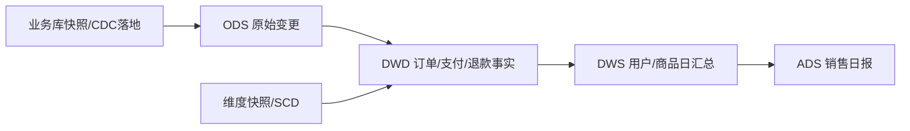
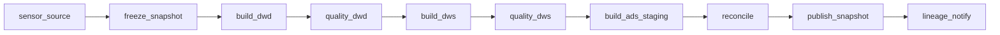

# 综合项目：从业务库到分层数仓的离线数据链路

本项目构建电商每日数仓：业务库订单、支付、用户和商品数据进入 ODS，Spark 生成 DWD 明细、DWS 用户/商品聚合与 ADS 日报，Airflow 编排，Iceberg/Hive Catalog 管表。目标是可重跑、可对账、可追踪，不是只让 SQL 返回结果。

## 1. 需求

- 每天 08:00 前发布昨日销售日报；
- 指标：支付订单数、支付用户数、GMV、退款金额、商品转化；
- 支持按省份/品类/渠道分析；
- 源数据迟到 2 天内可补正；
- 同一天重跑不能重复；
- 每个 ADS 版本可追到源 snapshot和代码 commit。

## 2. 数据模型

### 2.1 源表 {/* #源表 */}

- `orders(order_id,user_id,status,channel,created_at,updated_at)`
- `payments(payment_id,order_id,amount_cents,status,paid_at,updated_at)`
- `refunds(refund_id,payment_id,amount_cents,status,updated_at)`
- `users(user_id,province,registered_at,updated_at)`
- `products(product_id,category_id,price_cents,updated_at)`
- `order_items(order_id,product_id,quantity,unit_price_cents)`

金额用整数分或 decimal，禁止 float；所有时间明确时区。每表定义主键、变更位置和删除语义。

## 3. 分层

- ODS：保留 source position、op、before/after、ingestion time；
- DWD：一行对应明确事实粒度，去重并统一状态/时间/金额；
- DIM：用户/商品历史维度，可按需求选择 SCD1/SCD2；
- DWS：可复用主题聚合；
- ADS：面向报表契约，不能成为其他任务随意依赖的中间层。

## 4. 输入边界

每天运行先固定 ODS snapshot ID或数据库导出 manifest，记录 `source_version`。不要在作业运行中不断读取“最新”。迟到变化按 `updated_at/source_position`进入受影响业务日期，而不是只落今天。

## 5. 任务 DAG

每个 task输入为 `data_interval + source_snapshot + code_version`，输出到 staging branch/table。质量通过后原子发布 tag/alias或表 snapshot。

## 6. 核心转换

### 6.1 去重 {/* #去重 */}

同一实体按 source position/版本排序取最新，不能只按处理时间。事件表按 event ID 去重，实体当前表按主键+版本 Upsert。

### 6.2 支付事实 {/* #支付事实 */}

只统计成功支付，退款单独事实；GMV 口径明确是否含取消/退款。订单与支付多对一/一对多关系先审计，避免 Join 放大。

### 6.3 历史维度 {/* #历史维度 */}

若报表要求“按下单时省份”，需保留用户维度有效起止时间，并用订单事件时间做 temporal Join；直接 Join 当前用户省份会改写历史。

## 7. 质量闸门

- ODS source position连续、输入 count；
- DWD 主键/事件唯一、状态机合法、金额非负；
- `sum(payment) - sum(refund)` 与财务源对账；
- Join 前后行数和放大倍数；
- 每层最大业务时间、新鲜度；
- 与前一日分布变化阈值；
- ADS 随机订单可反查 DWD/ODS。

## 8. 物理设计

按业务日期粗分区，列式文件，目标数百 MiB量级通过实测调整。不要按 user/order高基数分区。观察每分区文件数/P50/P90、scan裁剪和 Spark task分布。

## 9. 补数与修正

输入一组日期和 source version，限制并发 pool；先生成新版本，质量通过再替换对应分区/snapshot。影响 DWD 日期后，找血缘重算对应 DWS/ADS。保留旧 snapshot直到观察期结束。

## 10. 故障注入

1. Spark 写一半终止：正式 ADS 不可见；
2. 同一天 DAG 重跑：count/GMV不变；
3. 注入重复支付：event ID 去重；
4. 用户省份变化：历史口径符合 SCD设计；
5. 小文件风暴：compaction后逻辑 checksum不变；
6. Source迟到两天：受影响日期正确补正。

## 11. 性能与可观测性

记录输入 snapshot、scan bytes/files、Spark plan/stage/task、Shuffle/spill/倾斜、输出文件、质量、publish snapshot、Airflow排队/重试/deadline。SLO 从 ADS 新鲜度下钻。

## 12. 交付物

- 需求与指标字典；
- 表 schema/partition/owner/保留；
- DAG 与幂等/补数文档；
- 代表 SQL 的 plan 与基线；
- 质量报告和 lineage；
- 六种故障演练记录；
- 容量/成本估算与 runbook。

## 13. 验收

- 任意日报版本可追到 source snapshot、代码和质量；
- 重跑/补数无重复且原子发布；
- GMV/退款可与源端守恒对账；
- 能从 Spark 长尾定位 key、partition或节点；
- 在 deadline前完成且有容量增长模型。

上一篇：[Kafka→Flink→Iceberg→Spark→GPU](./01-从Kafka到Flink-Iceberg-Spark再到GPU.md)　下一篇：[实时湖仓项目](./03-Kafka-Flink-Iceberg实时湖仓项目.md)
