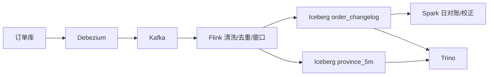

# 综合项目：Kafka、Flink、Iceberg 实时湖仓

本项目把订单 CDC 事件通过 Kafka 交给 Flink，构建 Iceberg 实时订单明细和 5 分钟省份指标；Spark 每日做批量对账/校正，Trino 查询。目标 P99 新鲜度 60 秒，故障后无静默丢重。

## 1. 架构

## 2. 事件契约

字段：event_id、order_id、op、source_position、event_time、schema_version、before/after。相同 order按稳定 key 进入同 Kafka partition。金额、时区、状态机、delete和迟到语义写入契约。

Schema Registry兼容测试在 producer CI执行；坏 schema进入 quarantine topic/table，不静默丢弃。

## 3. Kafka 规划

根据峰值 bytes/s、单 partition压测和 Flink source并行度选 partition；副本/ACK/min ISR按 RPO；retention覆盖最大停机+重放+升级。Dashboard按 partition显示 lag、吞吐、ISR和热点 key。

## 4. Flink 拓扑

`KafkaSource → schema validate → event_id dedup → assign watermark → keyBy(order_id) → 状态机 → sinks`。省份窗口从正确订单状态流计算；迟到在 allowed lateness内更新，超时写 side output供批校正。

Dedup TTL必须大于最大重放窗口，否则历史重放会重复。为每个有状态 operator设置稳定 UID和 max parallelism。

## 5. Checkpoint 与 Sink

Checkpoint storage用持久对象/HDFS，JM HA开启。记录 source offset、state、Iceberg待提交文件。选择 interval要同时满足新鲜度、小文件和恢复回退；每次完成后应有表 snapshot推进。

## 6. 表设计

Changelog/当前状态的表语义分开。按事件日期 transform分区，避免省份等低数据量组合产生细分区。监控 data/delete files、P50/P90大小、manifest、commit latency和冲突。

Flink高频写后由 Spark在低峰 rewrite data/delete/manifests。Maintenance与实时 writer按分区/冲突策略协调。

## 7. 批量校正

每日 Spark 固定 source和 Iceberg snapshots，对比：唯一 event、订单最终状态、支付金额、退款、5分钟窗口。迟到超过实时范围时写新 correction snapshot；消费者看到版本/更新时间而不是两个无口径结果。

## 8. 新鲜度预算

将 60 秒拆为 CDC、Kafka、Flink处理、checkpoint/file rolling、Iceberg commit/Catalog。统一时间戳，在 Dashboard显示每段P50/P99。若 Kafka lag为0但 snapshot不推进，问题在 Flink下游。

## 9. 故障注入

- CDC快照中重启；
- Kafka leader broker失败；
- Flink在 checkpoint/sink precommit时杀 TM；
- Catalog短时不可用；
- 对象存储限速形成反压；
- 注入热 order key、idle partition和迟到事件；
- savepoint升级后回滚。

每次验证 event ID唯一、金额守恒、source position/offset/checkpoint/snapshot链、恢复时间和 lag追平。

## 10. 生产 Runbook

### Lag

CDC source lag → Kafka partition lag → Flink records/backpressure/watermark → checkpoint → Iceberg commit。沿链路逐段定位。

### Checkpoint失败

分解 start delay、alignment、state upload和sink commit；禁止只扩大 timeout。

### 小文件

检查 writer×活跃分区×提交频率，先修源头，再 compaction；清理旧 snapshot前检查 reader/tag。

## 11. 交付与验收

- 事件/表契约与兼容矩阵；
- 容量/partition/并行度/文件计算；
- Flink topology、UID、checkpoint与升级文档；
- 新鲜度/正确性 Dashboard；
- 7类故障演练；
- 60秒 P99、恢复RTO和批对账通过。

上一篇：[离线数仓项目](./02-从业务库到分层数仓的离线项目.md)　下一篇：[Spark ETL 倾斜与性能优化项目](./04-Spark-ETL数据倾斜与性能优化项目.md)
