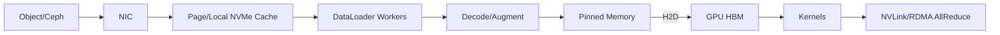

# 综合项目：面向 GPU 训练的数据集生产、版本化与吞吐优化

本项目把湖仓权威数据转成可复现训练集，并沿“对象存储/Ceph → 缓存 → DataLoader → CPU 解码 → pinned memory → PCIe → GPU HBM”测量吞吐。目标是让训练 run 可追溯，并能判断 GPU 空闲究竟来自数据、计算还是集合通信。

## 1. 数据场景

图像分类：Iceberg 样本表包含 `sample_id, object_uri, label, event_time, split_group, checksum, quality_flags`。对象存储保存图片。每天发布一个训练集版本，按用户/设备组切 train/validation/test，避免同源泄漏。

## 2. 版本 Manifest

```json
{
  "dataset_version": "orders-image-2026-08-10-v3",
  "source_snapshots": {"samples": 123, "labels": 456},
  "code_commit": "...",
  "schema_version": 4,
  "split_seed": 20260810,
  "shards": [{"uri": "...", "samples": 10000, "sha256": "..."}],
  "quality_report": "..."
}
```

版本发布后不可覆盖。训练 run记录 manifest URI/hash、容器、代码、超参、模型 checkpoint。修复样本发布新版本。

## 3. 生产 DAG

固定 Iceberg snapshots → schema/label质量 → 去重/泄漏检查 → 确定性 split → 读取对象并校 checksum → 转换/打 shard → shard校验 → 生成 manifest → 原子发布 → 缓存预热（可选）。

失败只留下 staging；正式 alias只有质量通过后切换。

## 4. Shard 设计

逐图片对象读取产生大量 GET/打开和随机延迟。将样本打包为中等大小 shard可提高顺序吞吐。Shard太小有元数据开销，太大降低 worker/rank并行、shuffle和重试粒度。

基准 64/256/1024 MiB等候选，记录 GET/s、有效 GiB/s、首 batch、samples/s、随机性和单 shard失败重试。压缩需比较网络节省与 CPU 解码。

## 5. 分布式采样

World size、rank、epoch和 seed决定 shard/sample分配。必须保证：同 epoch不同 rank不重叠、全局无遗漏；恢复 model checkpoint后 sampler进度/epoch语义明确；world size变化时允许的重复边界有记录。

只靠文件随机列表而不保存 seed/版本无法复现。

## 6. 数据路径分段



记录 storage latency/throughput、cache hit、worker queue、decode CPU、batch ready、H2D、kernel、collective。不要用单个 GPU utilization猜根因。

## 7. 吞吐预算

```text
节点需求 = sample_bytes_after_decode × samples_per_sec_per_GPU × GPUs
训练step = max(data_ready路径, H2D+compute+collective 的流水线关键路径)
```

考虑增强后数据变大、预取突发和远端共享。若 8 GPU每秒各200样本、每样本解码后2 MiB，节点数据准备约3.125 GiB/s；缓存/CPU/PCIe至少有对应能力。

## 8. 调优阶梯

1. 单 worker顺序读取，验证正确性和存储基线；
2. 增加 DataLoader workers到 CPU/存储拐点；
3. 调 batch/prefetch/persistent workers；
4. pinned memory和异步 H2D，测 overlap；
5. 本地 NVMe缓存与预热，测冷/热；
6. Shard大小/压缩/解码库；
7. 单机多 GPU sampler；
8. 多机并区分 storage traffic与 NCCL traffic。

每步只改一个变量，结果包含 samples/s、step P95、data wait、GPU kernel/collective和成本。

## 9. 拓扑与争抢

GPU、NIC、NVMe和CPU NUMA不对齐会跨 socket/PCIe。使用硬件拓扑、进程/IRQ/NUMA指标确认。存储读取和跨节点 AllReduce共享 NIC时，可分网、multi-rail、QoS/限速或错峰预取。

深入参考 [GPU-NIC 拓扑与 NUMA](../../../networking/rdma-roce/ai-cluster/06-GPU-NIC拓扑与NUMA亲和.md) 与 [AI 工作负载存储 I/O](../../../storage/ai-workloads/01-AI工作负载的存储IO模型.md)。

## 10. 故障注入

- 一个对象 checksum错误/404：隔离并阻止正式发布；
- 训练节点缓存为空：冷启动 SLO；
- 远端存储限速：队列和 GPU data wait；
- DataLoader worker crash：重启是否重复/卡死；
- 一个训练 rank失败：model与sampler恢复；
- world size变化：样本覆盖与重复；
- NCCL链路变慢：区分 collective与数据加载。

## 11. 数据质量

重复/近重复、label分布、坏图、未来信息、split group泄漏、类不平衡和敏感内容。保留样本级 source lineage，但报告和日志不暴露敏感 URI/内容。

## 12. 交付与验收

- 不可变 manifest/schema/statistics/quality；
- shard格式与大小基准；
- 冷/热缓存和 DataLoader阶梯实验；
- 单/多机分段 profile；
- sampler覆盖/恢复测试；
- 故障演练和 runbook；
- 任一模型 run可重建同一数据版本；
- GPU data wait低于目标且未用过度 CPU/网络成本换取。

上一篇：[Spark ETL 性能项目](./04-Spark-ETL数据倾斜与性能优化项目.md)　返回：[大数据技术学习地图](../00-大数据技术学习地图.md)
