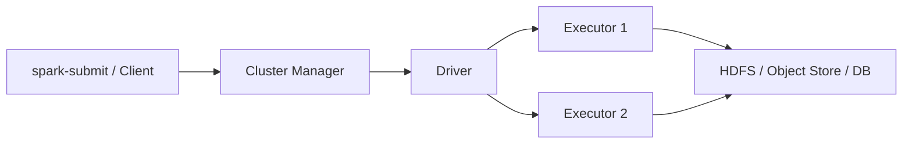

# Spark 架构、RDD、DataFrame 与 Driver/Executor

Spark 是分布式计算引擎，不负责长期保存权威数据。一个 Application 由 Driver 协调，Executor 在 worker 上执行 task、缓存数据并产生 Shuffle。理解进程和状态所有者，是排查 OOM、Driver 失联和 task 重试的前提。

## 1. 组件



- **Driver**运行用户主程序、创建 SparkSession/Context、生成计划、调度 stage/task，并收集状态。
- **Executor**是应用专属进程，运行 task，维护内存/磁盘缓存和 Shuffle 数据。
- **Cluster Manager**（Standalone、YARN、Kubernetes 等）分配进程资源，不决定 SQL 的每个 task 逻辑。

Driver 是控制面热点。把大量结果 `collect()` 到 Driver、生成巨型 task 闭包或跟踪过多 task 都可能使它 OOM。

## 2. RDD

RDD 是不可变、分区化的数据集合。Transformation（map/filter/join）惰性记录依赖，Action（count/save/collect）触发执行。RDD 容错主要依赖 lineage：丢失 partition 可从上游重新计算；缓存和 checkpoint 可缩短长 lineage。

窄依赖的子 partition 只依赖少数父 partition，可流水执行；宽依赖需要 Shuffle，形成 stage 边界。

## 3. DataFrame/Dataset

DataFrame 带 schema，以列和表达式描述计算。Spark 能在执行前优化逻辑计划、选择 Join 和进行列裁剪/谓词下推，通常比不透明 RDD 函数更易优化。Dataset 的类型能力主要在 JVM API 中，实际使用需结合语言。

优先使用内置表达式；普通 Python UDF/外部代码可能阻断部分优化并增加序列化边界。是否变慢需看物理计划和 profile，而非一概而论。

## 4. 分区与并行度

输入文件被规划成 input partitions；每个 stage 为 partition 创建 task。Executor core 限制同时 task 数。分区太少资源闲置，太多则调度、小文件和连接开销上升。

```text
有效并行度 ≤ min(stage task数, Executor可用core, source/sink能力)
```

`repartition` 通常发生 Shuffle，`coalesce` 可减少分区但可能不充分均衡；具体计划用 `explain` 验证。

## 5. 部署模式

Client/cluster mode 的关键差异是 Driver 在提交端还是集群内。Driver 的网络可达性、日志、故障恢复和凭据边界不同。生产通常让 Driver 由集群管理，但仍要为应用失败定义重试与幂等输出。

## 6. Cache、Persist 与 Checkpoint

Cache 适合被重复使用且重算昂贵的数据；它占 executor 内存/磁盘，并不是自动持久化结果。数据只用一次、缓存命中低或分区过大时可能拖慢任务。

RDD checkpoint 将数据物化到可靠存储并截断 lineage；流式 checkpoint 还保存查询进度与状态，语义不同。任何 checkpoint 路径都要持久、唯一并纳入生命周期。

## 7. 最小实验

创建 DataFrame：filter → groupBy → join → write。执行 `explain("formatted")`，在 UI 中对应 Job/Stage/Task。改变输入分区和 executor core，记录并行度、Shuffle、最大 task 时间；使用 count/sum 校验结果。

## 8. 指标与故障

- Driver heap/GC、scheduler delay、event/log 大小；
- Executor running/failed、heap/off-heap、GC、lost executor；
- task input/output、Shuffle、spill、duration 分位数；
- cache hit/eviction；
- source/sink latency 与文件数。

## 9. 掌握验收

- 画出 Client、Cluster Manager、Driver 和 Executor；
- 区分 RDD lineage、cache 与 checkpoint；
- 解释 DataFrame 为何给优化器更多信息；
- 从 partition、core 推导有效并行度；
- 说明 `collect()` 的 Driver 风险。

下一篇：[DAG、Job、Stage、Task 与调度过程](./02-DAG-Job-Stage-Task与调度过程.md)

## 10. 参考资料 {/* #参考资料 */}

- [Spark Cluster Mode Overview](https://spark.apache.org/docs/latest/cluster-overview.html)
- [Spark RDD Programming Guide](https://spark.apache.org/docs/latest/rdd-programming-guide.html)
