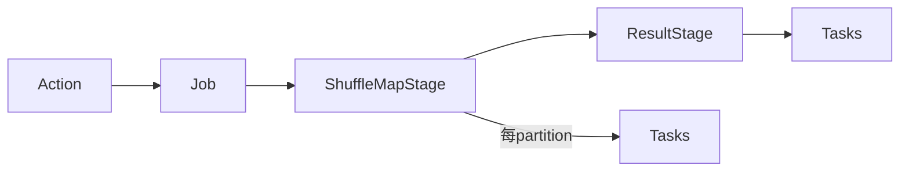

# Spark DAG、Job、Stage、Task 与调度过程

Spark UI 中 Job、Stage、Task 不是三个随意层级：一个 Action 通常触发 Job，宽依赖把 DAG 切成 Stage，每个 Stage 按 partition 产生 Task。性能定位要先找到慢 Job，再下钻 Stage 和 Task 分布。

## 1. 从代码到任务

DAGScheduler 根据 RDD 依赖和 Shuffle 边界构建 stage；TaskScheduler 将 TaskSet 交给 executor，并考虑资源、本地性和失败；SchedulerBackend 对接集群管理器。

一个 SQL 查询可能对应多个 Job，例如广播子查询、统计或 action；一个 notebook cell 也可能因多次 action 重复计算。

## 2. Stage 边界

map/filter 等窄依赖可在同一 task pipeline；groupBy/join/repartition 等宽依赖需要上游完整生成 Shuffle 数据，再由下游读取。Stage 失败可能重试 task；若 Shuffle 文件丢失，可能重新运行上游 map stage。

## 3. Task 与 Partition

一个 stage 的 task 数通常等于其输入 partition 数。Task 是调度/重试单位，不等同线程永久绑定。Executor 每个可用 core 通常同时运行一个 task（具体资源 profile 可扩展）。

Task 时间拆解：scheduler delay、deserialize、executor run、GC、result serialize、fetch wait。只看 executor run 会漏掉排队、拉取与结果返回。

## 4. 本地性与推测执行

Spark 可等待 process/node/rack locality，再逐步放宽。HDFS 上本地性有价值；对象存储上通常没有 block-local。等待过长会浪费资源，过短增加网络。

Speculation 为异常慢 task 启动副本，适合随机慢节点；若同一个热 partition 计算量巨大，副本也同样慢且增加资源。非幂等外部写入必须防两个 attempt 同时产生效果。

## 5. 动态资源

Dynamic Allocation 可按 backlog 和空闲回收 executor。它要与 Shuffle 数据保留机制、Kubernetes/YARN 启动时延、缓存和流任务特性协调。扩容慢于短 stage 时，资源到达时作业可能已结束。

## 6. 失败恢复

- Task 代码异常：按次数重试，确定性坏数据会重复失败；
- Executor lost：其 task 重调度，缓存丢失，Shuffle 可能重算；
- Driver lost：应用通常失败，是否由集群/工作流重提取决于部署；
- Fetch failure：下游拉取失败，可能标记上游 output 无效并重跑 stage；
- Output commit：只有成功 attempt 应发布结果。

作业重提必须固定输入 snapshot/offset，并使用幂等输出版本，否则恢复会重复或读到变化中的数据。

## 7. UI 分析流程

1. Jobs：确定慢 action 和关键时间线；
2. Stages：看哪个 stage 占主导、是否重复运行；
3. Tasks：比较 P50/P95/max duration、input、Shuffle、spill、GC；
4. Executors：慢 task 是否集中在某节点；
5. SQL：把物理算子对应到 stage；
6. Environment：保留最终生效配置。

## 8. 实验

对同一 DataFrame 连续执行两次 action，观察 lineage 是否重复；cache 后再执行并比较。制造单热 key，观察最大 task；开启 speculation 验证它不能消除确定性倾斜。保存 event log 供 History Server 复盘。

## 9. 掌握验收

- 从 Action 解释 Job/Stage/Task 数量；
- 指出 Shuffle 为什么切 stage；
- 区分 task 重试、stage 重算和应用重提；
- 用 UI 分位数定位热 partition 或慢节点；
- 解释动态资源在短作业和缓存场景的局限。

上一篇：[Spark 架构、RDD 与 DataFrame](./01-Spark架构RDD-DataFrame与Driver-Executor.md)　下一篇：[Spark SQL、Catalyst 与物理计划](./03-Spark-SQL-Catalyst物理计划与代码生成.md)

## 10. 参考资料 {/* #参考资料 */}

- [Spark Job Scheduling](https://spark.apache.org/docs/latest/job-scheduling.html)
- [Spark Monitoring](https://spark.apache.org/docs/latest/monitoring.html)
