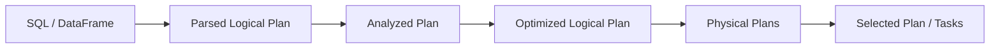

# Spark SQL、Catalyst、物理计划与代码生成

SQL 文本不会直接变成 task。Spark SQL 先解析并解析字段/函数，优化逻辑计划，再选择物理算子和分布方式。调优首先看 `EXPLAIN`，不要先堆配置。

## 1. 计划阶段

Analyzer 使用 Catalog 解析表、列、类型和函数；Catalyst 规则执行常量折叠、谓词下推、列裁剪等；成本优化依赖 table/column statistics 选择 Join 顺序/策略；物理计划包含 scan、exchange、sort、aggregate、join。

## 2. 阅读 EXPLAIN

重点找：

- Scan 是否只读所需列和分区；
- Filter 是否下推到数据源；
- `Exchange` 表示何处重分区/Shuffle；
- Join 是 broadcast hash、sort merge 还是其他策略；
- Sort/Aggregate 是否重复；
- Adaptive Plan 是否 final，运行期做了什么变化。

逻辑计划看“算什么”，物理计划看“怎样算”。同一 SQL 在统计、数据规模、配置和版本变化后可能得到不同物理计划。

## 3. Predicate/Column Pushdown

Parquet/ORC/Iceberg 可利用列裁剪、分区裁剪和文件/row-group 统计跳过数据。UDF 包裹过滤字段、隐式类型转换或复杂表达式可能阻止下推。用 plan 和实际 scan bytes/files 证明，而不是看到 WHERE 就假定生效。

## 4. Join 策略

- Broadcast Hash：复制小侧到 executor，避免大侧 Shuffle；
- Sort Merge：两侧按 key 重分区并排序，适合大表等值 Join；
- Shuffle Hash/其他策略：适用性受大小、内存和配置影响；
- Nested Loop 类：非等值条件可能代价巨大。

广播要按序列化/构建后的实际大小和 executor 并发内存判断。统计过期可能把“大表”误当小表，引发 OOM。

## 5. Catalyst 与 UDF

内置表达式拥有类型与语义，优化器可重写并生成高效执行代码。黑盒 UDF 限制优化，跨 JVM/Python 还会增加序列化；向量化 UDF 可降低边界开销但仍需测试。能用内置函数就优先用，业务逻辑复杂时再选择 UDF 并建立基准。

## 6. Tungsten/列式与代码生成

Spark 使用紧凑二进制表示、列式批处理、向量化 reader 和 whole-stage code generation 等减少对象分配与虚函数开销。物理计划中的 codegen 边界、fallback 和输入格式会影响效果。JVM heap 低不代表内存足够，off-heap、native、Python worker 和 page cache 也占内存。

## 7. 统计与计划回归

为关键表维护行数、字节和列统计，并监控新鲜度。版本/配置/schema 升级前保存代表性 SQL 的 physical plan、scan bytes、Shuffle、P95；计划变化必须解释。Hint 是最后手段，可能在数据增长后失效。

## 8. 实验

对 fact 与 dimension Join：先无统计，再收集统计；比较 plan 和 Shuffle。把可下推 filter 改为 UDF filter，对比 scan bytes。改变小表规模，观察广播边界和 AQE 最终计划。所有实验校验结果一致。

## 9. 掌握验收

- 区分 parsed/analyzed/optimized/physical plan；
- 从 plan 找出 scan、filter、exchange 和 join；
- 用 scan bytes 证明谓词/列下推；
- 解释统计过期如何造成错误广播；
- 建立 SQL 计划回归而不是只比较总耗时。

上一篇：[DAG、Job、Stage、Task](./02-DAG-Job-Stage-Task与调度过程.md)　下一篇：[Shuffle、内存、缓存、Spill 与序列化](./04-Shuffle内存缓存Spill与序列化.md)

## 参考资料

- [Spark SQL Guide](https://spark.apache.org/docs/latest/sql-programming-guide.html)
- [Spark SQL Performance Tuning](https://spark.apache.org/docs/latest/sql-performance-tuning.html)
