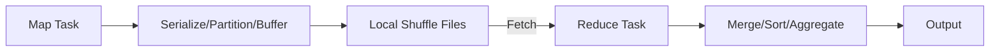

# Spark Shuffle、内存管理、缓存、Spill 与序列化

Spark 的聚合、Join、repartition 和排序会触发 Shuffle。它不是纯网络动作：Map 端 partition/排序并写本地文件，Reduce 端通过网络拉取、合并并可能再次 spill，因此 CPU、内存、本地盘和网络任何一层都能成为瓶颈。

## 1. 数据路径

Map output 通常不是写 HDFS 权威数据，而是 executor 本地中间数据。Executor 丢失可能使下游 fetch failure 并重算上游 stage。

## 2. 内存不只有 Heap

节点内存包含 JVM heap、off-heap/native、Python worker、Netty/direct buffer、进程开销和 OS page cache。容器限制作用于总进程/子进程，heap 设置刚好等于 limit 很容易被 OOMKilled。

Spark 执行内存用于 Shuffle/Join/aggregation，存储内存用于 cache/broadcast；二者可在统一内存区借用，但正在使用的执行内存与缓存淘汰有规则。调参数前先分清 heap OOM、container OOM、GC overhead、native memory 和磁盘满。

## 3. Spill

当聚合/排序数据无法留在执行内存时写本地盘。适量 spill 是容错机制，不一定是错误；大量 spill 表明 partition 太大、内存不足、对象膨胀或算法选择不当。

观察 memory bytes spilled、disk bytes spilled、peak execution memory、GC 和最大 partition。只增加 executor memory可能降低并发 task 数或扩大 GC，需与 core/partition 同调。

## 4. Cache

Cache 适合多次复用、计算昂贵且可容纳的数据。决定前问：复用几次、重算成本、预计大小、命中率、是否挤压 Shuffle。缓存后应 materialize 并在生命周期结束 unpersist。

缓存原始宽表却只复用一列，会浪费空间；缓存变化中的外部表也可能让用户误读旧快照。

## 5. Serialization 与 Compression

序列化影响网络字节、CPU 和对象大小。使用紧凑 schema/DataFrame通常优于任意 Java/Python 对象。Shuffle compression 减少本地盘/网络，代价是 CPU；应以 workload 基准选择 codec。

大 task closure、广播超大对象和 Python/JVM 往返都是序列化热点。日志中“task size very large”需要检查闭包是否意外捕获大集合。

## 6. Fetch Failure

可能原因：executor 丢失、本地 Shuffle 文件损坏/清理、磁盘满、网络超时、服务过载。反复提高 fetch retry 会延迟暴露根因。关联 executor lost、磁盘、节点事件与同一时间段网络，判断是随机还是集中于某节点。

## 7. 本地盘规划

本地临时盘需覆盖并发 Shuffle、spill、cache on disk 和重算余量。多目录应落到独立物理卷而非同一设备的多个路径。监控使用率、inode、await、吞吐和 per-executor 占用；接近满时先限制新作业和隔离根因。

## 8. 实验

运行大 groupBy/join，逐步减少每 executor 内存、改变 partition 数，记录 spill、GC、磁盘和 max task。缓存中间表后重复 action，比较总耗时与 Shuffle；验证缓存只在复用时获益。故障注入 executor 退出，观察 fetch failure 和 stage 重算。

## 9. 掌握验收

- 画出 Shuffle 写本地盘与跨网 fetch；
- 列出 heap 之外的五类内存；
- 区分适量 spill、倾斜和内存泄漏；
- 判断 cache 是否值得并验证命中；
- 从 fetch failure 追到 executor、磁盘或网络。

上一篇：[Spark SQL 与物理计划](./03-Spark-SQL-Catalyst物理计划与代码生成.md)　下一篇：[Join、数据倾斜、AQE 与性能调优](./05-Join数据倾斜AQE与性能调优.md)

## 参考资料

- [Spark Tuning Guide](https://spark.apache.org/docs/latest/tuning.html)
