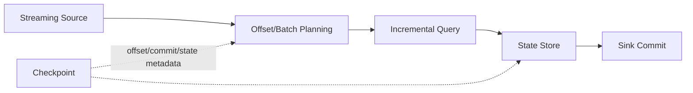

# Spark Structured Streaming、状态、Watermark 与 Checkpoint

Structured Streaming 把无界输入表示为持续增长的表，使用与 DataFrame 相近的 API。运行语义由 trigger、输入 offset、状态存储、watermark、output mode 和 sink 共同决定。

## 1. 查询路径

默认常见模式以 trigger 切成 micro-batch；每批确定 offset 范围，执行增量计划并提交。具体触发类型和支持能力随版本核对。

## 2. Output Mode

- Append：只输出未来不再更新的结果；
- Update：输出本批变化的行；
- Complete：输出完整结果表，状态/输出成本高。

能否使用某模式取决于聚合、watermark 与 sink。模式名称不等于 sink 事务保证。

## 3. Watermark 与状态

Watermark 根据事件时间和允许延迟决定何时可清理旧窗口/去重状态。它不是绝对无迟到数据保证。太短丢弃合法迟到，太长使 state store 膨胀、批次变慢和 checkpoint 增大。

流-流 Join 要为两侧定义事件时间约束和 watermark，否则状态可能无限增长。去重 key 和 watermark 字段要与业务语义对应。

## 4. Checkpoint 目录

保存 query identity、source progress、batch commit、state store 元数据等。生产必须使用持久、独占路径；删除或复用另一个查询的 checkpoint 可能从头读取、重复输出或状态不兼容。

代码/schema 升级能否从旧 checkpoint 恢复有兼容边界。上线前使用生产副本做恢复测试，并保留旧代码与输入 snapshot 回滚方案。

## 5. Exactly-Once 边界

可重放 source + checkpoint + 幂等/事务 sink 才能实现端到端一次逻辑效果。`foreachBatch` 允许复用批写逻辑，但函数在失败时可能再次运行；使用 `batchId`、主键 Upsert 或事务表去重。

对外 API、邮件等副作用需要 idempotency key，不能依赖 Spark 自动回滚。

## 6. 性能与背压

观察 input rows/s、processed rows/s、batch duration、trigger execution 分段、source lag、state rows/bytes、commit latency。若 batch duration 长于 trigger 间隔，查询逐渐落后。

Kafka source 的每批读取上限可控制恢复压力，但设置过低会永远追不上；目标是处理能力持续大于输入。

## 7. 故障排查

- Lag 增长：定位 scan、Shuffle、state、sink 哪段变慢；
- State 暴涨：watermark 不推进、热 key、TTL/Join 条件错误；
- 每批重复：checkpoint 丢失/更换、sink 非幂等、批提交失败；
- 恢复失败：state/schema/版本不兼容或 checkpoint 损坏；
- 小文件：trigger 频繁、writer/partition 过多。

## 8. 实验

输入带 event time 的订单，故意制造迟到和重复。运行窗口聚合/去重，记录 watermark 与 state。写出中途杀 executor/driver，恢复后按 event ID 和金额校验。更换 checkpoint 路径观察重复风险，但只在隔离数据集。

## 9. 掌握验收

- 画出 offset、batch、state、checkpoint 和 sink；
- 解释 watermark 如何影响迟到和状态清理；
- 区分 append/update/complete；
- 说明 `foreachBatch` 为何仍需幂等；
- 用 progress 指标定位落后阶段。

上一篇：[Join、倾斜与 AQE](./05-Join数据倾斜AQE与性能调优.md)　下一篇：[Spark on Kubernetes 部署、监控与故障排查](./07-Spark-on-Kubernetes部署监控与故障排查.md)

## 10. 参考资料 {/* #参考资料 */}

- [Structured Streaming Programming Guide](https://spark.apache.org/docs/latest/structured-streaming-programming-guide.html)
