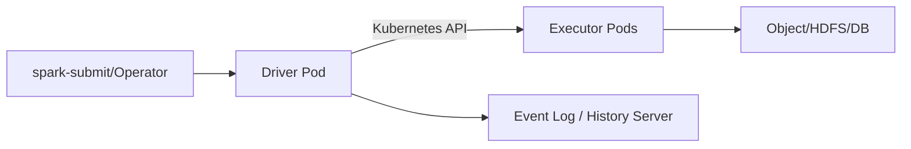

# Spark on Kubernetes 部署、监控与故障排查

Spark on Kubernetes 由 Driver 向 API Server 创建/管理 Executor Pod。Kubernetes 负责 Pod 资源与生命周期，Spark 负责 task 与 stage；Pod Running 不代表 Spark Job 健康。

## 1. 控制路径

Driver ServiceAccount 需要创建/查看/删除指定资源的最小 RBAC。不要给整个集群管理员。Client mode 下还要保证 executor 能回连 Driver 地址。

## 2. 镜像与依赖

固定 Spark、JDK、Python、connector 和 native library 版本；镜像用 digest/不可变 tag，依赖不在启动时临时从公网下载。Driver 与 Executor 的 classpath/代码必须一致，密钥通过 Secret/工作负载身份注入，不打进镜像和日志。

## 3. 资源

CPU/memory request 决定调度，limit 可能触发 throttling/OOM。Spark executor memory 之外要给 memory overhead 留给 direct/native/Python。Executor core 太多会让单 JVM GC、磁盘和网络集中；太少增加 Pod 与 Shuffle 连接。

Driver 需容纳计划、task 元数据和结果，`collect`/大广播仍可能 OOM。QoS、priority、quota 与多租户队列共同设计。

## 4. 存储

本地 Shuffle/spill 可用 emptyDir 或本地卷；容量、介质和 eviction 必须明确。Executor Pod 删除后本地 Shuffle 可能丢失，动态分配需使用版本支持的 Shuffle 数据保留方案。权威输出和 streaming checkpoint 必须在持久存储。

## 5. 调度与拓扑

用 node affinity/taint 将数据任务放到合适节点；topology spread 避免所有 executor 集中；本地 NVMe/zone 与对象存储路径影响吞吐。不要设置过严 affinity 导致长期 Pending。

## 6. 监控链路

- Kubernetes：Pending 原因、CPU throttle、OOMKilled、eviction、PVC/event；
- Spark：Job/Stage/Task、executor lost、Shuffle/spill/GC；
- JVM/Python：heap、native、worker error；
- 数据源/存储：scan bytes、request latency、throttle；
- 业务：deadline、输入 snapshot、输出质量。

开启 event log 并部署 History Server，使已结束/失败应用可复盘；集中 Driver/Executor 日志并带 application/executor ID。

## 7. 故障场景

| 现象 | 优先证据 |
|---|---|
| Executor Pending | requests、quota、affinity、taint、PVC |
| OOMKilled | Pod status、limit、heap/offheap/Python、task partition |
| Executor lost | node event、eviction、网络、磁盘 |
| Driver lost | deployment mode、日志、API/RBAC、heap |
| 写出重复 | 工作流重提、commit protocol、输出版本 |
| Shuffle fetch failure | executor 生命周期、本地盘、网络 |

## 8. 发布与恢复

提交参数、镜像、SQL/代码和输入 snapshot 版本化；工作流重试使用唯一 run ID 和幂等输出。升级先用代表性作业回放，对比 physical plan、输出 checksum、性能和资源。Driver 失败是否自动重提应由工作流/Operator 管理，避免双提交。

## 9. 掌握验收

- 画出 Driver 通过 API 创建 Executor 的路径；
- 正确估算 executor memory overhead；
- 区分 Pod 问题与 Spark Stage 问题；
- 设计本地 Shuffle 与持久 checkpoint 的不同存储；
- 用 event log、Kubernetes event 和业务校验完成事故复盘。

上一篇：[Structured Streaming](./06-Structured-Streaming状态Watermark与Checkpoint.md)　下一模块：[Flink 架构与 Slot](../flink/01-Flink架构JobManager-TaskManager与Slot.md)

## 10. 参考资料 {/* #参考资料 */}

- [Running Spark on Kubernetes](https://spark.apache.org/docs/latest/running-on-kubernetes.html)
- [Spark Monitoring](https://spark.apache.org/docs/latest/monitoring.html)
