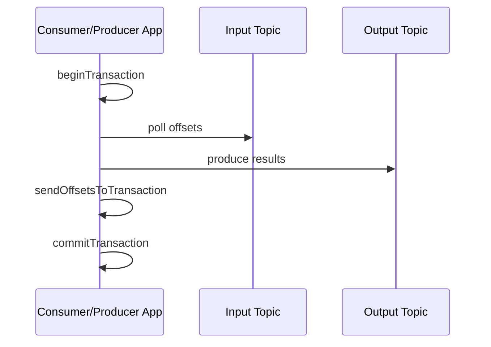

# Kafka 事务与端到端 Exactly-Once 边界

Kafka 事务可以原子提交多个 partition 的写入，并把 consumer group offset 与输出写入放入同一 Kafka 事务，适合 consume-transform-produce。但事务不会自动跨到任意数据库、对象存储和 HTTP API。

## 1. 事务角色

- Transactional producer 使用稳定事务标识初始化 producer identity/epoch；
- Transaction coordinator 跟踪事务状态与涉及 partition；
- 事务记录在提交前对 `read_committed` consumer 不可见；
- Abort marker 使 consumer 跳过已中止数据；
- Producer fencing 阻止旧实例继续以同一事务身份写入。

## 2. Consume-Transform-Produce

输出记录与“输入已经消费到哪里”一起提交。进程在提交前失败，事务中止，输入 offset 不推进；重启后重算，但旧输出不可见。提交成功后 ACK 丢失时，客户端/协调器通过事务状态处理不确定结果。

## 3. 读取隔离

`read_committed` 只返回已提交事务和非事务记录，并受未完成事务边界影响；`read_uncommitted` 可看到随后被 abort 的数据。下游若要求 EOS，必须检查消费隔离配置，不能只配置 producer。

## 4. 事务代价

事务增加协调、状态日志、marker、延迟和运维复杂度。长事务会延迟可见性并占用 broker 状态；事务超时、授权、实例并发和重启身份都需要规划。不要为本可通过主键 Upsert 解决的场景无条件开启事务。

## 5. 边界外系统

写数据库时可选：

- 业务主键/事件 ID 幂等 Upsert；
- 在同一 DB 事务保存结果与已处理 offset；
- Outbox/CDC 将 DB 事务变化发布回 Kafka；
- Flink checkpoint + 事务 sink；
- 写不可见文件后由表 snapshot 原子发布。

发短信、邮件等不可回滚副作用使用 idempotency key、业务状态机和人工补偿。绝不能因为 Kafka 开事务就宣称它们 Exactly-Once。

## 6. 重试与 Fencing

同一 transactional ID 同时运行两个实例时，新 epoch 会 fence 旧实例。这能防止僵尸 writer，但实例 ID 映射错误会造成互相 fencing、事务失败风暴。滚动发布必须确保实例身份稳定且旧进程退出时序正确。

## 7. 验证实验

输入 10 万条唯一事件，在输出过程中终止进程，分别用两种 isolation 读取输出。恢复后验证：输入提交 offset、输出 event ID 唯一数、金额总和和 abort 事务不可见。再把 sink 换成非幂等外部调用，观察 Kafka 事务无法覆盖外部副作用。

## 8. 指标与故障

- transaction begin/commit/abort rate 与 latency；
- transaction timeout、fenced producer、authorization error；
- coordinator/request error；
- read_committed consumer lag；
- 长时间 open transaction；
- event ID 重复与业务守恒校验。

## 9. 掌握验收

- 画出输入 offset 与输出 record 同事务提交；
- 解释 `read_committed` 的作用；
- 说明 producer fencing 的目的与发布风险；
- 为 Kafka 外部 sink 选择幂等、事务或 Outbox；
- 用故障注入证明定义范围内的 EOS，而非只看配置。

上一篇：[副本、ISR 与 KRaft](./04-副本ISR-Leader选举与KRaft.md)　下一篇：[Topic、Partition、磁盘与网络容量规划](./06-Topic-Partition磁盘网络与容量规划.md)

## 参考资料

- [Kafka Design: Transactions](https://kafka.apache.org/documentation/#design_transactions)
