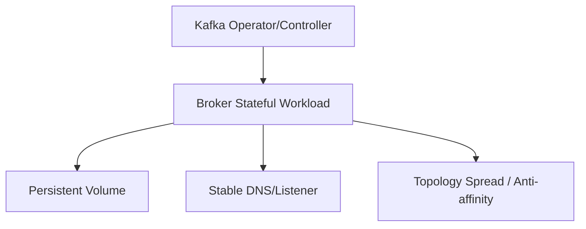

# Kafka 积压、故障排查、滚动升级与 Kubernetes 部署

运维 Kafka 的关键是把“lag 增长”继续拆分到 Producer、Broker、Consumer 和下游，而不是见到积压就增加 consumer。升级和 Kubernetes 部署则要保护 broker 身份、磁盘、故障域与有序操作。

## 1. Lag 排障树

1. 确认哪些 group/topic/partition，lag 是持续还是突发；
2. 对比 produce rate 与 consume rate，估算是否能追平；
3. 检查 consumer assignment、rebalance、error、处理队列和下游延迟；
4. 检查 broker fetch latency、throttle、热点 leader、磁盘和网络；
5. 检查消息大小/schema 变化和毒消息重试；
6. 修复后观察 lag 斜率与业务 event-time lag。

扩 consumer 只在 partition 有余量且瓶颈在消费计算时有效；下游数据库限速时会加剧压力。

## 2. Broker 典型故障

- ISR 反复 shrink：Follower 磁盘/网络慢、GC、请求排队；
- offline partition：无合格 leader、controller/元数据问题；
- 磁盘满：retention/cleaner 落后、流量增长或日志目录不均；
- 请求 P99 高：热点 partition、磁盘长尾、网络拥塞、线程/队列饱和；
- Controller 抖动：quorum、网络、磁盘或反复节点重启。

优先保存日志、指标、partition 状态和时间线；不要通过删除 segment 或放开不安全选举快速消警。

## 3. 滚动升级

升级前：核对官方兼容/协议升级步骤，备份配置，检查无 offline partition、ISR 健康和磁盘余量，暂停大 reassignment，验证客户端兼容和回滚镜像。

每次只滚动一个故障域内允许的 broker：迁移/确认 leader → 停止 → 升级 → 等注册、ISR 和流量稳定 → 再下一个。先升级二进制与协议切换常是分离步骤，具体以版本文档为准。Controller quorum 也要保持多数。

验收不只是 Pod Ready：produce/fetch 成功、ISR 恢复、无 offline partition、P99/错误率正常、业务 event ID 校验通过。

## 4. Kubernetes 数据路径

必须明确：broker/controller ID 如何稳定、PVC 是否绑定到正确节点/可用区、listener 对集群内外如何发布、证书和 ACL 如何轮换、Pod 终止时如何优雅离组、Operator 是否并发滚动多个副本。

### 存储选择

Kafka 日志偏顺序吞吐，但恢复和 compaction 也产生 I/O。网络块存储提高调度弹性，本地盘提供低延迟，各有故障与迁移取舍。无论哪种，都需要持久化语义和压测，禁止用临时盘承载唯一副本。

### 调度与故障域

用 topology spread/anti-affinity 让同 partition 副本跨节点/可用区，给 broker 设置合理 requests/limits 和 disruption budget。PDB 不能阻止节点突然故障，也不能替代 Operator 的安全滚动逻辑。

## 5. Runbook 与演练

演练 broker Pod 删除、节点 drain、PVC 挂载慢、证书更新、controller 失去少数成员和 consumer 大规模 rebalance。每次记录：检测时间、ISR/offline、客户端错误、恢复时间、数据校验和人工动作。

## 6. 关键观测

- 业务：生产成功率、消费新鲜度、重复/丢失校验；
- Broker：request P99、ISR/offline、controller、磁盘/网络；
- Consumer：lag、rebalance、处理/下游时间；
- Kubernetes：Pod restart、node/PVC/event、DNS、throttle；
- Operator：reconcile error、升级阶段和阻塞原因。

## 7. 掌握验收

- 从 lag 定位到具体 partition 和下游阶段；
- 区分增加 consumer 有效与无效的条件；
- 写出逐 broker、逐协议、可回滚的升级流程；
- 解释 StatefulSet/PVC/稳定身份与 Kafka 副本的关系；
- 注入 Pod/节点故障后用 ISR、P99 和业务校验证明恢复。

上一篇：[Kafka 容量规划](./06-Topic-Partition磁盘网络与容量规划.md)　下一模块：[Spark 架构、RDD 与 DataFrame](../spark/01-Spark架构RDD-DataFrame与Driver-Executor.md)

## 参考资料

- [Kafka Operations](https://kafka.apache.org/documentation/#operations)
- [Kubernetes StatefulSet](https://kubernetes.io/docs/concepts/workloads/controllers/statefulset/)
