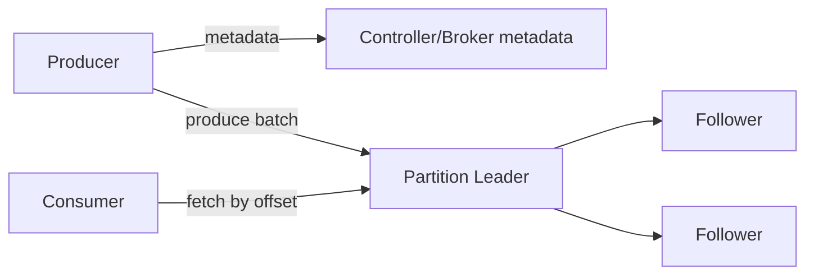

# Kafka 架构、分区日志、Segment 与索引

Kafka 的核心抽象是可复制、可追加、可按 offset 重放的分区日志。Topic 是逻辑分类，partition 是顺序、并行和复制的基本单元；一个 topic 的全局顺序并不存在。

## 1. 数据与控制面

Broker 保存日志并处理 produce/fetch。Controller 管理 broker、topic、partition、leader 与副本状态；现代 Kafka 使用 KRaft 管理控制面，具体部署角色和升级路径以所用版本为准。

## 2. Partition 与 Offset

一条记录被 partitioner 放入某个 partition；broker 在该 partition 追加并赋 offset。Offset 只在 partition 内单调递增，不是全局时间，也不是业务事件 ID。删除旧日志后 offset 不会重新从零排列。

Partition 数决定：

- 单 consumer group 最大有效消费并行度；
- producer 可以并行写入的日志数；
- leader/s副本、文件句柄和元数据规模；
- 扩容、选主和 rebalance 成本。

## 3. Segment 与索引

Partition 日志按大小或时间滚动成多个 segment。活跃 segment 接受 append，旧 segment 进入只读并按 retention/compaction 清理。常见文件包括日志数据、offset 索引和时间索引。

稀疏索引定位大致位置后，broker 再在 segment 内顺序扫描目标 offset。Segment 滚动过小会增加文件和索引，过大则让删除粒度、恢复和检查变粗。

## 4. 高吞吐来源

- 顺序追加避免随机更新；
- producer/consumer 按 batch 发送；
- page cache 缓解磁盘读取；
- 零拷贝等传输优化减少用户态搬运（实际路径依赖 TLS、压缩与平台）；
- partition 提供水平并行。

Kafka 不是“只使用内存”。数据可靠性仍依赖日志刷盘、操作系统和副本协议，page cache 是性能层。

## 5. Retention 与 Log Compaction

- **时间/大小保留**按 segment 删除老记录，适合事件日志和有限重放窗口。
- **Log compaction**长期保留每个 key 的较新值及 tombstone 语义，适合状态 changelog；它不保证任意时刻只有一条同 key 记录，consumer 必须能处理重复与中间版本。

Retention 必须长于最大停机、重放和灾备窗口；磁盘水位还要覆盖流量峰值和清理滞后。

## 6. 读写实验

创建隔离 topic，发送带 key/无 key 记录，查看每条记录的 partition/offset。观察 segment 滚动前后文件；停止 consumer 制造 lag，再恢复并验证 offset 连续性。不要直接修改 broker 日志文件。

## 7. 指标与排障

- records/bytes in/out、request queue/latency；
- partition/leader 数与分布；
- log size、segment 数、磁盘利用/await；
- page cache 命中侧证、CPU、网络重传；
- under-replicated/offline partition；
- consumer lag 与最早可用 offset。

吞吐下降时先区分请求排队、磁盘、网络、复制不足和单 partition 热点。总 broker 平均值正常不代表 leader 分布均衡。

## 8. 掌握验收

- 区分 topic、partition、segment、record 和 offset；
- 解释为什么只有 partition 内顺序；
- 说明索引为何可以稀疏以及 page cache 的作用；
- 比较 retention 与 compaction；
- 根据吞吐和消费并行度初步估算 partition 数。

下一篇：[Producer batching、acks、重试与幂等生产](./02-Producer-Batching-Acks重试与幂等.md)

## 参考资料

- [Apache Kafka Documentation](https://kafka.apache.org/documentation/)
- [Kafka Design](https://kafka.apache.org/documentation/#design)
