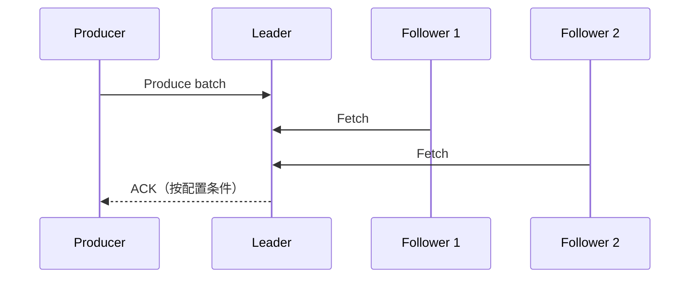

# Kafka 副本、ISR、Leader 选举与 KRaft 控制面

每个 partition 有一个 leader 处理正常读写，followers 拉取 leader 日志。副本数只是静态目标，真正影响可确认写入和可选主范围的是当前同步副本集合、复制进度与选举策略。

## 1. 复制路径

Follower 像 consumer 一样复制 leader。Leader 维护副本进度，并根据滞后条件管理 ISR。High Watermark 限定消费者可见的已复制日志边界；日志末端和已提交边界不能混淆。

## 2. ISR 与最小同步副本

ISR 不是“所有配置副本”，而是满足同步条件的动态集合。强确认写入配合最小 ISR，可以在同步副本不足时拒绝写入，以可用性换数据安全。若只看 replication factor=3，却长期 ISR=1，实际保护远低于预期。

## 3. Leader 故障

Controller 检测 broker/leader 不可用，从允许集合选新 leader并传播元数据。客户端刷新元数据后重试。切换期间出现短暂错误和延迟是正常的，关键是是否选择包含已确认数据的副本。

允许不同步副本成为 leader 可提高极端情况下可用性，却可能丢失已确认记录。该取舍必须由数据等级和业务 RPO 决定，不能为“告警恢复”临时打开而无审批。

## 4. Leader Epoch 与截断

Leader epoch 帮助识别不同任期日志，Follower 重新加入时可能截断与当前 leader 冲突的尾部，再继续复制。Offset 单调不代表历史永远不分叉；应用不应把未到可见提交边界的数据当成稳定事实。

## 5. KRaft 控制面

KRaft 使用 Raft quorum 管理 Kafka 元数据。Controller quorum 与 broker 数据复制是两个不同层面：前者决定 topic/partition/leader 元数据，后者保存业务日志。生产需规划 controller 独立故障域、quorum、磁盘、网络、监控与备份/恢复流程。

Quorum 要容忍 `f` 个 controller 故障通常需要 `2f+1` 个投票成员。成员过多会增加共识开销，不应把所有 broker 都设为 controller。

## 6. 故障演练

在隔离集群：确认 leader/ISR → 停止 leader broker → 记录选举和客户端恢复 → 恢复旧 broker并观察追赶。再让一个 follower 磁盘/网络变慢，观察 ISR shrink。禁止通过删除日志来“修复”副本。

## 7. 指标

- offline/under-replicated partition；
- ISR shrink/expand、in-sync replica count；
- leader election、unclean election；
- replica fetch lag/latency；
- controller active/quorum、metadata error；
- leader/partition 在 broker 间的分布；
- broker 磁盘、网络、请求队列与 GC。

先检查是否单 broker/磁盘/机架异常，再调整复制参数。ISR 抖动通常是资源或网络症状。

## 8. 掌握验收

- 区分副本数、ISR、日志末端和 High Watermark；
- 说明最小 ISR 与 ACK 共同形成的可用性取舍；
- 解释不干净选举的数据风险；
- 区分 KRaft controller quorum 与 partition replica；
- 演练 leader 故障并用 offset/event ID 验证数据。

上一篇：[Consumer Group 与 Rebalance](./03-Consumer-Group-Offset-Rebalance与顺序.md)　下一篇：[Kafka 事务与端到端 Exactly-Once](./05-Kafka事务与端到端Exactly-Once.md)

## 参考资料

- [Kafka Operations and KRaft](https://kafka.apache.org/documentation/#operations)
