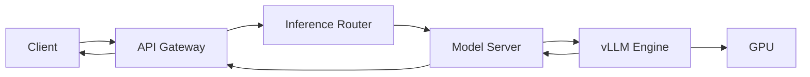

# LLM 服务 SLI、SLO 与 SLA 工程化

GPU 利用率、显存占用和 Pod 数量都很重要，但它们不能直接回答：

> 用户是否在承诺时间内拿到了正确、完整的模型响应？

SLI、SLO 和 SLA 的作用，就是把“服务稳定”变成可计算的工程指标。

本文不讨论绩效或流程管理，只解决五个技术问题：

1. LLM 服务的测量边界在哪里？
2. 什么请求进入分母？
3. 流式请求什么时候算成功？
4. TTFT、TPOT、E2E 应该如何写成 SLI？
5. 如何把 SLO 落成 PromQL、看板和验收测试？

---

## 1. 先区分 SLI、SLO 和 SLA

| 名称 | 含义 | 示例 |
| --- | --- | --- |
| SLI | 实际测量值 | 最近 30 天有效请求成功率为 99.94% |
| SLO | 内部可靠性目标 | 30 天窗口可用性不低于 99.9% |
| SLA | 对外合同承诺及违约后果 | 月可用性低于 99.5%触发服务补偿 |

三者关系可以写成：

```text
SLI = 实际观测结果
SLO = 希望 SLI 达到的目标
SLA = 对外承诺，通常比内部 SLO 更宽松
```

生产系统应先定义 SLI 和内部 SLO，再讨论 SLA。否则团队可能签下一个无法测量、
也无法从现有架构证明可以达到的承诺。

---

## 2. SLI 的统一数学形式

最常用的事件型 SLI 是：

```text
SLI = good events / valid events
```

- `valid events`：确实应该由本服务负责的有效事件。
- `good events`：在有效事件中达到质量要求的事件。
- `bad events = valid events - good events`。

例如 30 天内有 1,000,000 个有效请求，其中 999,200 个成功：

```text
availability = 999200 / 1000000 = 99.92%
```

如果 SLO 是 99.9%，这段时间仍在目标内；但剩余错误预算已经不多。

### 为什么不用“服务运行时间”

进程存活并不等于服务可用：

- 网关返回 200，但流式响应中途断开。
- Pod Ready，但所有请求都在排队。
- HTTP 成功，但输出为空或响应格式错误。
- 服务有多个模型，只有某个模型 revision 故障。

所以 LLM 服务应优先使用请求事件定义可用性，而不是只看进程 uptime。

---

## 3. 先画清服务边界

一条典型推理链路如下：



建议至少定义两层 SLO：

| SLO | 测量点 | 负责范围 |
| --- | --- | --- |
| 端到端服务 SLO | Gateway | 认证、路由、排队、模型服务、流式传输 |
| 模型运行时 SLO | Model Server | 调度、Prefill、Decode、GPU 执行 |

只在 vLLM 进程上测量，会漏掉网关、路由和网络故障；只在网关测量，又难以定位
故障发生在哪一层。因此“承诺看入口，定位看分层”。

---

## 4. 如何定义 valid events

请求是否进入 SLO 分母，必须提前写清楚。

### 4.1 推荐纳入分母

- 请求通过鉴权。
- 模型名称和接口存在。
- 请求体格式合法。
- prompt、`max_tokens` 等参数在服务限制内。
- 服务承诺为该租户、区域和模型提供请求处理。

### 4.2 通常不纳入分母

- 客户端请求体不合法导致的 400。
- 身份无效导致的 401/403。
- 客户端主动取消且服务尚未异常。
- 明确超出配额或约定限制的请求。
- 压测、健康检查等已经用稳定标签识别的内部流量。

### 4.3 不能简单按状态码判断

同一个状态码可能有不同责任归属：

| 状态 | 场景 | 是否为 bad event |
| --- | --- | --- |
| 400 | 用户 JSON 非法 | 否 |
| 400 | 网关错误改写了合法请求 | 是 |
| 429 | 用户超过合同配额 | 通常否 |
| 429 | 平台容量不足主动拒绝正常流量 | 是 |
| 499 | 客户端立即取消 | 通常否 |
| 499 | TTFT 太慢导致客户端超时取消 | 应视为是 |
| 503 | 模型正在计划内下线且流量已摘除 | 不应产生请求 |
| 503 | 可服务流量没有可用后端 | 是 |

生产实现中不要只保留 `status_code`，还要记录低基数
`result_reason`，例如：

```text
success
invalid_request
auth_rejected
quota_exceeded
capacity_rejected
backend_unavailable
backend_timeout
stream_interrupted
client_cancelled
```

---

## 5. LLM 服务应定义哪些 SLI

### 5.1 可用性 SLI

非流式请求的 good event：

```text
请求通过服务端校验
AND 后端成功处理
AND 返回符合协议的完整响应
```

PromQL 示例：

```promql
sum(rate(llm_gateway_requests_total{
  slo_eligible="true",
  result_reason="success"
}[5m]))
/
sum(rate(llm_gateway_requests_total{
  slo_eligible="true"
}[5m]))
```

这里使用计数器，不使用当前连接数等 Gauge。

### 5.2 流式完整性 SLI

HTTP Header 已经返回 200，不代表一次流式请求成功。至少要区分：

```text
accepted       请求被接受
first_token    首 token 已发送
completed      正常发送结束标记
interrupted    首 token 后异常中断
```

流式 good event 应以 `completed` 为准：

```promql
sum(rate(llm_streams_total{
  slo_eligible="true",
  outcome="completed"
}[5m]))
/
sum(rate(llm_streams_total{
  slo_eligible="true"
}[5m]))
```

### 5.3 TTFT 达标率

TTFT 是从服务入口收到请求到客户端收到首 token 的时间。

不要只把 P99 当 SLO。更容易计算错误预算的形式是“阈值内事件占比”：

```text
99% 的有效流式请求应在 2 秒内返回首 token
```

如果 Gateway 暴露直方图：

```text
llm_request_ttft_seconds_bucket
llm_request_ttft_seconds_count
llm_request_ttft_seconds_sum
```

PromQL：

```promql
sum(rate(llm_request_ttft_seconds_bucket{
  slo_eligible="true",
  le="2"
}[5m]))
/
sum(rate(llm_request_ttft_seconds_count{
  slo_eligible="true"
}[5m]))
```

这直接得到“2 秒内的请求比例”，可以像可用性一样计算错误预算。

### 5.4 TPOT / ITL 达标率

TPOT 是输出阶段平均每个 token 的生成间隔，ITL 是相邻 token 间隔。

二者不能替代 TTFT：

- Prefill 堵塞时 TTFT 变差，TPOT 可能正常。
- Decode 拥塞或调度不公平时，TTFT 正常但 ITL 抖动。

可定义：

```text
99% 的有效请求，平均 TPOT 不超过 80 ms/token
```

如果指标只有 TPOT 直方图：

```promql
sum(rate(llm_request_tpot_seconds_bucket{
  slo_eligible="true",
  le="0.08"
}[5m]))
/
sum(rate(llm_request_tpot_seconds_count{
  slo_eligible="true"
}[5m]))
```

### 5.5 端到端延迟 SLI

E2E 延迟受输入 token、输出 token 和流式模式影响。不能把所有请求混在一个桶里。

推荐用预先定义的请求等级：

```text
workload_class="short"
workload_class="medium"
workload_class="long"
```

等级由服务端按 token 范围计算，不能直接把原始 token 数放进 Label。

示例目标：

| 工作负载 | 条件 | 目标 |
| --- | --- | --- |
| short | input ≤ 1K，output ≤ 256 | 99% E2E ≤ 8s |
| medium | input ≤ 4K，output ≤ 1K | 99% E2E ≤ 40s |
| long | 更长上下文 | 单独定义或仅做尽力服务 |

### 5.6 正确性 SLI

基础设施层很难实时判断回答内容是否“正确”，但可以测量协议和执行正确性：

- 响应 JSON/SSE 格式正确。
- token 流没有重复序号或异常截断。
- 返回的模型 revision 与路由目标一致。
- 输出不包含 NaN、空 choices 等运行时异常。
- 工具调用满足 Schema。

内容质量、幻觉率和业务评测应进入模型评测体系，不要与基础设施可用性混为一个
指标。

---

## 6. Label 设计与基数控制

建议保留：

```text
service
cluster
region
model_family
model_revision
workload_class
stream
result_reason
```

禁止直接作为 Label：

```text
request_id
user_id
prompt
完整 URL
原始输入 token 数
错误堆栈
```

高基数字段放日志和 Trace；指标只保留用于聚合的稳定维度。

`model_revision` 也要受控：如果每次构建都产生永久新 Label，需要设置数据保留、
聚合规则或只保留稳定发布槽位，如 `stable/canary`。

---

## 7. 一份可执行的 SLO 定义

```yaml
service: llm-chat
owner: ai-platform
measurement_point: public-gateway
window: 30d

traffic_scope:
  region: cn-east-1
  model_family: llama-70b
  excluded:
    - invalid_request
    - auth_rejected
    - quota_exceeded
    - synthetic_probe

slos:
  - name: availability
    target: 0.999
    good_event: outcome == completed
    valid_event: slo_eligible == true

  - name: ttft
    target: 0.99
    threshold: 2s
    scope: stream == true

  - name: tpot
    target: 0.99
    threshold: 80ms
    scope: workload_class in [short, medium]

  - name: protocol_correctness
    target: 0.9999
    good_event: protocol_valid == true
```

这份配置的关键不是 YAML 格式，而是每个字段都能映射到真实指标和查询。

---

## 8. SLO 目标如何确定

不要直接照抄 99.99%。目标应来自：

1. 用户真正可感知的需求。
2. 上游超时、重试和降级策略。
3. 现有 4～8 周基线数据。
4. 依赖项和架构能够实现的上限。
5. 为发布、维护和偶发故障预留的错误预算。

### 可用时间的直觉

按 30 天粗略计算：

| SLO | 允许失败比例 | 等价不可用时间 |
| --- | --- | --- |
| 99% | 1% | 约 7.2 小时 |
| 99.9% | 0.1% | 约 43.2 分钟 |
| 99.95% | 0.05% | 约 21.6 分钟 |
| 99.99% | 0.01% | 约 4.32 分钟 |

请求型 SLO 最终按 good/valid events 计算；表中的时间只帮助建立直觉。

---

## 9. 多模型服务如何拆分 SLO

一个平台可能同时提供小模型和 70B 大模型。如果全部聚合：

- 大流量小模型会掩盖低流量关键模型故障。
- 长上下文请求会让统一延迟 SLO 失真。
- Canary 版本问题会被 Stable 流量稀释。

推荐层次：

```text
平台总 SLO
  ├─ region
  ├─ service_tier
  ├─ model_family
  └─ stable / canary
```

不要无限切分。只有会导致不同处置动作的维度，才值得建立独立 SLO。

---

## 10. 验证与实验

### 实验 1：验证流式成功口径

1. 发起 100 个正常流式请求。
2. 人为终止 5 个后端连接。
3. 检查 HTTP 200 数、first token 数、completed 数。
4. 确认可用性使用 completed，而不是 HTTP 200。

### 实验 2：验证 TTFT 直方图

1. 发送 short、medium、long 三类请求。
2. 查看 `_bucket`、`_count` 和 `_sum`。
3. 用 PromQL 计算 2 秒内的事件比例。
4. 将结果与原始请求日志交叉核对。

### 实验 3：验证责任边界

分别制造：

- 非法 JSON。
- 超配额请求。
- 后端 503。
- 首 token 前超时。
- 首 token 后流中断。

确认每种情况的 `slo_eligible` 和 `result_reason` 符合定义。

---

## 11. 上线检查清单

- [ ] SLO 的测量点位于用户流量入口。
- [ ] valid events 和排除项有明确规则。
- [ ] 流式完成与 HTTP 200 分开计数。
- [ ] TTFT、TPOT、E2E 的起止点有代码级定义。
- [ ] 延迟 SLO 使用直方图阈值达标率。
- [ ] 指标 Label 没有 request_id、user_id、prompt 等高基数字段。
- [ ] 指标结果与日志样本做过交叉验证。
- [ ] Stable、Canary 和关键模型不会互相掩盖。
- [ ] SLO 有 Owner、查询表达式、目标和窗口。
- [ ] 下一篇的错误预算告警可以直接使用这些 good/valid events。

## 12. 参考资料

- [Google SRE Workbook：Implementing SLOs](https://sre.google/workbook/implementing-slos/)
- [Prometheus：Histograms and summaries](https://prometheus.io/docs/practices/histograms/)
- [OpenTelemetry HTTP Metrics Semantic Conventions](https://opentelemetry.io/docs/specs/semconv/http/http-metrics/)

下一篇将把这些 SLI 转换为 Error Budget、Burn Rate 和可直接加载的
Prometheus 多窗口告警规则。
