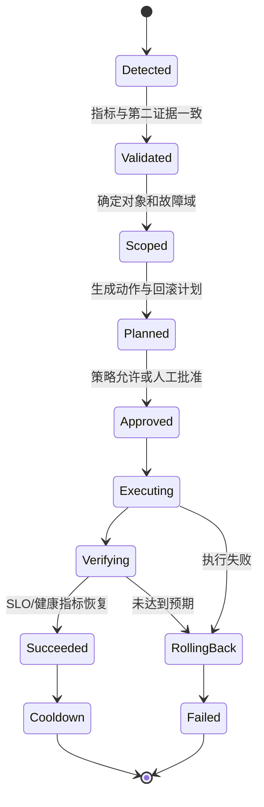

# Toil 量化与安全自动修复

自动化的目标不是“把人工命令放进脚本”，而是把一个可证明、可回滚、可审计的
技术处置过程变成系统能力。

AI Infra 的高风险操作很多：

- 重启推理 Pod 会中断流式请求。
- Cordon/Drain GPU 节点会影响昂贵的训练任务。
- 错误清理模型缓存会放大冷启动风暴。
- 盲目扩容可能没有 GPU 可用，反而增加排队和调度压力。
- 重启 RDMA/NCCL 相关组件可能扩大故障域。

因此应先自动化证据采集和低风险动作，再逐步进入受控修复。

---

## 1. 什么是 Toil

Toil 通常具有以下特征：

- 手工执行。
- 重复发生。
- 可以被自动化。
- 主要是战术性处置，不产生长期工程价值。
- 工作量随服务或集群规模线性增长。

例子：

| 工作 | 是否 Toil | 原因 |
| --- | --- | --- |
| 每天手工收集 GPU 节点健康信息 | 是 | 重复、可自动化 |
| 为新故障设计 Xid 隔离机制 | 否 | 产生长期工程能力 |
| 每次告警手工拼接 Pod/GPU/节点信息 | 是 | 规则明确、重复 |
| 一次性评估新型 GPU 架构 | 否 | 探索性工程工作 |
| 重复手工回滚相同发布故障 | 是 | 可由发布系统处理 |

---

## 2. 如何量化 Toil

为每类工作记录：

```text
frequency_per_month
minutes_per_execution
people_per_execution
error_probability
blast_radius
automation_difficulty
```

月度耗时：

```text
monthly_hours =
  frequency × minutes × people / 60
```

可使用简单优先级：

```text
automation_score =
  monthly_hours
  × repeatability
  × safety_gain
  / implementation_cost
```

其中各维度可按 1～5 打分。不要只按“最烦”决定优先级。

### 示例

| 任务 | 次/月 | 分钟/次 | 人数 | 月耗时 | 风险 |
| --- | ---: | ---: | ---: | ---: | --- |
| 事件证据包采集 | 20 | 30 | 2 | 20h | 低 |
| 手工重启异常 exporter | 10 | 10 | 1 | 1.7h | 中 |
| GPU 节点 Drain | 3 | 60 | 2 | 6h | 高 |
| 发布后 SLO 核对 | 40 | 15 | 1 | 10h | 低 |

优先自动化证据采集和发布核对；节点 Drain 即使耗时不低，也需要更严格的安全设计。

---

## 3. 自动化成熟度分级

```text
L0 文档化
  → L1 一键只读采集
  → L2 自动诊断和建议
  → L3 人工批准后执行
  → L4 小故障域自动执行
  → L5 全闭环自愈
```

同一个动作不应直接从 L0 跳到 L5。

例如 GPU Xid：

| 等级 | 能力 |
| --- | --- |
| L1 | 自动采集 Xid、Pod、GPU UUID、节点和时间线 |
| L2 | 根据 Xid 类型建议隔离或观察 |
| L3 | 人工批准后 Cordon 节点并停止新调度 |
| L4 | 对明确不可恢复类型自动 Cordon 单节点 |
| L5 | 自动迁移服务、Drain、维修工单、验收后恢复 |

---

## 4. 安全修复状态机



任何自动修复都应显式保存当前状态，不能只靠一段脚本从头执行到尾。

---

## 5. Detect：检测必须基于用户影响或明确故障

适合触发修复的信号：

- SLO Fast Burn。
- readiness 连续失败且同组其他实例健康。
- 明确的不可恢复 GPU Xid。
- Endpoint 指向已经终止的实例。
- 指标采集组件自身失败。

不适合单独触发：

- 一次 CPU 瞬时 100%。
- GPU 利用率低。
- 单点日志出现 `error` 字符串。
- 一个 Prometheus 样本缺失。

检测信号应包含稳定对象标识：

```text
cluster
namespace
pod_uid
node_uid
gpu_uuid
model_revision
alert_fingerprint
```

Pod 名称可复用或重建，不能作为唯一幂等键。

---

## 6. Validate：至少使用第二种证据

不要让“告警表达式写错”直接触发生产修复。

验证示例：

| 主信号 | 第二证据 |
| --- | --- |
| Pod readiness 失败 | Endpoint 已摘除且应用健康接口失败 |
| GPU Xid 告警 | 节点日志存在同 GPU UUID 的对应 Xid |
| TTFT Fast Burn | waiting 增长或 Trace 显示模型排队 |
| 推理实例异常 | 同模型其他实例正常，排除全局依赖故障 |
| 存储延迟 | 客户端 I/O 指标与服务端延迟同时异常 |

还要验证观测数据新鲜度：

```text
now - sample_timestamp < freshness_limit
```

---

## 7. Scope：限制故障域

自动化必须计算本次动作影响：

```text
target_count
target_percentage
zone_count
remaining_ready_replicas
remaining_gpu_capacity
active_training_jobs
current_error_budget
```

示例策略：

```yaml
policy:
  max_targets: 1
  max_percentage: 10
  max_targets_per_zone: 1
  min_ready_replicas_after_action: 3
  require_spare_gpu_capacity: true
  deny_during_active_rollout: true
  deny_when_metrics_stale: true
```

如果无法证明剩余容量足够，就不能自动摘除实例或节点。

---

## 8. Plan：每个动作必须有前置、后置和回滚

动作定义：

```yaml
action: remove_unhealthy_endpoint
target:
  cluster: prod-ai-east
  namespace: ai-serving
  pod_uid: 1f9c...

preconditions:
  - pod_ready == false for 5m
  - endpoint_serving == false
  - ready_replicas_after_action >= 3

expected_results:
  - target_request_rate == 0 within 2m
  - service_error_ratio decreases within 5m

rollback:
  action: restore_previous_routing_weight
  deadline: 5m
```

“重启看看”没有清晰预期，也很难证明根因，不是合格修复计划。

---

## 9. 幂等、锁、限速和冷却

### 9.1 幂等键

```text
idempotency_key =
  cluster + action + target_uid + alert_fingerprint
```

同一个事件重复投递时，不得重复执行动作。

### 9.2 分布式锁

锁粒度按影响对象设计：

```text
/remediation/cluster-a/node/<node-uid>
/remediation/cluster-a/deployment/<deployment-uid>
```

锁必须有：

- Holder ID。
- 获取时间。
- TTL/Lease。
- 续租机制。
- 异常退出后的超时释放。

Kubernetes 环境可使用 `coordination.k8s.io/v1 Lease`，但仍要处理持有者崩溃和时钟问题。

### 9.3 速率限制

```text
每集群每 10 分钟最多 1 个有状态修复
每故障域每 30 分钟最多 1 个节点隔离
全局同时执行不超过 N 个动作
```

### 9.4 冷却时间

动作完成后等待系统稳定，再重新评估。否则扩缩容、调度和指标延迟可能造成振荡。

---

## 10. Dry Run 与审批

Dry Run 输出应包含：

```json
{
  "action": "cordon_node",
  "target": "gpu-node-17",
  "reason": "confirmed_unrecoverable_xid",
  "affected_pods": 4,
  "affected_models": ["llama-70b"],
  "remaining_ready_replicas": 5,
  "spare_gpu_count": 8,
  "rollback": "uncordon_node",
  "requires_approval": true
}
```

审批人看到的是影响分析和回滚方案，而不是一个模糊的“是否执行脚本”按钮。

需要人工批准的典型动作：

- Drain 节点。
- 删除 Pod。
- 扩缩容超过策略上限。
- 修改路由和流量权重。
- 清理模型缓存。
- 修改存储或网络配置。

---

## 11. 一个只读优先的 Python 框架

下面代码演示状态机骨架。默认只生成计划，不执行有状态动作：

```python
from __future__ import annotations

from dataclasses import dataclass, asdict
from enum import Enum
from typing import Protocol
import json
import time


class State(str, Enum):
    DETECTED = "detected"
    VALIDATED = "validated"
    PLANNED = "planned"
    APPROVED = "approved"
    EXECUTING = "executing"
    VERIFYING = "verifying"
    SUCCEEDED = "succeeded"
    ROLLED_BACK = "rolled_back"
    FAILED = "failed"


@dataclass(frozen=True)
class Target:
    cluster: str
    namespace: str
    kind: str
    uid: str
    name: str


@dataclass
class Plan:
    action: str
    target: Target
    reason: str
    blast_radius: dict[str, int]
    preconditions: list[str]
    expected_results: list[str]
    rollback: str
    requires_approval: bool = True


class Action(Protocol):
    def validate(self, plan: Plan) -> bool: ...
    def execute(self, plan: Plan) -> None: ...
    def verify(self, plan: Plan) -> bool: ...
    def rollback(self, plan: Plan) -> None: ...


class RemediationEngine:
    def __init__(self, action: Action, dry_run: bool = True):
        self.action = action
        self.dry_run = dry_run
        self.state = State.DETECTED

    def run(self, plan: Plan, approved: bool = False) -> State:
        self.audit("plan_created", asdict(plan))

        if not self.action.validate(plan):
            self.state = State.FAILED
            self.audit("validation_failed", {})
            return self.state

        self.state = State.VALIDATED

        if self.dry_run:
            self.state = State.PLANNED
            self.audit("dry_run_complete", asdict(plan))
            return self.state

        if plan.requires_approval and not approved:
            self.state = State.PLANNED
            self.audit("approval_required", {})
            return self.state

        self.state = State.EXECUTING
        try:
            self.action.execute(plan)
            self.state = State.VERIFYING

            if self.action.verify(plan):
                self.state = State.SUCCEEDED
            else:
                self.action.rollback(plan)
                self.state = State.ROLLED_BACK
        except Exception as exc:
            self.audit("execution_exception", {"error": repr(exc)})
            try:
                self.action.rollback(plan)
                self.state = State.ROLLED_BACK
            except Exception as rollback_exc:
                self.audit(
                    "rollback_exception",
                    {"error": repr(rollback_exc)},
                )
                self.state = State.FAILED

        self.audit("run_complete", {"state": self.state.value})
        return self.state

    @staticmethod
    def audit(event: str, payload: dict) -> None:
        record = {
            "timestamp": time.time(),
            "event": event,
            "payload": payload,
        }
        print(json.dumps(record, ensure_ascii=False, sort_keys=True))
```

生产实现还必须补充：

- Kubernetes Lease 或其他分布式锁。
- 持久化幂等记录。
- RBAC 最小权限。
- 指标新鲜度和影响范围检查。
- 审批身份与签名。
- OpenTelemetry Trace。
- 重试上限、超时和熔断。
- 审计日志写入不可篡改存储。

---

## 12. Kubernetes RBAC 最小权限

把采集器与执行器拆成两个 ServiceAccount：

```text
evidence-collector
  只读 Pod、Event、Node、EndpointSlice、Deployment

remediation-executor
  只拥有经过批准的少量 patch/update 权限
```

不要为了方便给 `cluster-admin`。

示例只读 Role：

```yaml
apiVersion: rbac.authorization.k8s.io/v1
kind: Role
metadata:
  name: incident-evidence-reader
  namespace: ai-serving
rules:
  - apiGroups: [""]
    resources: ["pods", "pods/log", "events", "services"]
    verbs: ["get", "list", "watch"]
  - apiGroups: ["discovery.k8s.io"]
    resources: ["endpointslices"]
    verbs: ["get", "list", "watch"]
  - apiGroups: ["apps"]
    resources: ["deployments", "replicasets"]
    verbs: ["get", "list", "watch"]
```

执行器应针对资源、namespace、verb 和 admission policy 进一步限制。

---

## 13. 自动修复如何验证

动作后不能只验证 API 返回成功。

至少三层验证：

```text
资源层：对象达到期望状态
服务层：ready capacity、queue、error ratio 恢复
用户层：SLO Burn Rate、合成请求和真实流量恢复
```

例如重建异常推理实例：

| 层 | 验证 |
| --- | --- |
| 资源 | 新 Pod Ready，旧 Pod 已摘流 |
| 服务 | 模型加载完成，waiting 没有转移性爆炸 |
| 用户 | 5m error ratio 和 TTFT Burn Rate 回落 |

验证必须有 deadline。超过 deadline 即触发回滚或升级给人工。

---

## 14. 先自动化哪些场景

### 第一批：只读和低风险

- 一键采集事件证据包。
- 告警自动补充 Pod、Node、GPU UUID、模型 revision。
- 自动关联最近发布和 Kubernetes Event。
- SLO 查询与发布门禁。
- Runbook 推荐。

### 第二批：人工批准执行

- 将 Canary 流量降为 0。
- 对已确认异常实例执行受控摘流。
- Cordon 单个 GPU 节点。
- 触发预定义扩容或备用实例预热。

### 第三批：小故障域闭环

- 明确不可恢复 Xid 自动隔离单节点。
- 指标采集组件异常且有冗余时自动重建。
- 单实例卡死且容量充足时自动摘流并重建。

所有闭环都应保留全局 Kill Switch。

---

## 15. 测试体系

### 单元测试

- 幂等键生成。
- 策略判定。
- Blast Radius 计算。
- 状态机转换。
- 验证失败触发回滚。

### 集成测试

- 使用测试 namespace 和假对象。
- 模拟 Kubernetes API timeout、409 conflict、429 throttling。
- 模拟 Prometheus 数据过期和查询失败。
- 验证 Lease 竞争。

### 故障注入

- 同一告警重复投递。
- 执行器在动作中途崩溃。
- 验证指标延迟到达。
- 回滚 API 失败。
- 多个故障同时出现。

### 生产前 Shadow

系统只生成计划，不执行；将建议动作与人工真实动作比较 2～4 周：

```text
precision = 正确建议 / 全部建议
recall    = 被建议覆盖的真实动作 / 全部真实动作
```

Shadow 结果稳定后，再开放人工批准模式。

---

## 16. 自动化自身的可观测性

至少暴露：

```text
remediation_detected_total
remediation_planned_total
remediation_executed_total
remediation_succeeded_total
remediation_rolled_back_total
remediation_failed_total
remediation_duration_seconds
remediation_targets
remediation_policy_denied_total
remediation_lock_contention_total
```

日志需要记录：

- 谁或哪个策略批准。
- 使用了哪些证据。
- 计划、动作和回滚。
- API 请求结果。
- 验证查询结果。
- 最终状态。

自动修复系统是生产控制面，本身也需要 SLO、告警、发布和灾难恢复。

---

## 17. 实验任务

1. 统计一个月内重复证据采集、发布核对和故障操作的耗时。
2. 实现只读证据采集器，不授予写权限。
3. 为计划增加 blast radius、preconditions、expected results 和 rollback。
4. 使用 Kubernetes Lease 实现对象级锁。
5. 在测试 namespace 模拟重复告警和执行器崩溃。
6. 以 Dry Run/Shadow 模式运行，统计建议的 precision 和 recall。
7. 只为一个低风险动作开放人工批准执行。

## 18. 上线检查清单

- [ ] 检测有第二证据验证。
- [ ] 使用 UID 和告警指纹建立幂等键。
- [ ] 有对象级分布式锁、速率限制和冷却时间。
- [ ] 默认 Dry Run。
- [ ] 明确 blast radius 上限。
- [ ] 每个动作有前置条件、预期结果和回滚。
- [ ] 执行器使用最小 RBAC。
- [ ] 验证覆盖资源、服务和用户 SLO。
- [ ] 所有状态和审批进入审计日志。
- [ ] 有全局 Kill Switch。
- [ ] 已测试重复投递、中途崩溃和回滚失败。

## 19. 参考资料

- [Google SRE Book：Eliminating Toil](https://sre.google/sre-book/eliminating-toil/)
- [Kubernetes Lease API](https://kubernetes.io/docs/concepts/architecture/leases/)
- [Kubernetes RBAC](https://kubernetes.io/docs/reference/access-authn-authz/rbac/)
- [Kubernetes API Concepts：Resource Versions and Conflict](https://kubernetes.io/docs/reference/using-api/api-concepts/)

完成本文后，应优先做“自动采集和自动诊断”，而不是马上做“自动重启一切”。
