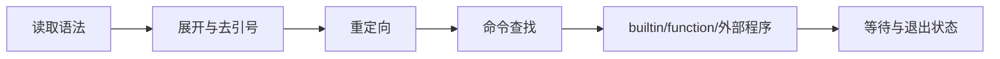

# Shell、帮助与安全自动化命令导读

终端里的一行文字不是直接交给 `ls`、`kubectl` 或 `rm`。Shell 先分词、展开变量/命令/算术/通配符、处理引号和重定向，再解析管道与控制运算符，最后才查找并执行命令。不了解这一层，就无法解释“明明加了引号为何还错”“退出码为何是 0”“通配符是谁展开的”。



## 1. 五类执行对象

```bash
type -a cd printf test ls
command -V kubectl
enable -a
```

alias、function、builtin、keyword 和 PATH 中的 executable 可同名。`which` 主要搜索 PATH，不能可靠说明 alias/function/builtin；脚本优先 `type`/`command -V`。

## 2. 展开与引用

大致顺序是 brace、tilde、parameter/arithmetic/command/process substitution、word splitting、filename expansion、quote removal。最重要纪律：

```bash
printf '%s\n' "$variable"
printf '%s\0' ./*.log
array=("$@")
```

双引号通常抑制 word splitting 和 glob；`"$@"` 保留每个位置参数边界；命令替换会去掉尾部换行，不能安全承载任意二进制/NUL。

## 3. 管道、重定向与退出状态

```bash
set -o pipefail
command >out.log 2>err.log
if ! result=$(command); then
  printf 'failed: %s\n' "$result" >&2
fi
```

重定向从左到右：`>file 2>&1` 与 `2>&1 >file` 不同。默认 pipeline 状态是最后一段，`pipefail` 才让非零段影响整体。`set -e` 有复杂语法例外，不能代替显式错误处理。

## 4. 本模块学习顺序

1. `bash`：调用模式与启动文件。
2. `help/type/command`：先识别实现和接口。
3. `printf/read/mapfile`：可靠输入输出。
4. `declare/export/readonly/unset`：变量属性、作用域与环境。
5. `set/shopt/test`：Shell 行为和条件判断。
6. `getopts/shift`：脚本 CLI 契约。
7. `trap/source/exec`：清理、复用与进程替换。
8. `env/xargs/tee`：外部环境、批处理与证据复制。

## 5. 安全脚本最低标准

```bash
#!/usr/bin/env bash
set -Eeuo pipefail
IFS=$'\n\t'
tmpdir=$(mktemp -d)
cleanup() { rm -rf -- "$tmpdir"; }
trap cleanup EXIT
```

这只是起点：`-e` 不是异常系统，`-u` 对可选变量要用 `${x:-}`，修改/删除前仍要解析绝对目标，trap 要幂等，敏感值不能进入 `set -x` 日志。

## 6. 验收

能预测 quoting/globbing/redirection 的结果，区分 Shell 与外部程序参数，保留数组边界和退出状态，设计可重复、可中断、可回滚且不会泄露密钥的自动化。

## 官方参考

- [GNU Bash Reference Manual](https://www.gnu.org/software/bash/manual/bash.html)
- [ShellCheck Wiki](https://www.shellcheck.net/wiki/)

从 [`bash`](./01-bash命令详解.md) 开始。
