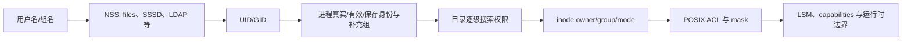

# 用户、用户组与权限命令导读

Linux 授权判断使用的是数字身份与进程凭据，而不是界面上看到的用户名。一次文件访问至少跨过“名字解析、进程身份、路径逐级搜索、DAC/ACL 检查”四层；SELinux、AppArmor、capabilities、容器 user namespace 还可能继续限制结果。



## 1. 必须先分清的对象

| 对象 | 核心问题 | 常见证据 |
|---|---|---|
| 账户记录 | 名字映射到哪个 UID、主 GID、home、shell | `getent passwd NAME` |
| 组记录 | 组名映射到哪个 GID，显式成员是谁 | `getent group NAME` |
| 进程凭据 | 当前程序实际携带哪些 UID/GID | `id`、`/proc/$PID/status` |
| 文件元数据 | inode 归谁、mode 是什么 | `stat`、`namei -l` |
| POSIX ACL | 命名用户/组与 ACL mask 如何生效 | `getfacl` |
| 提权策略 | 谁能以谁的身份执行什么 | `sudo -l`、`visudo -c` |

`/etc/passwd` 不保存现代 Linux 的密码散列；本地散列通常在仅 root 可读的 `/etc/shadow`。NSS 可能让用户来自 LDAP、SSSD、winbind 或容器映射，因此生产排障优先用 `getent`，不要只搜索本地文件。

## 2. 权限判断的最小模型

对普通文件：`r` 允许读内容，`w` 允许修改内容，`x` 允许作为程序执行。对目录：`r` 允许列出目录项名字，`w` 允许增删/改名目录项，`x` 允许搜索并穿过该目录。删除文件主要由父目录的 `w+x` 决定，不由文件自身的 `w` 决定；sticky bit 会进一步约束共享目录中的删除与改名。

传统 mode 只选择一类：所有者、所属组、其他人。若存在扩展 ACL，访问 ACL 的 `mask` 会限制命名用户、命名组和所属组条目的有效权限。root 也不是“绕过所有安全层”的同义词：只读挂载、immutable 属性、LSM、NFS root squash、capability 边界都可能阻止操作。

## 3. 本批 22 个命令

| 阶段 | 命令 | 学习目标 |
|---|---|---|
| 身份观察 | `id`、`whoami`、`groups`、`getent` | 分清名字、数字 ID、实际/有效身份、NSS 来源 |
| 用户生命周期 | `useradd`、`usermod`、`userdel`、`passwd`、`chage` | 创建、变更、锁定、过期与安全删除账户 |
| 用户组生命周期 | `groupadd`、`groupmod`、`groupdel` | 管理 GID、组名和成员列表 |
| 身份切换 | `su`、`runuser`、`sudo`、`visudo` | 交互切换、服务脚本运行和最小授权 |
| 基础权限 | `chmod`、`chown`、`chgrp`、`umask` | 管理 mode、所有者、组和创建掩码 |
| 扩展 ACL | `getfacl`、`setfacl` | 观察、修改、备份与恢复 POSIX ACL |

推荐严格按表中顺序学习：先证明“当前是谁”，再改变账户；先理解传统 mode，再引入 ACL。不要用 `sudo` 掩盖权限模型不清的问题。

## 4. 安全实验环境

账户命令会修改系统数据库，不应直接在生产机或个人主机练习。优先使用一次性虚拟机；容器常缺少 PAM、systemd、完整 shadow 工具和持久 NSS，不适合验证所有行为。

```bash
lab_dir=$(mktemp -d) || exit 1
install -d -m 0770 "$lab_dir/team"
touch "$lab_dir/team/report"
stat -c '%A %a %U:%G %n' "$lab_dir/team" "$lab_dir/team/report"
getfacl -p "$lab_dir/team/report"
```

涉及 `useradd/userdel/groupdel` 的实验应先快照虚拟机，并记录：命令、退出码、`getent` 结果、home/mail spool 是否存在、仍在运行的 UID 进程以及文件系统上残留的数字 UID/GID。

## 5. 生产变更前检查表

- 身份来自本地文件还是远端目录服务？目标节点是否都能解析？
- 变更的是名字、数字 UID/GID、主组、补充组，还是正在运行进程的凭据？
- 是否存在相同 UID/GID、NFS 共享、容器映射或跨节点不一致？
- 删除账户前是否检查了进程、cron、systemd、SSH key、sudoers、文件所有权和审计要求？
- 递归改权限前是否限定文件系统、符号链接策略、根路径和回滚清单？
- ACL 修改后是否检查 `mask` 与 `getfacl` 的 `effective` 结果？
- sudoers 是否使用 `visudo` 校验，并保留另一个可恢复的 root 会话？

## 6. 模块验收标准

- 能根据 `id/getent/stat/getfacl/namei` 证据解释一次 EACCES，而不是先执行 `chmod 777`。
- 能区分锁定密码、账户过期、禁止登录 shell、删除账户和终止现有进程。
- 能解释真实/有效 UID、主组/补充组，以及进程为什么不会自动获得刚新增的组。
- 能写出最小 sudo 规则并说明命令路径、参数、环境和日志边界。
- 能计算符号/八进制 mode、setuid/setgid/sticky、umask 和 ACL mask 的实际结果。
- 能备份并恢复一棵目录的 owner、group、mode 与 ACL，同时控制递归和符号链接风险。

## 官方参考

- [GNU Coreutils manual](https://www.gnu.org/software/coreutils/manual/)
- [shadow-utils manual pages](https://shadow-maint.github.io/shadow/man/)
- [Linux man-pages：credentials(7)](https://man7.org/linux/man-pages/man7/credentials.7.html)
- [sudo documentation](https://www.sudo.ws/docs/)
- [Linux-PAM documentation](https://www.linux-pam.org/Linux-PAM-html/)

下一篇：[`id` 命令详解](./01-id命令详解.md)
