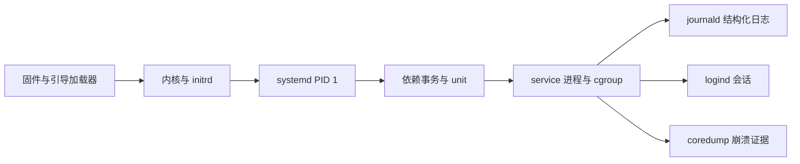

# systemd 服务、启动与日志命令导读

systemd 不只是“开机启动服务的工具”。在多数现代 Linux 发行版中，它同时参与 PID 1 初始化、unit 依赖事务、进程监督、cgroup 组织、日志、登录会话、定时任务、崩溃转储、关机以及部分 UEFI 引导管理。

本模块不要求背诵所有 unit 指令，而是先建立运行时对象和证据链，再学习 12 个命令的完整接口。



## 1. 先理解五类对象

| 对象 | 它是什么 | 常见误区 |
|---|---|---|
| manager | 系统 PID 1 或用户自己的 `systemd --user` | `--user` 不是“用普通用户管理系统服务” |
| unit | `.service`、`.socket`、`.target`、`.timer`、`.mount` 等声明对象 | unit 不等于进程，也不只有 service |
| job/transaction | start/stop 等请求展开后的有序作业集合 | 启动一个 unit 可能同时拉起很多依赖 |
| unit file | `/usr/lib`、`/run`、`/etc` 等处的持久配置和 drop-in | 磁盘文件变了不等于 manager 已重读 |
| journal entry | 带字段、时间戳、boot ID、unit/cgroup 身份的日志记录 | journal 不是单纯文本文件 |

unit 典型状态有三层：

```text
LOAD：配置是否成功加载
ACTIVE：active / inactive / activating / deactivating / failed
SUB：类型特有状态，如 running、exited、dead、failed
```

“enabled”描述开机/依赖关系中的安装状态，“active”描述当前运行状态。一个服务可以 enabled 但现在 inactive，也可以 disabled 却被手工、socket、timer 或依赖拉起。

## 2. unit 配置从哪里来

系统 unit 常见搜索路径按优先级可概括为：

```text
/etc/systemd/system       # 管理员持久配置，优先级高
/run/systemd/system       # 本次启动临时配置
/usr/lib/systemd/system   # 软件包提供；部分发行版使用 /lib
```

不要直接修改 `/usr/lib/systemd/system/*.service`：软件升级可能覆盖。使用：

```bash
systemctl cat nginx.service
systemctl edit nginx.service
systemd-delta
```

完整覆盖文件和 `*.d/*.conf` drop-in 的合并规则不同；列表型设置不一定能靠再次赋值清空，必须查对应 unit 指令文档。修改 unit 文件后通常执行 `systemctl daemon-reload`；修改服务自己的业务配置后是否 `reload`，取决于该服务是否实现 `ExecReload=`。

## 3. 服务生命周期不是一个 PID

service unit 通常对应一个 cgroup，里面可有主进程、子进程和辅助进程。`MainPID` 只是主进程身份；服务“成功启动”的判定受 `Type=simple/exec/notify/forking/oneshot/dbus` 影响。

```text
systemctl start
  → manager 计算 transaction
  → 建立 cgroup 和执行环境
  → 按 Type= 判定启动完成
  → 监督退出、超时、看门狗与重启策略
  → 将 stdout/stderr 和 manager 消息关联到 journal
```

不要把 `systemctl status` 截出的少量日志当作完整日志，也不要只向 `MainPID` 发信号后断言整个服务已停止。应把 unit 状态、属性、cgroup、journal 和应用健康检查放在一起。

## 4. journal 的证据模型

journald 记录结构化字段。常用可信字段由日志系统附加，以下划线开头：

| 字段 | 含义 |
|---|---|
| `_BOOT_ID` | 本次启动身份，可区分重启前后 |
| `_SYSTEMD_UNIT` / `_SYSTEMD_USER_UNIT` | 归属 unit |
| `_SYSTEMD_CGROUP` | 采集时的 cgroup |
| `_PID`、`_UID`、`_GID` | 采集时进程身份 |
| `_EXE`、`_COMM`、`_CMDLINE` | 可执行文件和命令身份 |
| `PRIORITY` | syslog 0～7 严重级别 |
| `SYSLOG_IDENTIFIER` | 程序提供或推导的标识 |
| `MESSAGE_ID` | 可机器匹配的消息类型 |
| `__CURSOR` | 可用于增量消费的唯一游标 |

多个不同字段匹配是 AND，同一字段多值通常是 OR，显式 `+` 可连接 OR 分支。脚本应使用 JSON/export、字段、cursor 和明确时间范围，不要解析彩色的人类输出。

## 5. 启动时间如何分析

启动慢要先分层：固件、boot loader、内核、initrd、userspace。`systemd-analyze time` 给出阶段汇总；`blame` 只统计 unit 自己处于 activating 的时间，不等于关键路径；`critical-chain` 也可能因 socket 激活、并发和时序而漏掉根因。

正确方法是：

1. 确认本次/上次 boot ID 和时间线。
2. 比较 `time`、`critical-chain`、`blame` 与 `plot`。
3. 对关键 unit 查 `After/Before/Wants/Requires`、启动日志和实际等待资源。
4. 区分“本身执行慢”和“等前置 job 慢”。
5. 把变更、内核日志、存储/网络就绪时间纳入同一时钟。

## 6. 本批 12 个命令

| 命令 | 核心用途 | 状态影响 |
|---|---|---|
| `systemctl` | unit、job、manager、启停和 enable/mask | `[R/W/D]` |
| `journalctl` | 结构化日志查询、验证、轮转与清理 | 查询 `[R]`；维护 `[W/D]` |
| `systemd-analyze` | 启动关键路径、unit 校验、安全分析与时间解析 | 多数 `[R]` |
| `systemd-run` | 创建瞬态 service/scope/timer/path/socket | `[W]` |
| `systemd-cat` | 将命令输出或消息写入 journal | `[W]` |
| `loginctl` | session、user、seat、linger 与会话终止 | `[R/W/D]` |
| `coredumpctl` | 查询、导出和调试 core dump | `[R]`；敏感数据风险 |
| `systemd-delta` | 比较发行版配置与本机覆盖/drop-in | `[R]` |
| `systemd-escape` | 路径/字符串与合法 unit 名相互转换 | `[R]` |
| `systemd-notify` | `Type=notify` readiness、状态和 watchdog 通知 | `[W]` |
| `systemd-inhibit` | 查看或持有关机、睡眠、合盖抑制锁 | `[R/W]` |
| `bootctl` | 查看/管理 systemd-boot、ESP 与引导项 | 查询 `[R]`；安装/变量 `[D]` |

本模块讲命令接口、运行时关系和排障。`.service/.socket/.timer` 的全部配置指令、journald 集中采集和 systemd-networkd 不塞进单个命令页，避免把配置语言与命令参数混为一谈。

## 7. 新人安全实验环境

优先使用可回滚 VM。容器内 PID 1 未必是 systemd，WSL、精简镜像和 chroot 也可能没有完整 D-Bus、logind、journal、coredump 或 UEFI 环境。

```bash
ps -p 1 -o pid,comm,args=
systemctl --version
systemctl is-system-running
journalctl --list-boots
test -d /sys/firmware/efi && echo UEFI || echo non-UEFI
```

实验 unit 使用独立名称，设置短超时和明确回滚；不要在远程生产机测试 `isolate`、`emergency`、`reboot`、`poweroff`、`mask` 核心 unit、会话终止或 bootloader 写操作。

## 8. 标准排障顺序

```bash
systemctl --failed
systemctl status demo.service --no-pager -l
systemctl show demo.service -p LoadState,ActiveState,SubState,Result,MainPID,ExecMainStatus
systemctl cat demo.service
journalctl -b -u demo.service --since '-15 min' --no-pager
systemctl list-dependencies demo.service --all
systemd-delta
```

记录：主机、时区、boot ID、systemd/内核版本、unit 配置来源、操作时间、状态转换、退出码、日志 cursor 和最近变更。先采证，再 restart/reset-failed；重启会改变现场。

## 9. 模块验收标准

- 能解释 unit、unit file、job、transaction、cgroup 和进程之间的关系。
- 能区分 active/enabled、reload/daemon-reload、restart/reload、disable/mask。
- 能用字段、boot、时间、unit、priority 和 cursor 精确查询日志。
- 能从 `time → critical-chain → blame/plot → unit 日志` 定位启动瓶颈。
- 能用 transient unit 安全运行一次性、交互式和定时任务，并清理现场。
- 能定位登录会话、core dump、本地配置覆盖和关机抑制者。
- 能只读检查 UEFI/systemd-boot 状态，并识别写 NVRAM/ESP 的高风险操作。

## 官方参考

- [systemd 260.2 release](https://github.com/systemd/systemd/releases/tag/v260.2)
- [systemd manual](https://www.freedesktop.org/software/systemd/man/)
- [systemd bootup](https://www.freedesktop.org/software/systemd/man/latest/bootup.html)
- [systemd unit](https://www.freedesktop.org/software/systemd/man/latest/systemd.unit.html)
- [journal fields](https://www.freedesktop.org/software/systemd/man/latest/systemd.journal-fields.html)

下一篇：[`systemctl` 命令详解](./01-systemctl命令详解.md)
