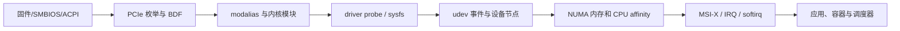
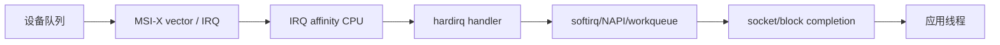

# 内核、硬件拓扑与中断命令导读

服务器里“有一张卡”至少包含五层事实：固件描述了插槽和平台，PCIe 总线枚举出 function，内核为 function 匹配驱动，udev 根据事件建立用户空间设备对象，进程最终通过 IRQ、DMA 和 NUMA 内存使用它。任何一层异常，都可能表现为设备消失、驱动初始化失败、带宽下降或延迟抖动。



## 1. 五套对象不能混为一谈

| 层次 | 关键对象 | 主要证据 | 典型命令 |
|---|---|---|---|
| 运行内核 | release、config、taint、ring buffer | `/proc`、`/sys`、journal | `uname`、`dmesg` |
| 内核模块 | `.ko`、alias、dependency、parameter、signature | `/lib/modules/$(uname -r)`、`/proc/modules` | `lsmod`、`modinfo`、`modprobe`、`depmod` |
| 硬件与总线 | SMBIOS record、PCI domain/bus/device/function、capability | DMI、PCI config space、sysfs | `lspci`、`setpci`、`dmidecode`、`lshw` |
| 设备管理 | kernel device、uevent、udev rule/property/node | `/sys/devices`、udev database | `udevadm` |
| 拓扑和执行 | NUMA node、CPU mask、scheduler policy、IRQ vector | sysfs/procfs、hwloc | `numactl`、`numastat`、`taskset`、`chrt`、`lsirq`、`irqtop`、`lstopo` |

`lspci` 看见设备，只证明 PCI function 已被枚举；不证明驱动绑定、固件加载、字符设备存在或业务健康。`lsmod` 看见模块，也不证明它已绑定目标 BDF。生产排障必须把 BDF、driver symlink、module、device node、NUMA node 和应用 PID 串在一起。

## 2. 本批 20 个命令

| 阶段 | 命令 | 学习目标 |
|---|---|---|
| 内核身份与证据 | `uname`、`dmesg` | 固定运行内核、架构、boot 与错误时间线 |
| 模块生命周期 | `lsmod`、`modinfo`、`modprobe`、`insmod`、`rmmod`、`depmod` | 区分已加载、可加载、依赖索引、参数、签名和危险强制操作 |
| PCIe 与硬件 | `lspci`、`setpci`、`dmidecode`、`lshw`、`udevadm` | 从固件资产到 PCI function、驱动绑定和 udev 事件 |
| NUMA 与调度 | `numactl`、`numastat`、`taskset`、`chrt` | 观察和约束 CPU、内存位置与调度策略 |
| IRQ 与联合拓扑 | `lsirq`、`irqtop`、`lstopo` | 观察 IRQ 分布，并串联 CPU、NUMA、PCIe、GPU 和 NIC |

[`lscpu`](../05-cpu-memory-load-proc/03-lscpu命令详解.md) 已在 CPU 模块完整讲解，本批直接复用。网卡队列、RSS/RPS/XPS 与 coalescing 复用[网络命令参考库](../../../networking/commands/00-网络命令参考库学习路线.md)的 `ethtool`、`ip` 和 `tc`；NVMe 复用[存储命令参考库](../../../storage/commands/00-存储命令参考库学习路线.md)。

## 3. PCIe 地址与拓扑

PCI BDF 写作 `domain:bus:device.function`，例如 `0000:65:00.0`。domain、bus、device 和 function 都是十六进制。Bridge 会创建下游 bus；PCIe switch 本质上是多端口 bridge 结构。`lspci -Dtv` 适合观察树，`lspci -Dnnk -s BDF` 适合把稳定数字 ID 和驱动绑定放到一起。

```bash
lspci -Dtv
lspci -Dnnk -s 0000:65:00.0
readlink -f /sys/bus/pci/devices/0000:65:00.0/driver
cat /sys/bus/pci/devices/0000:65:00.0/numa_node
cat /sys/bus/pci/devices/0000:65:00.0/local_cpulist
```

`LnkCap` 是能力上限，`LnkSta` 是当前协商；速度/宽度低于设计值可能来自插槽 lane、switch 上联、BIOS、线缆/转接、链路训练、节能或硬件故障。必须比较链路两端和资产设计，不能仅凭一行 `Speed` 归因。

## 4. 模块加载不是文件复制

```text
设备产生 modalias
→ modprobe 根据 modules.alias 找候选模块
→ 读取 modprobe.d 的 options/blacklist/install
→ 根据 modules.dep.bin 先加载依赖
→ 内核校验签名、vermagic、symbol version
→ 模块 init 注册 driver
→ driver 与 device ID 匹配并 probe
```

`insmod` 直接插入指定 `.ko`，不解决依赖和配置；日常使用 `modprobe`。`modprobe -f`、`insmod -f`、`rmmod -f` 会绕过保护，可能内存损坏、崩溃或数据丢失，不属于正常故障处理手段。

## 5. NUMA 与调度是两种约束

CPU affinity 决定线程可在哪些逻辑 CPU 运行；memory policy 决定页优先/必须/交错在哪些 NUMA node 分配。二者独立，且还受 cpuset cgroup、CPU quota、online CPU、automatic NUMA balancing 和 page migration 影响。

```text
应用 CPU mask ∩ cpuset effective CPU ∩ online CPU = 实际可运行 CPU
进程 memory policy ∩ cpuset effective mems ∩ online node = 实际可分配 node
```

`taskset` 成功只表示 mask 被接受，不保证线程立即迁移或独占 CPU；`numactl --membind` 可能因目标 node 内存不足让分配失败；`chrt` 实时策略错误会饿死系统线程。调优必须先观察、受控实验、验证 tail latency 和回滚。

## 6. IRQ 路径

现代高速设备通常使用 MSI-X，为多个队列分配多个 vector。硬中断只是入口，网络/块 I/O 大量工作会在 NAPI/softirq、workqueue 或应用线程继续执行。



所以“IRQ 分布均匀”不等于数据路径最优。还要检查 NUMA locality、NIC RSS、RPS/XPS、应用绑核、isolcpus/nohz_full、irqbalance 策略及跨 socket 流量。

## 7. 标准硬件故障排查

```bash
date -Ins
uname -a
dmesg --level=emerg,alert,crit,err,warn --time-format iso --nopager
lspci -Dnnk
lsmod
numactl --hardware
lscpu -e=CPU,NODE,SOCKET,CORE,ONLINE
lsirq --output IRQ,TOTAL,NAME
```

1. 固定 boot、内核 release、节点和变更时间。
2. 对照资产基线核对设备数量、稳定 ID 和 BDF。
3. 查 AER、IOMMU、driver probe、firmware、reset、timeout、MCE/EDAC 日志。
4. 从 BDF 追到 driver/module/udev node，而不是只看单个命令。
5. 核对 PCIe 当前链路、NUMA node、local CPU、IRQ 和应用线程。
6. 区分枚举、驱动、设备节点、数据面和调度五层故障。
7. 只在隔离/维护窗口做 reload、unbind、register write 或实时调度实验。

## 8. 容器、虚拟机与 Kubernetes 边界

- 容器共享宿主内核，`uname` 显示宿主内核；模块和 PCI config 通常由节点管理。
- 容器的 `/proc/interrupts`、sysfs、DMI 和 udev 可能不可见或被过滤；不要据此判断宿主硬件消失。
- 虚拟机看到的是 hypervisor 暴露的 vCPU、vNUMA 和虚拟/直通 PCI function；DMI 字段可能是模板值。
- Kubernetes 的 CPU Manager、Topology Manager、Device Plugin/DRA、cpuset 和 runtime capability 决定 Pod 视角；节点命令与容器命令要分别记录。
- SR-IOV VF、GPU MIG 与 mediated device 是派生资源，必须保留 PF/BDF/IOMMU group/NUMA 的父子映射。

## 9. 实验与验收

使用可快照、带多 NUMA node 或虚拟 PCI 设备的 VM；模块加载实验使用无业务依赖的测试模块，PCI 配置仅做读取和 `setpci -D` demo，实时调度设置明确超时与控制台回滚。不得在生产 GPU/NIC/NVMe 上练卸载驱动或配置空间写入。

掌握标准：能从 `uname/dmesg` 固定内核现场；能解释 module alias/dependency/signature/probe；能从 BDF 追到 driver、NUMA 与 IRQ；能区分 CPU affinity、memory policy 和调度策略；能为 GPU/NIC/NVMe 性能问题画出 PCIe→NUMA→IRQ→应用链路。

## 官方参考

- [Linux kernel documentation](https://docs.kernel.org/)
- [kmod project](https://github.com/kmod-project/kmod)
- [PCI utilities](https://mj.ucw.cz/sw/pciutils/)
- [The Linux PCI subsystem](https://docs.kernel.org/PCI/)
- [NUMA memory policy](https://docs.kernel.org/admin-guide/mm/numa_memory_policy.html)
- [IRQ affinity](https://docs.kernel.org/core-api/irq/irq-affinity.html)

下一篇：[`uname` 命令详解](./01-uname命令详解.md)
