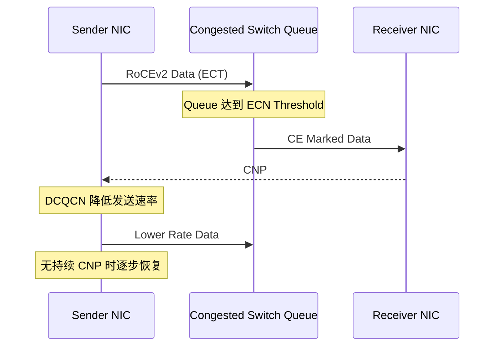

# ECN、CNP 与 DCQCN 拥塞控制

PFC 在缓冲接近危险水位时暂停上游；ECN/DCQCN 的目标是更早把拥塞反馈给发送端，
让源端降速。健康设计通常希望 ECN 经常承担调节，而 PFC 只处理难以完全避免的瞬时突发。

## 1. 闭环



三个角色：

- 交换机：在拥塞 Queue 上标记 CE；
- 接收 NIC：看到 CE 后生成 CNP；
- 发送 NIC：根据 CNP 和算法调整速率。

## 2. ECN 位

IP ECN 字段有 ECT/CE 等状态。发送端必须发出可 ECN 标记的报文，交换机才可把它标为 CE；
不支持 ECN 的流量通常仍按普通丢弃策略处理。

检查抓包：

```text
发送数据是否 ECT
拥塞点之后是否出现 CE
CNP 是否从接收端返回发送端
```

## 3. 交换机标记

常见 Profile 按 Queue 水位设置：

- `Kmin`：开始概率标记；
- `Kmax`：达到更高标记概率/全部标记；
- `Pmax`：概率上限；
- 或按绝对阈值、动态阈值等 ASIC 模型。

概念：

```text
Queue < Kmin       不标记
Kmin～Kmax         按概率增加标记
Queue ≥ Kmax       高概率或全部标记
```

具体语义、单位和动态 Buffer 关系依赖交换芯片。使用厂商推荐起点，再用真实突发验证。

## 4. DCQCN 的发送端行为

DCQCN 面向 RoCEv2 数据中心量化拥塞通知，核心行为是：

- 收到 CNP 后降低发送速率；
- 维护目标/当前速率；
- 在一段无拥塞反馈后逐步恢复；
- 平衡快速响应与稳定利用。

算法参数通常由 NIC 驱动/固件配置。参数过激会导致带宽锯齿和利用率低，过缓会让队列持续高水位、
触发 PFC 或丢包。

## 5. CNP 返回路径

CNP 必须及时回到发送端：

- 路由可达；
- QoS 分类正确；
- 不被拥塞数据 Queue 长时间阻塞；
- 不被 ACL/策略误丢；
- 两端 NIC 支持并启用相应拥塞控制；
- 多 Rail 时返回到正确设备/连接。

有 CE 无 CNP：检查接收 NIC；
有 CNP 但发送速率不变：检查发送 NIC 的 DCQCN/固件/统计。

## 6. ECN 与 PFC 阈值关系

理想顺序：

```text
Queue 开始上升
→ ECN 开始标记
→ Sender 收到 CNP 并降速
→ Queue 下降
→ 不触发 PFC
```

若突发过快或反馈 RTT 较长：

```text
Queue 继续上升
→ 达到 Xoff
→ PFC 作为最后保护
```

因此 ECN Threshold 要给反馈闭环留出时间和 Buffer。过高会来不及降速，过低可能频繁限速、降低利用率。

## 7. RTT 与拓扑

从标记到发送端降速存在闭环延迟：

```text
拥塞点→接收端数据传播
+ 接收端生成 CNP
+ CNP 返回发送端
+ NIC 处理和新速率生效
```

Fabric 跳数、线缆、队列和 CNP 调度都会改变延迟。不能为单交换机实验和多级 Clos 使用完全相同阈值而不验证。

## 8. 关键指标

### 交换机

- ECN Marked Packets；
- Queue Current/Max；
- PFC Tx/Rx Frames 与 Duration；
- Buffer Discard；
- 每 TC 吞吐。

### 接收 NIC

- 收到 CE/拥塞相关计数；
- 生成/发送 CNP；
- RoCE RX Packet/Error。

### 发送 NIC

- 收到 CNP；
- Congestion/Rate Reduction；
- Retransmission；
- 每 QP/TC 吞吐（平台支持时）。

### 应用

- perftest 时延/吞吐抖动；
- NCCL P95/P99；
- 训练 Step Time。

## 9. 判断模式

| 现象 | 含义 |
|---|---|
| 队列低、无 ECN/PFC | 可能无拥塞 |
| ECN/CNP 增加、PFC 很少 | 拥塞控制在提前调节 |
| ECN 高且 PFC 持续 | 容量不足、阈值或闭环有问题 |
| 队列高但无 ECN | 分类/Profile/ECT 错误 |
| CE 有、CNP 无 | 接收端配置/计数/生成问题 |
| CNP 有、源端不降速 | 发送 NIC DCQCN/固件问题 |
| 无 ECN但有丢包 | 流量未进入目标 Queue、阈值过高或 Lossy 路径 |

## 10. 调优方法

1. 固定拓扑、消息矩阵和背景流量。
2. 保存交换机/NIC 参数与计数基线。
3. 从厂商推荐 Profile 起步。
4. 只调整一个变量或一组强相关阈值。
5. 同时观察 Queue、ECN、CNP、PFC、吞吐和 P99。
6. 测短突发、持续负载、Incast 和 N-1 故障。
7. 观察恢复过程，防止速率长期过低或振荡。
8. 记录硬件、固件和驱动版本。

## 11. 实验

在隔离 RoCE Fabric 中：

1. 单流不拥塞，验证无异常标记。
2. 多发送端制造 Incast。
3. 观察 Queue→ECN→CNP→发送速率变化。
4. 临时把 ECN 阈值调得过高，观察 PFC/丢包增加。
5. 临时把阈值调得过低，观察吞吐和 CNP。
6. 恢复合理 Profile，验证 P99 和利用率。
7. 断开一条 ECMP 链路，测试 N-1 突发。

## 12. 掌握标准

能够从 Queue 水位开始，证明哪台交换机标记 CE、哪张接收 NIC 产生 CNP、哪张发送 NIC
执行降速；能解释 ECN 与 PFC 阈值为什么必须协同，而不是独立复制默认值。

## 参考资料

- [RFC 3168：Explicit Congestion Notification](https://www.rfc-editor.org/rfc/rfc3168)
- [NVIDIA RoCE Counters](https://docs.nvidia.com/networking/display/nvidiaonyxusermanualv3104006/roce%2Bcommands)
