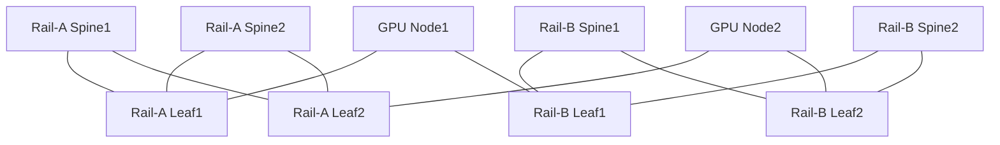

# 2 Spine + 4 Leaf AI Fabric 综合项目

本项目验收第二阶段。重点是从通信需求推导 Fabric，而不是复制某厂商“一键 RoCE”模板。

## 1. 需求

- 4 台 GPU 节点，每台 2 GPU、2×100G/200G/400G RDMA NIC；
- Rail-A 和 Rail-B；
- 每个 Rail 2 Leaf + 2 Spine（可用虚拟简化控制面，但无损数据面需真实硬件）；
- RoCEv2 L3 ECMP；
- Compute 与 Management 隔离；
- 单链路故障后训练可按设计失败或降级；
- 普通 TCP/存储流量不能进入 RoCE Lossless Queue；
- 有 PFC、ECN、CNP、Queue 和 NCCL 可观测性。

## 2. 逻辑拓扑



## 3. 设计交付

### 地址与路由

- Loopback/P2P 地址；
- BGP/OSPF/IS-IS 方案；
- ECMP 下一跳数量；
- RoCE GID/IP；
- MTU；
- Rail VRF/路由域；
- 管理面路径。

### 容量

```text
每节点下联:
每 Leaf下联/上联:
正常收敛比:
N-1 收敛比:
每 Rail 理论/目标有效带宽:
允许 Step Time 降级:
```

### QoS

| 流量 | DSCP/PCP | Priority/TC | Queue | PFC | ECN | 调度 |
|---|---|---|---|---|---|---|
| RoCE Data | 自行设计 |  |  |  |  |  |
| CNP | 自行设计 |  |  |  |  |  |
| Control |  |  |  |  |  |  |
| Best Effort |  |  |  |  |  |  |

数值不能照搬示例，要基于设备支持与实验。

## 4. 部署顺序

1. 验证线缆、Speed、FEC、PCIe 和 MTU。
2. 建立每 Rail Underlay 和 ECMP。
3. 验证 RoCEv2 IP/GID 与 Host RDMA。
4. 建立端到端 QoS 映射。
5. 配置 ECN/DCQCN。
6. 计算并配置 PFC Headroom/Xoff/Xon。
7. 验证单流和多流。
8. 验证 GPU Memory RDMA。
9. 验证 NCCL Collective。
10. 加入监控和故障演练。

每一步通过后再进入下一步。

## 5. 测试矩阵

| ID | 场景 | 预期 |
|---|---|---|
| T01 | 每 Rail Host RDMA 单流 | 达到同类节点基线 |
| T02 | 近端 GPU-NIC GDR | 路径和性能符合基线 |
| T03 | 双 Rail NCCL AllReduce | 两 Rail 都有流量 |
| T04 | NCCL All-to-All | 无持续热点/异常 PFC |
| T05 | TCP 背景流 | 不进入 Lossless Queue |
| T06 | 多发送端 Incast | ECN/CNP 先响应，PFC 可控 |
| T07 | 单上联故障 | ECMP 收敛，性能符合 N-1 设计 |
| T08 | 单 Rail 故障 | 作业行为符合定义 |
| T09 | Checkpoint + NCCL | 隔离与 SLO 符合设计 |
| T10 | 最大消息持续负载 | 无错误/丢弃，P99 稳定 |

## 6. 故障注入

必须完成：

1. 一跳 DSCP Trust 错误；
2. 一端 PFC Priority 错误；
3. ECN Threshold 过高；
4. 接收链路降速；
5. 单 ECMP 上联断开；
6. Rail 接线错误；
7. 路径 MTU 不一致；
8. GPU/NIC 远端 NUMA；
9. NCCL 错选管理网；
10. 背景存储流进入错误 Queue。

每个故障保留：

```text
用户症状
最早异常指标
影响范围
分层证据
根因
恢复
防复发检查
```

## 7. 观测大盘

必须能按 Node、NIC、Switch、Port、Queue、Priority、Rail、Job 查看：

- Link State/Speed/Error；
- 吞吐；
- Queue Watermark；
- ECN Mark；
- CNP；
- PFC Frames/Duration；
- No-buffer Discard；
- RDMA Retry/Error；
- NCCL P95/P99；
- 训练 Step Time。

## 8. 安全要求

- 不在生产 Fabric 制造 Storm；
- 管理连接与测试数据面隔离；
- 所有配置有前后快照；
- PFC/ECN 变更按单端口/单 Rail 灰度；
- 明确停止和回滚；
- 测试工具限制目标和持续时间；
- 实验结束清理临时路由/QoS。

## 9. 项目仓库

```text
ai-fabric-lab/
├── requirements.md
├── topology/
├── addressing/
├── qos/
├── configs/
├── baselines/
│   ├── perftest/
│   └── nccl-tests/
├── telemetry/
├── failure-drills/
└── acceptance.md
```

## 10. 最终验收

能够：

- 从作业通信矩阵推导端口和容量；
- 解释每个 QoS/PFC/ECN 参数服务的队列；
- 证明双 Rail 的 GPU/NIC/交换路径；
- 在 Incast 中展示 Queue→ECN→CNP→PFC 时间线；
- 在单链路/单 Rail故障后量化性能与影响；
- 用分层证据定位 10 个注入故障。

完成后进入 Kubernetes 和生产运维阶段。
