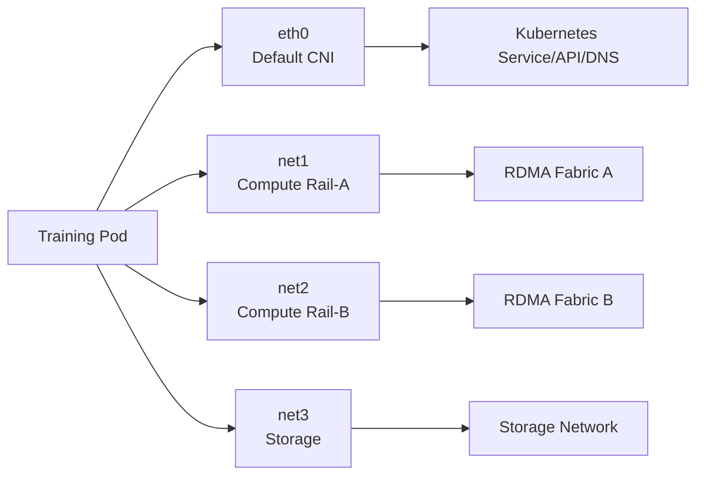

# Kubernetes AI 多网络架构

普通 Pod 通常只有默认网络接口 `eth0`。AI 训练可能还需要 Compute Rail、Storage 和
Management 网络。Multus 作为 Meta CNI 调用其他 CNI，为 Pod 附加额外接口。

## 1. 数据面



默认网络通常承载：

- Kubernetes Service；
- DNS；
- 控制面、日志和普通应用通信。

辅助网络通常承载：

- RoCE/InfiniBand；
- SR-IOV VF；
- Macvlan/Host Device；
- Storage 等专用平面。

## 2. Multus 的职责

Multus 不直接实现所有数据面，它根据 Pod Annotation/声明：

1. 先调用默认 CNI；
2. 读取 NetworkAttachmentDefinition（NAD）；
3. 调用对应辅助 CNI；
4. 把额外接口加入 Pod Network Namespace；
5. 记录网络状态。

因此故障可能位于 Multus、NAD、具体 CNI、IPAM、Device Plugin 或底层 NIC。

## 3. NetworkAttachmentDefinition

概念示例：

```yaml
apiVersion: k8s.cni.cncf.io/v1
kind: NetworkAttachmentDefinition
metadata:
  name: compute-rail-a
  namespace: ai
spec:
  config: |
    {
      "cniVersion": "0.3.1",
      "type": "macvlan",
      "master": "ens5f0np0",
      "mode": "bridge",
      "ipam": {
        "type": "whereabouts",
        "range": "10.100.0.0/24"
      }
    }
```

版本、CNI 类型和参数以当前组件文档为准。不要直接在生产复制示例地址和接口名。

Pod 请求：

```yaml
metadata:
  annotations:
    k8s.v1.cni.cncf.io/networks: ai/compute-rail-a
```

若同时需要多个 Rail，应为每个接口定义明确名称、资源和路由。

## 4. 接口与 RDMA 资源是两件事

Pod 有 `net1` 不等于拥有 RDMA Device；请求 RDMA Extended Resource 也不等于接口已配置。

完整路径通常需要：

```text
Multus/NAD
→ CNI 创建/移动接口
→ Device Plugin 分配 RDMA/PF/VF 资源
→ 容器权限和设备文件
→ 驱动/rdma-core
→ GID/IP/Route
```

二者的资源名和选择器必须指向同一物理设备/网络。

## 5. IPAM

常见方式：

- Whereabouts 等集群范围 IPAM；
- DHCP；
- Static（实验/严格管理场景）；
- 云/平台专用 IPAM；
- IPoIB 相关插件。

设计：

- 每 Rail CIDR 是否独立；
- IP 是否在节点重启后释放；
- 重复地址检测；
- Prefix 与路由传播；
- IPv4/IPv6；
- IPAM 数据库故障；
- SoT 与实际分配对账。

## 6. 路由

辅助 CNI 可能添加连接路由或默认路由。多个 Default Route 会让 Bootstrap、存储或监控走错接口。

Pod 内检查：

```bash
ip -br link
ip -br addr
ip route
ip rule
ip route get <peer>
```

通常应让默认网络保留默认路由，Compute Rail 使用明确 Prefix 路由；具体取决于平台。

## 7. MTU

逐层检查：

```text
Pod Interface
→ VF/PF/Macvlan
→ Host Netdev/VLAN
→ ToR
→ Fabric
→ Remote Pod
```

默认 CNI Overlay 的 MTU 与辅助 RoCE 网络 MTU 可以不同。不要从 `eth0` 的 MTU 推断 `net1`。

## 8. DNS 与 Service

Kubernetes Service/DNS 主要基于默认网络。辅助接口不会自动：

- 出现在 Service Endpoint 的目标路径；
- 获得 NetworkPolicy 保护；
- 注册独立 DNS；
- 选择为 NCCL Bootstrap/Data Interface。

需要明确训练框架用哪个地址交换 Rank，以及 NCCL 用哪个 HCA/接口。

## 9. NetworkPolicy 边界

许多默认 CNI 的 NetworkPolicy 只管默认网络，不一定覆盖 Multus 辅助网络。RDMA Fabric 的隔离可能依赖：

- VLAN/VRF/PKey；
- 交换 ACL；
- SR-IOV VF/硬件策略；
- Node/Namespace Admission；
- 作业资源权限。

在安全设计中明确每个接口由谁实施策略。

## 10. Pod 验证

```bash
kubectl describe pod <pod>
kubectl get network-attachment-definitions -A
kubectl get pod <pod> -o yaml
kubectl exec <pod> -- ip -br addr
kubectl exec <pod> -- ip route
kubectl exec <pod> -- rdma link show
kubectl exec <pod> -- ibv_devices
```

同时检查 Node：

- Multus/CNI 日志；
- Kubelet Event；
- Device Plugin Registration；
- PF/VF/Netdev；
- Network Namespace；
- IPAM 分配。

## 11. 常见故障

| 现象 | 优先检查 |
|---|---|
| Pod 卡在 ContainerCreating | Multus/CNI/IPAM/Device Plugin Event |
| 有 net1 无 RDMA Device | Extended Resource 和设备挂载 |
| 有 RDMA Device 无 IP | NAD/CNI/IPAM |
| Pod 间 ping 通，RDMA 不通 | GID、RDMA Namespace、QoS |
| Bootstrap 走 Compute 网 | Default Route/接口选择 |
| 重建 Pod 后 IP 冲突 | IPAM 释放与状态 |
| NetworkPolicy 无效 | 辅助网络是否受默认 CNI 管理 |

## 12. 实验

1. 部署默认 CNI 与 Multus。
2. 创建 Rail-A/Rail-B 两个 NAD。
3. Pod 请求两个辅助接口。
4. 验证接口名、IP、路由和 MTU。
5. 验证 RDMA Device/Netdev 映射。
6. 删除并重建 Pod，检查 IPAM 释放。
7. 故意写错 Master/Resource，观察 Event 和日志。
8. 验证默认 NetworkPolicy 是否覆盖辅助网络。

## 13. 掌握标准

能够把 Pod 的每张接口映射到 NAD、CNI、IPAM、Device Plugin、Host NIC 和 Fabric；
能解释为什么“Pod 有第二张网卡”不等于“Pod 已获得可用 RDMA”。

## 参考资料

- [Multus CNI](https://github.com/k8snetworkplumbingwg/multus-cni)
- [NVIDIA Network Operator](https://docs.nvidia.com/networking/display/kubernetes2640/)
