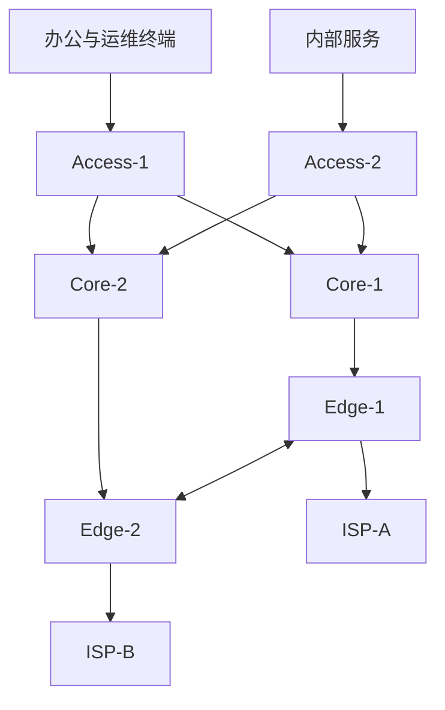

# 综合项目：双出口企业网络从规划到故障演练

## 1. 项目目标

构建一个可重复的实验网络，把第一阶段知识连接起来：



工具可选择 EVE-NG、containerlab、GNS3 或真实实验设备。路由示例优先使用 FRRouting；
交换和防火墙能力可根据实验平台替换。

## 2. 业务需求

### 网络区域

| 区域 | VLAN | 示例前缀 | 策略 |
| --- | ---: | --- | --- |
| 办公网 | 10 | `10.10.10.0/24` | 可访问互联网和指定内部服务 |
| 运维网 | 20 | `10.10.20.0/24` | 可管理网络设备，不允许普通办公终端进入 |
| 服务网 | 30 | `10.10.30.0/24` | 仅开放 DNS、HTTP/HTTPS 等必要端口 |
| DMZ | 40 | `10.10.40.0/24` | 发布公网服务，与内部网最小权限互通 |
| Transit | - | `/31` 或 `/30` | 仅用于三层设备互联 |

### 可用性

- 任意一条 Access 上联断开不影响同区域业务。
- 任意一个 ISP 断开后，互联网访问在目标时间内恢复。
- 路由环路、默认路由黑洞和错误路由泄漏必须被策略阻断。
- 管理和业务流量具有独立观测与访问控制。

## 3. 地址与路由规划

交付一份 IPAM 表：

```text
Prefix
用途
VRF/区域
网关
DHCP/静态范围
汇总边界
负责人
状态
```

路由设计：

- Access/Core 二层：明确 Root、备根或 MLAG 方案。
- Core/Edge 三层：使用 OSPF Area 0。
- Edge/ISP：使用 eBGP。
- 内部默认路由由 Edge 注入，但需跟踪真实出口状态。
- 只向 ISP 通告项目分配的实验公网前缀。

## 4. 实施阶段

### 阶段 A：二层

1. 创建 VLAN 与 Trunk。
2. 配置网关冗余或明确单网关故障边界。
3. 设置 STP Root/Backup、Edge、BPDU Guard。
4. 配置服务器或交换上联 LACP。

验证：

```text
VLAN 成员
STP Root 与端口角色
LACP Actor/Partner
MAC 学习
链路故障后的收敛
```

### 阶段 B：内部三层

1. 为 Core/Edge 互联分配点到点前缀。
2. 配置 OSPF、Router ID 和被动接口。
3. 根据平台能力启用适当 BFD。
4. 验证 LSDB、RIB、FIB 与 ECMP。

### 阶段 C：双出口 BGP

1. 与 ISP-A/ISP-B 建立 eBGP。
2. 用精确 Prefix List 限制出站。
3. 用 Local Preference 设计主/备或按业务出口。
4. 设计入站 Prepend/Community，仅作为实验验证。
5. 配置最大前缀和告警。

### 阶段 D：安全与 NAT

1. 建立默认拒绝、按业务放行策略。
2. 办公网使用 SNAT/PAT 访问互联网。
3. DMZ 服务使用 DNAT 发布。
4. 允许 Established/Related 返回流量。
5. 记录规则命中、Conntrack 和端口使用。

## 5. 可观测性

至少采集：

- 接口状态、带宽、错误、丢弃。
- STP/LACP 状态。
- OSPF/BGP 邻居和前缀数。
- 默认路由与关键业务前缀。
- NAT/Conntrack 使用率与分配失败。
- DNS、HTTP 合成探测。
- 端到端丢包、延迟和切换时间。

告警必须关联 Runbook，而不是只写“BGP Down”。

## 6. 故障演练矩阵

| 编号 | 故障 | 预期保护 | 关键证据 |
| --- | --- | --- | --- |
| F1 | Access 一条上联断开 | LACP/STP 收敛 | 成员、端口角色、丢包窗口 |
| F2 | OSPF 邻居 MTU 不一致 | 告警且不错误安装路由 | 邻居状态、日志、LSDB |
| F3 | ISP-A 物理断开 | 切换 ISP-B | BFD/BGP、默认路由、业务探测 |
| F4 | ISP-A 上游黑洞但接口 Up | 条件默认/BFD/探测处理 | 路由仍在与业务失败的差异 |
| F5 | 出站 Prefix List 被放宽 | 策略检查阻断 | 候选配置 Diff、通告前缀 |
| F6 | NAT 映射逼近上限 | 容量告警与限流 | Conntrack、端口、失败率 |
| F7 | 服务网返回路由删除 | 双向探测发现 | 请求到达、响应路径缺失 |
| F8 | PMTU ICMP 被过滤 | 大包探测告警 | 小包/大包对比、抓包 |

所有演练必须在隔离实验中进行。

## 7. 验收指标

不要预设一个与平台无关的“标准秒数”。先定义目标，再实测：

```text
链路故障检测 P95
控制面收敛 P95
FIB 生效 P95
业务恢复 P95
演练期间最大连续丢包
错误路由是否被护栏阻断
告警是否在规定时间送达
```

## 8. 项目交付物

- 高层与低层拓扑图。
- IP/VLAN/ASN/接口/策略清单。
- 配置模板和版本锁定信息。
- 正常状态基线快照。
- 自动验证脚本或命令清单。
- 八类故障演练记录。
- 回滚方案。
- 项目复盘：哪些假设错误、哪些观测缺失。

## 9. 毕业答辩问题

1. 办公网访问公网服务时，每一跳的源/目的 MAC、IP、端口如何变化？
2. 主 ISP 接口 Up 但上游黑洞时，为什么普通接口检测无法切换？
3. BGP 路由存在但业务不通，如何证明问题位于 FIB、NAT 或返回路径？
4. 一条 LACP 成员损坏为什么只影响部分五元组？
5. 如何证明 DMZ 无法主动访问运维网？
6. 如果自动化误发布 `0.0.0.0/0`，哪一道护栏应最先阻断？

能用实际状态和抓包回答，而不是只描述配置，才算完成第一阶段。

[进入第二阶段：数据中心与云网络 →](../PartII-数据中心与云/00-第二阶段学习路线.md)
