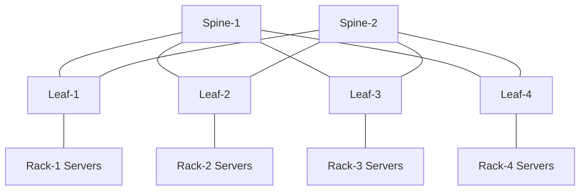

# Clos 与 Spine-Leaf 数据中心架构

## 1. 数据中心网络解决的问题

传统园区网络常按接入、汇聚、核心分层，链路可能依赖 STP 阻塞。现代数据中心更关注：

- 大量服务器之间的东西向流量。
- 任意机架之间相对稳定的跳数和带宽。
- 多条并行路径同时转发。
- 通过增加 Leaf/Spine 水平扩展。
- 单设备或单链路故障不形成大范围故障域。

Clos 不是某个协议，而是一类多级交换拓扑。Spine-Leaf 是常见的两级 Clos 实现。

## 2. 基本拓扑



设计原则：

- 每台 Leaf 连接每台 Spine。
- Leaf 之间通常不直接互联。
- Spine 之间通常不直接互联。
- 服务器接入 Leaf，Border Leaf 连接外部网络。
- Leaf 到 Spine 运行三层 Underlay，并通过 ECMP 使用全部上联。

任意不同 Leaf 下服务器的路径通常是：

```text
Server → Leaf → Spine → Leaf → Server
```

这使跨机架路径长度稳定。

## 3. 为什么不依赖 STP

Leaf-Spine 上联使用三层点到点网络：

- 不形成传统二层环路。
- 每条链路都可进入 ECMP。
- 故障由路由协议撤销，而不是等待 STP 重新生成树。
- 二层租户网络如需跨 Leaf，由 VXLAN Overlay 承载。

二层范围被限制在服务器接入和 Overlay 逻辑广播域，Underlay 本身保持纯三层。

## 4. 交换芯片 Radix 决定规模

交换机端口数有限。假设 Leaf 有 64 个同速端口：

- 32 个连接服务器。
- 32 个连接 Spine。

最多可连接 32 台 Spine；若每台 Leaf 都接所有 Spine，Fabric 规模受 Leaf 上联端口、
Spine 下联端口和布线共同限制。

不能只问“有多少台交换机”，要问：

```text
Leaf 下行端口数
Leaf 上行端口数
Spine 可连接 Leaf 数
每端口速率
光模块与布线数量
功耗、空间和故障域
```

## 5. Oversubscription

超售比常用近似：

```text
Oversubscription = 服务器侧总带宽 / Fabric 上联总带宽
```

例：

```text
48 × 25G 下行 = 1200G
8 × 100G 上行 = 800G
超售比 = 1.5:1
```

注意：

- 端口标称带宽不等于真实可用吞吐。
- 单流受 ECMP 哈希限制。
- 业务流量不一定同时满载。
- East-West、North-South、存储、训练通信的峰值分布不同。
- 故障后剩余容量必须重新计算。

AI 训练或高性能存储网络通常比普通业务网络更关注低超售甚至无阻塞设计。

## 6. 无阻塞不等于无拥塞

“1:1 上下行”只说明理论端口容量：

- 多个入口仍可能同时冲向同一个出口。
- 微突发可以在很短时间填满交换机队列。
- ECMP 哈希可能倾斜。
- 接收端速率低于发送端聚合速率。
- Pause/PFC、ECN 或丢包行为仍需设计。

网络无拥塞需要业务流量模型、缓冲、队列和拥塞控制共同满足。

## 7. 故障域

| 故障 | 影响 |
| --- | --- |
| 一条 Leaf-Spine 链路 | 对应 Leaf 少一条 ECMP 路径 |
| 一台 Spine | 所有 Leaf 同时少一部分 Fabric 容量 |
| 一台 Leaf | 其下单归属服务器或机架受影响 |
| Border Leaf | 外部/南北向流量受影响 |
| 控制面策略错误 | 可能跨多个设备传播，影响大于单硬件故障 |

Spine 故障看似“所有机架都受影响”，但只要容量规划正确，通常表现为容量下降而非
完全中断。验证必须在 N-1、N-2 场景重新计算超售和热点。

## 8. 服务器双归属

服务器可连接两台 Leaf：

- MLAG：两台 Leaf 对服务器呈现一个 LACP 系统。
- EVPN Multihoming：通过 ESI、DF 等标准控制面协调多归属。
- Active/Standby Bond：服务器侧只使用一条活动链路。
- 路由到主机：服务器与 Leaf 建立三层邻接或使用路由协议。

选择取决于服务器能力、故障收敛、运维复杂度和 Overlay 设计。

## 9. 设计输入

在画拓扑前收集：

### 业务

- 服务器数、NIC 数和速率。
- East-West/North-South 比例。
- 大象流、小流、微突发和集合通信。
- 单机架与跨机架流量。
- 延迟、丢包和恢复目标。

### 物理

- 端口 Radix、Breakout 能力。
- 光模块、光纤类型、距离和预算。
- FEC 模式、速率协商和兼容矩阵。
- 机柜、电力、散热和布线。

### 运维

- 设备升级故障域。
- 配置自动化和回滚。
- Telemetry、Flow、队列和光模块可观测能力。
- Spare、RMA 和版本生命周期。

## 10. 容量示例

需求：

```text
16 个机架
每机架 32 台服务器
每台双 25G
服务器侧按 50% 同时利用估算
N-1 Spine 后仍不超过 2:1
```

步骤：

1. 单机架总下行：`32 × 2 × 25G = 1600G`。
2. 50% 设计负载：`800G`。
3. 假设 8 条 100G 上联：正常上联 `800G`。
4. 若 4 台 Spine、每台承担 2 条 100G，失去一台后剩 `600G`。
5. N-1 超售：`800/600 = 1.33:1`。

还要验证故障流量能否均匀重哈希，以及某个热点目的是否造成局部拥塞。

## 11. 验证清单

- 每台 Leaf 是否连接全部 Spine，是否存在错误“跨级”链路。
- 所有上联 MTU、速率、FEC、地址和路由策略是否一致。
- ECMP 下一跳数量是否符合预期。
- 关闭每条链路和每台 Spine 时，FIB 与业务恢复时间。
- 单流/多流、同机架/跨机架、正常/N-1 的容量。
- 队列、Drop、ECN、Buffer 与接口利用率是否能观测。

## 12. 常见误区

- Spine-Leaf 天然无阻塞：取决于端口、超售和流量矩阵。
- 增加 Spine 一定提升单流带宽：单流通常仍哈希到一条路径。
- 所有 Leaf 完全相同：Border、Service、Storage Leaf 可能有不同角色。
- 设备冗余等于业务高可用：服务器、路由、负载均衡和应用也要冗余。
- 只按正常状态规划：维护和故障状态的剩余容量才决定生产可靠性。

## 参考资料

- [RFC 7938: Use of BGP for Routing in Large-Scale Data Centers](https://www.rfc-editor.org/rfc/rfc7938)
- [RFC 7690: Close Encounters of the ICMP Type 2 Kind](https://www.rfc-editor.org/rfc/rfc7690)

[下一篇：Underlay 路由设计与收敛 →](./02-Underlay路由设计与收敛.md)
