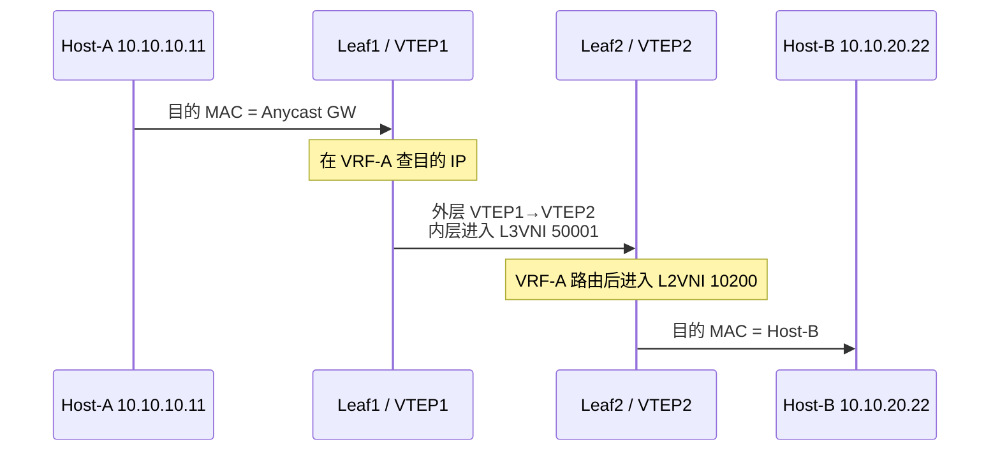

# EVPN 网关、BUM 与多归属

前一篇解决了“远端 MAC/IP 如何被控制面发现”。本篇继续回答三个生产问题：

1. 不同子网之间怎样跨 VTEP 路由？
2. 广播、未知单播和组播怎样送到其他 VTEP？
3. 一台服务器双归属两个 Leaf 时怎样避免环路并快速收敛？

## 1. L2VNI 与 L3VNI

| 对象 | 作用 | 类比 |
|---|---|---|
| L2VNI | 标识一个二层广播域 | VLAN 的跨 Fabric 延伸 |
| L3VNI | 标识一个租户 VRF 的三层传输域 | 租户专属的三层骨干 |
| SVI | VLAN 的三层网关接口 | 默认网关 |
| Anycast Gateway | 每个接入 Leaf 使用相同网关 IP/MAC | 网关跟随主机就近存在 |

示例：

```text
Tenant-A / VRF-A / L3VNI 50001
├── VLAN 100 / L2VNI 10100 / 10.10.10.0/24
└── VLAN 200 / L2VNI 10200 / 10.10.20.0/24
```

Anycast Gateway 的所有 Leaf 对 VLAN 100 使用相同网关 IP 和虚拟 MAC。主机迁移后无需重新学习另一个默认网关，第一跳路由始终在本地 Leaf 完成。

## 2. 对称 IRB 的数据包路径

主机 A 位于 Leaf1 的 VLAN 100，主机 B 位于 Leaf2 的 VLAN 200：



这叫 **对称 IRB**：入口和出口 VTEP 都执行一次三层转发，中间使用 L3VNI。每个 Leaf只需维护本地子网的二层信息和租户的三层可达性，规模更容易扩展。

非对称 IRB 通常让入口 VTEP完成全部三层路由，然后直接进入目标 L2VNI；结果是每个可能作为入口的 Leaf都需要实例化所有目标二层广播域。小规模可用，但大规模扩展和运维更困难。

### 排查对称 IRB 必看的表

```text
入口：本地 ARP/FDB → VRF 路由表 → EVPN Type 2/5 → L3VNI
Underlay：远端 VTEP loopback 路由 → ECMP → MTU
出口：L3VNI → 目标 L2VNI → 本地 ARP/FDB → 接口
```

## 3. BUM 流量

BUM 包括：

- Broadcast：例如 ARP Request；
- Unknown Unicast：FDB 没有目的 MAC；
- Multicast：二层组播。

常见承载方式：

### 3.1 Ingress Replication

入口 VTEP 根据 Type 3 IMET 路由维护远端 VTEP 列表，并为每个远端复制一份。

优点是 Underlay 不要求部署组播；缺点是同一个广播包要复制多次。设一个 VNI 有 `N` 个远端 VTEP，入口复制开销近似为 `N` 份。

### 3.2 Underlay Multicast

VNI 映射到 Underlay 组播组，由网络复制。它能减少入口 VTEP负担，但引入 PIM、IGMP、组播状态和更多排障面。

选择依据不是“哪个更先进”，而是 VTEP 数量、BUM 比例、硬件能力和团队对组播的运维能力。

### 3.3 为什么必须抑制不必要的 BUM

- 用 EVPN Type 2 的 MAC-IP 绑定做 ARP/ND Suppression；
- 对未知单播谨慎启用抑制或丢弃；
- 限制单个租户的广播速率；
- 优先用三层边界，避免无限扩大二层故障域。

## 4. EVPN Multihoming

服务器通过 LACP 双归属 Leaf1 和 Leaf2 时，EVPN 使用 ESI 标识这段共同以太网连接。

```text
                +-- Leaf1 / VTEP1 --+
Server -- LAG --|                    |-- Fabric
                +-- Leaf2 / VTEP2 --+
                       同一 ESI
```

关键机制：

| 机制 | 作用 |
|---|---|
| Type 4 ES Route | 发现同一 ESI 的其他 PE/VTEP |
| Type 1 A-D Route | 别名转发、标签通告和快速批量撤销 |
| DF Election | 指定谁向该以太网段转发 BUM，防止重复 |
| Split Horizon | 从该 ES 收到的流量不再发回同一 ES |
| Aliasing | 远端可把流量负载到同一 ES 的多个可用 VTEP |
| Mass Withdrawal | 接入故障时一次撤销该 ES 下的大量可达性 |

### 4.1 All-Active 与 Single-Active

- All-Active：多个 Leaf同时转发单播，常与 LACP 配合，带宽利用率高。
- Single-Active：只有一个 Leaf对该 ES 转发，适用于无法多活或需要单活语义的设备。

DF 主要约束从 Fabric 向多归属以太网段发送 BUM 的方向。不要错误地认为“非 DF 完全不转发业务”。

## 5. 两个典型故障

### 故障一：单播正常，ARP 偶发重复

检查顺序：

1. Type 3 IMET 远端列表是否重复或残留；
2. 同一 ESI 的 DF 结果是否一致；
3. Split Horizon 标签/行为是否正确；
4. 是否同时存在传统 MLAG 泛洪与 EVPN 多归属泛洪；
5. 主机 Bond/LACP 状态是否一致。

### 故障二：一条接入链路断开后大量主机长时间中断

检查：

- 故障是否被本地快速感知；
- Type 1 Per-ES A-D 是否撤销；
- 远端是否执行 Mass Withdrawal；
- Type 2 是否被错误地逐条等待老化；
- 剩余 Leaf是否有到服务器 LAG 的有效成员。

## 6. 验证清单

```bash
# Linux 接入和 VXLAN 状态
ip -d link show
bridge link show
bridge vlan show
bridge fdb show
ip neigh show

# FRR 控制面，具体命令随版本可能略有差异
vtysh -c 'show bgp l2vpn evpn route type multicast'
vtysh -c 'show bgp l2vpn evpn route type es'
vtysh -c 'show bgp l2vpn evpn route type prefix'
vtysh -c 'show evpn es'
vtysh -c 'show evpn vni'
```

抓包时同时解读：

1. 外层源/目的 VTEP；
2. UDP 目的端口 4789；
3. VXLAN VNI；
4. 内层源/目的 MAC；
5. 内层源/目的 IP；
6. 是否为 BUM 的多份复制。

## 7. 实验与掌握标准

搭建双 Leaf、一个 L2VNI、一个 L3VNI：

1. 验证同子网二层通信；
2. 增加第二子网，验证对称 IRB；
3. 清空 ARP/FDB，观察 Type 2、Type 3 和 BUM；
4. 将一台 Linux 主机以 Bond 双归属；
5. 断开一条成员链路，记录丢包数和控制面收敛证据；
6. 故意制造 VNI、RT、Anycast MAC 之一不一致并定位。

掌握不是会背术语，而是能从“主机 A 发出的第一帧”开始，解释入口路由、VNI 切换、远端解封装和出口二层转发，并说明多归属为什么不产生环路。

## 参考资料

- [RFC 7432：EVPN 与多归属机制](https://www.rfc-editor.org/rfc/rfc7432)
- [RFC 8365：EVPN Overlay](https://www.rfc-editor.org/rfc/rfc8365)
- [RFC 9135：Integrated Routing and Bridging in EVPN](https://www.rfc-editor.org/rfc/rfc9135)
- [RFC 9136：EVPN IP Prefix Advertisement](https://www.rfc-editor.org/rfc/rfc9136)
