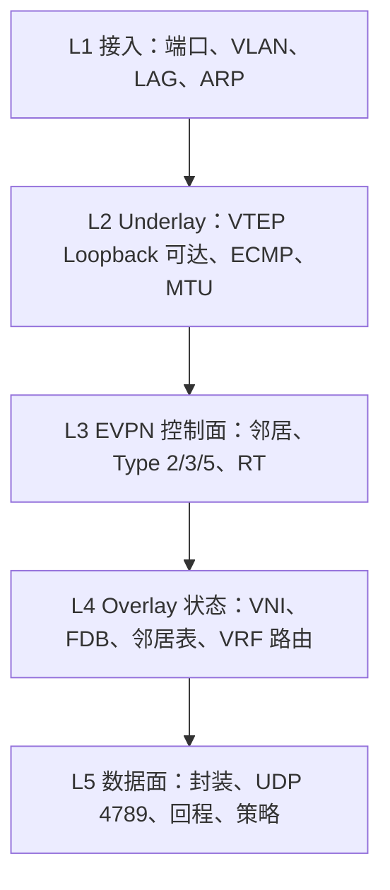

# VXLAN EVPN 分层故障排查

VXLAN EVPN 的难点不是命令多，而是同一个故障表象可能来自不同平面。最有效的方法是固定一条失败流量，再按层证明。

## 1. 先记录失败流

```text
源主机 / IP / MAC / 接入 Leaf / VLAN / VNI:
目的主机 / IP / MAC / 接入 Leaf / VLAN / VNI:
同子网还是跨子网:
协议和端口:
首次故障时间:
双向都失败还是单向失败:
最近变更:
```

不要从全网日志开始。先把问题缩小成一个明确五元组和一条预期路径。

## 2. 五层排障模型



### 第一层：主机与接入

检查：

```bash
ip addr
ip route
ip neigh
ethtool <interface>
bridge link show
bridge vlan show
```

要证明：

- 主机地址、掩码和默认网关正确；
- 接入口属于正确 VLAN；
- Bond/LACP 成员一致；
- Leaf 能学到本地主机 MAC/IP；
- 主机到本地 Anycast Gateway 正常。

如果同一 Leaf、同一 VLAN 的两台主机都不能通信，暂时不要追查 EVPN。

### 第二层：Underlay

```bash
ip route get <remote-vtep>
ping <remote-vtep>
traceroute <remote-vtep>
ping -M do -s <size> <remote-vtep>
vtysh -c 'show ip route <remote-vtep>'
```

要证明：

- 远端 VTEP Loopback 存在路由；
- 下一跳和 ECMP 成员有效；
- 双向均可达；
- 路径 MTU 容纳内层报文加 VXLAN/UDP/IP 头；
- BFD 或路由协议没有抖动。

### 第三层：EVPN 控制面

```bash
vtysh -c 'show bgp l2vpn evpn summary'
vtysh -c 'show bgp l2vpn evpn route'
vtysh -c 'show bgp l2vpn evpn route type macip'
vtysh -c 'show bgp l2vpn evpn route type prefix'
```

沿一条路由追踪：

```text
本地是否生成
→ RR 是否收到
→ 远端是否收到
→ RT 是否允许导入
→ 下一跳是否保留为正确 VTEP
```

“邻居 Established”只证明 BGP 会话正常，不能证明地址族激活、路由生成和 RT 导入正确。

### 第四层：Overlay 编程状态

```bash
ip -d link show type vxlan
bridge fdb show
ip neigh show
ip route show vrf <vrf-name>
vtysh -c 'show evpn vni'
```

核对四个映射：

```text
VLAN ↔ L2VNI
VRF  ↔ L3VNI
远端 MAC ↔ 远端 VTEP
远端 IP/前缀 ↔ 正确 VRF 下一跳
```

控制面 RIB 有路由但 FDB/内核路由没有，说明问题处在协议进程到硬件/内核的下发链路。

### 第五层：数据面

在入口和出口 VTEP 同时抓包：

```bash
tcpdump -ni any 'udp port 4789'
tcpdump -ni <access-interface> host <host-ip>
```

判断：

1. 内层包有没有到入口；
2. 入口有没有封装；
3. 外层目的 VTEP 和 VNI 是否正确；
4. 出口有没有收到并解封装；
5. 出口有没有发给目标；
6. 返回流量是否沿完整路径回来。

## 3. 症状到层级的快速映射

| 症状 | 优先检查 |
|---|---|
| 本地同 VLAN 也不通 | 接入 VLAN、端口、主机配置 |
| 本地通，跨 Leaf 不通 | Underlay VTEP 可达、Type 2、VNI |
| 同子网通，跨子网不通 | Anycast Gateway、VRF、L3VNI、Type 5/2 |
| 单播通，ARP/广播异常 | Type 3、BUM 列表、ARP Suppression |
| 小包通，大包失败 | Underlay MTU、PMTUD、分片策略 |
| 只有一个方向通 | 回程路由、RT、状态防火墙、ACL |
| 迁移后短时或持续黑洞 | MAC Mobility、旧 FDB、路由撤销 |
| 单个租户失败 | 该租户 RT、VNI、VRF、策略 |
| 所有租户跨 Leaf 失败 | Underlay、VTEP、BGP EVPN 会话 |

## 4. 三个故障演练

### 演练 A：错误 RT

现象：Leaf2 能收到 EVPN Update，但租户 VNI 没有远端 MAC。

证据：

- 全局 EVPN RIB 有 Type 2；
- 路由携带 `target:65000:10100`；
- Leaf2 VRF只导入 `target:65000:10200`；
- 修复 RT 后 FDB 下发并恢复。

### 演练 B：Underlay MTU 不足

现象：ARP、ping 小包正常，应用传输大响应超时。

证据：

- 不分片的大包 ping 失败；
- 入口 VTEP有 VXLAN 包，路径中间出现丢弃；
- 调整 Fabric MTU 或端点 MSS 后恢复。

### 演练 C：Anycast Gateway MAC 不一致

现象：某个 Leaf下跨子网通信异常，主机迁移后故障位置改变。

证据：

- 各 Leaf的网关 IP 相同但虚拟 MAC 不同；
- 主机 ARP 缓存随接入位置变化；
- 统一虚拟 MAC 后恢复。

## 5. 生产 Runbook 应包含什么

- 失败流量记录模板；
- 每层只读命令；
- 正常基线示例；
- 何时升级给交换机、服务器、云或安全团队；
- 可能改变状态的命令及审批要求；
- 恢复验证和证据归档；
- 根因、触发条件、为何监控未提前发现。

## 6. 掌握标准

给你一个“跨 Leaf 的 Pod 无法访问数据库”的告警，你应能：

1. 选择一个失败五元组；
2. 在 15 分钟内判断故障属于接入、Underlay、控制面、Overlay 编程还是数据面；
3. 用至少两类证据验证结论；
4. 修复后证明去程、回程、故障前后状态和监控全部恢复；
5. 给出防复发的检测或变更护栏。

## 参考资料

- [FRRouting EVPN 文档](https://docs.frrouting.org/en/latest/evpn.html)
- [Linux 内核 VXLAN 文档](https://docs.kernel.org/networking/vxlan.html)
- [RFC 7348：VXLAN](https://www.rfc-editor.org/rfc/rfc7348)
