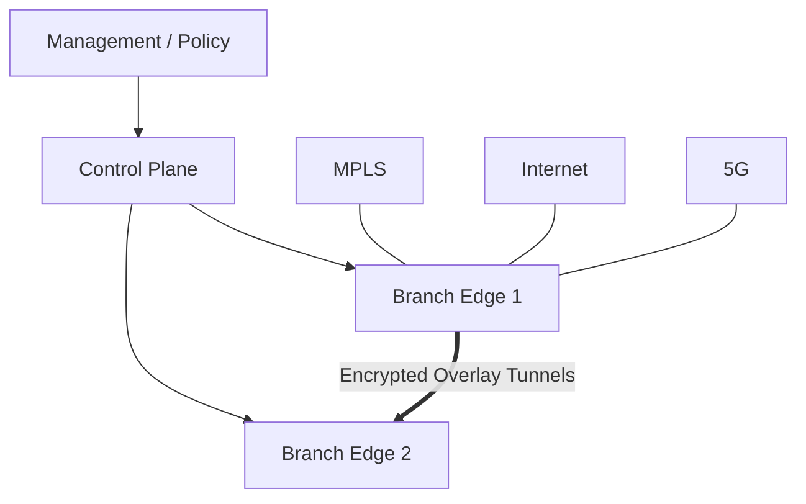

# SD-WAN 架构、应用选路与排障

SD-WAN 把多种 Underlay 链路抽象为受集中策略控制的 Overlay。它减少逐设备配置，但没有消除路由、NAT、MTU、加密和故障域。

## 1. 三个平面

| 平面 | 作用 | 典型组件 |
|---|---|---|
| 管理平面 | 设备生命周期、模板、策略、可视化 | Controller/Manager |
| 控制平面 | 身份、拓扑、路由和策略分发 | Control Nodes |
| 数据平面 | 建隧道并转发业务 | Branch/Edge |

有些产品合并组件，名字也不同。分析时始终映射回这三个职责。



## 2. Underlay 与 Overlay

Underlay 负责 Edge 端点之间的 IP 可达，Overlay 通常使用 IPsec 等隧道。

排障必须区分：

```text
Underlay：WAN 接口地址、默认路由、DNS/NTP、NAT、运营商可达
Overlay：身份认证、隧道、路由发布、分段、业务策略
```

控制器可达但数据隧道失败，或隧道 Up 但业务路由未发布，都是不同层的问题。

## 3. 应用感知选路

策略通常按应用、用户、站点或网段选择路径：

```text
语音：低时延、低抖动链路
ERP：优先 MPLS，Internet 备份
Office/SaaS：本地互联网出口
备份：低成本链路和低优先级
```

SLA 探测指标：

- 丢包；
- 时延；
- 抖动；
- 可用性；
- 某些实现增加 MOS 或应用体验。

### 防止路径振荡

如果阈值为 50 ms，链路在 49～51 ms 波动，可能频繁切换。需要：

- 进入和退出使用不同阈值；
- 连续多个探测窗口才判定；
- 最小保持时间；
- 恢复后延迟回切；
- 对瞬时异常和持续异常使用不同策略。

## 4. 路由与分段

集中控制仍要处理：

- 站点 Prefix 如何发布；
- Hub-and-Spoke 还是 Full Mesh；
- 不同业务 VPN/Segment 如何隔离；
- 分支默认路由走本地还是中心；
- 汇总是否造成黑洞；
- 数据中心和云路由怎样重分发；
- 最大前缀和环路保护。

集中策略错误可能影响全部站点，所以 PR、仿真、Canary 和分批发布更重要。

## 5. 本地互联网出口

Direct Internet Access 可以减少 SaaS 回绕时延，但安全边界也从中心机房分散到各分支。

必须设计：

- DNS 和 Web 安全；
- 本地防火墙；
- SaaS 身份与零信任策略；
- 日志集中；
- 公网 NAT 地址；
- 云安全服务/SASE 故障时的回退；
- 分支是否允许绕过安全检查。

## 6. 常见故障

### Edge 无法上线

检查：

1. WAN 口地址、默认路由和 DNS；
2. 系统时间与证书有效期；
3. NAT/防火墙是否允许控制和数据端口；
4. 设备身份、序列号、租户归属；
5. 控制器证书链和授权；
6. MTU 与分片。

### 隧道 Up 但业务不通

检查：

- 目标 Prefix 是否发布和安装；
- Segment/VPN 是否相同；
- 应用策略是否把流量送到错误路径；
- 安全策略/NAT；
- 回程路径；
- 隧道内 MTU；
- LAN 侧 VLAN、路由和 DHCP。

### 没有切换到备线

检查：

- SLA 探测目标是否真正代表业务路径；
- 失败指标是否超过阈值和持续窗口；
- 备线是否满足策略；
- 备线隧道是否预先建立；
- NAT 会话能否跨路径保留；
- 应用是否能承受连接重建。

## 7. 排障顺序

```text
固定失败应用和五元组
→ 检查 LAN 接入
→ 检查 Underlay 每条链路
→ 检查控制器连接与身份
→ 检查 Overlay 隧道
→ 检查路由与 Segment
→ 检查应用/SLA 策略
→ 检查安全、NAT、MTU
→ 检查完整回程
```

## 8. 设计与演练

为 20 个分支设计：

- MPLS + Internet 双 Underlay；
- 语音、ERP、SaaS、备份四类业务；
- ERP 通过双数据中心；
- SaaS 本地出口；
- 每类业务的 SLA、主备、回切和安全策略；
- 控制器不可达时的生存行为。

演练：

1. 主链路硬 Down；
2. 主链路不 Down 但 10% 丢包；
3. DNS 不可达；
4. 控制器不可达；
5. 隧道 MTU 不足；
6. 错误全局策略；
7. 双数据中心单侧 Prefix 撤销。

记录业务丢包、切换时间、会话重建和回切稳定性。

## 9. 掌握标准

你应能把任意厂商 SD-WAN 产品映射为管理、控制、数据平面；能区分 Underlay、隧道、路由、策略和应用故障；能用 SLA 设计稳定切换，并说明集中控制怎样通过灰度与护栏避免全网事故。
