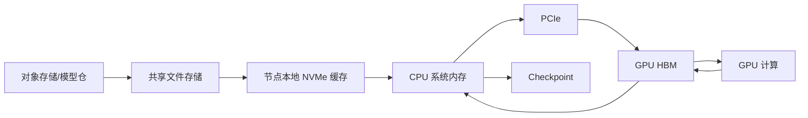
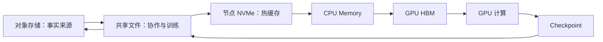

# AI 工作负载的存储 IO 模型：模型、数据集与 Checkpoint

存储选型最常见的错误是先问：

> NFS、CephFS、对象存储和本地 NVMe，哪个性能最好？

正确顺序应该是：

1. 业务在读写什么？
2. 文件有多大、多少个？
3. 有多少客户端并发？
4. 数据是否共享和持久？
5. 允许多久加载和恢复？
6. 然后才选择技术。

← [大模型文件在 Kubernetes 中的存储方案](./06-大模型文件在%20Kubernetes%20中的存储方案.md)

## 1. 学习目标

完成本文后，你应该能够：

- 区分吞吐、IOPS、延迟、并发和元数据性能
- 描述模型权重、训练数据集、Checkpoint 和日志的 IO 模型
- 解释小文件为什么会拖慢大规模训练启动
- 理解共享存储和本地缓存的分工
- 比较本地 NVMe、NFS、Ceph、对象存储和并行文件系统
- 设计模型分发和 Checkpoint 路径
- 建立存储、CPU、PCIe 和 GPU 的分段性能基线

## 2. 存储在 GPU 系统中的位置



这只是传统路径。使用 GPUDirect Storage 时，部分数据可以绕过 CPU bounce buffer，但业务仍需理解文件系统、对齐和支持矩阵。

## 3. 五个核心指标

### 3.1 吞吐

单位：

```text
MB/s、GB/s、GiB/s
```

适合衡量：

- 大模型权重顺序读取
- 大文件数据集
- Checkpoint 大块写入
- 多节点聚合带宽

### 3.2 IOPS

单位：

```text
每秒 IO 操作数
```

适合衡量：

- 大量小文件
- 随机读取
- 元数据与小块访问

高吞吐设备不一定拥有适合小文件的 IOPS。

### 3.3 延迟

关注：

- 平均延迟
- P95/P99
- 首字节时间
- Metadata 操作延迟

训练任务可能容忍平均延迟，却被偶发长尾拖住整个同步点。

### 3.4 并发

一个节点顺序读取很快，不代表 100 个 Pod 同时加载模型仍然快。

要区分：

- 单客户端带宽
- 单节点并发
- 多节点聚合带宽
- 存储服务端热点

### 3.5 元数据性能

涉及：

- `open`
- `stat`
- `readdir`
- `create`
- `rename`
- `unlink`

百万小文件数据集可能主要受元数据限制，而不是磁盘顺序带宽。

## 4. 模型权重的 IO 模型

模型权重通常具有：

- 总容量大
- 文件数量从少量到数百/数千
- 启动时大量读取
- 运行期间较少修改
- 多副本可能同时读取同一 Revision

典型路径：

```text
模型仓库
→ 共享存储或下载任务
→ 节点缓存
→ 进程读取
→ CPU Memory
→ GPU HBM
```

### 4.1 冷启动风暴

Deployment 同时扩容 20 个副本：

```text
20 个 Pod × 读取同一份 100 GB 模型
```

如果没有缓存和分发控制，可能瞬间产生 2 TB 读取需求。

结果：

- 对象存储限流
- NFS Server 饱和
- CephFS MDS/OSD 压力
- 节点网络占满
- Pod Startup 超时

### 4.2 模型文件分片

分片有利于：

- 并发下载
- 单文件失败重试
- 多 Rank 分别加载

但分片过多会增加：

- Metadata 操作
- 文件打开
- 校验
- 目录遍历

需要在并发和元数据压力之间平衡。

## 5. 训练数据集的 IO 模型

### 5.1 大文件顺序读取

例如：

- Tar Shard
- Parquet
- 大型二进制 Record

特点：

- 更容易获得高吞吐
- Metadata 压力较小
- 适合预取和顺序访问

### 5.2 大量小文件

例如数百万图片或文本文件。

特点：

- `open/stat/close` 比例高
- Directory 和 Metadata Server 压力大
- 随机访问
- 多 Worker 会放大并发

优化方向可能包括：

- Sharding
- 合并文件
- 数据索引
- 节点缓存
- 减少目录层级热点

### 5.3 随机采样

训练常会 Shuffle。即使底层文件很大，访问模式也可能变成随机。

需要观察：

- 读取粒度
- Cache 命中
- Worker 数量
- 数据是否跨节点重复读取

## 6. Checkpoint 的 IO 模型

Checkpoint 通常具有：

- 周期性突发写入
- 数据量大
- 多 Rank 同时参与
- 要求持久性
- 失败后需要恢复

错误模式：

```text
所有 Rank 同时写一个共享文件
```

可能造成锁竞争、损坏或不可扩展。

常见策略：

- 只有 Rank 0 写单文件
- 每 Rank 写独立 Shard
- 使用 Distributed Checkpoint
- 临时文件写完后原子 Rename
- 写入完成标记
- 后台上传对象存储

### Checkpoint 时间预算

```text
Checkpoint 时间 ≈ 数据量 ÷ 有效聚合写入带宽 + 同步和元数据开销
```

如果每 10 分钟保存一次，而每次写入需要 4 分钟，训练有效计算时间会严重下降。

## 7. 推理运行时 IO

模型加载完成后，在线推理不一定持续大量访问存储，但仍可能发生：

- Adapter/LoRA 动态加载
- 模型切换
- Tokenizer 和配置读取
- 日志写入
- Prefix Cache 持久化
- CPU/KV Offload

因此存储方案既要满足冷启动，也要避免运行时单点。

## 8. 本地 NVMe

优势：

- 低延迟
- 高本地带宽
- 不占共享存储网络
- 适合模型缓存和临时数据

限制：

- 数据只在单节点
- 节点故障时缓存丢失
- 容量碎片化
- 调度必须理解数据位置
- 需要预热和淘汰机制

推荐定位：

```text
对象/共享存储作为事实来源
→ 本地 NVMe 作为可重建缓存
```

不要把唯一 Checkpoint 只保存在本地临时盘。

## 9. NFS

优势：

- POSIX 文件接口
- 客户端成熟
- 使用简单
- 适合中小规模共享目录

限制：

- Server 和网络可能形成瓶颈
- 高可用需要额外设计
- Metadata/小文件压力
- 大规模并发冷启动可能产生热点

适合：

- 小型团队共享模型
- 规模有限的 RWX
- 运维简单优先

不能只测试一台客户端。至少验证：

- 单客户端
- 多客户端
- 大文件
- 小文件
- Server 故障
- 网络抖动

## 10. Ceph

### CephFS

适合：

- POSIX 共享目录
- Kubernetes RWX
- 多节点模型和数据集

要关注：

- MDS Metadata 性能
- Data Pool
- 小文件
- 客户端 Cache
- 恢复期性能

### RBD

适合：

- 单节点块设备
- Kubernetes RWO
- 数据库或本地文件系统承载

它不是天然的多节点共享文件系统。

### RGW/S3

适合：

- 模型仓库
- 数据集对象
- 版本和生命周期
- 跨环境分发

应用需要通过 S3 API 或下载层使用。

完整内容见：

→ [Ceph 学习路线](../ceph/00-Ceph学习路线.md)

## 11. 对象存储

优势：

- API 边界清楚
- 水平扩展
- 适合大对象
- 版本和生命周期
- 可作为模型事实来源

限制：

- 不是普通 POSIX 文件系统
- 应用需要 S3 SDK 或下载流程
- 列目录、Rename 和小文件语义不同
- 并发下载受服务端和网络限制

常见架构：

```text
S3 模型仓
→ 节点级下载 Job/Daemon
→ 校验 Hash/Revision
→ 本地 NVMe
→ Pod 只读加载
```

## 12. 并行文件系统

Lustre、BeeGFS 等并行文件系统通常将 Metadata 与数据目标分开，并通过 Striping 提供多目标并行 IO。

适合：

- HPC
- 大规模训练
- 多客户端高聚合吞吐
- 大型数据集和 Checkpoint

代价：

- 部署和运维复杂
- 客户端和内核兼容
- Metadata、Storage Target、网络需要共同规划

不能只看到“并行”就假设所有小文件场景都更快。

## 13. 分层存储架构

一套常见设计：



每层职责：

| 层 | 主要职责 |
| --- | --- |
| 对象存储 | 长期保存、版本和跨环境分发 |
| 共享文件 | 多节点 POSIX 访问 |
| 本地 NVMe | 热模型和数据缓存 |
| CPU Memory | 解码、预处理和普通 IO Buffer |
| GPU HBM | 当前计算工作集 |

## 14. 容量规划

不要只计算一份模型：

```text
所需容量 =
模型多个 Revision
+ 数据集多个版本
+ Checkpoint 保留
+ 本地缓存副本
+ 临时文件
+ 日志
+ 安全余量
```

本地缓存还要考虑每个 GPU 节点各保存一份模型。

## 15. 带宽规划

### 模型冷启动

```text
单 Pod 理论加载时间 = 模型大小 ÷ 单 Pod 有效读取带宽
```

多 Pod：

```text
聚合需求 = 并发 Pod 数 × 每 Pod 目标带宽
```

实际还要加：

- Metadata
- Hash 校验
- 解压/反序列化
- CPU→GPU 复制
- Rank 同步

### 训练

```text
数据供应速率 ≥ 每步数据量 ÷ 每步计算时间
```

如果存储供应不足，GPU 会在两个 Step 之间等待。

## 16. 建立分段时间线

不要只看 Pod 从 Pending 到 Ready 的总时间。

分段记录：

| 阶段 | 开始 | 结束 | 耗时 | 指标 |
| --- | --- | --- | --- | --- |
| 镜像拉取 |  |  |  | Registry/网络 |
| PVC 挂载 |  |  |  | CSI |
| 模型读取 |  |  |  | Storage |
| 校验/解压 |  |  |  | CPU |
| H2D |  |  |  | PCIe |
| NCCL 初始化 |  |  |  | NVLink/NIC |
| 服务 Ready |  |  |  | 应用 |

这样才能知道“冷启动慢”到底慢在哪里。

## 17. 测试工具

### fio

适合块和文件 IO：

```bash
fio --name=read-seq \
  --filename=/mnt/test/fio.bin \
  --size=20G \
  --rw=read \
  --bs=1M \
  --direct=1 \
  --iodepth=16 \
  --runtime=60 \
  --time_based
```

这是示例，不要对生产文件或未知块设备执行写测试。

### mdtest

适合 Metadata 操作基线，常与 IOR 工具集一起使用。

### IOR

适合并行文件系统多进程读写。

### S3 Benchmark

测试：

- PUT/GET
- 对象大小
- 并发
- 首字节时间
- 错误率

### 应用真实加载

最重要的仍是：

- PyTorch/vLLM 实际模型加载
- DataLoader 吞吐
- Checkpoint 时间
- GPU 等待比例

微基准不能替代真实应用。

## 18. Kubernetes 关注点

- StorageClass
- AccessMode
- ReclaimPolicy
- CSI Controller/Node Plugin
- Mount Option
- `WaitForFirstConsumer`
- Local PV Node Affinity
- InitContainer 下载
- DaemonSet 预热
- PVC 扩容
- Secret

调度器需要同时满足：

```text
GPU 可用
+ 存储可挂载
+ 数据位置正确
+ 本地缓存命中
+ 网络带宽足够
```

## 19. 常见故障

### GPU 利用率周期性掉到零

检查：

- DataLoader
- 存储延迟
- CPU 解码
- H2D
- 同步点

### Pod 启动时存储被打满

检查：

- 同时扩容数量
- 模型缓存
- 下载限流
- 分批滚动
- 每 Pod 是否重复下载

### Checkpoint 偶发超时

检查：

- 多 Rank 同步
- 聚合写入
- Metadata
- 存储恢复或快照
- 网络拥塞
- 容量阈值

### 小文件很慢但 fio 很快

fio 大块顺序结果不能代表 Metadata 和小文件负载。

## 20. 选型方法

| 需求 | 优先考虑 |
| --- | --- |
| 简单共享、小规模 | NFS |
| Kubernetes 大规模 RWX | CephFS 或其他分布式文件 |
| 模型事实来源与版本 | S3/对象存储 |
| 节点热缓存 | 本地 NVMe |
| 大规模 HPC 聚合吞吐 | 并行文件系统 |
| GPU 直接 IO | 经过验证的 GDS 方案 |

很多生产系统不是“六选一”，而是组合。

## 21. 它与其他模块的关系

### 上游

- 模型训练产生权重和 Checkpoint
- 数据工程产生数据集

### 本层

- 存储负责持久化、共享和分发
- 缓存减少重复远端读取

### 下游

- CPU 读取和预处理
- PCIe 把数据送入 HBM
- GDS 在满足条件时提供更直接路径
- 调度器依据数据位置选择节点

## 22. 常见误区

### GPU 集群只需要高吞吐

小文件和 Metadata 可能更重要。

### 本地 NVMe 最快，所以全部用本地盘

它缺少天然共享和持久事实来源，需要缓存治理。

### Ceph/NFS/S3 可以互相直接替换

它们提供的接口、语义和故障模型不同。

### 微基准快，模型加载一定快

反序列化、校验、CPU 和 H2D 也在关键路径。

### GDS 可以让所有存储自动加速

需要应用、文件系统、驱动和硬件共同支持。

## 23. 本篇总结

```text
先识别 IO 模型
→ 再选择存储接口
→ 设计共享层与缓存层
→ 分别测吞吐、IOPS、延迟和 Metadata
→ 用真实模型/训练验证
→ 最后将数据位置交给调度策略
```

下一篇先从最靠近 GPU 节点的本地存储开始，学习怎样把 NVMe 作为可调度的高速缓存。

→ [本地 NVMe 与 Local PV 实践](./03-本地NVMe与Local-PV实践.md)

## 24. 课后练习

1. 模型权重、训练数据和 Checkpoint 的 IO 模型有何差异？
2. 为什么百万小文件可能无法用顺序吞吐解释？
3. 本地 NVMe 应作为事实来源还是缓存？
4. 比较 NFS、CephFS 和对象存储的接口语义。
5. 计算 20 个 Pod 同时加载 100 GB 模型的聚合读取量。
6. 设计一个对象存储、CephFS 和本地 NVMe 组合架构。
7. 对同一存储分别执行 fio、真实模型加载和多 Pod 并发测试。

## 参考与致谢

- [Kubernetes Storage](https://kubernetes.io/docs/concepts/storage/)
- [PyTorch DataLoader](https://pytorch.org/docs/stable/data.html)
- [PyTorch Distributed Checkpoint](https://pytorch.org/docs/stable/distributed.checkpoint.html)
- [Ceph Documentation](https://docs.ceph.com/en/latest/)
- [GPUDirect Storage](https://docs.nvidia.com/gpudirect-storage/)
