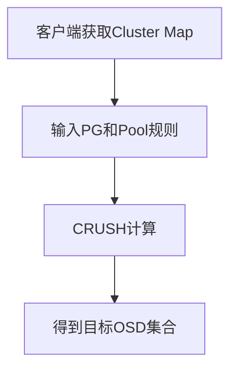
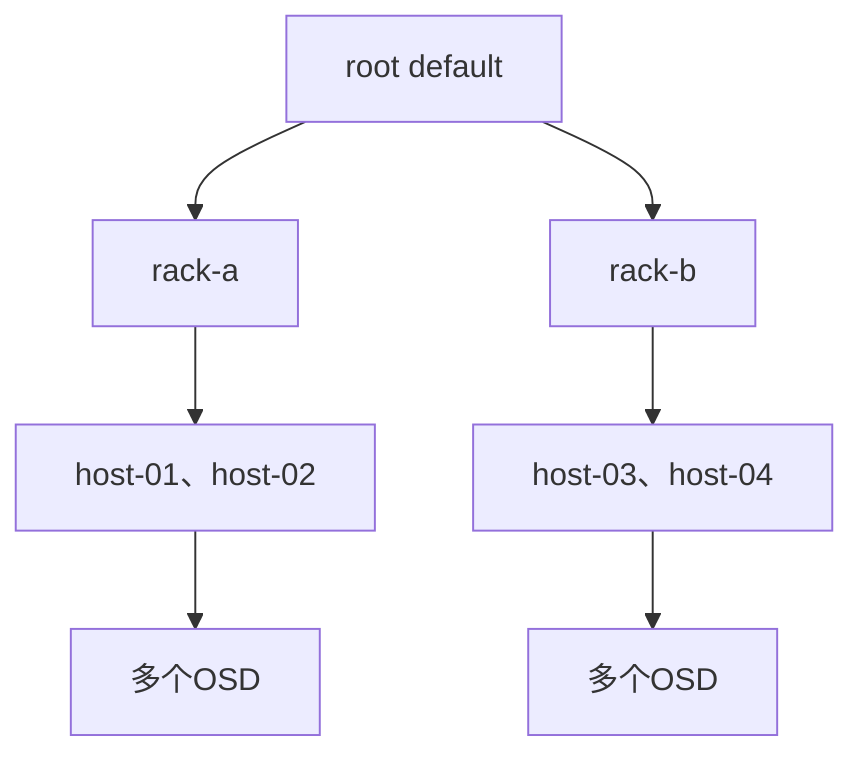
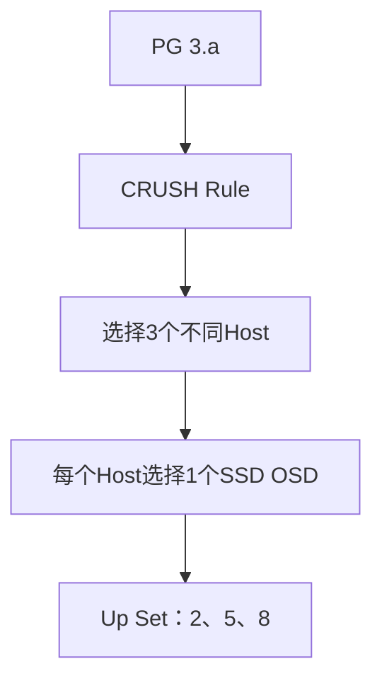

# CRUSH 数据分布原理：Ceph 如何决定数据放在哪些服务器

《Ceph 从零基础到生产运维实战》第 5 篇

← [第 4 篇：Ceph 数据组织原理](./04-Ceph数据组织原理.md)

上一篇建立了下面这条数据定位链路：

```text
业务数据 → RADOS Object → Pool → PG → OSD Acting Set
```

Object 如何映射到 PG 已经比较清楚，接下来还有一个关键问题：

> 一个 PG 为什么会映射到 osd.2、osd.5、osd.8，而不是其他 OSD？

答案就是 **CRUSH**。

CRUSH 不仅决定数据放到哪块磁盘，还要满足更多要求：

- 三个副本不能全部放在同一台服务器
- SSD 业务不能被分配到 HDD
- 机架级容灾时，副本应分布在不同机架
- 新增 OSD 后，数据要逐步重新均衡
- 客户端不依赖中央位置查询服务，也能计算目标 OSD

本文将解释 CRUSH Map、Bucket、Rule、Weight、Failure Domain 和 Device Class 之间的关系。


## 为什么 Ceph 不使用中心位置表

传统存储系统可以维护一张中心索引表：

```text
object-a → server-1/disk-2
object-b → server-3/disk-1
object-c → server-2/disk-4
```

这种方式直观，但在大规模分布式存储中会产生几个问题：

- 对象数量可能达到数十亿，位置表会非常庞大
- 每次读写前查询中心服务，中心服务可能成为性能瓶颈
- 中心服务故障会影响数据定位
- 磁盘扩容或故障后，需要更新大量位置记录

Ceph 采用另一种思路：

> **客户端拿到集群地图后，通过确定性的算法计算数据位置。**

同一个 PG、同一份 CRUSH Map 和同一条 CRUSH Rule 会得到一致的放置结果。



客户端不需要问 MON「这个对象在哪块磁盘」。MON 提供的是集群地图，真正的数据位置由客户端计算。

## CRUSH 是什么

CRUSH 全称为 Controlled Replication Under Scalable Hashing，可以理解为「可控副本的可扩展哈希算法」。

它的核心职责是：

> 根据集群拓扑、设备权重、Pool 规则和故障域，把 PG 映射到合适的 OSD 集合。

CRUSH 的输入主要包括：

- PG 标识
- CRUSH Map
- Pool 使用的 CRUSH Rule
- 副本数或纠删码块数量
- OSD 状态及权重

输出则是一组目标 OSD：

```text
PG 3.a → [osd.2, osd.5, osd.8]
```

CRUSH 解决的不只是「随机选磁盘」，而是在满足拓扑和故障域约束的前提下，实现可重复、相对均衡的数据放置。

## CRUSH Map：描述真实物理拓扑

CRUSH Map 描述 Ceph 集群中的 OSD 以及它们所在的物理层级。

一个常见结构如下：



常见层级包括：

```text
root
└── datacenter
    └── room
        └── row
            └── rack
                └── host
                    └── osd
```

实际环境不需要使用所有层级。小型集群可能只有：

```text
root → host → osd
```

大型双机房或多机架环境才会加入 datacenter、room、row、rack 等层级。

### 查看 CRUSH 拓扑

```bash
ceph osd tree
ceph osd crush tree
ceph osd crush dump
```

`ceph osd tree` 是日常最常用的命令，可以看到 OSD 属于哪台 Host、状态和权重。

## Bucket：CRUSH 层级中的容器

CRUSH 拓扑中的 root、rack、host 等节点称为 **Bucket**。

Bucket 不是存储数据的目录，而是表示物理设备的组织关系：

| Bucket 类型 | 表示内容 |
| --- | --- |
| root | 一组完整的存储设备树 |
| datacenter | 数据中心或机房 |
| rack | 机架 |
| host | 物理服务器 |
| osd | 最终存储单元 |

为什么需要这些层级？因为不同故障往往具有相关性：

- 一块磁盘故障，只影响一个 OSD
- 一台服务器断电，会影响该 Host 下全部 OSD
- 一个机架交换机故障，可能影响整个 Rack
- 一个机房故障，可能影响整个 Datacenter

如果 CRUSH 只看到一组平铺的 OSD，就无法理解这些相关故障关系。

## Failure Domain：副本需要跨越什么故障边界

Failure Domain 就是故障域，用于指定数据副本应该分散到哪一级物理边界。

### 1. OSD 级故障域

三个副本放在三个不同 OSD 即可，但这些 OSD 可能都属于同一台服务器：

```text
host-01
├── osd.0  副本1
├── osd.1  副本2
└── osd.2  副本3
```

虽然可以容忍部分磁盘故障，但 `host-01` 宕机时三个副本会同时不可用。

### 2. Host 级故障域

如果 Failure Domain 设置为 Host，三个副本需要位于不同服务器：

```text
host-01 → osd.0 → 副本1
host-02 → osd.4 → 副本2
host-03 → osd.7 → 副本3
```

这样单台服务器故障时，其他服务器仍然保留副本。

### 3. Rack 级故障域

如果要求整个机架故障后数据仍然可用，可以让副本跨 Rack 放置：

```text
rack-a → 副本1
rack-b → 副本2
rack-c → 副本3
```

这里有一个必须注意的约束：

> **三副本并且 Failure Domain 为 Rack 时，至少需要三个可选 Rack。**

如果集群只有两个 Rack，却要求 CRUSH 选择三个不同 Rack，就无法完整满足规则，PG 可能出现 `undersized` 等异常状态。

### 4. 10 台服务器应该选什么故障域

假设 10 台服务器分布在同一个机架中，每台提供一块 OSD：

- 使用 Host 故障域，可以把三副本放在三台服务器
- 无法真正实现 Rack 级容灾，因为所有节点仍共享同一个机架故障点

如果 10 台服务器分布在两个机架中，仍然无法让三副本分别位于三个 Rack。此时可以：

- 使用 Host 故障域，并接受机架故障风险
- 增加第三个机架
- 重新评估副本、Stretch Cluster 或容灾架构

> CRUSH 只能按照真实拓扑分散数据，不能凭空创造不存在的故障域。

## CRUSH Rule：数据放置规则

CRUSH Map 描述「集群里有什么」，CRUSH Rule 描述「某个 Pool 如何从这些设备中选择位置」。

一条副本池规则通常需要表达：

- 从哪个 Root 开始
- 是否限制设备类型
- 按哪个 Bucket 层级分散副本
- 需要选择多少个目标位置

可以把一条规则抽象成：

```text
从 root default 开始
选择 hdd 设备
按照 host 故障域选择
输出满足副本数的 OSD
```

### 查看 CRUSH Rule

```bash
ceph osd crush rule ls
ceph osd crush rule dump
ceph osd crush rule dump <rule-name>
```

查看某个 Pool 使用哪条规则：

```bash
ceph osd pool get <pool-name> crush_rule
```

### Pool 与 CRUSH Rule 的关系

不同 Pool 可以使用不同规则：

| Pool | CRUSH Rule | 效果 |
| --- | --- | --- |
| vm-ssd | replicated-ssd | 只使用 SSD，副本跨 Host |
| archive-hdd | replicated-hdd | 只使用 HDD，副本跨 Host |
| critical-data | rack-replicated | 副本跨 Rack |

因此，创建两个 Pool 不会自动实现物理隔离，真正限制磁盘和故障域的是 CRUSH Rule。

## Device Class：让不同介质服务不同业务

Ceph 可以给 OSD 标记设备类别，常见包括：

- hdd
- ssd
- nvme

查看设备类别：

```bash
ceph osd crush class ls
ceph osd crush tree --show-shadow
```

设备类别可以与 CRUSH Rule 结合。例如：

```text
高性能虚拟机 Pool → SSD/NVMe
日志归档 Pool       → HDD
CephFS 元数据 Pool   → SSD
大容量数据 Pool     → HDD
```

### Device Class 不是自动性能保证

同样被标记为 SSD 的设备，性能也可能差别很大：

- SATA SSD 与 NVMe 延迟不同
- 企业级 SSD 与消费级 SSD 耐久度不同
- 网卡和 CPU 可能成为瓶颈
- BlueStore DB/WAL 位置会影响性能

Device Class 用于设备选择，不替代实际性能测试和硬件规划。

## Weight：容量越大，承担的数据通常越多

CRUSH 需要知道不同设备的相对容量，才能让大容量 OSD 承担更多数据，小容量 OSD 承担更少数据。

### 1. CRUSH Weight

CRUSH Weight 通常反映 OSD 或 Bucket 的相对容量。相同类型的设备中，容量更大的 OSD 通常拥有更大的 CRUSH Weight。

例如：

```text
2 TiB OSD → weight 约 2
4 TiB OSD → weight 约 4
```

这只是便于理解的示例，实际值应以 `ceph osd tree` 输出为准。

### 2. OSD Reweight

`ceph osd reweight` 设置的是 0 到 1 之间的临时覆盖权重，与 CRUSH Weight 不是同一个概念。

| 类型 | 主要用途 |
| --- | --- |
| CRUSH Weight | 反映设备在 CRUSH 树中的相对容量 |
| OSD Reweight | 临时减少某个 OSD 承担的数据比例 |

现代集群启用 Balancer 时，不应随意长期保留非 1.0 的 Override Reweight，否则可能与 Balancer 产生冲突。

排障时建议先查看，不要看到容量不均衡就立即修改权重：

```bash
ceph osd tree
ceph osd df tree
ceph balancer status
```

## CRUSH 如何选择三副本位置

假设条件如下：

```text
Pool：rbd-data
副本数：3
Root：default
Device Class：ssd
Failure Domain：host
```

CRUSH 的简化计算过程是：

1. 从 `root default` 开始
2. 只在 SSD 设备集合中选择
3. 先选择三个不同 Host
4. 再从每个 Host 中选择一个合适 OSD
5. 输出三个 OSD 组成的 Up Set



如果其中一个 Host 不可用或 OSD 被标记为 Out，新的 OSD Map 和 CRUSH 计算可能产生新的目标集合，Ceph 再把缺失副本恢复到新位置。

## 扩容时为什么不是所有数据都重写

假设集群原来有 9 个 OSD，现在增加 `osd.9`。

CRUSH Map 发生变化后，部分 PG 会重新计算到新 OSD，但不会让所有 PG 全部更换位置。

简化过程如下：

1. 新 OSD 加入 CRUSH Map 并标记为 in
2. 部分 PG 的 Up Set 发生变化
3. Acting Set 暂时负责继续提供服务
4. Ceph 通过 Backfill 把相关对象迁移到新 OSD
5. 数据分布逐步达到新的平衡

这也是 Ceph 能够横向扩容的基础。

### 扩容为什么会影响业务性能

数据迁移会占用：

- 源 OSD 读带宽
- 目标 OSD 写带宽
- 集群网络
- CPU 和内存
- OSD 操作队列

所以生产环境扩容不能只关注「OSD 是否添加成功」，还要观察 Backfill、Recovery、客户端延迟和容量变化。

## CRUSH 与 Up Set、Acting Set

上一篇提到：

- **Up Set** 是 CRUSH 计算出的目标 OSD 集合
- **Acting Set** 是当前实际负责 PG 的 OSD 集合

正常情况下：

```text
up     [2,5,8]
acting [2,5,8]
```

故障或迁移期间可能出现：

```text
up     [2,6,8]
acting [2,5,8]
```

这表示 CRUSH 希望 PG 最终位于 `osd.2`、`osd.6`、`osd.8`，但当前仍由原来的集合提供服务或完成过渡。

查看特定对象：

```bash
ceph osd map <pool-name> <object-name>
```

查看 PG 详细状态：

```bash
ceph pg map <pg-id>
ceph pg query <pg-id>
```

## CRUSH 常用只读命令

```bash
# 查看OSD拓扑、状态和权重
ceph osd tree

# 查看完整CRUSH树
ceph osd crush tree

# 查看CRUSH Map结构
ceph osd crush dump

# 查看CRUSH规则
ceph osd crush rule ls
ceph osd crush rule dump

# 查看设备类别
ceph osd crush class ls
ceph osd crush tree --show-shadow

# 查看Pool使用的CRUSH规则
ceph osd pool get <pool-name> crush_rule

# 查看对象的PG和OSD映射
ceph osd map <pool-name> <object-name>
```

修改 CRUSH Rule、移动 Bucket 或调整 Weight 都会触发数据位置变化。生产环境操作前应先评估数据迁移量、剩余容量和业务影响。

## 常见误区

**误区一：CRUSH 只是随机选择磁盘**

CRUSH 是确定性、受规则控制的放置算法，需要同时考虑拓扑、权重、设备类别、副本数和故障域。

**误区二：三副本一定能容忍任意一台服务器故障**

只有副本真正分布在不同 Host 时，才能抵御单 Host 故障。副本数必须与 Failure Domain 结合分析。

**误区三：两个机架可以实现三副本跨机架**

三副本都要求位于不同 Rack 时，至少需要三个可选 Rack。

**误区四：不同 Pool 一定使用不同磁盘**

Pool 是逻辑隔离。只有配合 Device Class 和 CRUSH Rule，才能限制 Pool 使用的物理设备。

**误区五：修改 CRUSH Rule 只会改变配置，不会移动数据**

规则变化可能改变 PG 映射，从而触发大量 Recovery 或 Backfill。

**误区六：OSD 容量不均衡就应该直接执行 Reweight**

容量偏差可能来自 PG 数量、Pool 比例、对象大小、CRUSH 约束或 Balancer 状态。必须先分析原因。

## 本篇总结

需要记住以下结论：

1. CRUSH 根据 PG、拓扑、权重和规则计算目标 OSD
2. 客户端获取 Cluster Map 后可以自行计算数据位置
3. CRUSH Map 描述 Root、Rack、Host 和 OSD 之间的物理层级
4. CRUSH Rule 决定 Pool 从哪些设备、按照什么故障域选择 OSD
5. Failure Domain 必须与真实机房和机架结构匹配
6. Device Class 可以把 SSD、HDD 和 NVMe 分配给不同 Pool
7. CRUSH Weight 与 OSD Override Reweight 不是同一个概念
8. 新增或移除 OSD 会让部分 PG 重新映射，并产生数据迁移
9. CRUSH 只能利用已有故障域，不能弥补物理架构本身的缺陷

**三副本为什么只剩三分之一容量，size 和 min_size 有什么区别，纠删码又为什么可以提高空间利用率？**


## 自测题

1. CRUSH 为什么不需要维护每个对象的中心位置表？
2. CRUSH Map 和 CRUSH Rule 有什么区别？
3. Failure Domain 设置为 Host 代表什么？
4. 三副本跨 Rack 至少需要几个 Rack？
5. 创建两个 Pool 能否自动实现物理磁盘隔离？
6. CRUSH Weight 和 OSD Reweight 有什么区别？
7. 新增 OSD 后为什么会出现 Backfill？
8. Up Set 和 Acting Set 在什么情况下可能不同？

## 参考资料

- [Ceph 官方架构文档](https://docs.ceph.com/en/latest/architecture/)
- [CRUSH Maps](https://docs.ceph.com/en/latest/rados/operations/crush-map/)
- [CRUSH 控制命令](https://docs.ceph.com/en/latest/rados/operations/crush-map-edits/)
- [Pools 文档](https://docs.ceph.com/en/latest/rados/operations/pools/)
- [Monitoring OSDs and PGs](https://docs.ceph.com/en/latest/rados/operations/monitoring-osd-pg/)

→ [第 6 篇：副本、纠删码与一致性](./06-副本纠删码与一致性.md)
