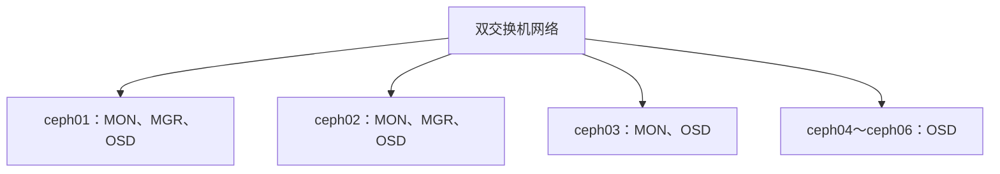
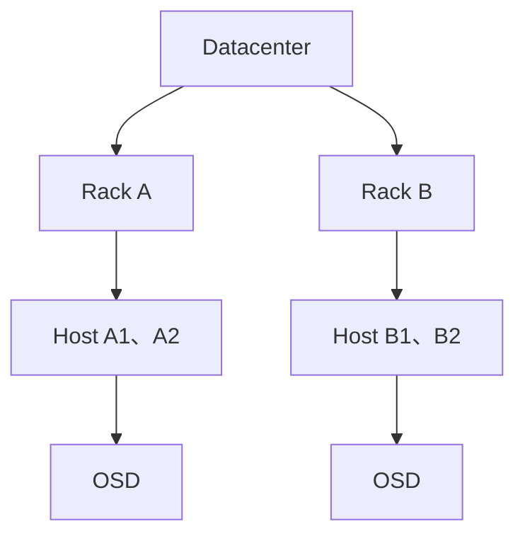
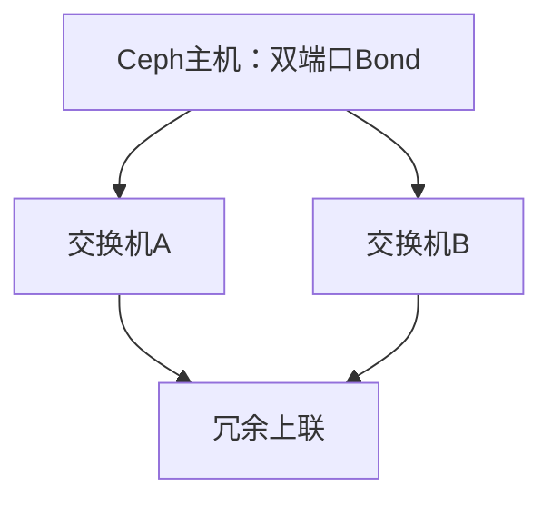

# Ceph 生产集群规划：节点、磁盘、网络与故障域怎么设计

《Ceph 从零基础到生产运维实战》第 7 篇

← [第 6 篇：副本、纠删码与一致性](../PartII-核心原理/06-副本纠删码与一致性.md)

前面几篇讲的是 Ceph 如何保存数据，这一篇开始进入真正的生产实践。

很多 Ceph 项目并不是安装失败，而是规划阶段就埋下了问题：

- 三副本却放在同一台服务器
- 只计算业务容量，没有预留故障恢复空间
- 一台机器塞满几十块盘，却只配一张低速网卡
- OSD 数据盘与操作系统共用
- 选择了不具备掉电保护的消费级 SSD
- 交换机、PDU 和机架看似冗余，实际仍是同一故障域
- 上线后才发现恢复速度无法满足业务要求

因此，生产集群规划不能从「买几台服务器」开始，而应该从业务目标、故障模型和恢复目标倒推。


## 先定义目标，不要先选硬件

规划前至少要回答下面这些问题。

| 维度 | 需要确认的问题 |
| --- | --- |
| 数据接口 | 使用 RBD、CephFS 还是 RGW？ |
| 数据规模 | 当前有效数据多少？一年后、三年后多少？ |
| IO 模型 | 随机还是顺序？读写比例如何？对象大小如何？ |
| 性能目标 | 需要多少 IOPS、吞吐和延迟？ |
| 可用性 | 允许停一台主机、一个机架还是一个机房？ |
| 恢复目标 | 故障后希望多久恢复到完整冗余？ |
| 保护策略 | 三副本还是纠删码？CRUSH 故障域是什么？ |
| 运维窗口 | 是否允许滚动重启、扩容和升级？ |
| 预算 | 更关注采购价格，还是三到五年的总成本？ |

例如，「需要 100 TB 空间」并不足以指导采购。还需要说明：

- 100 TB 是业务有效数据，还是磁盘原始容量？
- 采用三副本还是 EC 4+2？
- 是否包含未来增长？
- 是否包含快照和历史版本？
- 停掉最大一台主机后，剩余空间能否完成恢复？
- 恢复时是否仍要保证业务性能？

### 一个更完整的需求示例

```text
业务：虚拟机 RBD 系统盘
有效数据：当前 60 TB，一年后预计 100 TB
负载：70% 读、30% 写，以 4 KiB 随机 IO 为主
保护：三副本，故障域为 host
容错：任意一台存储节点故障，业务继续运行
恢复目标：12 小时内重新达到三副本
网络：客户端与存储节点至少 25 Gb/s，双交换机冗余
容量红线：正常状态不超过规划可用容量的 70%～75%
```

有了这些条件，节点数、磁盘类型、网络带宽和容量余量才有计算依据。

## 生产集群需要多少台节点

Ceph 没有一个适用于所有场景的固定节点数。实验环境可以用三台节点理解架构，但生产环境不应只用「能组成集群」作为标准。

### 1. MON 为什么通常部署奇数个

MON 依靠多数派形成 Quorum。

| MON 数量 | 形成多数派需要 | 可容忍 MON 故障数 |
| --- | --- | --- |
| 1 | 1 | 0 |
| 3 | 2 | 1 |
| 5 | 3 | 2 |

常见生产集群部署 3 个 MON；更大或跨更复杂故障域的集群可能使用 5 个。MON 并不是越多越好，因为成员越多，Quorum 通信和维护也越复杂。

MON 应跨独立主机，最好进一步跨机架、电源和交换机故障域。三个 MON 容器放在同一台物理机上，仍然只能抵抗进程级故障，无法抵抗主机故障。

### 2. MGR 为什么至少需要主备

MGR 为监控、Dashboard、编排模块等提供管理能力。通常至少部署 2 个：一个 Active，一个 Standby。

MGR 暂时不可用通常不会让 OSD 中的数据立刻停止读写，但会影响管理、监控和部分模块。因此不能把「数据面还能工作」理解成 MGR 不重要。

### 3. OSD 节点数由故障域和并行度共同决定

如果副本池设置：

```text
size = 3
failure_domain = host
```

至少需要三个可用 Host 才能放置三个副本。但「刚好三个」存在明显问题：

- 一台 Host 故障后只剩两个故障域，无法恢复回三副本
- 维护一台 Host 期间没有额外主机承接完整冗余
- 容量和恢复带宽余量很小
- 任一节点负载变化都会显著影响整个集群

因此，生产设计通常需要多于保护策略的最小故障域数量。具体数量应由容量、性能、维护和恢复目标共同决定。

### 4. 小型生产拓扑示例

下面是一种示意方案，不是必须照抄的标准答案：



六台存储节点比三台更容易满足：

- 三个 MON 跨主机
- MGR 主备
- 三副本跨 Host
- 一台主机故障后还有其他 Host 承接恢复
- 扩容和维护时具备更好的并行度

在中大型集群中，也可以把 MON/MGR 放到独立管理节点，把 OSD 集中在存储节点。但小集群为了成本，经常采用角色融合。角色融合不是错误，前提是对 CPU、内存、磁盘和故障影响做好预算。

## 故障域必须映射真实基础设施

CRUSH 中的 Host、Rack、Room、Datacenter 等层级，应该与真实世界一致。



### 1. 常见故障域

| 故障域 | 可能同时失效的资源 |
| --- | --- |
| OSD | 单块磁盘或单个 OSD 进程 |
| Host | 整台服务器、HBA、主板或操作系统 |
| Chassis | 同一机箱、电源背板或存储背板 |
| Rack | 机架交换机、PDU 或整柜供电 |
| Room | 某个机房区域 |
| Datacenter | 整个数据中心 |

如果三副本的 CRUSH 规则只按 OSD 分散，三个副本可能仍位于同一 Host。Host 断电时会同时丢失三份。

### 2. 「服务器不同」不代表故障域独立

以下情况仍可能存在共同故障点：

- 多台服务器连接同一个交换机
- 双电源都接到同一个 PDU
- 两张网卡都连接同一个 ToR 交换机
- 多个机架共用同一个上联
- 虚拟化部署中的多个 Ceph 节点实际位于同一宿主机
- 不同机房依赖同一条城域链路

规划时建议制作一张故障域表，明确每个 Host 所在的机架、PDU、交换机和机房。之后再检查 CRUSH 层级是否与之对应。

## OSD 数据盘怎么规划

### 1. 通常一块数据盘对应一个 OSD

在 BlueStore 架构下，常见做法是：

```text
1 块独立 HDD 或 SSD → 1 个 OSD
```

Ceph 自身完成数据冗余和故障恢复，因此 OSD 数据盘通常交给 HBA/JBOD 或 RAID 控制器的直通模式，不建议先把多块盘组成传统硬件 RAID，再在上面创建少量 OSD。

原因包括：

- RAID 会隐藏单盘状态
- 故障定位和替换更复杂
- Ceph 无法充分感知独立设备
- 双重冗余可能浪费容量
- 大 RAID 卷故障会同时影响更多数据

如果硬件只能通过 RAID 控制器提供磁盘，应确认支持可靠的 HBA/JBOD/IT 模式、正确上报序列号和 SMART 信息，并完成故障替换演练。

### 2. 操作系统盘与 OSD 盘分离

建议使用独立系统盘，生产环境可根据主机可靠性要求做系统盘镜像。不要把操作系统、容器运行时和多个 OSD 的数据都放在同一块磁盘上。

磁盘分工示例：

| 设备 | 用途 |
| --- | --- |
| 2 块小型企业级 SSD | RAID1，操作系统和容器运行环境 |
| 8 块 HDD | 8 个 HDD OSD 的数据设备 |
| 1～2 块企业级 NVMe | 为 HDD OSD 提供 BlueStore DB/WAL，按设计切分 |

### 3. DB/WAL 为什么可能放到 SSD

BlueStore 会使用：

- **block**：主要对象数据
- **block.db**：RocksDB 元数据
- **block.wal**：预写日志

HDD OSD 把 DB/WAL 放到低延迟 SSD 或 NVMe，可能改善小 IO 和元数据相关性能。但这不是「加一块 SSD 一定翻倍」的魔法，需要根据对象大小、RocksDB 占用、SSD 耐久度和故障影响测试。

一块 NVMe 承载多个 HDD OSD 的 DB 时，它会成为共享故障点。NVMe 故障可能同时导致多个 OSD 不可用，因此需要控制扇出比例，并把这种影响计入主机级故障模型。

### 4. 不要只看容量，要看设备质量

生产 SSD 应重点关注：

- 掉电保护 PLP
- 持续写入性能，而非短时缓存峰值
- 写入耐久度 DWPD/TBW
- 延迟尾部表现
- 固件稳定性
- SMART/NVMe 健康信息
- 同型号批量故障风险

消费级 SSD 可能在缓存耗尽或垃圾回收时出现长尾延迟，也可能缺少可靠掉电保护。Ceph 对延迟抖动敏感，平均吞吐很高并不能掩盖严重的 P99/P999 延迟。

## CPU 和内存如何估算

### 1. OSD 不是「只负责存盘」

OSD 还要执行：

- 对象读写
- 校验和
- 副本或纠删码计算
- Recovery 和 Backfill
- Scrub 与 Deep Scrub
- RocksDB 和 BlueStore 处理
- 与其他 OSD 进行心跳和数据传输

SSD/NVMe 越快，CPU 越可能成为瓶颈。纠删码、加密、压缩和高小 IO 场景也会增加 CPU 需求。

### 2. 内存计算不能只乘一个固定值

BlueStore 的 `osd_memory_target` 是目标值，不是绝对硬上限。官方当前文档给出的默认值是 4 GiB，并强调恢复、内核回收延迟以及其他守护进程会带来额外占用。

一个保守的初步估算方法是：

```text
主机内存预算
= OSD 数量 × 每 OSD 内存目标
+ MON/MGR/MDS 等守护进程
+ 操作系统与容器运行时
+ 监控组件
+ 恢复和瞬时峰值余量
```

官方硬件建议给出的一个参考是：服务器总内存大于 `OSD 数量 × osd_memory_target × 2`，并至少考虑临时峰值余量。但这只是规划起点，不能替代压测。

例如一台主机有 10 个 HDD OSD，若每个 OSD 按 4～6 GiB 目标估算，再加系统、监控、MGR 和恢复峰值，128 GiB 往往比 64 GiB 更从容。对于全 NVMe、高并发小对象或角色融合节点，应重新测算。

### 3. 角色的 CPU 特点不同

| 角色 | 资源特点 |
| --- | --- |
| OSD | 随 IO、恢复、EC 和设备速度增长，需要足够核心 |
| MON | 稳定性和低延迟存储重要，规模变化时需要峰值余量 |
| MGR | 模块越多、集群越大，CPU 和内存需求越高 |
| MDS | 元数据负载重，关注高主频和缓存内存 |
| RGW | 前端协议、加密和并发请求会消耗 CPU，可水平扩展 |

## 网络不是配套设施，而是 Ceph 的一部分

Ceph 中的副本写入、Recovery、Backfill、心跳以及客户端 IO 都会使用网络。磁盘越多、节点越密，网络越容易成为总瓶颈。

### 1. Public Network 与 Cluster Network

| 网络 | 主要流量 |
| --- | --- |
| Public Network | 客户端访问、MON 通信、守护进程公共通信 |
| Cluster Network | OSD 心跳、复制、Recovery 和 Backfill |

Ceph 只配置 Public Network 也能正常工作。单独配置 Cluster Network 可以隔离恢复和复制流量，但会增加网卡、交换机、路由、防火墙和故障排查复杂度。

正确的问题不是「生产是否必须双网」，而是：

- 单网的总带宽和冗余是否足够？
- 恢复流量是否会挤压客户端 IO？
- 双网是否真正连接到独立交换机和故障域？
- 团队能否稳定维护额外网络？

### 2. 带宽怎么估算

官方硬件建议当前至少为 Ceph 节点间以及客户端到集群提供 10 Gb/s 网络；较重负载通常应考虑 25 Gb/s，密集节点可能需要 100 Gb/s。

但端口速率不是有效吞吐保证。还应检查：

- 每台主机所有磁盘的聚合吞吐
- 双端口 Bond 的散列策略
- ToR 交换机的背板与上联带宽
- 是否出现超卖
- MTU 是否端到端一致
- 丢包、重传、Pause Frame 和错误计数
- 故障切换后单链路能否承载业务与恢复流量

例如一台主机有 12 块 HDD，每块顺序读取约 200 MB/s，理论聚合可超过 2 GB/s。单个 10 Gb/s 链路的线速约 1.25 GB/s，扣除协议开销后更低，恢复时网络就可能先饱和。

### 3. 网络冗余示例



双网卡如果都接同一台交换机，只能抵抗网卡或端口故障，无法抵抗交换机故障。生产环境通常要跨交换机做链路冗余，并验证交换机堆叠、MLAG 或相应网络方案的真实故障行为。

### 4. 防火墙端口要按实际版本核对

Ceph 当前官方网络文档中常见端口包括：

| 服务 | 默认 TCP 端口 |
| --- | --- |
| MON Messenger v2 | 3300 |
| MON Messenger v1 | 6789 |
| OSD、MDS、MGR 等动态端口 | 6800～7568 |

不要只在一台主机临时关闭防火墙后就认为网络已完成。应按 Public/Cluster 网段限制来源，结合所用 Ceph 版本、容器网络和操作系统防火墙实现编写规则，并逐台滚动验证。

## 十台服务器的角色规划示例

假设有 10 台同配置服务器，每台：

```text
2 块系统 SSD（镜像）
8 块企业级 HDD 作为 OSD
1 块或 2 块企业级 NVMe 作为 DB 设备
双 25 Gb/s 网卡
```

一种融合部署方案如下：

| 主机 | 角色示例 |
| --- | --- |
| ceph01 | MON、MGR、OSD、管理入口 |
| ceph02 | MON、MGR、OSD、管理入口 |
| ceph03 | MON、OSD |
| ceph04～ceph10 | OSD |

这样共有 80 个 HDD OSD，三副本按 Host 分散。还需要继续检查：

- 单台主机约占总原始容量 10%，停机后剩余节点是否有恢复空间
- 三个 MON 是否跨不同机架和电源域
- 两个 MGR 是否避免共同故障点
- NVMe 故障会同时影响几个 HDD OSD
- 双 25 Gb/s 在单链路故障后能否承载峰值
- 未来扩容是增加同构节点，还是向现有节点加盘
- CRUSH 设备类是否区分 HDD、SSD 和 NVMe

如果业务对 RBD 低延迟要求很高，可能不应混用 HDD 数据层；如果主要存放大对象归档，则 HDD 加纠删码可能更经济。架构应由业务驱动。

## 上线前必须做的验证

### 1. 硬件验收

- 核对磁盘型号、固件、容量和序列号
- 检查 SSD 的 PLP 和耐久度
- 运行 SMART/NVMe 健康检查
- 测试 HBA、背板和 PCIe 带宽
- 做内存、CPU 和网卡压力测试
- 验证 BMC、双电源和远程控制
- 记录磁盘槽位与 Linux 设备的映射

### 2. 网络验收

- 检查每条链路协商速率
- 用多流 `iperf3` 测试节点间双向吞吐
- 测试丢包、重传和 MTU
- 断开一条网线验证 Bond 切换
- 重启一台交换机验证冗余
- 在故障状态下再次测量剩余带宽

### 3. 存储压测

压测应分层进行：

1. 单盘基准，确认设备没有异常
2. 单节点聚合测试，发现 HBA、背板、CPU 或网络瓶颈
3. 集群 RADOS 层测试
4. 使用 RBD、CephFS 或 RGW 做贴近真实业务的测试
5. 压测期间模拟一个 OSD 或一台 Host 故障
6. 记录正常、降级和恢复阶段的业务延迟

只测试「空集群的峰值吞吐」没有生产意义。真正决定体验的往往是集群恢复时，业务延迟是否仍在可接受范围内。

## 常见规划错误

**错误 1：三台节点就等于生产高可用**

三台节点只是许多三副本设计的最小放置条件。失去一台后没有新的第三个 Host 完成恢复，维护和容量余量也很有限。

**错误 2：10 块 2 TB 磁盘就是 20 TB 可用**

20 TB 只是十进制原始容量。还要扣除副本或纠删码开销、系统保留、恢复余量和数据分布不均带来的限制。下一篇会专门计算。

**错误 3：所有 SSD 都适合 Ceph**

设备的持续性能、掉电保护、耐久度和尾延迟，通常比标称顺序吞吐更重要。

**错误 4：网卡带宽等于集群带宽**

交换机上联、Bond 散列、单流限制、协议开销和故障后的剩余链路都会影响有效带宽。

**错误 5：把 Recovery 当成后台低优先级小流量**

故障恢复会同时消耗磁盘、网络和 CPU。恢复太慢会延长降级时间并增加重叠故障风险。

**错误 6：采购完硬件再决定 CRUSH 故障域**

故障域决定节点、机架、电源和交换机如何分布，必须在采购和上架前设计。

## 生产规划检查表

在采购或部署前，逐项回答：

- [ ] 已明确使用 RBD、CephFS 或 RGW
- [ ] 已测量真实业务 IO 模型，而非只写「高并发」
- [ ] 已计算当前、增长后和快照占用
- [ ] 已选择副本或纠删码策略
- [ ] 已定义最大容忍故障域
- [ ] CRUSH 层级与真实机架、电源和交换机一致
- [ ] 最大主机或机架故障后仍有恢复空间
- [ ] MON 和 MGR 跨独立故障域
- [ ] 系统盘与 OSD 数据盘分离
- [ ] OSD 数据盘由 Ceph 直接管理
- [ ] SSD 具备符合要求的 PLP、耐久度和持续性能
- [ ] 内存包含 OSD 目标、系统、其他守护进程和峰值余量
- [ ] 网络按所有磁盘聚合吞吐和恢复流量设计
- [ ] 链路、交换机和电源冗余已经实际演练
- [ ] 已完成正常、故障和恢复状态下的压测
- [ ] 已设计监控、备件、扩容和升级方案

## 本篇总结

生产 Ceph 规划的核心不是记住一组最低配置，而是建立下面的推导链：

```text
业务接口和 IO 模型
→ 容量、性能与延迟目标
→ 数据保护和故障域
→ 节点数、磁盘、CPU、内存和网络
→ 故障后的恢复空间与恢复带宽
→ 压测和故障演练
```

需要记住：

1. 最小可部署规模不等于合理生产规模
2. CRUSH 故障域必须对应真实硬件和网络
3. 一块数据盘对应一个 OSD 是常见设计
4. 系统盘、OSD 数据盘和可选 DB/WAL 设备要明确分工
5. Ceph 性能上限可能在磁盘、CPU、内存、网络或故障域中的任一处
6. 规划必须覆盖故障和恢复状态，而不是只看正常状态
7. 硬件建议是起点，真实业务压测才是最终依据

**原始容量、可用容量、副本与纠删码开销、恢复预留，以及 nearfull、backfillfull 和 full 红线。**


## 自测题

1. 为什么三个 MON 通常要部署在三台不同 Host 上？
2. 三副本、故障域为 Host 时，为什么只有三台 OSD 主机不利于故障恢复？
3. 一块 NVMe 为多个 HDD OSD 提供 DB 时，会引入什么故障影响？
4. Public Network 和 Cluster Network 分别承载哪些主要流量？
5. 为什么只按单块磁盘吞吐选择网卡会导致错误规划？
6. `osd_memory_target` 为什么不能当作 OSD 绝对内存上限？
7. 双网卡都接到同一交换机，能否抵抗交换机故障？

## 参考资料

- [Hardware Recommendations](https://docs.ceph.com/en/latest/start/hardware-recommendations/)
- [Network Configuration Reference](https://docs.ceph.com/en/latest/rados/configuration/network-config-ref/)
- [CRUSH Maps](https://docs.ceph.com/en/latest/rados/operations/crush-map/)
- [Cephadm Compatibility and Requirements](https://docs.ceph.com/en/latest/cephadm/compatibility/)

→ [第 8 篇：Ceph 容量计算](./08-Ceph容量计算.md)
