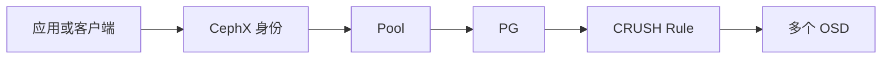
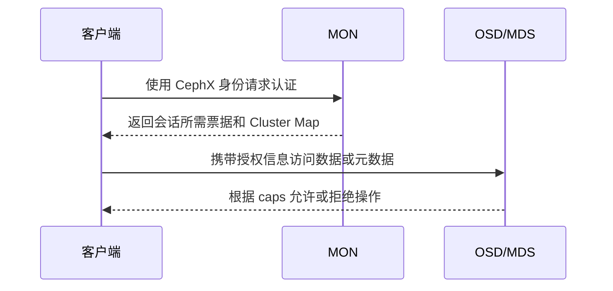

# Ceph Pool 与 CephX 实战：存储策略、配额与最小权限

《Ceph 从零基础到生产运维实战》第 11 篇

← [第 10 篇：Cephadm 管理机制](../PartIII-集群规划与部署/10-Cephadm管理机制.md)

前面的文章已经讲清 Object、PG、OSD 和 CRUSH 的关系，并完成了集群部署。从这一篇开始，我们站在应用视角使用 Ceph。

应用接入前必须先回答两个问题：

1. 数据放进哪个 Pool，采用什么冗余、故障域和容量策略？
2. 应用使用哪个 CephX 身份，它能访问哪些数据？

Pool 解决的是**数据策略与逻辑隔离**，CephX 解决的是**身份认证与访问授权**。两者组合后，才能形成可治理的多租户边界。

本文命令以 cephadm 管理的较新 Ceph 集群为例。Pool 删除、权限覆盖和密钥输出都可能造成严重后果，生产环境执行前必须备份当前配置、复核对象名称，并在测试环境验证。


## 本文目标

完成本文后，你应该能够：

- 解释 Pool 与目录、磁盘分区、租户之间的区别
- 创建副本 Pool，并正确设置应用类型
- 理解 `size`、`min_size`、CRUSH Rule 和 failure domain 的关系
- 使用 PG autoscaler 管理 PG 数量
- 配置 Pool 容量或对象数配额
- 解释 CephX 的认证与授权过程
- 为 RBD 和 CephFS 创建最小权限客户端
- 安全分发、验证、轮换和回收 keyring
- 避免误删 Pool、覆盖 caps 和泄露 `client.admin` 密钥

## Pool 到底是什么

Pool 是 RADOS 对象的逻辑集合，也是数据策略的配置边界。

一个 Pool 通常会定义：

- 副本或纠删码保护方式
- 副本数和最小可写副本数
- CRUSH Rule 与设备类型
- PG 数量及 autoscaler 策略
- 应用类型
- 容量或对象数配额
- 压缩、恢复优先级等部分高级属性



Pool 不是：

- 某几块固定磁盘的简单集合
- 文件系统中的目录
- 天然完全隔离的租户
- 备份

同一个 OSD 可以同时承载多个 Pool 的 PG。Pool 之间虽然具有逻辑策略和权限边界，但仍可能共享相同的 CPU、磁盘和网络资源。

## 创建前先做设计

不要看到业务名称就立刻创建 Pool。先记录下面这些信息。

| 项目 | 示例 |
| --- | --- |
| 业务 | OpenStack 虚拟机系统盘 |
| 接口 | RBD |
| Pool 名称 | `rbd-vm` |
| 数据保护 | 三副本 |
| failure domain | `host` |
| 设备类 | `ssd` |
| 规划有效容量 | 10 TiB |
| 容量上限 | 8 TiB 配额，预留增长和恢复空间 |
| CephX 身份 | `client.openstack-cinder` |
| 网络来源 | 存储客户端网段 |
| 数据生命周期 | 业务删除后进入 RBD Trash 7 天 |

Pool 数量也不是越多越好。每个 Pool 至少会消耗 PG、监控和运维成本。下面这些理由通常不足以单独创建新 Pool：

- 每个项目一个 Pool
- 每个用户一个 Pool
- 每个小应用一个 Pool
- 仅为了在 Dashboard 上分开显示

真正适合拆分 Pool 的边界包括：

- 冗余策略不同
- CRUSH Rule 或设备类不同
- 容量配额不同
- 数据生命周期和备份策略不同
- 性能与恢复优先级不同
- 权限隔离确实需要 Pool 级边界

## 查看现有 Pool

```bash
ceph osd pool ls
ceph osd lspools
ceph osd pool ls detail
ceph df detail
```

JSON 输出更适合脚本和审计：

```bash
ceph osd pool ls detail --format json-pretty
ceph df detail --format json-pretty
```

检查某个 Pool 的全部属性：

```bash
ceph osd pool get rbd-vm all
```

不要修改名称以点号开头的系统 Pool，也不要手工清理 RGW、CephFS 或 Manager 创建的 Pool。先确认它属于哪个服务以及服务是否仍在使用。

## 创建副本 Pool

假设集群已经存在一个面向 SSD、failure domain 为 `host` 的 CRUSH Rule：

```bash
ceph osd crush rule ls
ceph osd crush rule dump replicated_ssd
```

创建 Pool：

```bash
ceph osd pool create rbd-vm 32 32 replicated replicated_ssd --autoscale-mode=on
```

参数含义：

| 参数 | 含义 |
| --- | --- |
| `rbd-vm` | Pool 名称 |
| 第一个 `32` | 初始 `pg_num` |
| 第二个 `32` | 初始 `pgp_num` |
| `replicated` | 副本池 |
| `replicated_ssd` | 使用的 CRUSH Rule |
| `--autoscale-mode=on` | 允许 autoscaler 调整 PG |

较新版本允许省略部分 PG 参数，让集群默认值和 autoscaler 接管。命令语法会随版本演进，执行前先查看：

```bash
ceph osd pool create --help
```

创建后立即验证：

```bash
ceph osd pool ls detail
ceph osd pool get rbd-vm all
ceph osd pool autoscale-status
```

### Pool 命名建议

名称应该体现接口、用途或服务，而不是人员姓名。

推荐：

```text
rbd-vm
rbd-k8s
cephfs-prod-data
rgw-prod-data
```

不推荐：

```text
test2
new-pool
zhangsan
pool-final-v3
```

名称以后可能出现在客户端配置、监控规则、备份脚本和权限表达式中，随意改名会产生连锁影响。

## 配置副本数

设置三副本：

```bash
ceph osd pool set rbd-vm size 3
```

设置至少两个副本可写：

```bash
ceph osd pool set rbd-vm min_size 2
```

验证：

```bash
ceph osd pool get rbd-vm size
ceph osd pool get rbd-vm min_size
ceph osd pool get rbd-vm crush_rule
```

`size = 3` 表示正常情况下保存三份；`min_size = 2` 表示可用副本少于两个时停止写入。

它们解决不同问题：

- `size` 决定目标冗余
- `min_size` 决定降级状态下何时停止写入以保护一致性

为了短期恢复写入而把 `min_size` 改成 `1`，可能让最后一份数据在后续故障中丢失。它不是普通性能参数，而是数据安全边界。

### 修改 size 不会瞬间完成

将 `size` 从 2 改为 3 后，Ceph 需要为所有相关 PG 创建额外副本，会消耗：

- 原始容量
- 磁盘 I/O
- 网络带宽
- CPU
- 恢复窗口

变更前检查：

```bash
ceph -s
ceph df
ceph osd df tree
ceph pg stat
```

变更后持续观察：

```bash
watch ceph -s
```

不要同时修改大量 Pool 的副本数，也不要在容量接近阈值时增加副本数。

## CRUSH Rule 与故障域

副本数只是数量，CRUSH Rule 决定副本放到哪里。

例如三副本必须分散到不同 Host：

```bash
ceph osd crush rule dump replicated_ssd
ceph osd tree
```

重点核对：

- Rule 使用哪个 CRUSH Root
- 是否限制 `ssd`、`hdd` 或其他 device class
- failure domain 是 `osd`、`host`、`rack` 还是其他层级
- CRUSH 层级是否真实反映机架、交换机和电源关系

如果 failure domain 是 `osd`，三份数据可能落在同一台服务器的三块盘上。磁盘故障可容忍，但服务器故障会同时丢失全部副本。

修改现有 Pool 的 CRUSH Rule 会引发大规模数据迁移。生产变更前至少完成：

1. 导出当前 CRUSH Map 和 Pool 配置
2. 计算目标设备的容量余量
3. 验证新 Rule 可以满足副本约束
4. 评估迁移流量和业务窗口
5. 准备停止或回退条件

## PG Autoscaler

PG 太少可能造成数据分布和并行度不足；PG 太多会增加 OSD、MON 和 Manager 的内存及控制面负担。

较新的 Ceph 集群通常应优先使用 PG autoscaler，而不是照抄固定的“每个 OSD 100 个 PG”等旧公式。

查看状态：

```bash
ceph osd pool autoscale-status
```

常见模式：

| 模式 | 行为 |
| --- | --- |
| `on` | 自动调整 PG 数量 |
| `warn` | 只给建议和告警，不自动调整 |
| `off` | 不自动调整 |

为单个 Pool 设置：

```bash
ceph osd pool set rbd-vm pg_autoscale_mode on
```

查看：

```bash
ceph osd pool get rbd-vm pg_autoscale_mode
```

### 告诉 autoscaler 未来会用多少空间

新 Pool 还没有数据时，autoscaler 无法仅靠当前使用量理解未来规模。可以设置目标比例或目标大小：

```bash
ceph osd pool set rbd-vm target_size_ratio 0.4
```

或者：

```bash
ceph osd pool set rbd-vm target_size_bytes 8T
```

不要同时随意设置互相冲突的目标，也不要让所有 Pool 的目标比例总和超过实际可用边界。设置后检查：

```bash
ceph osd pool autoscale-status
ceph health detail
```

### bulk Pool

预计从一开始就承载大量数据的 Pool，可以在创建时考虑 `--bulk`。它帮助 autoscaler 更早分配合适的 PG，而不是等待数据增长后多次调整。

```bash
ceph osd pool create archive --bulk
```

是否支持以及具体语法取决于当前版本，执行前查看命令帮助。不要把所有 Pool 都标为 bulk。

## 应用类型配置

每个业务 Pool 都应该关联应用类型。常见值：

| 接口 | 应用类型 |
| --- | --- |
| RBD | `rbd` |
| CephFS | `cephfs` |
| RGW | `rgw` |

RBD Pool 推荐使用 `rbd pool init`：

```bash
rbd pool init rbd-vm
```

也可以显式启用应用标签：

```bash
ceph osd pool application enable rbd-vm rbd
```

查看：

```bash
ceph osd pool application get rbd-vm
ceph osd pool ls detail
```

CephFS 创建文件系统时会管理它需要的 metadata 和 data Pool；RGW 通常由服务流程创建并标记自己的 Pool。不要因为看到应用标签就认为可以随意替换或删除系统 Pool。

## Pool 配额

Pool 可以限制最大字节数或最大对象数：

```bash
ceph osd pool set-quota rbd-vm max_bytes 8T
ceph osd pool set-quota rbd-vm max_objects 10000000
```

查看：

```bash
ceph osd pool get-quota rbd-vm
ceph df detail
```

取消某项配额通常将其设置为 `0`：

```bash
ceph osd pool set-quota rbd-vm max_bytes 0
```

### 配额不是容量规划

Pool 配额只限制这个 Pool，不能替代集群整体容量预留。设置时需要同时考虑：

- 快照和 Clone
- RBD Trash
- RGW 版本对象与未完成 multipart upload
- CephFS 快照和异步清理
- 副本或 EC 的原始容量开销
- 最大故障域恢复空间
- 数据分布不均衡

例如计划允许 8 TiB 有效数据，不代表在一个仅剩 8 TiB 理论可用空间的集群里就能安全设置 8 TiB 配额。

配额接近上限时应该提前告警，而不是等到业务写失败才处理。

## 安全删除 Pool

删除 Pool 会永久删除其中全部对象，通常不可恢复。

先完成只读确认：

```bash
ceph osd pool ls detail
ceph df detail
ceph osd pool application get old-pool
ceph auth ls
```

还必须确认：

- 没有 RBD Image、快照或 Trash
- 不属于任何 CephFS
- 不属于 RGW Realm、Zone 或系统元数据
- 没有 Kubernetes StorageClass 或 PV 引用
- 没有客户端配置和自动化继续写入
- 已完成业务负责人审批和需要的备份

Ceph 默认要求 Pool 名称输入两次，并要求显式确认。本文不提供可直接复制的删除命令，因为删除应该由经过审批的 Runbook 根据当前版本生成。

查看当前版本帮助：

```bash
ceph osd pool delete --help
```

不要通过删除底层 RADOS 对象来“清理”RBD、CephFS 或 RGW 数据，应使用对应服务接口执行生命周期操作。

## CephX 认证机制

CephX 是 Ceph 自身的认证系统。默认启用时，客户端需要先证明身份，再依据 capabilities 获得权限。



CephX 提供：

- 客户端与集群组件的身份认证
- 面向 MON、MGR、OSD、MDS 的权限控制
- Pool、Namespace、CephFS 路径等范围限制

CephX 不等于：

- Linux 用户系统
- RGW 的 S3 用户
- CephFS 内部文件的 POSIX UID/GID
- 自动加密所有网络流量
- 静态数据加密

因此安全设计还要结合网络隔离、Messenger v2 secure 模式、磁盘加密、Secret 管理和上层身份系统。

## CephX 用户与 capabilities

客户端实体通常写成：

```text
client.rbd-app
client.cephfs-team-a
client.csi-rbd
```

常见 daemon caps：

| 类型 | 控制对象 |
| --- | --- |
| `mon` | 获取 Map、读取或执行集群控制命令 |
| `mgr` | Manager 模块和管理命令 |
| `osd` | Pool 或 Namespace 中的对象数据 |
| `mds` | CephFS 路径和文件元数据 |

常见权限字母包括 `r`、`w`、`x`，但准确语义与 daemon 类型及 profile 有关。优先使用官方定义的 profile，避免凭感觉拼接权限。

查看全部认证实体：

```bash
ceph auth ls
```

查看单个实体：

```bash
ceph auth get client.rbd-app
```

不要在工单、聊天或博客截图中输出 `key:` 字段。展示权限时可使用：

```bash
ceph auth get client.rbd-app | sed '/key:/d'
```

## 创建 RBD 最小权限客户端

假设客户端只允许使用 `rbd-vm` Pool：

```bash
ceph auth get-or-create client.rbd-app \
  mon 'profile rbd' \
  osd 'profile rbd pool=rbd-vm' \
  -o /etc/ceph/ceph.client.rbd-app.keyring
```

验证权限：

```bash
ceph auth get client.rbd-app
rbd --id rbd-app --keyring /etc/ceph/ceph.client.rbd-app.keyring -p rbd-vm ls
```

负向验证同样重要：该用户不应该访问其他业务 Pool。

```bash
rbd --id rbd-app --keyring /etc/ceph/ceph.client.rbd-app.keyring -p another-pool ls
```

预期结果应该是权限拒绝，而不是成功列出数据。

### 只读 RBD 客户端

某些备份或审计场景只需要读权限。具体 profile 和 caps 应按当前版本官方文档设计，并使用真实读写操作验证。不要仅凭 `ceph auth get` 的输出就认为最小权限已经生效。

## 创建 CephFS 最小权限客户端

CephFS 权限不仅涉及 OSD，还涉及 MDS 路径。

假设文件系统名为 `prod-fs`，只允许访问 `/team-a`：

```bash
ceph fs authorize prod-fs client.team-a /team-a rw \
  root_squash \
  -o /etc/ceph/ceph.client.team-a.keyring
```

查看：

```bash
ceph auth get client.team-a
```

验证时至少测试：

- 能挂载或访问授权路径
- 能在授权路径创建和读取文件
- 无法访问其他团队路径
- root 是否受到预期限制
- Quota 和快照操作是否符合设计

CephFS capabilities 的 path、root squash、snapshot 等语义较多，优先使用 `ceph fs authorize`，并参考当前版本官方 CephFS client authorization 文档。

## CephX 最小权限设计方法

为每个应用填写一张权限矩阵：

| 身份 | 接口 | 允许范围 | 操作 | 来源网络 | Secret 所有者 |
| --- | --- | --- | --- | --- | --- |
| `client.rbd-app` | RBD | `rbd-vm` | 读写 | 10.10.20.0/24 | 虚拟化平台 |
| `client.team-a` | CephFS | `/team-a` | 读写 | 10.10.30.0/24 | Team A |
| `client.audit` | 管理 | 健康与容量 | 只读 | 运维网 | 监控平台 |

设计原则：

1. 不让普通应用使用 `client.admin`
2. 不为多个互不相关的应用复用同一个 keyring
3. OSD caps 明确限制 Pool 或 Namespace
4. CephFS caps 明确限制文件系统和路径
5. 只读采集器不授予写权限
6. 自动化仅获得完成任务所需的最小权限
7. 必要时限制允许访问的 CIDR
8. 定期检查长期未使用的身份

### caps 更新是覆盖，不是追加

这是非常容易踩坑的一点：

```bash
ceph auth caps client.rbd-app ...
```

会用新提交的 capabilities 覆盖原有值。修改前必须先导出：

```bash
ceph auth get client.rbd-app -o client.rbd-app.before.keyring
ceph auth get client.rbd-app
```

然后在新命令中完整写出仍需保留的 daemon caps。变更后立即做正向和负向验证。

## Keyring 文件管理

推荐一个 keyring 只保存一个应用身份：

```text
/etc/ceph/ceph.client.rbd-app.keyring
```

文件内容类似：

```ini
[client.rbd-app]
    key = <secret>
    caps mon = "profile rbd"
    caps osd = "profile rbd pool=rbd-vm"
```

保存到文件：

```bash
ceph auth get client.rbd-app \
  -o /etc/ceph/ceph.client.rbd-app.keyring
```

设置最小文件权限：

```bash
chown root:root /etc/ceph/ceph.client.rbd-app.keyring
chmod 600 /etc/ceph/ceph.client.rbd-app.keyring
```

如果应用进程不是 root，应该将文件交给专用用户或组，并只授予该进程读取权限。不要简单使用 `chmod 644`。

### Secret 分发原则

- 使用企业 Secret Manager、配置管理系统或 Kubernetes Secret
- 传输通道必须加密
- 禁止提交到 Git
- 禁止放进容器镜像
- 禁止写入公开 Wiki、工单和聊天记录
- 日志不得打印 keyring 内容
- 每份 Secret 都要有所有者、使用方和轮换日期

可以在仓库中保存**不含 key 的权限声明模板**，但不要保存真实 keyring。

## 密钥轮换

较新版本提供认证实体密钥轮换命令：

```bash
ceph auth rotate client.rbd-app
```

轮换会使旧密钥失效，不能在未协调客户端的情况下直接执行。推荐流程：

1. 清点所有使用该身份的客户端
2. 确认维护窗口和回退方案
3. 轮换密钥
4. 通过安全通道更新所有客户端 Secret
5. 重载或滚动重启需要读取新 Secret 的应用
6. 验证正向访问
7. 验证旧密钥已经失效
8. 保存审计记录

如果业务无法无中断更新同一实体的密钥，可评估创建新的平行身份、迁移客户端、验证后再回收旧身份。

## 回收客户端身份

删除 CephX 实体不会删除 Pool 数据，但仍会使使用旧密钥的客户端立即失去访问能力。

回收前：

- 确认应用已停止或切换身份
- 检查 Kubernetes Secret、虚拟化平台和配置管理引用
- 查询该身份的所有分发位置
- 保存 caps 审计记录
- 获得应用所有者确认

删除语法：

```bash
ceph auth del client.old-app
```

执行后验证旧 keyring 无法再访问，并从 Secret 系统和客户端安全删除副本。

## 完整实验：为一个 RBD 应用建立边界

### 1. 检查集群

```bash
ceph -s
ceph osd tree
ceph osd crush rule ls
ceph osd pool autoscale-status
```

要求集群状态已知，没有未解释的 PG 异常或容量风险。

### 2. 创建并初始化 Pool

```bash
ceph osd pool create lab-rbd 32 32 replicated replicated_rule --autoscale-mode=on
ceph osd pool set lab-rbd size 3
ceph osd pool set lab-rbd min_size 2
rbd pool init lab-rbd
```

`replicated_rule` 只是示例，必须替换成当前集群已验证的 CRUSH Rule。

### 3. 设置实验配额

```bash
ceph osd pool set-quota lab-rbd max_bytes 100G
ceph osd pool get-quota lab-rbd
```

### 4. 创建客户端

```bash
ceph auth get-or-create client.lab-rbd \
  mon 'profile rbd' \
  osd 'profile rbd pool=lab-rbd' \
  -o /etc/ceph/ceph.client.lab-rbd.keyring
chmod 600 /etc/ceph/ceph.client.lab-rbd.keyring
```

### 5. 正向验证

```bash
rbd --id lab-rbd \
  --keyring /etc/ceph/ceph.client.lab-rbd.keyring \
  -p lab-rbd create demo --size 1G

rbd --id lab-rbd \
  --keyring /etc/ceph/ceph.client.lab-rbd.keyring \
  -p lab-rbd ls
```

### 6. 负向验证

尝试列出未授权 Pool，预期收到权限拒绝：

```bash
rbd --id lab-rbd \
  --keyring /etc/ceph/ceph.client.lab-rbd.keyring \
  -p rbd-vm ls
```

### 7. 清理实验

先删除测试 Image：

```bash
rbd --id lab-rbd \
  --keyring /etc/ceph/ceph.client.lab-rbd.keyring \
  -p lab-rbd rm demo
```

确认无数据、无引用后，再按照实验环境审批流程回收用户和 Pool。不要把生产 Pool 的删除命令写入通用自动化脚本。

## 常见错误

### 所有应用共用 client.admin

任意一个应用 Secret 泄露都可能危及整个集群，而且无法清楚审计是谁执行了操作。

### OSD caps 没有限制 Pool

官方文档特别提醒：具有 OSD capabilities 的用户，如果没有正确限制范围，可能访问集群中的全部 Pool。

### 修改 caps 时漏掉原有权限

`ceph auth caps` 是覆盖操作。漏写某个 daemon caps 会让业务立即失去相应能力。

### 用 Pool 代替备份

Pool 隔离不了误删除、管理员误操作、软件缺陷和整个集群故障。

### 手工固定大量 PG

旧经验公式不理解业务目标、Pool 数量和实际使用率。优先观察 autoscaler 建议。

### 通过提高配额处理容量危机

提高 Pool 配额不会增加任何磁盘空间，只会让业务继续消耗集群剩余安全余量。

### keyring 出现在 Git 或命令历史

密钥一旦进入 Git 历史，即使后来删除文件也应视为已经泄露，需要立即轮换。

## 生产检查清单

### Pool

- [ ] 名称、用途和所有者明确
- [ ] 应用类型正确
- [ ] CRUSH Rule 与真实故障域一致
- [ ] `size` 和 `min_size` 经过数据安全评审
- [ ] PG autoscaler 状态正常
- [ ] 容量目标和配额与集群预算一致
- [ ] 监控覆盖容量、对象数和 PG
- [ ] 删除流程有审批和引用检查

### CephX

- [ ] 普通应用不使用 `client.admin`
- [ ] 每个身份都有明确所有者
- [ ] OSD caps 限制到目标 Pool 或 Namespace
- [ ] CephFS caps 限制到目标文件系统和路径
- [ ] 已完成正向和负向测试
- [ ] keyring 未进入 Git、镜像或日志
- [ ] Secret 分发渠道安全
- [ ] 有轮换和回收流程

## 本文小结

Pool 是数据策略边界，CephX 是访问控制边界。

一套可靠的接入流程应该是：

```text
明确业务需求
→ 设计 Pool 和 CRUSH 策略
→ 配置 autoscaler、应用标签和配额
→ 创建独立 CephX 身份
→ 限制到最小数据范围
→ 安全分发 keyring
→ 做正向与负向验证
→ 接入监控、轮换和回收流程
```


下一篇将使用 Pool 与 CephX 基础能力创建和使用 CephFS 文件存储。

→ [第 12 篇：CephFS 文件存储实战](./12-CephFS文件存储实战.md)

## 课后练习

1. Pool 与目录有什么区别？为什么一个 Pool 不等于一组固定磁盘？
2. `size = 3`、`min_size = 2` 分别控制什么？
3. 为什么修改 CRUSH Rule 可能引发大量数据迁移？
4. PG autoscaler 的 `on`、`warn` 和 `off` 有什么差别？
5. 为什么 Pool 配额不能替代集群容量规划？
6. CephX、S3 用户和 Linux 用户有什么区别？
7. 为什么 `ceph auth caps` 变更前要导出当前权限？
8. 为一个只能访问指定 RBD Pool 的应用写出权限矩阵并完成负向测试。

## 官方资料

- [Ceph Pools](https://docs.ceph.com/en/latest/rados/operations/pools/)
- [Placement Groups](https://docs.ceph.com/en/latest/rados/operations/placement-groups/)
- [Ceph User Management](https://docs.ceph.com/en/latest/rados/operations/user-management/)
- [CephX Configuration Reference](https://docs.ceph.com/en/latest/rados/configuration/auth-config-ref/)
- [CephFS Client Authorization](https://docs.ceph.com/en/latest/cephfs/client-auth/)
