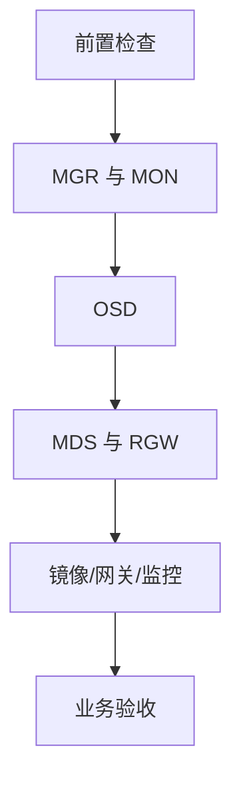

# Cephadm 滚动升级实战：评估、执行、暂停、恢复与验收

《Ceph 从零基础到生产运维实战》第 22 篇

← [第 21 篇：Ceph 性能分析与优化](./21-Ceph性能分析与优化.md)

升级 Ceph 不是「换一个容器镜像」那么简单：它同时涉及 MON/MGR/OSD/MDS/RGW、客户端兼容性、数据健康、容量、镜像仓库和业务验证。本篇给出一套可演练、可暂停、可审计的 cephadm 升级流程。


## 本文目标

读完后，你应该能够：

- 区分补丁版本升级和大版本升级
- 阅读目标版本的发布说明和升级说明
- 判断集群是否具备升级条件
- 固定目标版本或容器镜像，避免不可重复的升级
- 使用 cephadm 启动和监控滚动升级
- 理解 cephadm 的守护进程升级顺序和安全门控
- 正确使用 `pause`、`resume` 和 `stop`
- 排查镜像拉取、standby MGR、守护进程失败和版本不一致
- 完成数据面、控制面和业务面的升级验收
- 理解「停止升级」与「版本回滚」的根本区别

:::caution 重要提示
本文命令以 cephadm 管理的集群为前提。生产执行前必须使用与你当前版本对应的官方文档，而不是只看 latest 文档。不同 Ceph 大版本支持的升级路径、参数和兼容约束可能不同。
:::

## 升级真正改变了什么

Ceph 升级可能同时改变：

- 守护进程二进制和容器镜像
- MON、OSD、MDS 使用的功能集
- 默认配置和废弃参数
- on-disk 格式或元数据行为
- 客户端协议能力
- Dashboard 与 MGR 模块
- Prometheus、Grafana 等监控服务部署
- cephadm 和主机侧工具兼容性

升级期间会出现临时混合版本。只要处于官方支持路径、按照编排顺序执行，这通常是滚动升级的一部分，而不是自动等于故障。

## 补丁升级与大版本升级

### 补丁版本升级

例如同一稳定系列中的 `18.2.x` 到后续 `18.2.y`。一般风险较低，但仍可能包含：

- 行为修复
- 配置默认值改变
- 安全修复
- 与容器运行时或操作系统的兼容变化

### 大版本升级

例如从一个 Ceph 稳定系列进入下一个稳定系列。需要额外确认：

- 官方支持的升级起点
- 是否必须先升级到当前系列的最低补丁版本
- 是否允许跨越某个大版本
- 客户端最低版本
- CephFS、RGW multisite、RBD mirror 等专项步骤
- 完成后何时启用新功能或提高 `min_*_release`

**原则：绝不凭经验假设可以跨版本跳跃。** 按目标版本升级文档逐跳执行。

## 为什么 cephadm 能滚动升级

cephadm 默认按安全顺序处理守护进程，并在重启每个守护进程前询问集群是否仍能保持可用。

当前文档中的总体顺序包括：

1. MGR
2. MON
3. crash
4. OSD
5. MDS
6. RGW
7. rbd-mirror / cephfs-mirror
8. 其他网关和监控组件



不要绕开编排器同时手工重启大量 OSD。那会跳过可用性门控，并放大降级和数据不可用风险。

## 升级前必须回答的十个问题

1. 当前 Ceph 版本和目标版本是什么？
2. 官方是否支持这条直接升级路径？
3. 目标版本有哪些已知问题和不兼容变更？
4. 当前集群是否健康且所有主机在线？
5. 是否有足够容量承受意外恢复和回填？
6. 所有主机都能拉取目标镜像吗？
7. 客户端内核、librbd、CephFS 和 S3 SDK 是否兼容？
8. 是否有 standby MGR、足够 MON 和正确的故障域？
9. 出现错误时谁有权暂停，业务如何降级？
10. 如何证明升级成功，而不只是 `ceph -s` 看起来正常？

任何一个关键问题没有答案，都不应直接进入生产升级。

## 建立升级清单

### 当前版本

```bash
ceph versions
ceph --version
```

`ceph versions` 能看到各类守护进程正在运行的版本，是升级前后最重要的证据之一。

### 主机和守护进程

```bash
ceph orch host ls
ceph orch ps --refresh
ceph orch ls
```

确认：

- 所有主机在线
- 没有 `error`、`stopped` 或持续刷新失败的守护进程
- MGR 至少有一个 active 和一个 standby
- MON quorum 正常
- 各类服务实际数量符合设计

### 导出声明式规格

```bash
ceph orch ls --export > ceph-services-before-upgrade.yaml
```

这个文件可能包含部署细节，应按配置备份制度保存。它不能替代数据备份。

### 集群健康

```bash
ceph -s
ceph health detail
ceph pg stat
ceph osd tree
ceph osd perf
```

理想基线：

- PG 全部处于预期状态，通常为 `active+clean`
- 没有 OSD down
- 没有卡住的 recovery/backfill
- 没有未解释的 slow ops
- 没有刚发生但未分析的 crash

### 容量

```bash
ceph df detail
ceph osd df tree
```

不要在接近 `nearfull`、`backfillfull` 或 `full` 的状态升级。一个 OSD 或主机意外离线时必须仍有恢复空间。

### 崩溃记录

```bash
ceph crash ls-new
```

不要为了「变绿」直接归档未知 crash。先确认它们是否与当前版本问题相关。

## 目标版本与镜像策略

推荐使用明确版本：

```bash
ceph orch upgrade start --ceph-version <X.Y.Z>
```

或者明确镜像：

```bash
ceph orch upgrade start --image quay.io/ceph/ceph:<tag>
```

生产中不要使用：

- `latest`
- 会被覆盖的内部浮动标签
- 未扫描、未签名或来源不明的镜像
- 只在一台节点验证过的私有仓库路径

更严格的环境可以记录镜像 digest，以保证所有节点获取相同内容。

需要提前确认：

- DNS
- 代理
- 仓库证书
- 镜像仓库凭据
- 每个 Ceph 主机到仓库的网络
- Podman/Docker 与目标 Ceph 版本兼容性
- 本地磁盘有足够空间保存新旧镜像

## 发布说明应重点看什么

不要只看「新功能」，重点搜索：

- Upgrade
- Known issues
- Breaking changes
- CephFS
- RBD
- RGW
- cephadm
- Dashboard
- configuration option changes
- minimum client release
- incompatible on-disk changes

把与本集群相关的内容写入变更单。例如没有 CephFS 的集群不需要执行 CephFS 特有步骤，但不能因此忽略 RGW multisite 的变更。

## 客户端兼容性检查

服务端升级成功不代表业务兼容。应盘点：

- Linux 内核 Ceph/RBD 客户端版本
- `ceph-common` 与 librbd/librados
- QEMU/libvirt
- Kubernetes CSI 驱动
- CephFS kernel/FUSE 客户端
- OpenStack Cinder/Glance/Nova
- S3 SDK、网关和负载均衡器
- 备份、监控和自动化脚本

尤其不要过早关闭 msgr1、强制新协议或启用新 `require_*_release`。先完成客户端兼容验证和升级。

## 业务基线与回归测试

升级前保存：

- RBD 创建/映射/读写/删除测试
- CephFS 挂载、创建、读写、rename、删除
- RGW PUT/GET/HEAD/DELETE 和 multipart
- 业务错误率、P95/P99
- 集群 IOPS、吞吐和延迟
- Dashboard 和告警状态

测试对象必须是专门的合成数据，不要拿生产卷做破坏性验证。

升级后运行完全相同的测试，才具有可比性。

## 升级窗口和角色分工

至少明确：

- 变更负责人
- Ceph 操作人
- 业务验证人
- 网络/镜像仓库支持人
- 暂停条件和决策人
- 通知渠道
- 观测面板
- 升级步骤与时间预算

大集群升级可能持续很久。窗口应基于守护进程数量和演练数据估算，而不是凭经验写两小时。

## 关于 PG autoscaler

当前 cephadm 会在升级期间自动暂停并恢复 PG autoscaler 活动，除非管理员显式允许升级期间继续 autoscale：

```bash
ceph config get mgr mgr/cephadm/pg_autoscale_during_upgrade
```

原因是升级中进行 PG split/merge 可能显著拖慢进度。

如果根据当前版本文档需要手工控制，应先记录每个 Pool 的原始 autoscale 模式。不要粗暴修改后忘记恢复。

## CephFS 的升级注意事项

cephadm 默认可能为了安全降低活跃 MDS 数量。大型 CephFS 的单个 MDS 未必能承受全部负载，因此必须：

- 阅读目标版本的 CephFS 升级说明
- 评估 `max_mds`、standby 和客户端负载
- 在预生产环境验证
- 准备业务暂停或降载方案

某些版本支持通过 orchestrator 的 `fail_fs` 流程升级 MDS，但这会使文件系统暂时 failed，不能把它当作无感选项：

```bash
ceph config get mgr mgr/orchestrator/fail_fs
```

是否设置及如何设置，应以当前源版本和目标版本文档为准。

## 启动升级

再次检查：

```bash
ceph -s
ceph orch host ls
ceph orch ps --refresh
ceph versions
```

按明确版本启动：

```bash
ceph orch upgrade start --ceph-version <X.Y.Z>
```

或者按明确镜像启动：

```bash
ceph orch upgrade start --image <registry>/<repo>:<tag>
```

执行后立即记录：

- 命令和时间
- 操作人
- 目标版本/镜像/digest
- 初始输出
- 变更单编号

## 如何监控升级

### 升级状态

```bash
ceph orch upgrade status
```

### Ceph 状态进度

```bash
watch -n 10 ceph -s
```

### cephadm 事件日志

```bash
ceph -W cephadm
```

### 版本分布

```bash
watch -n 30 ceph versions
```

### 守护进程状态

```bash
ceph orch ps --refresh
```

同时观察：

- PG 状态
- OSD down/out
- slow ops
- MON quorum
- MGR active/standby
- MDS 状态
- RGW 错误率
- 业务 P95/P99

升级期间出现 `HEALTH_WARN` 不一定异常，但每个告警都必须解释。

## 暂停、恢复和停止

### 暂停

```bash
ceph orch upgrade pause
```

适合：

- 业务错误率升高
- 出现未知健康告警
- 依赖团队需要分析
- 镜像仓库短暂异常
- 接近窗口边界，需要保留当前状态

暂停不会把已经升级的守护进程降回旧版本。

### 恢复

问题排除并完成验证后：

```bash
ceph orch upgrade resume
```

恢复前应重新检查 `ceph -s`、业务探针和故障证据。

### 停止

```bash
ceph orch upgrade stop
```

`stop` 的含义是停止后续升级编排。它不是回滚，也不会自动降级已经升级的守护进程。

如果停止时集群处于混合版本，需要依据官方兼容矩阵和厂商支持决定继续升级、修复后恢复，还是采取专门恢复方案。

## 什么情况下必须暂停

建议预先定义硬暂停条件：

- MON 失去多数派 quorum
- 多个 OSD 意外 down
- PG inactive、incomplete 或 unavailable
- 数据损坏相关告警
- 客户端错误率超过阈值
- P99 持续超过 SLO
- RGW/MDS 等关键入口不可用
- 镜像 digest 与审批目标不一致
- 出现未在演练中见过的严重 crash

暂停之后先保存证据，不要立即批量重启或清理告警。

## UPGRADE_NO_STANDBY_MGR

升级要求可用的 standby MGR。如果出现该告警：

```bash
ceph orch ps --daemon-type mgr --refresh
ceph -s
```

检查：

- 是否实际只部署了一个 MGR
- standby 是否持续重启
- 主机是否在线
- 镜像是否可拉取
- 端口、时间和权限是否正常

若设计上应有两个 MGR，可以按已审批的 service spec 修复。官方示例：

```bash
ceph orch apply mgr 2
```

生产中应确认 placement，不要让两个 MGR 落在同一故障域。

## UPGRADE_FAILED_PULL

该告警表示至少有主机无法拉取目标镜像。常见原因：

- 版本或标签不存在
- DNS/路由/代理失败
- 仓库证书不受信任
- 凭据过期
- registry 限流
- 某个节点使用不同容器运行时配置
- 主机磁盘空间不足

排查：

```bash
ceph orch upgrade status
ceph -W cephadm
ceph orch host ls
```

在目标主机按组织标准验证 DNS、TLS、认证和镜像拉取。不要把私有仓库改成 insecure 作为长期解决办法。

如果目标镜像写错，可停止当前流程并用正确目标重新启动：

```bash
ceph orch upgrade stop
ceph orch upgrade start --ceph-version <correct-version>
```

仍要记住：这不会回滚已升级守护进程。

## 升级长时间没有进度

按顺序检查：

```bash
ceph orch upgrade status
ceph -W cephadm
ceph -s
ceph health detail
ceph orch ps --refresh
ceph versions
```

常见门控原因：

- 主机离线
- 没有 standby MGR
- OSD 当前不适合停止
- PG 状态不安全
- 镜像拉取失败
- 某守护进程升级后启动失败
- MDS 或 CephFS 安全条件不满足
- orchestrator/MGR 模块异常

「进度慢」可能是 cephadm 在保护可用性。不要直接绕过门控。

## 某个守护进程启动失败

先定位守护进程：

```bash
ceph orch ps --refresh
ceph health detail
```

查看 cephadm 事件和对应日志：

```bash
ceph -W cephadm
cephadm logs --name <daemon-name>
```

根据实际部署也可使用对应 systemd journal。重点查：

- 配置参数是否被删除或改名
- 挂载、目录、权限
- 端口冲突
- 容器启动错误
- keyring 或证书
- 主机内核/容器运行时兼容性
- 新版本已知问题

不要在未保存日志前反复 redeploy，这会覆盖时间线并增加变量。

## DAEMON_OLD_VERSION

混合版本时间过长时可能出现旧版本告警。先确认升级是否仍在进行：

```bash
ceph orch upgrade status
ceph versions
```

如果升级因维护计划暂停，某些环境会临时静默告警，但必须记录原因和恢复日期：

```bash
ceph health mute DAEMON_OLD_VERSION --sticky
```

升级完成后取消静默：

```bash
ceph health unmute DAEMON_OLD_VERSION
```

静默只隐藏告警，不解决版本不一致。不要用它制造「HEALTH_OK」。

## 分阶段升级的边界

新版本 cephadm 支持通过 daemon type、service、host 或 limit 限制一批升级对象，例如：

```bash
ceph orch upgrade start --image <image> \
  --daemon-types mgr,mon --hosts <host-list>
```

或：

```bash
ceph orch upgrade start --image <image> \
  --services <service-list> --limit 2
```

但要注意：

- 参数是否可用取决于源版本
- cephadm 仍会强制守护进程类型顺序
- 限制参数不等于可以随意跳过依赖
- 部分 OSD 分批升级需要按当前版本文档验证
- 大规模分批方案必须先演练

不要从 latest 文档复制参数到旧集群后直接执行。

## OSD 升级期间的特殊原则

- 不要同时大范围调整 CRUSH 拓扑
- 不要同步进行换盘、扩容和大规模 reweight
- 不要在容量紧张时启动
- 观察 `ceph osd perf`、PG 和恢复流量
- 保留足够的失败域冗余
- 不要手工并行重启大量 OSD

某些新版本支持按 CRUSH bucket 约束 OSD 升级并使用 `osd ok-to-upgrade` 门控。该功能和参数随版本演进，只应根据当前版本官方文档使用。

## 监控栈为什么也要验收

cephadm 可能在升级过程中刷新：

- node-exporter
- Prometheus
- Alertmanager
- Grafana
- ceph-exporter

升级后检查：

- Prometheus targets
- 指标是否断点
- Alertmanager 是否能发送测试告警
- Grafana 数据源和 Dashboard
- Ceph MGR prometheus 模块
- TLS 和认证是否仍有效

没有监控的「升级成功」无法被证明。

## 升级完成后的技术验收

### 所有版本一致

```bash
ceph versions
ceph orch ps --refresh
```

确认没有意外旧版本守护进程。

### 集群健康

```bash
ceph -s
ceph health detail
ceph pg stat
ceph osd tree
ceph osd perf
```

### 控制面

```bash
ceph quorum_status --format json-pretty
ceph mgr dump
ceph orch host ls
ceph orch ls
```

### CephFS

```bash
ceph fs status
```

验证 MDS active/standby、客户端状态和实际文件操作。

### RGW

```bash
ceph orch ps --daemon-type rgw --refresh
```

执行真实协议的 PUT/GET/HEAD/DELETE 合成测试。

### RBD

使用专用测试镜像进行创建、读写、快照或映射验证，不要只运行 `rbd ls`。

## 业务验收

至少比较升级前后的：

- 请求成功率
- P50/P95/P99
- RBD I/O 错误
- CephFS mount 与元数据操作
- RGW 4xx/5xx
- 应用日志
- 备份和复制任务
- 告警链路

建议持续观察一个完整业务周期，而不是命令结束后立刻关闭变更单。

## 升级后主机侧工具

官方文档提示，集群升级完成后还需将主机上的 cephadm 或非 cephadm shell 场景使用的 `ceph-common` 更新到兼容版本。

这属于主机软件变更，应：

- 按发行版仓库和软件管理流程执行
- 逐主机验证
- 注意 Podman/Docker 兼容矩阵
- 避免在 Ceph 守护进程升级中间同时升级整个操作系统

存储升级、容器运行时升级、内核升级最好拆分为可归因的独立变更。

## 回滚的现实

Ceph 不是普通无状态 Web 服务。升级后可能出现：

- 新版本写入新的元数据格式
- MON/OSDMap 功能位变化
- 配置和守护进程状态变化
- 客户端已经使用新行为

因此：

- `upgrade stop` 不是 downgrade
- 把镜像标签改回旧版不等于安全回滚
- 不应在没有官方路径和支持指导时自行批量降级
- 真正的恢复可能涉及修复后继续升级、恢复配置、重建服务，甚至业务数据恢复

最重要的风险控制是：

- 选择支持路径
- 预生产演练
- 健康基线
- 小步执行
- 明确暂停条件
- 有独立的数据备份与灾备方案

## 一份可直接采用的升级 Runbook

### T-14 天

- 阅读发布说明和已知问题
- 确认支持路径
- 完成客户端盘点
- 在预生产复现拓扑并升级
- 记录耗时和问题

### T-7 天

- 修复现有 `HEALTH_WARN`
- 清理容量风险
- 验证镜像仓库和目标镜像
- 完成备份与恢复抽检
- 确认人员和窗口

### T-1 天

- 再次记录健康、版本、容量和业务基线
- 冻结非必要 Ceph 变更
- 确认没有换盘、回填或 scrub 高峰
- 通知业务方

### T0

- 四眼复核目标版本
- 运行最后一次前置检查
- 启动升级
- 持续观察 cephadm、健康和业务

### 升级完成

- 版本一致性
- 控制面和 PG 验收
- RBD/CephFS/RGW 合成测试
- 监控和告警验收
- 取消临时静默
- 恢复被暂停的计划任务
- 进入持续观察期

## 升级前检查清单

- 当前版本和目标版本明确
- 官方支持直接升级路径
- 已阅读源版本与目标版本说明
- 目标镜像已固定并验证来源
- 所有主机在线且能拉取镜像
- MON quorum 正常
- 至少一个 standby MGR 正常
- PG 处于预期健康状态
- 没有 OSD down 和未知 slow ops
- 容量有恢复余量
- CephFS/RGW/mirroring 专项已检查
- 客户端兼容性已验证
- 数据备份和恢复演练有效
- 暂停条件和负责人明确
- 业务探针与面板准备完毕

## 升级后检查清单

- `ceph orch upgrade status` 不再显示进行中
- `ceph versions` 符合目标
- 守护进程均正常运行
- MON/MGR/OSD/MDS/RGW 状态正常
- PG 回到预期状态
- 无未知 crash 和持续 slow ops
- 业务合成读写成功
- 错误率和 P99 回到基线
- 镜像、备份和定时任务正常
- Prometheus、Alertmanager、Grafana 正常
- 临时静默和配置已撤销
- 主机侧工具已按计划升级
- 变更记录、耗时和异常已归档

## 常见误区

### 误区一：HEALTH_OK 就可以升级

还要验证容量、主机、镜像、客户端、备份和业务基线。

### 误区二：容器化就能随便回滚镜像

Ceph 是有状态系统，协议和元数据兼容性比容器标签更重要。

### 误区三：upgrade stop 会恢复旧版本

它只停止后续编排。

### 误区四：一次升级同时做内核、网络和 CRUSH 变更更省窗口

这样很难归因，也会叠加故障风险。

### 误区五：升级期间告警全部可以忽略

临时 `HEALTH_WARN` 可能正常，但每条告警必须可解释。

### 误区六：守护进程全是新版本就算完成

还需要业务、监控、备份、复制和持续观察验收。

## 本文小结

一次可靠的 Ceph 升级应当具备以下闭环：

- 使用官方支持的版本路径
- 在预生产环境演练
- 保存健康、容量、版本和业务基线
- 固定目标镜像
- 让 cephadm 按安全顺序滚动升级
- 出现硬条件时暂停并保存证据
- 明确 `stop` 不是回滚
- 用数据面、控制面、业务面和监控面完成验收
- 撤销临时措施并复盘


下一篇将讲解 Ceph 网络设计与故障排查：Public/Cluster Network、丢包、MTU 与带宽。

→ [第 23 篇：Ceph 网络设计与故障排查](./23-Ceph网络设计与故障排查.md)

## 课后练习

1. 为什么大版本升级不能假设可以跨版本跳跃？
2. cephadm 为什么先升级 MGR 和 MON，再处理 OSD？
3. 为什么必须有 standby MGR？
4. `upgrade pause`、`resume`、`stop` 的区别是什么？
5. 为什么 `stop` 不是回滚？
6. 镜像拉取失败应从哪些层面排查？
7. 为什么升级前需要容量余量？
8. CephFS 大规模多 active MDS 环境为什么要特别评估？
9. 守护进程版本一致后还需要哪些业务验收？
10. 为什么不建议把 Ceph、操作系统、网络和 CRUSH 变更合并？

## 官方资料

- [Cephadm 升级 Ceph](https://docs.ceph.com/en/latest/cephadm/upgrade/)
- [Cephadm 故障排查](https://docs.ceph.com/en/latest/cephadm/troubleshooting/)
- [Ceph 版本发布索引](https://docs.ceph.com/en/latest/releases/)
- [Cephadm 主机与服务管理](https://docs.ceph.com/en/latest/cephadm/services/)
