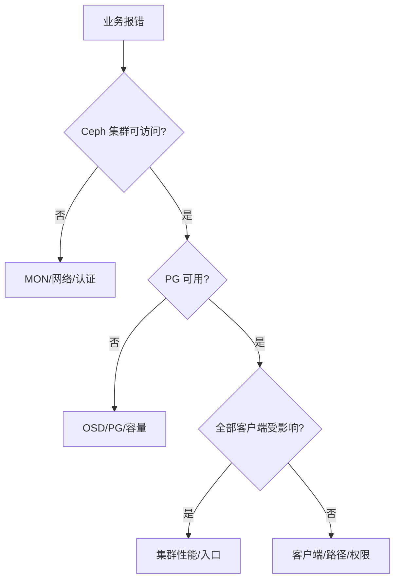

# Ceph 生产事故应急与复盘：接警、止损、证据、恢复和防止复发

《Ceph 从零基础到生产运维实战》第 27 篇

← [第 26 篇：Ceph 自动化巡检与报告](./26-Ceph自动化巡检与报告.md)

生产事故中最危险的并不是不会某条命令，而是在信息不完整时同时修改多个变量：批量重启 OSD、清空防火墙、强制修复 PG、调整 CRUSH，最终破坏仅存的数据副本。本篇建立一套可用于值班、应急演练和事故复盘的 Ceph 处理框架。


## 本文目标

读完后，你应该能够：

- 按数据风险和业务影响对 Ceph 事故分级
- 在事故开始五分钟内建立统一时间线
- 区分止损、恢复、修复和根因分析
- 使用最小只读命令保存集群证据
- 判断 MON、OSD、PG、容量、网络和客户端故障范围
- 避免批量重启、错误 out/purge 和盲目调参
- 处理单盘、整机、MON quorum、full、网络分区等场景
- 为数据一致性问题设置更严格的审批边界
- 设计恢复验收与持续观察
- 写出关注系统原因而不是个人责任的事故复盘

:::danger 最高原则
在确认 PG 副本和故障域前，不要销毁、格式化、purge 或重新部署任何可能含有唯一数据副本的 OSD。
:::

## 四个阶段不要混在一起

### 止损

目标是阻止影响继续扩大，例如：

- 停止错误发布
- 禁止新增写入
- 暂停会扩大故障的自动化
- 隔离异常网络或主机
- 保护最后可用副本

### 恢复服务

让关键业务回到最低可接受水平，不要求此时已经找到根因。

### 永久修复

修复根本缺陷并恢复冗余、性能和正常运维状态。

### 根因与预防

解释事故为什么发生、为什么没有被提前发现、为什么影响这么大，并改进系统。

事故中可以并行推进，但记录中必须区分。临时降低恢复速度保护业务是止损，不是永久修复。

## 建议的事故等级

| 等级 | 数据与业务表现 | 响应方式 |
| --- | --- | --- |
| SEV-1 | 数据不可用/可能丢失、核心业务大面积失败、MON 丢失多数派 | 立即全员响应、冻结变更、事故指挥 |
| SEV-2 | 冗余显著下降、部分业务中断、容量/性能风险快速扩大 | 值班和相关团队立即处理 |
| SEV-3 | 单节点故障但数据可用、性能轻度下降、可控恢复 | 工单跟踪并限时恢复 |
| SEV-4 | 无业务影响的配置漂移、单次告警、容量趋势 | 日常运维处理 |

数据一致性风险应提升等级。即使暂时没有用户报错，unfound、incomplete 或可能只剩唯一副本也不能按普通告警处理。

## 事故角色

### Incident Commander

- 决定优先级
- 控制变更
- 协调团队
- 决定升级、降级和结束事故

### Ceph Operator

- 执行已确认命令
- 解释集群状态
- 保存执行前后证据

### Scribe

- 记录时间线
- 记录命令、输出摘要和决策
- 维护待办和假设

### Business/Client Owner

- 验证业务
- 决定是否停写或降级
- 提供错误率、延迟和受影响范围

### Infrastructure Support

根据情况包括网络、Linux、硬件、机房、安全和数据库团队。

一个人可以兼任，但必须明确「谁决定、谁操作、谁记录」。

## 前五分钟做什么

1. 声明事故和严重度
2. 冻结与事故无关的 Ceph、网络、主机变更
3. 建立统一沟通频道和时间线
4. 记录当前时间、时区和报警来源
5. 执行最小只读采集
6. 判断是否存在数据不可用或唯一副本风险
7. 决定是否需要业务停写
8. 指定下一次状态更新时间

最小采集：

```bash
date -Is
ceph -s
ceph health detail
ceph osd tree
ceph pg stat
ceph df detail
ceph orch ps --refresh
```

如果命令失败，也要记录失败类型和耗时。

## 建立事实、假设和动作三栏

**已确认事实**

- 10:03 开始出现 RGW 5xx
- osd.12、osd.13 同在 host-a 并 down
- 3 个 PG inactive
- 交换机端口在 10:01 down

**待验证假设**

- host-a 断电
- TOR-A 故障
- OSD 进程因磁盘超时退出

**已执行动作**

- 10:06 暂停非必要部署
- 10:08 通知业务停止批处理
- 10:10 保存 host-a 内核日志

不要把「怀疑网络故障」写成事实。假设变化时，保留旧记录而不是覆盖。

## 只读证据包

建议创建受控目录：

```bash
incident_dir="/secure/incidents/INC-20260806-001"
mkdir -p "${incident_dir}"
chmod 700 "${incident_dir}"
```

保存 JSON：

```bash
ceph status --format json-pretty > "${incident_dir}/ceph-status.json"
ceph health detail --format json-pretty > "${incident_dir}/health-detail.json"
ceph osd tree --format json-pretty > "${incident_dir}/osd-tree.json"
ceph osd dump --format json-pretty > "${incident_dir}/osd-dump.json"
ceph pg dump pgs_brief --format json-pretty > "${incident_dir}/pgs-brief.json"
ceph df detail --format json-pretty > "${incident_dir}/df-detail.json"
ceph versions --format json-pretty > "${incident_dir}/versions.json"
ceph orch ps --refresh --format json-pretty > "${incident_dir}/orch-ps.json"
```

这些输出包含内部地址、主机名和拓扑。不要上传到公开平台。

## 保存日志而不制造新故障

cephadm 集群常使用 journald：

```bash
journalctl -u 'ceph-<fsid>@osd.<id>' \
  --since '2026-08-06 09:45:00' \
  --until '2026-08-06 10:30:00'
```

cephadm 事件：

```bash
ceph log last cephadm
ceph -W cephadm
```

主机内核：

```bash
journalctl -k \
  --since '2026-08-06 09:45:00' \
  --until '2026-08-06 10:30:00'
```

原则：

- 时间范围明确
- 先保存原始日志，再 grep
- 不在所有节点同时开启 debug
- debug 结束后恢复配置
- 日志分区空间必须监控
- 使用统一时区或同时记录 UTC

全局 debug 可能迅速写满磁盘，形成第二起事故。

## 首先判断影响在哪一层



不要把任何客户端超时都当作 OSD 故障。也不要因为 `ceph -s` 正常就排除业务接口问题。

## 关键状态的风险顺序

一般从高到低关注：

1. 数据丢失/损坏迹象
2. PG unavailable、inactive、incomplete、stale
3. MON quorum
4. OSD down 与副本数
5. full/backfillfull
6. 大量 degraded/undersized
7. recovery/backfill
8. slow ops 与性能
9. 单个守护进程和非关键模块

实际严重度仍结合业务。例如只有一个 RGW 入口全部不可用时，集群数据健康但对象业务仍可能是 SEV-1。

## 绝对不要在信息不足时做的事

- 同时重启所有 MON
- 批量重启整类 OSD service
- 将多个 OSD 同时 out
- purge 仍可能含唯一副本的 OSD
- 清空防火墙或重启全部交换机
- 将 Pool `min_size` 降到 1 以恢复写入
- 提高 full ratio 掩盖容量问题
- 对未知 PG 直接 `mark_unfound_lost`
- 删除损坏对象「让告警消失」
- 在生产盘执行 FIO 或擦盘
- 同时修改恢复、网络、CRUSH 和内核参数

每个动作都应回答：它会影响哪些副本、能否回滚、如何验证。

## 场景一：单个 OSD down

### 判断

```bash
ceph -s
ceph health detail
ceph osd tree
ceph osd find <id>
ceph orch ps --daemon-type osd --refresh
```

主机：

```bash
journalctl -u 'ceph-<fsid>@osd.<id>' --since '-30 min'
journalctl -k --since '-30 min'
lsblk
```

### 关键问题

- 仅进程 down，还是盘/主机/网络故障？
- OSD 当前是 in 还是 out？
- PG 是否仍 active？
- 设备是否出现 I/O error、reset、timeout？
- 该 OSD 是否刚替换或部署？
- 是否存在更多同型号盘异常？

### 动作原则

- 若只是明确的瞬时进程故障，可在保存日志后重启该 daemon
- 若盘硬故障，按换盘流程执行
- 不要因单次 down 立即 purge
- 观察恢复对业务的影响
- 恢复后验证 PG、容量和设备健康

## 场景二：整台 OSD 主机失联

### 识别

- 同一 host 下多个 OSD 同时 down
- `ceph orch host ls` 显示 offline
- SSH、ICMP 或交换机端口异常
- PG 大量 degraded/undersized

### 先不要急着 out

如果主机可快速恢复，立即将整机 OSD out 会触发大规模回填；主机回来后又再次迁移数据。

需要评估：

- 故障预计时长
- 当前 Pool size/min_size
- 剩余容量
- 恢复窗口
- 是否还有同故障域风险
- 业务 SLO
- `mon_osd_down_out_interval` 和 `noout` 状态

### 主机维护与真实故障不同

维护应提前使用经过验证的 host maintenance 流程；真实故障应根据 MTTR 和数据风险决定何时 out。

主机恢复后：

```bash
ceph osd tree
ceph pg stat
ceph orch ps --hostname <host> --refresh
```

还要检查根因是电源、内核、NIC、容器运行时还是公共依赖。

## 场景三：多个 OSD 同时 down

优先找共同故障域：

- 同一主机
- 同一机架
- 同一电源
- 同一交换机/VLAN
- 同一 DB/WAL 设备
- 同型号固件
- 同一批次变更

命令：

```bash
ceph osd tree
ceph osd crush tree
ceph pg dump_stuck inactive
ceph pg dump_stuck stale
```

如果多个副本恰好位于同一真实故障域，可能暴露 CRUSH 标签错误。恢复前保护现存盘，不要继续按错误拓扑批量操作。

## 场景四：MON quorum 丢失

表现：

- `ceph -s` 超时
- 客户端无法获取新 map 或认证
- 仍有缓存 map 的 I/O 可能短时继续
- MON 反复选举

检查各 MON 主机：

```bash
systemctl status 'ceph-<fsid>@mon.<name>'
journalctl -u 'ceph-<fsid>@mon.<name>' --since '-30 min'
ss -lntp | grep -E ':3300|:6789'
timedatectl status
df -h
```

还要检查：

- MONMap 中地址
- 3300/6789 双向连通
- 时间
- MON 数据盘
- 网络分区两侧各有哪些 MON
- 最近是否调整 MON 或 DNS

恢复多数派优先。不要在不同网络分区分别创建自认为正确的新 quorum。

从 MON store 恢复属于高级且高风险操作，应严格使用对应版本官方恢复文档或厂商支持。

## 场景五：集群 full 或接近 full

检查：

```bash
ceph -s
ceph health detail
ceph df detail
ceph osd df tree
ceph osd dump | grep -E 'full_ratio|backfillfull_ratio|nearfull_ratio'
```

先判断：

- 是全局容量不足还是单 OSD 倾斜
- 哪个 Pool 增长
- 是否有快照、trash、RGW lifecycle、日志或备份异常
- 是否存在 out OSD 导致容量更紧张
- 是否有可安全清理的数据
- 扩容需要多久

止损选项：

- 与业务协调暂停非关键写入
- 恢复误 out 且健康的 OSD
- 清理经过业务确认的无用数据
- 加速已准备好的扩容
- 处理严重数据倾斜

危险动作：

- 直接提高 full ratio
- 删除未知 Pool/快照
- 降低副本数
- 在空间不足时触发大规模 reweight/backfill

提高 ratio 只会把最终停止点向后推，可能让恢复空间彻底消失。

## 场景六：PG inactive、incomplete 或 stale

先定位：

```bash
ceph health detail
ceph pg dump_stuck inactive
ceph pg dump_stuck stale
ceph pg <pgid> query
ceph pg map <pgid>
```

要回答：

- acting/up set 有哪些 OSD
- 哪些 OSD down/out
- 最后完整 interval
- 是否仍能恢复某个旧 OSD
- 是否因 MON map、网络或 OSD store 问题
- 是否有 unfound objects

操作优先级通常是恢复原 OSD/主机/网络，让 PG 找回足够历史，而不是立刻声明对象丢失。

`ceph pg repair` 主要用于特定 inconsistent 场景，不是所有非 active PG 的通用修复按钮。

`mark_unfound_lost` 会接受数据丢失结果，必须经过数据所有者、事故指挥和专业支持审批。

## 场景七：PG inconsistent / scrub error

采集：

```bash
ceph health detail
rados list-inconsistent-pg <pool>
rados list-inconsistent-obj <pgid> --format json-pretty
ceph pg <pgid> query
```

先判断：

- 是 data digest、omap、size 还是 read error
- 哪个 shard/OSD 异常
- 底层设备是否报告介质错误
- 是否存在已知版本 bug
- 正确副本是否明确

再根据对象类型、Pool 和官方流程决定 repair。

注意：

- 自动 repair 可能用某一副本覆盖另一副本
- EC Pool 和 replicated Pool 行为不同
- CephFS metadata/RGW index 对象不能当普通文件随意删除
- 修复前应保存 inconsistent 输出和相关日志

数据一致性事故应优先寻求有经验人员或供应商支持。

## 场景八：大量 slow ops

先确定是现象还是根因：

```bash
ceph -s
ceph health detail
ceph osd perf
ceph pg stat
```

关联检查：

- recovery/backfill/scrub
- 最慢 OSD
- 磁盘 await/util 和内核 reset
- 网络丢包/重传
- CPU steal、load、OOM
- BlueStore DB/WAL
- 单个热 PG/Pool/客户端
- mClock profile

缓解必须对应瓶颈：

- 业务受恢复影响，可临时切换经过验证的 QoS 策略
- 单盘故障，隔离并换盘
- 网络丢包，修复链路
- 热点业务，限流或扩展入口
- full 附近，先处理容量

不要看到 slow ops 就全局增加线程。更多并发可能让拥塞更严重。

## 场景九：OSD flapping

表现为 OSD 反复 down/up。可能原因：

- heartbeat 网络抖动
- 主机 CPU stall
- 磁盘 I/O 长时间阻塞
- 进程 crash/restart
- MTU/路由不一致
- 容器运行时或系统服务问题

时间线应对齐：

- OSD 日志
- 内核日志
- 网卡计数器
- 交换机端口
- systemd restart count
- crash module
- 业务延迟

反复手工 restart 可能看似短暂恢复，但会清除最有价值的现场状态。

## 场景十：只有部分客户端失败

这通常提示：

- 客户端 key/caps
- 客户端版本
- 某子网或 MTU
- DNS/MON 地址
- 内核 RBD/CephFS bug
- 特定 Pool/namespace
- 某节点 CSI plugin
- 入口负载均衡

对比健康和异常客户端：

```bash
ceph -s
ip route get <mon-ip>
nc -vz <mon-ip> 3300
ceph auth get client.<name>
```

检查客户端日志、内核日志和实际使用的 keyring/config。不要修改整个集群来迁就一台错误配置的客户端。

## 场景十一：RBD 业务异常

区分：

- 无法创建/删除镜像
- 无法 map
- map 后 I/O 超时
- exclusive-lock/watch 异常
- mirror lag
- 单镜像还是整个 Pool
- CSI provisioning 还是数据面

检查：

```bash
rbd info <pool>/<image>
rbd status <pool>/<image>
rbd mirror image status <pool>/<image>
ceph osd pool stats <pool>
```

在 Kubernetes 场景还要看 controller/node plugin、VolumeAttachment 和节点内核日志。

不要在业务仍挂载时强制删除 watcher、lock 或 image。

## 场景十二：CephFS 业务异常

区分：

- mount 失败
- 目录操作卡住
- 文件数据 I/O 卡住
- 单路径/单客户端
- MDS failover
- damaged rank
- 客户端 session/lock 问题

检查：

```bash
ceph fs status
ceph health detail
ceph tell mds.<name> status
ceph orch ps --daemon-type mds --refresh
```

同时检查 metadata Pool 与 data Pool PG 状态。目录能列出不代表数据 Pool 正常；数据 OSD 健康也不代表 MDS 元数据路径正常。

驱逐 CephFS client 可能导致客户端 I/O 错误，应先确认 client ID、业务归属和影响。

## 场景十三：RGW 5xx

分层：

1. DNS
2. 负载均衡/Ingress
3. RGW Pod/daemon
4. RGW 到 MON/OSD
5. RGW metadata/index/data Pool
6. 外部 KMS/身份系统
7. multisite

检查：

```bash
ceph orch ps --daemon-type rgw --refresh
ceph health detail
radosgw-admin sync status
```

结合请求 ID 关联负载均衡、RGW 和应用日志。

4xx 往往是认证、权限、配额或请求问题；5xx 更可能是服务端依赖异常，但不能只按状态码猜测。

## 场景十四：cephadm 无法管理主机

检查：

```bash
ceph orch status
ceph orch host ls
ceph cephadm check-host <hostname>
ceph log last cephadm
```

可能原因：

- SSH
- hostname/FQDN 不一致
- 时间同步
- Podman/Docker
- Python/LVM 依赖
- 主机磁盘满
- registry
- cephadm paused
- stray daemon

数据面可能仍在运行，但编排面失效会阻止升级、重启和服务收敛。不要因为 `ceph -s` 仍可用就忽略。

## 场景十五：网络分区

先画出：

- 哪些客户端到哪些 MON/OSD 不通
- MON 分区两侧数量
- Public 和 Cluster Network
- 同机架/跨机架
- 交换机、VLAN、路由和防火墙变更

检查：

```bash
ip route get <peer-ip>
ip -s link
ethtool -S <iface>
ss -ntp
ping -c 5 <peer-ip>
tracepath <peer-ip>
```

不要清空防火墙或同时重启两台交换机。目标是恢复原有连通性和多数派，不是在事故中重新设计网络。

## 场景十六：误操作或自动化失控

常见例子：

- 错误 `useAllDevices` 消耗数据盘
- 脚本批量 out OSD
- 误设 `noout`/`norecover`
- 删除 service spec
- 错误 lifecycle 删除对象
- 误改 CRUSH rule
- `ceph auth caps` 覆盖原权限

第一步是停止自动化控制器或错误任务继续收敛。然后：

1. 保存 Git/CI/审计记录
2. 比较变更前配置
3. 确认实际影响
4. 回滚最小配置
5. 验证控制器不会再次覆盖
6. 恢复业务与冗余

在声明式系统中，只手工修现场对象而不修 Git/CR，错误可能几秒后再次出现。

## 何时停写

考虑停写的情况：

- full 导致写入行为不可预测
- 只剩最低副本且继续写会扩大恢复量
- 两站点可能双主
- 应用正在持续写入错误数据
- 勒索/凭据泄露
- 数据一致性状态未知
- 恢复需要 application-consistent 时间点

停写决策需要业务参与。应明确：

- 哪些业务停
- 读是否保留
- 何时开始
- 缓存/队列如何处理
- 恢复后如何重放
- 数据差异如何对账

存储团队不能只从集群角度决定业务数据语义。

## 变更前的三问

每次事故操作前问：

1. 预期变化是什么？
2. 最坏结果是什么？
3. 如何确认成功并回滚？

记录模板：

```text
10:34 +08:00
动作：仅重启 osd.12 daemon
依据：磁盘和网络正常，进程因已知 crash 退出，PG 仍 active
预期：osd.12 在 2 分钟内 up，版本不变
停止条件：出现其他 OSD down 或 PG inactive
回滚：停止重复重启，保存新日志并升级处理
执行人/复核人：A/B
```

这比在聊天中只写「我重启试试」安全得多。

## 一次只改变一个变量

如果同时：

- 重启 OSD
- 改 recovery
- 调 MTU
- 清防火墙
- reweight

即使系统恢复，也无法知道哪项有效，哪项制造了隐患。

每个动作后设观察窗口：

```bash
ceph -s
ceph health detail
ceph pg stat
ceph osd perf
```

并观察业务错误率和 P99，而不是只看命令是否返回 0。

## 恢复验收

### 控制面

- MON quorum 稳定
- MGR active/standby
- cephadm 可管理主机
- 版本和 service spec 正常

### 数据面

- PG 回到目标状态
- 无 inactive/incomplete/unfound
- OSD up/in 符合设计
- 容量和分布安全
- recovery 完成或有明确计划

### 业务面

- RBD、CephFS、RGW 合成测试
- 核心应用读写
- 错误率、延迟、吞吐
- 数据库/文件/对象一致性对账

### 运维面

- 临时 flags 已撤销
- debug 已关闭
- 告警静默已取消
- 自动化重新启用并验证
- 备份、镜像和监控恢复

## 何时可以降低事故等级

不是「命令成功」就降级。建议满足：

- 业务恢复并持续稳定一个观察窗口
- 数据不可用风险解除
- 冗余恢复或已有可接受计划
- 故障不再扩大
- 临时措施已登记
- 值班和业务负责人同意
- 下一阶段负责人和截止时间明确

即使业务恢复，若集群仍严重 degraded，事故可以从 SEV-1 降到 SEV-2，而不是直接关闭。

## 事故时间线示例

| 时间 | 事实/动作 | 结果 |
| --- | --- | --- |
| 10:03 | RGW 5xx 告警 | 对象写入失败率 38% |
| 10:05 | 声明 SEV-1，冻结 Ceph 变更 | 建立事故频道 |
| 10:07 | 发现 rack-b 8 个 OSD down | 120 PG degraded，3 inactive |
| 10:10 | 网络团队确认 TOR-B 双上联异常 | 定位共同故障域 |
| 10:14 | 未将 OSD out，先恢复交换链路 | 避免大规模回填 |
| 10:19 | OSD 全部 up，PG 开始 peering | 业务逐步恢复 |
| 10:27 | PG active+clean，RGW 错误率恢复 | 进入观察期 |
| 11:10 | 取消变更冻结，事故降级 | 建立后续工单 |

时间线写事实，不写「很快」「应该」「可能已经」。

## 复盘不是事故流水账

一份有效复盘包括：

- 影响摘要
- 用户可感知表现
- 精确时间线
- 技术根因
- 触发条件
- 扩大影响的因素
- 检测和响应为何延迟
- 哪些防线有效
- 哪些操作有风险
- 可验证的改进项

## 五个为什么示例

现象：一台交换机故障导致大量 PG 不可用。

1. 为什么 PG 不可用？三副本中的多个副本同时失联。
2. 为什么多个副本同时失联？它们实际位于同一机架网络。
3. 为什么 CRUSH 没有避免？部分节点的 rack 标签填写错误。
4. 为什么标签错误未被发现？上线只检查 OSD 数量，没有验证物理拓扑与 CRUSH 对应。
5. 为什么没有自动检查？巡检系统未保存和比较 CMDB 与 CRUSH hierarchy。

根因不是「交换机坏了」，而是故障域建模与验收不足让单点故障突破副本设计。

## 根因、触发因素和放大因素

### 根因

导致系统具备故障条件的核心缺陷。

### 触发因素

让缺陷在此时暴露的事件，例如链路断开、发布、磁盘故障。

### 放大因素

扩大影响或延长恢复的条件，例如：

- 容量过高
- 告警延迟
- Runbook 缺失
- 权限不足
- 备件不足
- 恢复流量无 QoS
- 同时进行多个变更

只修触发因素，下次仍可能由另一个事件触发同一根因。

## 改进项必须可验收

差的改进项：

- 加强监控
- 提高责任心
- 优化流程
- 后续注意

好的改进项：

```text
动作：巡检每日比较 CMDB rack 与 CRUSH rack，并对不一致触发 Warning
负责人：存储平台组
截止时间：2026-08-20
验收：测试环境修改一个 rack 标签，5 分钟内产生告警并关联节点清单
```

每项应有：

- 负责人
- 截止日期
- 优先级
- 验收方法
- 跟踪工单
- 是否降低根因、检测或恢复风险

## 无责复盘不等于无人负责

无责（blameless）意味着关注：

- 当时有哪些信息
- 为什么该动作在当时看起来合理
- 系统为什么允许单个错误产生巨大影响
- 如何增加防呆、审批和可观测性

它不意味着：

- 忽略违规
- 不分配改进项
- 不审查高风险操作
- 不处理故意破坏

目标是让下一位处于同样压力的人更难做错、更容易做对。

## 演练场景

建议季度演练：

- 单 OSD 故障
- 整台 OSD 主机断电
- 单 TOR 链路故障
- 一个 MON 丢失
- RGW 单实例故障
- RBD/CephFS 客户端权限失效
- 容量增长到扩容线
- RBD mirror lag
- 备份恢复
- 泄露客户端 key

演练要求：

- 先定义预期
- 不在未知生产集群直接注入
- 有停止条件
- 记录实际 RTO
- 验证告警、Runbook、权限和沟通
- 演练后清理 flags、测试数据和静默

## 值班速查清单

### 接警

- 记录时间、时区和告警
- 判断数据风险和业务范围
- 声明严重度
- 冻结无关变更
- 指定指挥、操作和记录人

### 采集

- `ceph -s`
- `ceph health detail`
- `ceph osd tree`
- `ceph pg stat`
- `ceph df detail`
- `ceph orch ps --refresh`
- 日志和主机证据
- 业务错误率和 P99

### 决策

- 是否有唯一副本风险
- 是否停写
- 共同故障域是什么
- 动作预期和最坏结果
- 回滚与停止条件
- 双人复核高风险命令

### 恢复

- 控制面稳定
- PG 可用
- 冗余和容量安全
- 三类业务接口验证
- 临时参数、flags、debug 和静默已清理
- 进入观察期

### 复盘

- 时间线完整
- 根因/触发/放大因素分开
- 备份证据
- 改进项有负责人、日期和验收
- Runbook 与巡检已更新

## 本文小结

Ceph 事故处理的核心不是「快速输入更多命令」，而是控制风险：

- 先按数据风险和业务影响分级
- 建立指挥、操作和记录角色
- 前五分钟冻结无关变更并保存只读证据
- 区分事实、假设和动作
- 优先保护最后可用副本和 MON 多数派
- 根据共同故障域缩小范围
- 一次改变一个变量，每个动作都有停止条件和回滚
- 恢复验收覆盖控制面、数据面、业务面和运维面
- 复盘区分根因、触发和放大因素
- 改进项必须有负责人、截止日期和可测试的验收标准


下一篇将讨论当 Ceph 扩大到数百/数千 OSD、数十亿对象和众多 Pool 后，如何控制 PG、MON/MGR、恢复窗口和运维爆炸半径。

→ [第 28 篇：大规模 Ceph 集群设计与运维](./28-大规模Ceph集群优化.md)

## 课后练习

1. 止损、恢复、永久修复和根因分析有什么区别？
2. 为什么前五分钟不应首先批量重启？
3. 整台 OSD 主机短时失联时，为什么不一定立即 out？
4. MON 网络分区时应该优先保护哪一侧？
5. `mark_unfound_lost` 为什么需要最高级别审批？
6. PG inconsistent 时为什么不能直接删除对象？
7. 哪些情况下应考虑业务停写？
8. 一个事故动作执行前要回答哪三个问题？
9. 根因、触发因素和放大因素如何区分？
10. 怎样把「加强监控」改成可验收的改进项？

## 官方资料

- [Ceph 健康检查说明](https://docs.ceph.com/en/latest/rados/operations/health-checks/)
- [OSD 故障排查](https://docs.ceph.com/en/latest/rados/troubleshooting/troubleshooting-osd/)
- [PG 状态与排查](https://docs.ceph.com/en/latest/rados/troubleshooting/troubleshooting-pg/)
- [Cephadm 故障排查](https://docs.ceph.com/en/latest/cephadm/troubleshooting/)
- [Cephadm Operations 与日志](https://docs.ceph.com/en/latest/cephadm/operations/)
- [Crash Module](https://docs.ceph.com/en/latest/mgr/crash/)
