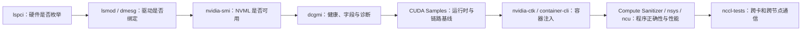

# GPU 与加速器命令参考库

这套参考库不把 GPU 故障简单归因于“显卡坏了”。一项 GPU 作业真正经过的是：PCIe 设备被发现、内核驱动绑定、设备节点创建、容器注入设备和库、CUDA 程序装载、Kernel 执行、跨卡通信，最后才是框架层任务。每篇文章都说明命令观察哪一层、输出如何解释、会不会影响在线任务，以及证据不足时下一步查什么。

## 1. 文档基线与使用约定

本文以 2026 年 8 月可用的 NVIDIA 官方文档为基线：DCGM 4.6、CUDA Toolkit 13.3、NVIDIA Container Toolkit 1.19、Compute Sanitizer 2026.2、Nsight Systems 2026.4、Nsight Compute 2026.2。发行版仓库里的版本通常更早，执行前始终先检查本机帮助：

```bash
nvidia-smi --version
dcgmi --version
nvidia-ctk --version
nvcc --version
compute-sanitizer --version
nsys --version
ncu --version
<command> --help
```

不同驱动、GPU 型号和构建方式会让子命令或字段发生变化。文章给出稳定的参数族和生产用法；本机 `--help` 与对应版本的官方手册才是最终依据。

## 2. 安全等级

| 等级 | 含义 | 典型操作 |
|---|---|---|
| `[R]` | 只读观察，通常不主动改变设备状态 | 查询清单、拓扑、健康状态和版本 |
| `[A]` | 主动采样、注入工作负载或占用性能计数器 | DCGM 诊断、压力测试、Profiler、NCCL 基准 |
| `[W]` | 写配置或改变运行环境 | 配置容器运行时、创建设备节点 |
| `[D]` | 可能中断业务、重置设备或改变持久状态 | GPU reset、MIG/ECC/时钟配置、强制终止进程 |

`[A]` 不一定改配置，但可能抢占算力、显存、互联带宽或硬件计数器。生产环境必须选定空闲 GPU、限定持续时间并保留基线。

## 3. 四阶段学习路线

### 第一阶段：驱动、设备与节点健康

1. [`nvidia-smi`](./01-nvidia-smi常用命令与指标说明.md)：设备清单、利用率、显存、进程、拓扑、ECC 与 Xid 入口。
2. [`dcgmi`](./02-dcgmi命令详解.md)：主机/集群 GPU 发现、健康策略、字段监控和诊断。
3. [`dcgmproftester`](./03-dcgmproftester命令详解.md)：主动产生确定类型的 GPU 负载，验证 DCGM 性能字段。
4. [`nvidia-bug-report.sh`](./04-nvidia-bug-report命令详解.md)：在驱动异常仍存在时采集完整证据包。
5. [`nvidia-modprobe`](./05-nvidia-modprobe命令详解.md)：加载模块并创建设备节点，理解权限边界。

### 第二阶段：容器设备注入

6. [`nvidia-ctk`](./06-nvidia-ctk命令详解.md)：配置 Docker/containerd/CRI-O 和 CDI。
7. [`nvidia-container-cli`](./07-nvidia-container-cli命令详解.md)：检查容器运行时实际发现并挂载了哪些设备和库。

### 第三阶段：CUDA 编译与正确性调试

8. [`nvcc`](./08-nvcc命令详解.md)：理解 Host/Device 两段编译、架构目标和可执行文件生成。
9. [`compute-sanitizer`](./09-compute-sanitizer命令详解.md)：定位越界、竞争、未初始化访问和同步错误。
10. [`cuda-gdb`](./10-cuda-gdb命令详解.md)：在 CPU 线程、CUDA Context、Kernel、Block 和 Thread 间切换调试。

### 第四阶段：性能、二进制与通信

11. [`nsys`](../../sre/performance/03-Nsight-Systems端到端时间线分析.md)：先回答时间花在哪里、CPU 与 GPU 是否并行。
12. [`ncu`](../../sre/performance/04-Nsight-Compute-CUDA-Kernel分析.md)：再回答单个 Kernel 为什么慢。
13. [`cuobjdump`](./13-cuobjdump命令详解.md)：从 Host Binary 提取 PTX、Cubin、ELF 和资源信息。
14. [`nvdisasm`](./14-nvdisasm命令详解.md)：反汇编 Cubin，分析 SASS 控制流和指令。
15. [`deviceQuery` 与 `bandwidthTest`](./15-CUDA-Samples命令详解.md)：建立 CUDA 可用性和主机—设备带宽基线。
16. [`nccl-tests`](./16-nccl-tests命令详解.md)：验证单机/多机集合通信的正确性、算法带宽和总线带宽。

## 4. 固定排障顺序



不要跳层。例如容器中看不到 GPU，先在宿主机验证 `nvidia-smi`；宿主机驱动未工作时，修改 Kubernetes Device Plugin 不会解决问题。NCCL 慢也应先确认 PCIe/NVLink/RDMA 拓扑与单链路基线，而不是先修改几十个环境变量。

## 5. 三条重要边界

- `nvidia-smi` 顶部的 CUDA Version 是**驱动可支持的最高 CUDA 兼容版本**，不等于已安装 Toolkit 版本；Toolkit 看 `nvcc --version`。
- DCGM Profiling、Nsight Compute 等工具可能竞争同一组硬件性能计数器。做受控实验时不要并发采样，监控系统也应临时降级对应指标。
- 基准测试证明的是“给定拓扑、版本、参数和时间点下的结果”，不能仅凭一次峰值证明生产负载没有瓶颈。

## 6. 最终验收

学完后应能独立完成：从 PCI Bus ID/UUID 将应用进程映射到物理 GPU；区分驱动、Toolkit 与容器运行时版本；采集不破坏现场的证据；复现 CUDA 内存错误；解释 Timeline 与 Kernel 指标；用 CUDA Samples 和 NCCL Tests 建立可比较基线；判断故障位于计算、显存、PCIe/NVLink、网络、容器还是应用层。

## 官方入口

- [NVIDIA GPU Deployment and Management Documentation](https://docs.nvidia.com/deploy/)
- [NVIDIA DCGM Documentation](https://docs.nvidia.com/datacenter/dcgm/latest/)
- [NVIDIA CUDA Toolkit Documentation](https://docs.nvidia.com/cuda/)
- [NVIDIA Container Toolkit Documentation](https://docs.nvidia.com/datacenter/cloud-native/container-toolkit/latest/)
- [NVIDIA NCCL Documentation](https://docs.nvidia.com/deeplearning/nccl/)
