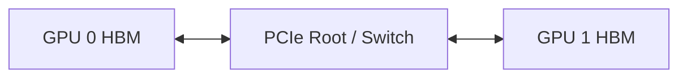
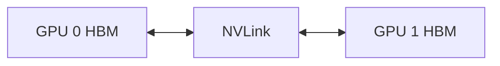
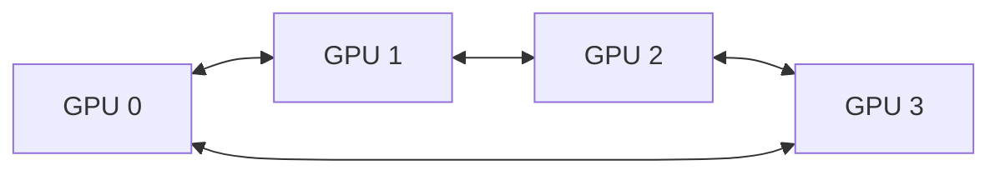
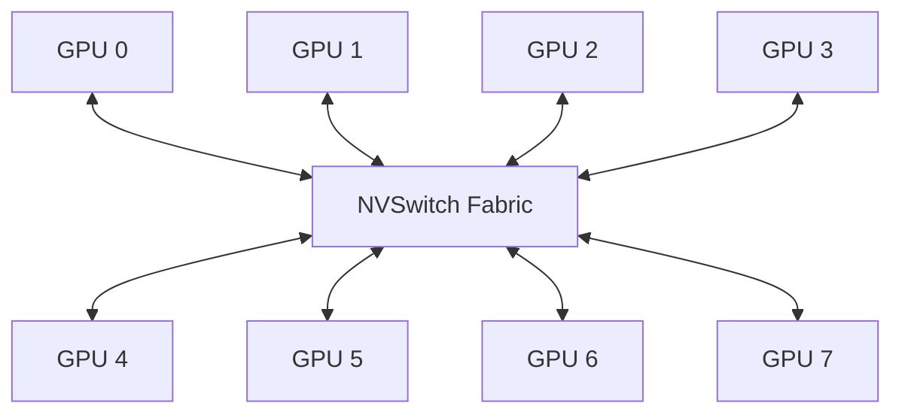

# NVLink 与 NVSwitch 原理：多 GPU 如何交换显存数据

当模型放不进一块 GPU，或者训练需要多卡并行时，GPU 之间必须交换：

- Tensor
- 梯度
- 激活
- KV Cache 或中间结果
- 集合通信数据

如果 GPU 之间的通信速度跟不上计算，增加更多 GPU 反而可能让任务更慢。

← [CPU 与 GPU 之间的数据搬运](../pcie-numa/05-CPU与GPU之间的数据搬运.md)

## 1. 学习目标

完成本文后，你应该能够：

- 区分 PCIe P2P、NVLink 和 NVSwitch
- 解释 GPU HBM 到另一块 GPU HBM 的数据路径
- 读懂 `nvidia-smi topo -m`
- 判断两块 GPU 是否支持 P2P
- 理解 Fabric Manager 在 NVSwitch 系统中的作用
- 使用 CUDA Samples 和 `nccl-tests` 建立机内通信基线
- 识别 NVLink 降级、P2P 不可用和拓扑选择错误
- 说明为什么 Tensor Parallel 调度需要理解 NVLink 域

## 2. 从两块 GPU 开始

假设服务器中有两块 GPU：



最基础的 GPU 间通信可以通过 PCIe。

如果硬件和软件支持 Peer-to-Peer：

```text
GPU 0 HBM
→ PCIe P2P
→ GPU 1 HBM
```

如果 P2P 不可用，某些通信可能退化为：

```text
GPU 0 HBM
→ CPU 系统内存
→ GPU 1 HBM
```

多一次 staging 会增加延迟并占用 CPU 内存和 PCIe 带宽。

## 3. PCIe P2P

Peer-to-Peer 允许一个 PCIe 设备直接访问另一个设备的地址空间。

它受到以下条件影响：

- GPU 型号和驱动支持
- 两块 GPU 的 PCIe 拓扑
- Root Complex
- PCIe Switch
- IOMMU
- ACS
- 虚拟化和直通方式

PCIe P2P 不等于 NVLink。没有 NVLink 的 GPU 也可能支持 PCIe P2P。

## 4. NVLink 解决什么问题

NVLink 是面向 GPU 等设备的高速互联技术。它为支持的设备提供比普通 PCIe 路径更适合 GPU 间通信的互联。

简化路径：



NVLink 的价值不只是“带宽更高”，还包括：

- 降低 GPU 间通信成本
- 让多 GPU 应用更高效地交换 Tensor
- 为 NCCL Collective 提供机内高速路径
- 减少对 CPU 内存和 PCIe Root 的依赖

### 4.1 NVLink 不会自动把多块 GPU 变成一块 GPU {/* #nvlink-不会自动把多块-gpu-变成一块-gpu */}

每块 GPU 通常仍有：

- 独立 HBM
- 独立 CUDA Device ID
- 独立 CUDA Context
- 独立故障状态

应用或通信库仍然需要明确管理数据和计算。

## 5. Link、带宽与拓扑

一块 GPU 可能拥有多条 NVLink。具体：

- Link 数量
- 单 Link 带宽
- 双向/单向口径
- GPU 之间连接方式
- 是否通过 NVSwitch

都会随 GPU 和系统架构变化。

因此不要把某一代产品的数字写成 NVLink 永久固定值。查询当前平台：

```bash
nvidia-smi -q
nvidia-smi nvlink --status
nvidia-smi topo -m
```

## 6. 点对点 NVLink 拓扑

部分系统中，GPU 之间以特定拓扑直接连接。

例如简化 Ring：



此时：

- 相邻 GPU 可能有直接 NVLink
- 非相邻 GPU 可能需要其他路径
- 不同 GPU 组合的带宽和延迟可能不同

调度一个 2 卡任务时，“任选两块空闲 GPU”不一定性能相同。

## 7. NVSwitch

当 GPU 数量增加，仅靠大量点对点连接会变复杂。NVSwitch 提供交换结构，让多块 GPU 通过交换网络互联。



NVSwitch 的主要作用：

- 建立高带宽多 GPU Fabric
- 减少 GPU 对选择带来的不均匀性
- 为 Collective 提供更好的互联基础
- 在支持的平台上提供 NVLink SHARP 等能力

### 7.1 NVSwitch 不是以太网交换机 {/* #nvswitch-不是以太网交换机 */}

它不转发普通 IP Packet，也不是 Kubernetes CNI 网络。它服务于 NVLink Fabric。

## 8. Fabric Manager

在需要 Fabric Manager 的 NVSwitch 系统中，它负责或参与：

- 初始化 NVSwitch Fabric
- 配置路由和端口映射
- 协调 GPU 与 NVSwitch
- 监控 NVLink/NVSwitch 错误
- 暴露 Fabric 状态

查看：

```bash
systemctl status nvidia-fabricmanager
journalctl -u nvidia-fabricmanager
nvidia-smi -q
```

不同代际系统的初始化机制可能变化，不能假设所有 NVSwitch 服务器都使用完全相同的 Fabric Manager 行为。

Fabric 未正确初始化时可能出现：

- CUDA 应用无法启动
- P2P 能力不可用
- NCCL 初始化失败
- GPU Fabric 状态异常

## 9. 读懂 `nvidia-smi topo -m` {/* #读懂-nvidia-smi-topo */}

本节使用一台四卡双路服务器作为教学示例：GPU0 与 GPU1 通过两条聚合 NVLink 相连，GPU2 与 GPU3 同样相连，两组 GPU 分属不同 NUMA Node。NIC0、NIC1 分别靠近两侧 CPU，但与同侧 GPU 不在同一个 PCIe Switch 下。真实服务器的 GPU 数量、`NV#` 数字和 PCIe 路径会不同。

```bash
nvidia-smi topo -m
```

示例输出：

```text
        GPU0  GPU1  GPU2  GPU3  NIC0  NIC1  CPU Affinity  NUMA Affinity  GPU NUMA ID
GPU0      X    NV2   SYS   SYS  NODE   SYS          0-31              0          N/A
GPU1     NV2     X   SYS   SYS  NODE   SYS          0-31              0          N/A
GPU2     SYS   SYS     X   NV2   SYS  NODE         32-63              1          N/A
GPU3     SYS   SYS   NV2     X   SYS  NODE         32-63              1          N/A
NIC0    NODE  NODE   SYS   SYS     X   SYS
NIC1     SYS   SYS  NODE  NODE   SYS     X

Legend:
  X    = Self
  SYS  = Path crosses PCIe and the socket-to-socket interconnect
  NODE = Path crosses PCIe host bridges inside one NUMA node
  PHB  = Path crosses a PCIe host bridge
  PXB  = Path crosses multiple PCIe switches
  PIX  = Path crosses a single PCIe switch
  NV#  = Path uses a bonded set of # NVLinks
```

### 9.1 Legend 中文解释

`Legend` 就是矩阵中路径缩写的图例。它描述两个设备之间需要经过哪些硬件，不是性能测试结果。

| 标记 | 英文含义 | 中文解释 | 简化数据路径 |
| --- | --- | --- | --- |
| `X` | Self | 行与列指向同一个设备，因此无需判断设备间路径 | GPU0 → GPU0 |
| `PIX` | Single PCIe Switch | 两个设备之间最多经过一个 PCIe Switch，通常是距离较近的 PCIe 路径 | GPU0 → PCIe Switch → GPU1/NIC |
| `PXB` | Multiple PCIe Switches | 路径经过多个 PCIe Switch，但没有穿过 CPU 的 PCIe Host Bridge | GPU0 → Switch A → Switch B → GPU1 |
| `PHB` | PCIe Host Bridge | 路径需要经过 PCIe Host Bridge，通常就是 CPU 提供的 PCIe Root Complex | GPU0 → PCIe Switch/Root Port → CPU I/O → GPU1/NIC |
| `NODE` | Same NUMA Node | 路径跨越同一 NUMA Node 内的多个 PCIe Host Bridge，但不跨 CPU Socket | GPU0 → Host Bridge A → CPU 内部 I/O 互联 → Host Bridge B → NIC |
| `SYS` | System Interconnect | 除 PCIe 外还要跨 NUMA Node 或 CPU Socket 互联，例如 Intel UPI/QPI、AMD xGMI/Infinity Fabric | GPU0 → CPU0 → Socket 互联 → CPU1 → GPU2 |
| `NV#` | Bonded set of # NVLinks | 设备对之间使用由 `#` 条 NVLink 组成的路径，例如 `NV2`、`NV4`、`NV12` | GPU0 → NVLink 直连或 NVSwitch Fabric → GPU1 |

如果只比较 PCIe 拓扑距离，通常可以先按 `PIX → PXB → PHB → NODE → SYS` 理解为路径逐渐变远。但这不是严格的性能排名：PCIe 代际、链路宽度、交换芯片上行是否共享、CPU 互联带宽和并发负载都会改变实测结果。`NV#` 属于另一类 GPU 高速互联，也不能只凭数字直接换算带宽。

### 9.2 NIC0 是什么

`NIC` 是 Network Interface Card/Controller，即网卡或网络接口控制器。`NIC0` 是 `nvidia-smi` 在拓扑矩阵中为第一组网卡设备分配的索引标签，`NIC1` 是第二组。它们通常对应服务器中的高速以太网、RoCE 或 InfiniBand 适配器。

`NIC0` 不是以下概念：

- 它不一定等于 Linux 中的 `eth0`、`ens5f0` 或 `ib0`；操作系统接口名与 `nvidia-smi` 的拓扑编号属于两套命名。
- 它不是 Kubernetes CNI，也不是 Pod 虚拟网卡。
- 它不一定表示第一块插入主板的物理网卡；编号取决于驱动和 NVML 枚举结果。
- 它出现在矩阵中不代表 GPUDirect RDMA 一定可用，只说明工具识别到了可参与拓扑展示的网卡设备。

在本节示例中：

```text
GPU0 → NIC0 = NODE
GPU0 → NIC1 = SYS
```

`NODE` 表示 GPU0 与 NIC0 位于同一个 NUMA Node，但两者之间仍要跨 PCIe Host Bridge；`SYS` 表示 GPU0 到 NIC1 还要跨 CPU Socket 互联。因此，如果一个分布式训练进程使用 GPU0，通常应优先选择拓扑更近的 NIC0，而不是跨 Socket 使用 NIC1。

当 GPUDirect RDMA 条件满足时，理想数据路径是：

```text
GPU HBM
→ GPU PCIe/NVLink 接口
→ 同侧 PCIe Root/Switch
→ NIC 的 DMA/RDMA Engine
→ InfiniBand 或 RoCE 网络
```

如果 GPUDirect RDMA 不可用，数据可能先进入主机内存再交给 NIC，增加 PCIe 搬运、CPU/内存带宽占用和时延。`topo -m` 只能告诉你物理距离，不能单独证明实际通信已经走 GPUDirect RDMA。

如果本机驱动支持，可以用下面的命令查看更明确的 NIC 映射；旧版本则需要结合 PCI 地址、Linux 网卡名和 RDMA 设备名核对：

```bash
nvidia-smi topo -nic
ibdev2netdev
lspci -Dnn | grep -Ei 'Ethernet|Network|InfiniBand'
```

### 9.3 三个 Affinity 字段

矩阵右侧的三列不是设备间路径，而是 GPU 与主机 CPU、主机内存以及 NUMA 拓扑的关系：

| 字段 | 中文含义 | 示例值如何理解 | 容易误解的地方 |
| --- | --- | --- | --- |
| `CPU Affinity` | CPU 亲和范围 | `0-31` 表示逻辑 CPU 0～31 在拓扑上更靠近这块 GPU | 只表示硬件距离，不代表进程已经绑核，也不代表这些 CPU 被 GPU 独占 |
| `NUMA Affinity` | 主机内存 NUMA 亲和节点 | `0` 表示从 NUMA Node 0 的主机内存访问该 GPU 通常路径更近 | 它描述主机内存节点，不是 GPU 编号，也不是 GPU 自身 NUMA ID |
| `GPU NUMA ID` | GPU 自身的 NUMA Node ID | 某些平台会把 GPU 或 GPU 内存作为独立 NUMA Node 暴露；普通服务器常见 `N/A` | `N/A` 表示该字段不适用，不表示 GPU 故障，也不能把它当成 Node 0 |

`CPU Affinity` 回答“哪些 CPU 离这块 GPU 较近”，`NUMA Affinity` 回答“哪一个主机内存节点离它较近”，`GPU NUMA ID` 回答“操作系统是否给 GPU 自身分配了 NUMA ID”。三者描述的是不同对象。

NIC 行通常不会填写这三个 GPU 亲和字段，所以示例中 NIC0、NIC1 行的右侧为空。容器中的 CPUSet、设备可见范围和驱动版本也可能影响实际展示，排查时应同时记录宿主机的 `lscpu`、`numactl -H` 和容器资源限制。

沿 GPU0 所在行读取：

1. GPU0 → GPU1 是 `NV2`，表示两卡之间有一组由两条 NVLink 聚合而成的路径；`2` 不是两张 GPU，也不是 PCIe x2。
2. GPU0 → GPU2 是 `SYS`，表示路径需要跨 PCIe 和 CPU 间互联；它描述物理路径，不直接证明 CUDA P2P 一定可用或不可用。
3. GPU0 → NIC0 是 `NODE`，表示设备处于同一 NUMA Node，但路径仍跨 PCIe Host Bridge。若显示 `PIX`，通常说明 GPU 与 NIC 的 PCIe 路径更近。
4. `CPU Affinity 0-31` 和 `NUMA Affinity 0` 表示 GPU0 靠近 Node 0，不表示应用进程已经完成 CPU 绑定。
5. `GPU NUMA ID N/A` 表示没有适用的 GPU 自身 NUMA ID，与主机侧的 `NUMA Affinity 0` 并不矛盾。

在 NVSwitch 服务器上，多块 GPU 经过同一个 NVLink Fabric 互联，GPU 子矩阵可能呈现大量相同的 `NV#`。例如某类平台截取前四卡后可能类似：

```text
        GPU0  GPU1  GPU2  GPU3
GPU0      X   NV12  NV12  NV12
GPU1    NV12     X  NV12  NV12
GPU2    NV12  NV12     X  NV12
GPU3    NV12  NV12  NV12     X
```

这表示设备对之间存在由若干 NVLink 组成的 Fabric 路径，不表示每一对 GPU 都用 12 根线直接相连。不同代际和机型可能显示其他 `NV#`，必须以本机矩阵为准。

这些符号是拓扑类别，不是带宽分数。`NV12` 通常比跨 Socket 的 `SYS` 更适合高频 GPU 通信，但最终仍要结合 NVLink 代际、链路状态以及带宽测试验证。准确含义以当前 `nvidia-smi topo -h` 为准。

### 9.4 检查 P2P Read

```bash
nvidia-smi topo -p2p r
```

参数 `r` 查询 GPU 对之间的 P2P Read 能力。延续上面的示例，组内支持、跨组因平台限制不支持时，输出可能如下：

```text
P2P Connectivity Matrix
        GPU0  GPU1  GPU2  GPU3
GPU0      X    OK   CNS   CNS
GPU1     OK     X   CNS   CNS
GPU2    CNS   CNS     X    OK
GPU3    CNS   CNS    OK     X

Legend:
  X    = Self
  OK   = Status Ok
  CNS  = Chipset not supported
  GNS  = GPU not supported
  TNS  = Topology not supported
  NS   = Not supported
  U    = Unknown
```

这里的 `OK` 只说明驱动报告该设备对具备 Read 能力，不等于带宽、时延已经达到预期。`CNS` 说明平台或芯片组没有提供该能力，不表示 GPU 已经掉卡。

### 9.5 检查 P2P Write

```bash
nvidia-smi topo -p2p w
```

参数 `w` 查询 P2P Write 能力。当前教学示例的 Read 与 Write 结果恰好相同：

```text
P2P Connectivity Matrix
        GPU0  GPU1  GPU2  GPU3
GPU0      X    OK   CNS   CNS
GPU1     OK     X   CNS   CNS
GPU2    CNS   CNS     X    OK
GPU3    CNS   CNS    OK     X

Legend:
  X    = Self
  OK   = Status Ok
  CNS  = Chipset not supported
  GNS  = GPU not supported
  TNS  = Topology not supported
  NS   = Not supported
  U    = Unknown
```

不能因为本例两张矩阵相同，就只检查其中一项。P2P 能力可能受 GPU 型号、PCIe Root、ACS/IOMMU、虚拟化、驱动和运行模式影响，也不应预设矩阵一定对称。

### 9.6 状态码与判断边界

| 状态 | 含义 | 不能直接推出的结论 |
| --- | --- | --- |
| `X` | 当前设备自身 | 不是检查失败 |
| `OK` | 所查询的能力可用 | 不等于实测带宽正常 |
| `CNS` | 芯片组或平台不支持 | 不等于 GPU 故障 |
| `GNS` | GPU 不支持 | 不能靠重启将硬件能力变为支持 |
| `TNS` | 当前拓扑不支持 | 不等于两卡完全无法交换数据 |
| `NS` | 该能力不受支持 | 要结合查询的是 Read、Write、NVLink 还是 PCIe 判断 |
| `U` | 状态未知 | 不能当成 `OK` |
| `DR` | 能力被注册表或驱动配置禁用，部分较新驱动显示 | 不等于硬件本身不支持 |

还可以继续查询：

```bash
nvidia-smi topo -p2p n  # NVLink P2P 能力
nvidia-smi topo -p2p p  # PCIe P2P 能力，是否支持取决于驱动版本
```

`topo -m` 回答设备之间通过什么路径连接，`topo -p2p r/w` 回答驱动是否报告相应访问能力；它们都不是性能压测。要确认实际通信是否健康，还需要运行 `p2pBandwidthLatencyTest` 和 `nccl-tests`，比较不同 GPU Pair 的带宽、时延与集合通信结果。

不同驱动版本支持的 `-p2p` 能力选项和状态码可能不同，先以本机 `nvidia-smi topo -h` 为准。

## 10. CUDA P2P

应用可以查询两块 GPU 是否支持 Peer Access：

```cpp
int can_access = 0;
cudaDeviceCanAccessPeer(&can_access, device0, device1);
```

启用：

```cpp
cudaSetDevice(device0);
cudaDeviceEnablePeerAccess(device1, 0);
```

支持 P2P 不代表一定走 NVLink。实际路径还要结合拓扑和硬件。

## 11. CUDA Samples 验证

### 11.1 p2pBandwidthLatencyTest

```bash
./p2pBandwidthLatencyTest
```

它可以展示：

- P2P 是否可用
- 单向/双向带宽
- P2P Enabled/Disabled 对比
- GPU 对之间差异

记录：

| GPU Pair | Topology | P2P | Bandwidth | Latency |
| --- | --- | --- | --- | --- |
| 0 ↔ 1 | NVLink | Yes |  |  |
| 0 ↔ 4 | PHB/SYS |  |  |  |

### 11.2 simpleP2P

```bash
./simpleP2P
```

用于验证基础 Peer Access 和数据正确性。

这些结果是 CUDA P2P 基线，不等于 NCCL Collective 性能。

## 12. NCCL 如何使用拓扑

NCCL 是拓扑感知的 Collective 通信库。它会考虑：

- GPU 间 NVLink
- PCIe 路径
- CPU/NUMA
- NIC/HCA
- 网络插件
- Collective 类型

开启调试：

```bash
export NCCL_DEBUG=INFO
export NCCL_DEBUG_SUBSYS=INIT,GRAPH
```

运行任务后检查日志中的：

- GPU 拓扑
- Channel
- Ring/Tree
- P2P Transport
- NVLink/PCIe
- NET/IB 或 NET/Socket

不要在生产配置中永久保留大量 Debug 日志。

### 12.1 NVLS {/* #nvls */}

在支持的 NVSwitch 平台和 NCCL 版本中，NVLink SHARP/NVLS 可以让部分 Collective 利用交换 Fabric 的能力。

是否启用、支持哪些 Collective、当前默认行为，应查目标 NCCL 和系统文档，不能仅凭环境变量名称判断已经生效。

## 13. `nccl-tests` 机内基线

单机 8 卡示例：

```bash
./build/all_reduce_perf -b 8 -e 8G -f 2 -g 8
```

重点观察：

- `algbw`
- `busbw`
- 不同消息大小
- In-place/Out-of-place
- 是否出现 Correctness Error

再对比：

```bash
export NCCL_P2P_DISABLE=1
```

该变量只适合受控诊断。关闭 P2P 后如果性能显著下降，说明高速 P2P 路径对当前任务重要。

不要把诊断变量永久写入系统配置。

## 14. Tensor Parallel 为什么依赖 NVLink

Tensor Parallel 会在单层计算中频繁交换中间结果。通信位于请求关键路径：

```text
计算一部分
→ GPU 间 Collective
→ 继续计算
→ 再次 Collective
```

因此：

- 通信频率高
- 小延迟很重要
- 带宽不足会直接拉长 Token 时间
- 跨慢速拓扑的 TP 可能不如较小并行度

Data Parallel 的通信模式和频率不同，不能用 TP 的互联需求直接套用。

## 15. NVLink 与显存容量

NVLink 让 GPU 之间更快通信，但通常不会自动聚合为一个透明的统一大显存。

如果两块 GPU 各有 80 GiB：

- 应用可以将模型切分到两块 GPU
- 通信通过 NVLink 加速
- 但每个进程和每个 Tensor 的放置仍需框架管理

“8 × 80 GiB = 一块 640 GiB GPU”是错误理解。

## 16. 常见故障

### 16.1 `topo -m` 没有 NVLink {/* #topo--m-没有-nvlink */}

检查：

- GPU 型号是否支持
- 服务器是否真的安装 NVLink/NVSwitch
- GPU 是否处于预期槽位
- 驱动版本
- Fabric Manager
- 虚拟机或容器是否暴露完整拓扑

### 16.2 CUDA P2P 不可用 {/* #cuda-p2p-不可用 */}

检查：

- PCIe Root 与 ACS
- IOMMU
- GPU 组合和驱动支持
- 虚拟化直通
- MIG 等运行模式

### 16.3 NCCL 没有走预期路径 {/* #nccl-没有走预期路径 */}

采集：

```bash
nvidia-smi topo -m
NCCL_DEBUG=INFO NCCL_DEBUG_SUBSYS=INIT,GRAPH <command>
```

不要一开始就随机设置大量 NCCL 环境变量。先确认硬件拓扑和日志。

### 16.4 NVLink Error 增长 {/* #nvlink-error-增长 */}

需要结合：

- DCGM NVLink 指标
- `nvidia-smi -q`
- Xid
- Fabric Manager 日志
- NCCL Error
- 服务器硬件日志

持续错误应升级给硬件和平台团队，不要通过重复重启掩盖。

### 16.5 一组 GPU 很快，另一组很慢 {/* #一组-gpu-很快另一组很慢 */}

可能是：

- GPU 对不在同一 NVLink 域
- 跨 CPU Socket
- PCIe Link 降速
- P2P 不可用
- GPU/NIC 距离不同

## 17. Kubernetes 为什么需要理解 NVLink

Kubernetes 原生扩展资源通常只表达：

```yaml
resources:
  limits:
    nvidia.com/gpu: 4
```

这只说明需要 4 块 GPU，不一定表达：

- 哪 4 块 GPU
- 是否属于同一 NVLink 域
- 是否靠近同一 NIC
- 是否满足 Tensor Parallel 拓扑

生产方案可能结合：

- GPU Feature Discovery 标签
- 节点池
- 整机 8 卡分配
- Gang Scheduling
- 自定义调度插件
- DRA 和设备属性
- 应用自身的 Rank/GPU 映射

对于单节点 8 卡 TP，最简单可靠的策略常常是独占整台经过验证的 8 卡节点，而不是在同一节点混合多个拓扑敏感任务。

## 18. 它与其他模块的关系

### 18.1 上游 {/* #上游 */}

- 模型和 Batch 已经进入各 GPU HBM
- PyTorch、vLLM 或训练框架产生跨 GPU 通信

### 18.2 本层 {/* #本层 */}

- CUDA P2P 提供 GPU 间访问能力
- NVLink/NVSwitch 提供机内高速互联
- NCCL 根据拓扑组织 Collective

### 18.3 下游 {/* #下游 */}

- 跨节点时通信继续进入 NIC、IB/RoCE
- 调度器应选择正确 GPU 组合和节点
- DCGM/NCCL 提供观测证据

## 19. 常见误区

### 19.1 有 NVLink 就不需要 NCCL {/* #有-nvlink-就不需要-nccl */}

NVLink 是硬件互联，NCCL 是 Collective 通信库，层次不同。

### 19.2 NVSwitch 是普通网络交换机 {/* #nvswitch-是普通网络交换机 */}

NVSwitch 服务 NVLink Fabric，不承载普通 TCP/IP。

### 19.3 多卡显存会自动合并 {/* #多卡显存会自动合并 */}

应用和框架仍需管理分片与通信。

### 19.4 `nvidia-smi topo` 显示 NVLink 就一定性能正常 {/* #nvidia-smi-topo-显示-nvlink-就一定性能正常 */}

还要做 P2P 和 NCCL 基线，并观察 Error。

### 19.5 卡越多越快 {/* #卡越多越快 */}

扩展收益取决于计算通信比、消息大小和并行策略。

## 20. 本篇总结

```text
单 GPU：HBM 内部访问
两 GPU：PCIe P2P 或 NVLink
多 GPU：点对点 NVLink 或 NVSwitch Fabric
应用通信：CUDA P2P / NCCL
调度目标：把强通信任务放进合适的高速互联域
```

后续进入跨节点通信：数据会从 GPU HBM 经过 PCIe 到达 NIC，并通过 InfiniBand 或 RoCE 到达另一台服务器。

→ [NCCL 通信原理与常见问题](../../ai-systems/training/distributed/05-NCCL%20通信原理与常见问题.md)

## 21. 课后练习

1. PCIe P2P 和 NVLink 有什么区别？
2. NVSwitch 为什么不等于普通网络交换机？
3. 为什么 NVLink 不会自动形成统一大显存？
4. 使用 `nvidia-smi topo -m` 画出服务器 GPU 连接图。
5. 运行 `p2pBandwidthLatencyTest`，比较不同 GPU Pair。
6. 运行 `all_reduce_perf`，比较启用和禁用 P2P 的结果。
7. 设计一个 8 卡 Tensor Parallel Pod 的节点选择与独占策略。

### 21.1 参考答案 {/* #参考答案 */}

1. PCIe P2P 复用 PCIe 层级，带宽和路径受 Root Complex、Switch 与 ACS/IOMMU 影响；NVLink 是 GPU 间专用高速互连，通常提供更高带宽和更低延迟，但可达关系取决于具体机器拓扑。
2. NVSwitch 交换的是服务器内部 GPU/NVLink 流量，不运行以太网/IP/BGP，也不负责跨服务器网络转发；它解决的是多 GPU 间高带宽全互连或近似全互连。
3. 每张 GPU 仍拥有独立地址空间和内存控制器。统一寻址只让地址可表达，框架仍需显式分片、复制、P2P 访问或集合通信，不能自动把容量合并成一块透明大显存。
4. 执行 `nvidia-smi topo -m`，把 `NV#`、`PIX/PXB`、`PHB/SYS` 转成边；同时记录 CPU Affinity 和 NIC 列，图中应能指出每个 GPU Pair 的最短路径。
5. 运行 CUDA Samples 的 `p2pBandwidthLatencyTest`，保存每个 Pair 的 P2P 可达性、单向/双向带宽和时延。相同拓扑的 Pair 应接近；异常 Pair 要结合 Xid、链路状态和 PCIe/NVLink 计数排查。
6. 使用 `NCCL_P2P_DISABLE=0/1` 分别运行同规模 `all_reduce_perf`，保持消息大小、GPU 数和进程布局一致。比较 `algbw`、`busbw` 和尾部抖动；禁用后若回落到共享内存/PCIe，性能通常下降。
7. Pod 请求8张整卡，使用节点标签锁定经过验证的8卡NVSwitch/NVLink机型，并通过反亲和或整机资源配额防止其他GPU任务混入；TP大小必须等于可见GPU数，部署后用拓扑和NCCL基线验收。

## 22. 参考与致谢 {/* #参考与致谢 */}

- [NVIDIA System Management Interface：Topology](https://docs.nvidia.com/deploy/nvidia-smi/index.html#topology)
- [NVIDIA Fabric Manager User Guide](https://docs.nvidia.com/hgx-platforms/fabric-manager-user-guide/)
- [NCCL Documentation](https://docs.nvidia.com/deeplearning/nccl/index.html)
- [NCCL Troubleshooting](https://docs.nvidia.com/deeplearning/nccl/user-guide/docs/troubleshooting.html)
- [CUDA Samples](https://github.com/NVIDIA/cuda-samples)
