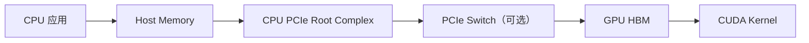
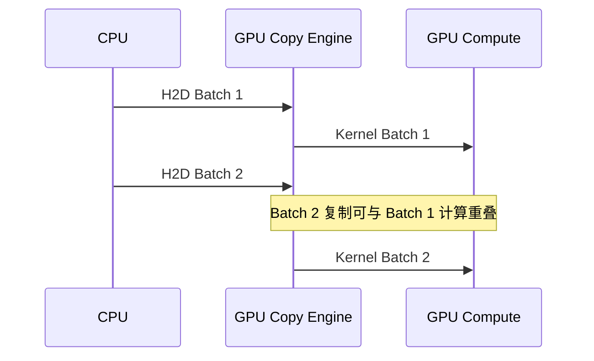

# CPU 与 GPU 之间的数据搬运：PCIe、Pinned Memory、DMA 与 CUDA Stream

GPU 执行计算前，模型、输入和中间数据必须先出现在它能访问的内存中。

最常见的数据路径是：

```text
磁盘或网络
→ CPU 系统内存
→ PCIe
→ GPU HBM
→ CUDA Kernel
```

如果只优化 GPU Kernel，却忽略数据准备和 Host-to-Device 复制，GPU 可能长期等待输入。

← [GPU 服务器硬件拓扑与 NUMA](./04-GPU服务器硬件拓扑与NUMA.md)

## 1. 学习目标

完成本文后，你应该能够：

- 区分 Host Memory 与 Device Memory
- 解释 Pageable Memory 为什么通常需要额外 staging
- 理解 Pinned Memory、DMA 和 GPU Copy Engine
- 区分同步复制与异步复制
- 说明 CUDA Stream 如何让传输和计算重叠
- 判断 NUMA 和 PCIe 拓扑为什么影响 H2D/D2H
- 使用 CUDA Sample 或 PyTorch 测量传输带宽
- 识别数据加载、内存复制和 GPU 计算之间的瓶颈

## 2. Host 与 Device

CUDA 程序通常同时包含两个执行环境：

- **Host**：CPU 及其系统内存
- **Device**：GPU 及其显存



CPU 与 GPU 可能使用统一虚拟地址空间，但这不代表物理数据天然位于两边，也不代表访问成本相同。

## 3. 数据为什么需要搬运

常见数据来源：

- 文件系统中的模型权重
- 对象存储下载的数据
- DataLoader 产生的 Batch
- 网络接收的推理请求
- CPU 完成预处理后的 Tensor

在离散 GPU 系统中，这些数据通常先到系统内存，再经过 PCIe 进入 GPU HBM。

PCIe 带宽通常显著低于 GPU 内部 HBM 带宽。因此：

- H2D/D2H 复制要尽量减少
- 小复制应适当批量化
- 能复用的数据尽量留在 GPU
- 在条件允许时让复制与计算重叠

## 4. Pageable Memory

普通 `malloc` 或常规 CPU Tensor 通常使用 Pageable Memory。

操作系统可以：

- 移动物理页面
- 交换页面
- 修改虚拟地址到物理页的映射

DMA 设备需要稳定的物理内存页面。进行 GPU 复制时，驱动往往需要把数据先复制到内部 Pinned Buffer，再由 DMA 搬到 GPU。

简化路径：

```text
应用 Pageable Memory
→ 驱动 Pinned Staging Buffer
→ DMA
→ PCIe
→ GPU HBM
```

这意味着一次 Host-to-Device 操作可能隐含额外 CPU 内存复制。

## 5. Pinned Memory

Pinned Memory 也叫：

- Page-locked Memory
- Pinned Host Memory
- 锁页内存

它的物理页面不会被操作系统随意换出或移动，因此 DMA 可以直接使用。

简化路径：

```text
应用 Pinned Memory
→ DMA
→ PCIe
→ GPU HBM
```

CUDA 常见接口：

```cpp
cudaHostAlloc(...)
cudaMallocHost(...)
cudaHostRegister(...)
```

PyTorch DataLoader：

```python
DataLoader(
    dataset,
    batch_size=64,
    pin_memory=True,
)
```

把 CPU Tensor 复制到 GPU：

```python
batch = batch.to("cuda", non_blocking=True)
```

### Pinned Memory 不是越多越好

锁页内存是一种有限系统资源。过量使用可能导致：

- 系统可分页内存减少
- 内存回收压力
- 其他进程性能下降
- 注册和注销开销
- DataLoader Worker 占用大量 RAM

正确方法是：

- 复用固定数量的 Buffer
- 控制预取深度
- 监控 Host RAM
- 用实验确定是否改善端到端吞吐

## 6. DMA 与 Copy Engine

DMA 允许设备在 CPU 完成控制面设置后搬运数据，而不是由 CPU 使用 Load/Store 指令逐字节复制。

简化过程：

1. CPU 准备源地址、目标地址和长度
2. 驱动验证和固定需要的内存
3. Copy Engine 发起传输
4. 数据经过 PCIe
5. 完成后产生事件或状态

CPU 仍然参与：

- 内存分配
- 地址映射
- 命令提交
- 同步
- 异常处理

“DMA 不经过 CPU”通常是指数据面不需要 CPU 做中间复制，不代表 CPU 完全不参与。

## 7. H2D、D2H、D2D

| 类型 | 路径 |
| --- | --- |
| H2D | Host Memory → GPU Memory |
| D2H | GPU Memory → Host Memory |
| D2D | 同一 GPU 内或 GPU 之间复制 |
| P2P | 一个 GPU 直接访问另一个 GPU |

CUDA 示例：

```cpp
cudaMemcpy(dst_gpu, src_host, bytes, cudaMemcpyHostToDevice);
cudaMemcpy(dst_host, src_gpu, bytes, cudaMemcpyDeviceToHost);
cudaMemcpy(dst_gpu_b, src_gpu_a, bytes, cudaMemcpyDeviceToDevice);
```

跨 GPU 的 D2D 是否走 PCIe P2P、NVLink 或中间 staging，取决于拓扑和 P2P 能力。

## 8. 同步复制

`cudaMemcpy()` 是阻塞式接口。简化时间线：

```text
CPU 提交复制
→ 等待复制完成
→ 提交 Kernel
→ 等待 Kernel
```

优点：

- 逻辑简单
- 容易保证依赖关系
- 适合入门和正确性验证

缺点：

- CPU 线程可能等待
- 数据搬运与计算不能充分重叠
- 流水线容易产生空洞

## 9. 异步复制

`cudaMemcpyAsync()` 可以让 Host 更早返回，并将操作加入指定 Stream。

```cpp
cudaMemcpyAsync(
    dst_gpu,
    src_host,
    bytes,
    cudaMemcpyHostToDevice,
    stream
);
```

官方最佳实践强调：异步 Host/Device 传输通常要求 Pinned Host Memory。

异步不等于自动并行。能否重叠取决于：

- GPU 是否支持并发 Copy 与 Compute
- 是否使用合适的非默认 Stream
- 操作之间是否有数据依赖
- Buffer 是否为 Pinned Memory
- Copy Engine 数量与方向
- 框架是否插入全局同步

## 10. CUDA Stream

Stream 是按顺序执行的一组 GPU 操作。

同一个 Stream 内：

```text
Copy A
→ Kernel A
→ Copy Result A
```

会保持顺序。

不同 Stream 的独立操作在硬件允许时可以重叠：

```text
Stream 1：复制 Batch 2
Stream 2：计算 Batch 1
```

形成流水线：



### 双缓冲

准备两个 Buffer：

```text
Buffer A 正在被 GPU 计算
Buffer B 正在从 Host 复制
```

每轮交换角色，可以减少 GPU 等待。

## 11. 重叠的前提

### 11.1 硬件能力

CUDA Device Property 中的 `asyncEngineCount` 可以帮助判断 Copy Engine 能力。

CUDA Sample：

```bash
./deviceQuery
```

关注：

- Concurrent copy and kernel execution
- Number of asynchronous engines
- Unified Addressing

### 11.2 数据独立

Kernel 不能在对应输入尚未复制完成时启动。不同 Batch 或不同 Chunk 才容易形成流水线。

### 11.3 不要无意同步

以下操作可能让流水线失去并发：

- 频繁 `torch.cuda.synchronize()`
- 每个小 Tensor 都立即 `.item()`
- Host 立即读取 GPU 结果
- 默认 Stream 与其他 Stream 的同步语义
- 框架中的隐式同步

同步是正确性所必需的工具，但应放在明确边界，而不是每一步都同步。

## 12. NUMA 为什么影响传输

双 Socket 服务器中，GPU 通常连接到某个 CPU Socket 的 PCIe Root。

最佳路径：

```text
CPU 0 Local Memory
→ CPU 0 PCIe Root
→ GPU 0
```

较差路径可能是：

```text
CPU 1 Memory
→ CPU Interconnect
→ CPU 0 PCIe Root
→ GPU 0
```

这会额外占用 CPU 间互联，并可能增加延迟、降低带宽。

查看：

```bash
lscpu
numactl -H
nvidia-smi topo -m
cat /sys/bus/pci/devices/<gpu-bdf>/numa_node
```

实验绑定：

```bash
numactl --cpunodebind=0 --membind=0 <command>
```

不要盲目绑定。先确认 GPU、NIC 和数据加载进程的真实 NUMA 位置。

## 13. PyTorch DataLoader 链路

典型训练数据链路：

```text
存储
→ DataLoader Worker
→ CPU 解码/预处理
→ Pinned Memory
→ non_blocking H2D
→ GPU Forward/Backward
```

影响因素：

- 存储读取速度
- `num_workers`
- CPU 解码能力
- `prefetch_factor`
- `pin_memory`
- Batch 大小
- H2D 带宽
- GPU 计算时间

GPU 空闲不一定是 GPU 问题。可能是 DataLoader 没有及时提供下一批数据。

## 14. PyTorch H2D 实验

在空闲测试 GPU 上运行：

```python
import time
import torch

size_mb = 512
elements = size_mb * 1024 * 1024 // 4

pageable = torch.empty(elements, dtype=torch.float32)
pinned = torch.empty(elements, dtype=torch.float32, pin_memory=True)

def bench(tensor, non_blocking, rounds=20):
    for _ in range(5):
        _ = tensor.to("cuda", non_blocking=non_blocking)
    torch.cuda.synchronize()

    start = time.perf_counter()
    for _ in range(rounds):
        _ = tensor.to("cuda", non_blocking=non_blocking)
    torch.cuda.synchronize()
    seconds = time.perf_counter() - start

    gb = tensor.numel() * tensor.element_size() * rounds / 1e9
    return gb / seconds

print("pageable:", bench(pageable, False), "GB/s")
print("pinned:", bench(pinned, True), "GB/s")
```

注意：

- 这是端到端框架实验，不是纯 PCIe 峰值测试
- 分配和释放行为可能影响结果
- `non_blocking=True` 不保证所有情况下都获得并行
- 测试需要同步才能获得可信时间
- 共享 GPU、虚拟化、NUMA 和功耗状态都会影响结果

## 15. CUDA bandwidthTest

CUDA Samples 中的 `bandwidthTest` 更适合建立 H2D/D2H/D2D 基线。

常见用法以当前 CUDA Samples 帮助为准：

```bash
./bandwidthTest --help
./bandwidthTest
```

保存：

- GPU 型号
- PCIe Generation 与 Link Width
- NUMA 绑定
- Pageable/Pinned
- H2D/D2H/D2D
- 测试大小
- 驱动和 CUDA 版本

不要把不同硬件、不同 Buffer 大小和不同 NUMA 条件的结果直接比较。

## 16. 传输瓶颈的判断

### GPU 周期性空闲

可能原因：

- DataLoader 慢
- 存储抖动
- CPU 解码不足
- H2D 同步复制
- Batch 太小
- 请求流量不足

### PCIe 流量高、GPU Core 低

可能原因：

- 频繁 CPU/GPU 往返
- Offload
- 小 Tensor 复制过多
- 数据预处理没有放到 GPU

### Pinned Memory 很高

可能原因：

- Worker 数量过多
- 预取过深
- Buffer 没有复用
- 应用泄漏锁页内存

### 同一个程序在不同 NUMA 上差异大

检查：

- CPU 亲和
- 内存分配节点
- GPU PCIe Root
- NIC 位置
- 是否跨 Socket

## 17. 常见优化顺序

1. 确认 GPU 是否真的在等数据
2. 建立存储、CPU、H2D 和 Kernel 分段时间线
3. 减少不必要的 H2D/D2H
4. 合并小复制
5. 复用 GPU 常驻数据
6. 使用受控数量的 Pinned Buffer
7. 使用异步复制和多 Stream
8. 调整 DataLoader
9. 绑定正确 NUMA
10. 再考虑 GDS 等更复杂路径

不要在没有基线时同时调整 Worker、Batch、Pinned Memory、Stream 和 NUMA。

## 18. 它与其他模块的关系

### 上游

- NFS、CephFS、对象存储或本地 NVMe 提供数据
- CPU 执行解码、Tokenizer 和预处理

### 本层

- Pinned Memory 为 DMA 提供稳定源地址
- Copy Engine 通过 PCIe 搬运数据
- CUDA Stream 组织依赖和并发

### 下游

- HBM 保存模型和 Batch
- CUDA Kernel 使用数据
- 多 GPU 通过 PCIe P2P、NVLink 或 NVSwitch继续通信

### 对调度的影响

调度不能只看 GPU 数量，还可能需要：

- CPU/GPU NUMA 亲和
- GPU/NIC 亲和
- 本地 NVMe 数据位置
- 足够 CPU 和 Host Memory

## 19. 常见误区

### Unified Virtual Addressing 等于没有数据复制

统一地址空间简化寻址，不代表物理数据不需要迁移。

### `non_blocking=True` 一定异步

是否真正异步和重叠取决于内存类型、Stream、硬件和依赖。

### Pinned Memory 总是越多越快

过多锁页内存会损害系统整体稳定性。

### GPU 利用率低就增加 Batch

先确认瓶颈是否在存储、CPU 预处理或 H2D。

### DMA 完全不需要 CPU

CPU 仍负责控制面、驱动和同步，只是不必亲自搬每个字节。

## 20. 本篇总结

普通 H2D 路径：

```text
Pageable Memory
→ Pinned Staging
→ DMA
→ PCIe
→ GPU HBM
```

优化路径：

```text
Reusable Pinned Buffer
→ Async DMA
→ CUDA Stream
→ 与 GPU 计算重叠
```

下一篇继续研究：当数据已经进入不同 GPU 的 HBM 后，GPU 之间如何通过 NVLink 和 NVSwitch交换数据。

→ [NVLink 与 NVSwitch 原理](../nvlink-nvswitch/01-NVLink与NVSwitch原理.md)

## 21. 课后练习

1. Pageable Memory 为什么通常不能直接用于高效 DMA？
2. Pinned Memory 为什么不能无限使用？
3. `cudaMemcpyAsync` 真正与 Kernel 重叠需要哪些条件？
4. 双 Socket 服务器中，远端 NUMA 如何影响 H2D？
5. 为什么频繁调用 `.item()` 可能降低训练吞吐？
6. 使用 `bandwidthTest` 比较 Pageable/Pinned 和 H2D/D2H。
7. 改变 DataLoader 的 `num_workers`、`pin_memory`，记录 GPU 等待时间和端到端吞吐。

## 参考与致谢

- [CUDA Programming Guide](https://docs.nvidia.com/cuda/cuda-programming-guide/)
- [CUDA C++ Best Practices：Data Transfer Between Host and Device](https://docs.nvidia.com/cuda/cuda-c-best-practices-guide/)
- [CUDA Samples](https://github.com/NVIDIA/cuda-samples)
- [PyTorch DataLoader](https://pytorch.org/docs/stable/data.html)
