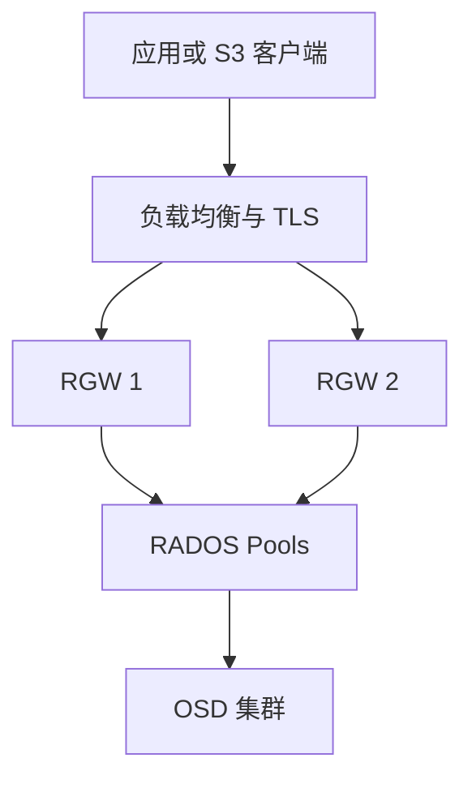
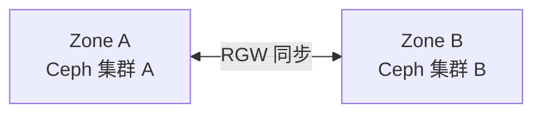

# Ceph RGW 实战：部署 S3 对象存储、用户、Bucket、Quota 与高可用

《Ceph 从零基础到生产运维实战》第 13 篇

前两篇分别完成了 RBD 块存储和 CephFS 文件存储的使用，本篇继续学习 Ceph 的第三种服务形态：由 RADOS Gateway 提供的 S3 兼容对象存储。

← [第 12 篇：CephFS 文件存储实战](./CephFS文件存储实战)

## 本文目标

读完并完成实验后，你应该能够：

- 解释 RGW、S3 API、Bucket、Object 和 Key 的关系
- 使用 cephadm 部署多个 RGW 实例
- 创建普通 S3 用户并安全管理 Access Key 和 Secret Key
- 使用 AWS CLI 创建 Bucket、上传和下载对象
- 配置用户容量及对象数量配额
- 理解 RGW 高可用、负载均衡和 TLS 的边界
- 初步排查 403、404、5xx、上传慢和容量不足等问题
- 区分单集群 RGW 高可用与跨集群 Multisite 容灾

本文继续使用前文的示例集群：

| 项目 | 示例值 |
| --- | --- |
| Ceph 集群 | ceph01、ceph02、ceph03 |
| 公共网络 | 10.10.10.0/24 |
| RGW 服务 ID | prod |
| RGW 端口 | 8080 |
| 负载均衡域名 | s3.example.internal |
| 示例用户 | blog-app |

命令中的主机名、地址、域名和密码必须替换为实际值。

## 对象存储不是「另一个共享目录」

对象存储通过 HTTP API 操作数据，不向客户端直接暴露传统目录和块设备。

一个对象通常由三部分组成：

- **对象内容**：真正的数据
- **Key**：对象在 Bucket 中的唯一名称
- **Metadata**：内容类型、时间戳和自定义属性等元数据

S3 中最常见的层次可以理解为：

```text
Endpoint
└── Bucket
    ├── images/2026/logo.png
    ├── backup/db/full.sql.gz
    └── documents/readme.pdf
```

`images/2026/logo.png` 看起来有目录，但对 S3 来说，它本质上只是一个包含 `/` 的 Key。控制台或客户端把相同前缀展示成目录，是为了方便人理解。

### 三类存储如何选择

| 需求 | 更适合的接口 |
| --- | --- |
| 虚拟机磁盘、数据库数据盘 | RBD 块存储 |
| 多台 Linux 主机共享 POSIX 文件系统 | CephFS |
| 图片、视频、备份、安装包、静态资源 | RGW/S3 对象存储 |
| 应用需要通过 HTTP 上传下载对象 | RGW/S3 对象存储 |
| 应用要求原地修改文件中间几个字节 | 通常使用块或文件存储 |

对象存储适合「按对象整体读写」的场景。虽然 S3 支持分段上传和 Range 读取，但它不是 POSIX 文件系统，不能假设 rename、文件锁和目录权限等语义与本地文件系统完全一致。

## RGW 在 Ceph 中处于什么位置

RGW 是 RADOS Gateway 的简称。它接收 S3 或 Swift API 请求，把用户、Bucket、索引、对象数据和相关元数据存入底层 RADOS。



理解这张图需要抓住四点：

1. RGW 是协议网关，不是独立的数据副本系统
2. 多个 RGW 实例通常访问同一组底层数据
3. RGW 进程可以横向扩展，但 Bucket 索引和对象仍依赖 RADOS
4. 对外入口需要负载均衡、DNS 和证书，不能只部署多个进程就宣称实现了完整高可用

### RGW 进程坏了会丢数据吗

通常不会。RGW 本身主要承担请求处理，持久数据在 RADOS 中。某个 RGW 进程退出后，健康检查应把它从负载均衡后端移除，客户端继续访问其他 RGW。

但下面的问题仍可能导致服务异常：

- 所有 RGW 都运行在同一台主机
- 负载均衡器只有一个实例
- DNS 或证书失效
- 底层 OSD、PG 或存储池异常
- RGW 使用的元数据池、索引池接近满
- 所有 RGW 同时使用了错误配置

所以，高可用是一条完整链路，而不是一个进程数量。

## 部署前的规划

### 最少规划这些内容

| 项目 | 需要回答的问题 |
| --- | --- |
| 服务规模 | 预计每秒请求数、吞吐量和并发连接数是多少？ |
| 对象模型 | 主要是小对象还是大对象？平均大小是多少？ |
| 数据保护 | 副本池还是纠删码数据池？ |
| 入口 | 使用四层还是七层负载均衡？VIP 和域名是什么？ |
| 安全 | TLS 在负载均衡终止，还是由 RGW 直接处理？ |
| 命名方式 | 使用路径风格还是虚拟主机风格访问 Bucket？ |
| 生命周期 | 是否需要版本控制、过期删除、分段上传清理？ |
| 容灾 | 只需要单集群高可用，还是需要跨站点复制？ |

### 小对象会放大系统压力

同样是 10 TiB 数据：

- 由 10 个 1 TiB 对象组成
- 由十亿级小对象组成

这两种负载对 Bucket 索引、元数据、PG、内存和请求处理的压力完全不同。因此只看容量远远不够，还要看对象数量、对象大小分布、请求类型和并发。

生产规划至少记录：

- 平均对象大小
- P95/P99 对象大小
- PUT、GET、DELETE 请求比例
- 峰值吞吐量和 QPS
- Bucket 数量及单 Bucket 对象数量
- 分段上传数量
- 数据保留周期

## 使用 cephadm 部署 RGW

### 给 RGW 主机添加标签

为了让 RGW 固定部署到合适的节点，可以使用主机标签：

```bash
ceph orch host label add ceph01 rgw
ceph orch host label add ceph02 rgw
ceph orch host ls
```

生产环境建议至少跨两台主机部署，不要把所有实例放在一个故障域中。

### 编写服务规格文件

创建 `rgw-prod.yaml`：

```yaml
service_type: rgw
service_id: prod
placement:
  label: rgw
  count_per_host: 1
networks:
  - 10.10.10.0/24
spec:
  rgw_frontend_type: beast
  rgw_frontend_port: 8080
```

字段含义如下：

| 字段 | 含义 |
| --- | --- |
| service_type | 服务类型为 RGW |
| service_id | 本组 RGW 服务的标识 |
| placement.label | 只调度到带 `rgw` 标签的主机 |
| count_per_host | 每台匹配主机部署一个实例 |
| networks | 守护进程使用的网络 |
| rgw_frontend_type | HTTP 前端，此处使用 Beast |
| rgw_frontend_port | RGW 监听端口 |

先预览调度结果，再正式应用：

```bash
ceph orch apply -i rgw-prod.yaml --dry-run
ceph orch apply -i rgw-prod.yaml
```

查看部署状态：

```bash
ceph orch ls --service_name rgw.prod
ceph orch ps --service_name rgw.prod --refresh
ceph -s
```

只有在两个 RGW 都进入运行状态、集群健康状态可解释之后，才继续配置外部入口。

### 简化部署命令

实验环境也可以使用命令行快速部署：

```bash
ceph orch apply rgw prod --placement="label:rgw count-per-host:1" --port=8080
```

长期维护时，YAML 规格文件更容易进入 Git 管理和评审，也更容易复现。

## 验证 RGW 端点

先从管理网络直接测试每个实例：

```bash
curl -i http://10.10.10.11:8080/
curl -i http://10.10.10.12:8080/
```

没有凭据时，可能返回 XML 格式的 `AccessDenied` 或其他 S3 响应。只要 TCP、HTTP 和 RGW 响应正常，就说明端点已经可达；这不代表身份认证已经通过。

同时检查：

```bash
ceph health detail
ceph orch ps --daemon_type rgw --refresh
```

如果端口不通，依次检查：

- RGW 守护进程是否运行
- 主机是否监听目标端口
- 主机防火墙和安全组是否放行
- 客户端路由是否可达
- `networks` 是否选择了正确网卡
- RGW 日志中是否有绑定端口失败

## 为 RGW 构建高可用入口

RGW 节点不应该成为应用永久写死的地址。推荐为应用提供一个稳定入口：

```text
https://s3.example.internal
```

其背后可以是 HAProxy、Nginx、硬件负载均衡器或云负载均衡器。

### 健康检查应该检查什么

只检查 TCP 端口能发现进程退出，但不能发现所有应用层故障。可以分层检查：

- TCP 端口是否可连接
- HTTP 是否能返回预期的 S3 响应
- 使用低权限探测账号执行受控的 API 测试
- 从监控系统观察错误率和延迟

健康检查不应持续创建大量 Bucket 或对象，也不应使用管理员密钥。

### TLS 放在哪里终止

两种常见方案：

| 方案 | 优点 | 注意事项 |
| --- | --- | --- |
| TLS 在负载均衡器终止 | 证书管理集中、配置常见 | LB 到 RGW 之间应使用受控网络，必要时继续加密 |
| RGW 直接提供 TLS | 端到端链路更直接 | 每个 RGW 的证书和私钥管理更复杂 |

无论采用哪一种，都要明确：证书域名、到期监控、TLS 版本、密钥权限和轮换流程。

### 路径风格与虚拟主机风格

路径风格示例：

```text
https://s3.example.internal/my-bucket/logo.png
```

虚拟主机风格示例：

```text
https://my-bucket.s3.example.internal/logo.png
```

虚拟主机风格通常需要：

- `*.s3.example.internal` 的泛域名 DNS
- 覆盖该域名的证书
- RGW 的 DNS 名称配置
- 负载均衡器正确转发 Host 请求头

实验阶段可以先使用路径风格，生产设计再根据 SDK、DNS 和证书体系确定最终方案。

## 创建普通 S3 用户

使用 `radosgw-admin` 创建用户：

```bash
radosgw-admin user create \
  --uid=blog-app \
  --display-name="Blog Application"
```

命令输出会包含：

- `access_key`
- `secret_key`
- 用户 ID 和配额信息

### 密钥安全原则

`secret_key` 相当于密码。创建后应立即放入密码管理系统或密钥管理系统，并遵循：

- 不写进文章、截图和工单
- 不提交到 Git 仓库
- 不硬编码进应用镜像
- 不通过即时通信明文发送
- 应用从 Secret 管理系统读取
- 定期轮换，泄露后立即吊销
- 不同应用、环境和团队使用不同用户

如果创建命令的终端输出会被录屏或集中采集，也应评估日志暴露风险。

查看用户信息：

```bash
radosgw-admin user info --uid=blog-app
```

不要把普通业务用户设置成系统用户或赋予不必要的管理能力。S3 数据访问权限与 `radosgw-admin` 管理权限是两个不同层面。

## 使用 AWS CLI 访问 Ceph RGW

RGW 提供 S3 兼容 API，因此可以使用 AWS CLI、SDK、s3cmd、mc 等工具。

### 配置独立 Profile

在测试客户端上执行：

```bash
aws configure --profile ceph-rgw
```

按提示输入 Access Key、Secret Key、默认区域和输出格式。测试环境也不要把真实密钥直接写入可共享的命令历史或文档。

如需强制使用路径风格：

```bash
aws configure set s3.addressing_style path --profile ceph-rgw
```

### 创建 Bucket

```bash
aws --profile ceph-rgw \
  --endpoint-url https://s3.example.internal \
  s3 mb s3://ceph-lab-unique-name
```

Bucket 名称需要符合 S3 命名规范。生产中还要制定团队、项目、环境和地域的命名约定。

### 上传和查看对象

```bash
aws --profile ceph-rgw \
  --endpoint-url https://s3.example.internal \
  s3 cp ./logo.png s3://ceph-lab-unique-name/images/logo.png

aws --profile ceph-rgw \
  --endpoint-url https://s3.example.internal \
  s3 ls s3://ceph-lab-unique-name/ --recursive
```

### 下载对象

```bash
aws --profile ceph-rgw \
  --endpoint-url https://s3.example.internal \
  s3 cp s3://ceph-lab-unique-name/images/logo.png ./downloaded-logo.png
```

下载后应根据业务需要校验文件大小或校验和。不要默认把 S3 ETag 当作所有对象的 MD5；分段上传、服务端加密等场景下，它可能不是简单 MD5。

### 删除测试对象和 Bucket

```bash
aws --profile ceph-rgw \
  --endpoint-url https://s3.example.internal \
  s3 rm s3://ceph-lab-unique-name/images/logo.png

aws --profile ceph-rgw \
  --endpoint-url https://s3.example.internal \
  s3 rb s3://ceph-lab-unique-name
```

非空 Bucket 不能直接删除。生产环境不要为了省事使用递归强制删除，尤其是在启用了版本控制的 Bucket 中。

## 用户、Bucket、ACL 和 Policy 的关系

权限问题是 RGW 运维中最容易混淆的部分之一。

| 对象 | 作用 |
| --- | --- |
| RGW 用户 | 持有访问密钥的身份 |
| Bucket | 对象的逻辑容器 |
| ACL | 较传统的对象或 Bucket 授权机制 |
| Bucket Policy | 使用 JSON 描述允许或拒绝的访问 |
| IAM Policy/Role | 更细粒度的身份授权能力，支持程度应按 Ceph 版本验证 |
| Admin Caps | `radosgw-admin` 管理能力，不等同于普通 S3 权限 |

最小权限原则应该落实为：

- 只允许访问需要的 Bucket
- 只授予需要的 GetObject、PutObject 等动作
- 读写账号与只读账号分离
- 管理账号与业务账号分离
- 明确拒绝公开访问，除非业务确实需要
- 定期审计长期未使用的密钥

不要用一个管理员密钥服务所有应用。一旦泄露，影响范围会覆盖整个对象存储平台。

## 配置用户配额

配额可以限制用户使用的总容量或对象数量，防止单个租户失控地耗尽集群。

例如，把 `blog-app` 限制为最多 100 GiB、100 万个对象：

```bash
radosgw-admin quota set \
  --quota-scope=user \
  --uid=blog-app \
  --max-size=100G \
  --max-objects=1000000

radosgw-admin quota enable \
  --quota-scope=user \
  --uid=blog-app
```

查看用户信息和配额：

```bash
radosgw-admin user info --uid=blog-app
radosgw-admin user stats --uid=blog-app --sync-stats
```

### 配额不是容量规划的替代品

配额回答的是「一个用户最多能使用多少」，它不能替代：

- 集群原始容量和可用容量规划
- 副本或纠删码开销计算
- nearfull、backfillfull、full 阈值监控
- 容量增长趋势预测
- 故障恢复所需的安全余量

所有用户配额之和也可以大于集群容量，这类似资源超分配。是否允许超分，需要结合实际使用率和扩容周期制定规则。

### 统计可能不是实时精确值

RGW 为了性能会缓存和异步维护部分统计信息。因此容量页面与瞬时写入量可能存在短暂差异。做审计时可同步统计，但不要高频执行重统计操作给生产集群增加额外负担。

## 版本控制、生命周期与误删除保护

### 开启 Bucket 版本控制

```bash
aws --profile ceph-rgw \
  --endpoint-url https://s3.example.internal \
  s3api put-bucket-versioning \
  --bucket ceph-lab-unique-name \
  --versioning-configuration Status=Enabled
```

启用后，覆盖或删除对象通常会保留旧版本或产生删除标记，这有助于应对误操作。

但版本控制会增加容量消耗。必须配套：

- 旧版本保留周期
- 非当前版本清理策略
- 删除标记处理策略
- 容量告警
- 恢复演练

### 生命周期规则

生命周期规则可以自动处理：

- 对象到期删除
- 非当前版本到期
- 未完成分段上传的清理
- 存储类别转换，具体能力取决于 Ceph 版本和部署设计

规则应先在测试 Bucket 验证。错误的生命周期策略可能批量删除业务数据。

### 版本控制不是备份

版本控制和跨站点复制都不能自动等价为备份：

- 管理员或自动化可能删除所有版本
- 错误策略可能被同步到另一个站点
- 凭据泄露可能同时影响源和副本
- 软件缺陷或人为操作可能影响整个逻辑命名空间

重要数据仍需要独立权限域、独立保留策略和可验证恢复流程。

## 分段上传与大对象

大对象通常通过 multipart upload 分成多个部分上传，成功后再完成合并。这可以提高并行度，并允许失败后只重传部分数据。

需要关注：

- 分段大小是否合理
- 客户端并发是否压垮网络或 RGW
- 未完成上传是否长期占用空间
- 超时和重试是否导致请求风暴
- SDK 是否正确完成或中止上传

查看未完成的分段上传可使用 S3 API：

```bash
aws --profile ceph-rgw \
  --endpoint-url https://s3.example.internal \
  s3api list-multipart-uploads \
  --bucket ceph-lab-unique-name
```

建议通过生命周期规则清理长期未完成的 multipart upload，而不是不加判断地手工批量删除。

## RGW 使用哪些存储池

RGW 会在 RADOS 中维护多类数据，例如：

- Realm、Zonegroup 和 Zone 配置
- 用户和认证元数据
- Bucket 元数据
- Bucket 索引
- 对象数据
- 日志和同步状态

查看相关 Pool：

```bash
ceph osd pool ls
ceph df detail
```

不同 Ceph 版本、Realm/Zone 名称和部署方式会产生不同的 Pool 名称，因此不要仅凭网上某篇文章的固定名称进行删除或修改。

### 数据池和索引池的负载不同

- 对象数据池承担主要容量
- Bucket 索引和元数据池更强调小 I/O、延迟和可靠性
- 纠删码适合降低大规模对象数据的容量开销
- 元数据和索引通常仍使用副本池

如果要为 RGW 设计纠删码和定制 CRUSH 规则，应先在测试集群验证，并明确各 Pool 的 application、规则、PG 数量和故障域。不要在不理解用途时直接修改自动创建的 Pool。

### 绝对不要绕过 RGW 删除对象

不要使用 `rados rm` 或直接删除 RGW Pool 中的底层对象来代替 S3 删除操作。这样会使数据、索引和元数据不一致，后续修复可能比原问题更严重。

正常业务对象应通过 S3 API 管理；底层修复工具只在明确故障模型、完成备份并参考对应版本文档后使用。

## 单集群高可用与 Multisite

### 单集群多 RGW

多个 RGW 访问同一个 Ceph 集群，主要解决：

- 单个 RGW 进程故障
- 单台 RGW 主机故障
- 横向扩展吞吐和连接数
- 滚动升级

它无法解决整个 Ceph 集群或整个机房同时不可用。

### RGW Multisite

Multisite 使用 Realm、Zonegroup 和 Zone 组织多个 RGW 站点，并进行元数据及对象同步。



Multisite 适合跨机房容灾、就近访问等场景，但复杂度明显提高：

- 需要规划 Realm、Zonegroup、Zone
- 需要同步用户和元数据
- 要监控数据同步延迟和失败
- 必须设计故障切换和回切流程
- 网络分区可能带来冲突处理问题
- cephadm 只负责部署守护进程，站点关系仍要单独配置

初学者应先把单集群 RGW 的部署、权限、监控和恢复掌握清楚，再进入 Multisite。

## 常用管理与检查命令

### 服务状态

```bash
ceph -s
ceph health detail
ceph orch ls --service_name rgw.prod
ceph orch ps --daemon_type rgw --refresh
```

### 用户信息

```bash
radosgw-admin user list
radosgw-admin user info --uid=blog-app
radosgw-admin user stats --uid=blog-app --sync-stats
```

### Bucket 信息

```bash
radosgw-admin bucket list --uid=blog-app
radosgw-admin bucket stats --bucket=ceph-lab-unique-name
```

`radosgw-admin` 是管理工具，不应替代应用日常调用 S3 API。生产环境执行会改变数据或元数据的子命令前，必须确认范围和影响。

## 常见故障一：返回 403

S3 `403 Forbidden` 不一定只是「密码错了」。建议按以下顺序检查。

### 检查时间

S3 签名包含时间信息。客户端、RGW 和认证链路时间偏差过大，可能导致签名过期或尚未生效。

```bash
timedatectl
chronyc tracking
```

所有节点应使用可靠的时间同步服务。

### 检查密钥和用户状态

```bash
radosgw-admin user info --uid=blog-app
```

确认：

- Access Key 是否属于目标用户
- 密钥是否启用
- 应用是否读取了旧 Secret
- 轮换过程中旧密钥是否已提前删除

不要在排障记录中粘贴完整 Secret Key。

### 检查 Endpoint、区域和签名方式

同一组密钥访问了错误的 Endpoint，或者代理改写 Host 请求头，都可能导致签名不一致。检查：

- SDK 配置的 Endpoint
- HTTP/HTTPS 是否一致
- 端口是否正确
- Host 请求头是否被代理保留
- 区域和签名版本是否匹配
- 客户端使用路径风格还是虚拟主机风格

### 检查 Policy 和 ACL

身份认证成功不等于有权限执行当前操作。确认请求的 Bucket、Key 和 Action 是否被策略允许，是否存在显式 Deny。

### 观察 RGW 日志

先找到守护进程和所在主机：

```bash
ceph orch ps --daemon_type rgw --refresh
```

再到对应主机查看该 RGW 容器日志。使用 cephadm 部署时可执行：

```bash
cephadm logs --name <rgw-daemon-name>
```

应以问题发生时间、请求 ID、用户和 Bucket 为线索，避免在大量日志中盲目搜索。

## 常见故障二：返回 404

`404 NoSuchBucket` 或 `NoSuchKey` 常见原因包括：

- Bucket 名称或 Key 拼写错误
- Key 大小写不一致
- Endpoint 指向了另一套环境
- 路径风格与虚拟主机风格配置不一致
- 对象已被生命周期规则删除
- 开启版本控制后，当前版本是删除标记
- Multisite 尚未完成同步

使用与应用相同的 Endpoint 和 Profile 复现：

```bash
aws --profile ceph-rgw \
  --endpoint-url https://s3.example.internal \
  s3api head-bucket --bucket ceph-lab-unique-name

aws --profile ceph-rgw \
  --endpoint-url https://s3.example.internal \
  s3api head-object \
  --bucket ceph-lab-unique-name \
  --key images/logo.png
```

HeadBucket 成功但 HeadObject 失败时，重点检查 Key、版本和对象权限。

## 常见故障三：返回 5xx 或请求超时

### 先区分入口问题和存储问题

分别测试：

- 负载均衡器地址
- 每个 RGW 后端地址
- Ceph 集群健康状态

如果只有负载均衡入口异常，优先检查 LB、证书、DNS 和后端健康检查。如果所有 RGW 都异常，则继续检查集群。

### 检查集群健康状态

```bash
ceph -s
ceph health detail
ceph df detail
ceph osd tree
ceph osd perf
ceph pg stat
```

重点关注：

- Pool 是否接近 nearfull、backfillfull 或 full
- 是否有 inactive、stale、peering、degraded PG
- 是否有 OSD down
- OSD commit/apply 延迟是否异常
- 是否存在 slow ops
- MON 是否失去 quorum

### 检查 RGW 资源

RGW 节点也可能耗尽：

- CPU
- 内存
- 文件描述符
- 网络带宽
- 连接跟踪表
- 容器资源限制

如果增加 RGW 实例后仍没有改善，问题可能在负载均衡、网络、Bucket 索引热点或底层 OSD，而不是 RGW 数量不足。

## 常见故障四：上传或下载很慢

### 先建立可重复的测试

不要只说「用户感觉慢」。至少记录：

- 测试对象大小
- PUT 还是 GET
- 单并发还是多并发
- 客户端位置和网络路径
- Endpoint
- 开始时间和持续时间
- 平均、P95、P99 延迟
- 是否发生重试

### 分层定位

| 层次 | 观察内容 |
| --- | --- |
| 客户端 | CPU、磁盘、SDK 并发、分段大小、重试 |
| DNS/TLS | 解析延迟、握手延迟、证书校验 |
| 负载均衡 | 后端分配、连接复用、超时、队列 |
| RGW | CPU、内存、请求延迟、错误码、并发 |
| 网络 | 丢包、重传、带宽、MTU |
| RADOS | OSD 延迟、slow ops、恢复流量、PG 状态 |
| 磁盘 | HDD/SSD 延迟、BlueStore DB/WAL、设备错误 |

小对象性能更容易受请求次数和元数据影响，大对象性能更容易受吞吐、分段并发和网络影响。必须按工作负载区分。

## Bucket 索引热点与大 Bucket

当单个 Bucket 包含大量对象并承受高并发写入时，Bucket 索引可能成为热点。Ceph RGW 支持 Bucket index shard 和动态 resharding，但它们不是无限扩展的魔法。

设计阶段应考虑：

- 是否把所有租户塞进一个超大 Bucket
- Key 前缀是否导致业务访问集中
- Bucket 数量和单 Bucket 对象数量
- 当前 Ceph 版本的动态 reshard 能力
- resharding 期间的业务影响
- 索引 Pool 的设备类型与延迟

不要在生产高峰期盲目手工 reshard。先确认当前 shard 状态、对象数量、版本限制，并制定回退和观察方案。

## 密钥轮换的正确思路

多数 RGW 用户可以拥有不止一组 S3 Key，因此可以采用重叠轮换：

1. 为用户创建第二组密钥
2. 把新密钥写入 Secret 管理系统
3. 滚动更新应用
4. 验证所有实例都使用新密钥
5. 观察旧密钥不再被使用
6. 删除旧密钥
7. 记录轮换时间和负责人

不要先删除旧密钥再部署新密钥，否则会造成业务中断。密钥疑似泄露时则要以控制风险为优先，结合影响范围决定是否立即吊销。

## 生产上线检查清单

### 架构与容量

- [ ] 至少两个 RGW 实例分布在不同主机
- [ ] 负载均衡和 VIP 不存在明显单点
- [ ] 已评估对象数量、平均大小、QPS 和吞吐
- [ ] RGW 数据、索引和元数据池的保护策略明确
- [ ] 集群保留了故障恢复和扩容余量
- [ ] 已明确是否需要 Multisite

### 网络与安全

- [ ] 生产入口使用正确的 DNS 名称
- [ ] TLS 证书可信且配置到期告警
- [ ] RGW 后端端口不对无关网络开放
- [ ] 业务用户遵循最小权限
- [ ] Secret Key 未进入代码、镜像和日志
- [ ] 已定义密钥轮换和泄露处置流程
- [ ] 管理员账号不用于普通业务

### 数据治理

- [ ] 为租户设置合理配额
- [ ] 对重要 Bucket 评估版本控制
- [ ] 生命周期规则已经过测试
- [ ] 未完成分段上传有清理机制
- [ ] 已有独立备份或容灾方案
- [ ] 已完成对象恢复演练

### 监控与运维

- [ ] 监控 RGW 实例存活、请求率、错误率和延迟
- [ ] 监控 OSD、PG、Pool 容量和 slow ops
- [ ] 监控负载均衡后端健康
- [ ] 能按请求 ID 检索 RGW 日志
- [ ] 具备 403、5xx、慢请求和容量告警 Runbook
- [ ] 升级、扩容、密钥轮换都经过演练

## 常见误区

**误区一：有两个 RGW 就一定高可用**

错误。还要检查主机故障域、负载均衡、DNS、证书和底层 Ceph 集群。

**误区二：S3 的「目录」就是文件系统目录**

错误。多数情况下它只是 Key 的前缀，不能直接套用 POSIX 语义。

**误区三：RGW 无状态，所以完全不用备份**

错误。RGW 进程本身容易重建，但用户、Bucket、索引和对象数据都在 RADOS 中，仍需要数据保护与恢复方案。

**误区四：版本控制等于备份**

错误。版本控制降低误覆盖风险，但不能替代独立权限域和可验证备份。

**误区五：遇到索引问题直接删除底层 RADOS 对象**

错误。绕过 RGW 修改底层对象极易破坏一致性。

**误区六：所有 403 都是密码错误**

错误。时间偏差、Endpoint、Host 改写、签名版本、Policy、ACL 都可能产生 403。

## 本文小结

这一篇完成了 Ceph RGW 的第一轮生产化实践：

1. RGW 把 S3/Swift 请求转换为 RADOS 操作
2. 多个 RGW 可以横向扩展，但完整高可用还依赖 LB、DNS、TLS 和底层集群
3. 普通应用使用 S3 用户及最小权限策略，不使用管理账号
4. 配额、版本控制、生命周期和 multipart 清理共同构成数据治理
5. 排障要沿客户端、入口、RGW、网络、RADOS 和磁盘分层定位
6. 单集群多 RGW 与 Multisite 解决的是不同级别的问题

下一篇将进入 Ceph 监控与健康检查，建立从 `ceph -s`、Prometheus、Grafana 到告警 Runbook 的完整观察体系。

→ [第 14 章：Ceph 监控告警](../PartV-日常运维与监控/Ceph监控告警)

## 课后练习

1. RGW 为什么可以部署多个实例并访问相同对象？
2. Bucket 中看起来像目录的路径，在对象模型中是什么？
3. 两个 RGW 实例为什么不能自动等于完整高可用？
4. S3 返回 403 时，除密钥之外还应检查哪些内容？
5. 用户配额为什么不能代替集群容量规划？
6. 版本控制与备份有什么区别？
7. 单集群多 RGW 与 Multisite 各自解决什么问题？
8. 为什么不能使用 `rados rm` 代替 S3 API 删除业务对象？

## 官方资料

- [Ceph RGW 介绍](https://docs.ceph.com/en/latest/radosgw/)
- [使用 cephadm 部署 RGW](https://docs.ceph.com/en/latest/cephadm/services/rgw/)
- [RGW 管理指南](https://docs.ceph.com/en/latest/radosgw/admin/)
- [RGW Multisite](https://docs.ceph.com/en/latest/radosgw/multisite/)
- [Amazon S3 API 兼容性](https://docs.ceph.com/en/latest/radosgw/s3/)
