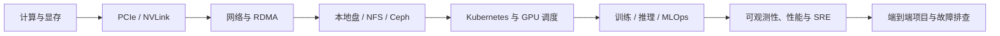

# 文档导读

本站是一套面向 AI Infra 与云原生工程实践的技术知识库。文章按知识域组织，
整个内容体系按照技术边界和实际数据路径组织；你可以先独立掌握计算、网络、存储、
Kubernetes、训练推理和 SRE，再通过综合项目把它们串成完整系统。

## 按技术主题直接进入

| 要学习或排查的主题 | 入口 |
| --- | --- |
| Linux、进程、权限、内核、systemd 和原生命令 | [Linux 与操作系统](./linux/00-Linux命令参考库学习路线.md) |
| GPU、显存、PCIe、NUMA、NVLink、CUDA 和 GPU 调度 | [GPU 与加速计算](./gpu/00-GPU与加速计算学习路线.md) |
| TCP/IP、路由交换、数据中心、RDMA、RoCE 和 AI Fabric | [网络](./networking/00-网络学习路线.md) |
| Linux I/O、NVMe、NFS、Ceph、对象存储和 CSI | [存储](./storage/00-存储技术学习路线.md) |
| 容器、Kubernetes、服务网格、Serverless 和边缘计算 | [容器与 Kubernetes](./cloud-native/00-云原生与平台工程学习路线.md) |
| 分布式训练、vLLM、推理服务、模型制品和 MLOps | [AI 训练与推理](./ai-systems/00-大模型系统学习地图.md) |
| MySQL、Redis、Kafka、Elasticsearch、Milvus、ClickHouse 与大数据工程 | [数据系统](./data-systems/00-数据系统学习地图.md) |
| 指标、日志、追踪、SLO、性能工程和事故复盘 | [可观测性与 SRE](./sre/00-SRE与生产工程学习路线.md) |
| Python、Go、API 客户端和诊断工具工程 | [自动化与 DevOps](./automation/00-自动化工程学习路线.md) |
| 端到端链路、生产 GPU 集群和异构资源池 | [综合项目](./projects/00-综合项目学习地图.md) |

如果暂时不知道从哪里开始，先阅读[AI Infra 技术模块学习地图](./learning/00-AI-Infra技术模块学习地图.md)，再按上表进入具体技术主题。

## 如何使用这套文档

- **零基础学习**：先看学习地图，再按 Linux、GPU、网络、存储、Kubernetes、AI 系统和 SRE 的顺序学习。
- **专题补课**：直接进入左侧对应技术域，例如 Ceph、RDMA、GPU 调度或 vLLM。
- **生产排障**：先进入具体技术模块寻找排障章节，再用 SRE 方法建立证据链和复盘。
- **学习验收**：不要只记组件名称；应能解释请求、数据与资源在各层之间如何流动。
