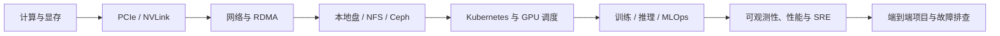

# 文档导读

本站是一套面向 AI Infra 与云原生工程实践的技术知识库。文章按知识域组织，
不强行围绕某一个产品或岗位拆分；你可以先独立掌握计算、网络、存储、
Kubernetes、训练推理和 SRE，再通过综合项目把它们串成完整系统。

## 推荐的主学习路径

1. 从[AI Infra 技术模块学习地图](./learning/00-AI-Infra技术模块学习地图.md)了解全貌。
2. 在[基础技术](./foundations/00-基础技术学习地图.md)中掌握 GPU、显存、PCIe、NVLink、网络与存储。
3. 在[平台工程](./platform/00-平台工程学习地图.md)中掌握 Kubernetes、GPU 设备管理、调度与资源治理。
4. 在[大模型系统](./ai-systems/00-大模型系统学习地图.md)中掌握分布式训练、vLLM 推理和 MLOps。
5. 在[工程能力](./engineering/00-工程能力学习地图.md)中学习可观测性、可靠性、性能分析、自动化和事故复盘。
6. 最后完成[综合项目](./projects/00-综合项目学习地图.md)，建立端到端的系统视角。

## 如何使用这套文档

- **零基础学习**：按上面的六个模块顺序阅读，每篇完成命令验证或实验。
- **专题补课**：直接进入左侧对应技术域，例如 Ceph、RDMA、GPU 调度或 vLLM。
- **生产排障**：先看工程能力中的故障方法，再回到具体技术模块验证数据路径。
- **面试准备**：不要只背组件名；应能解释请求、数据与资源在各层之间如何流动。

所有技术文档都位于 `/docs`，网站目录与源码 `docs/` 目录保持一致。
